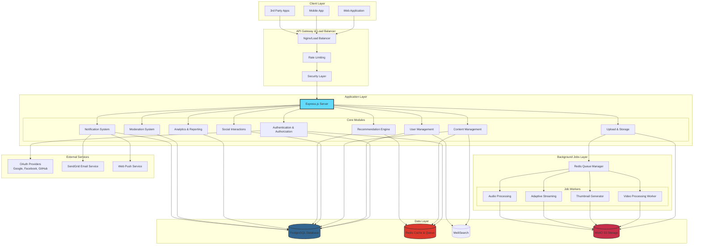
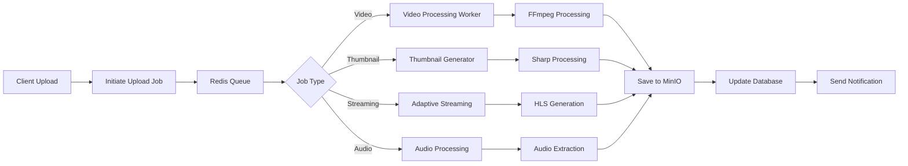
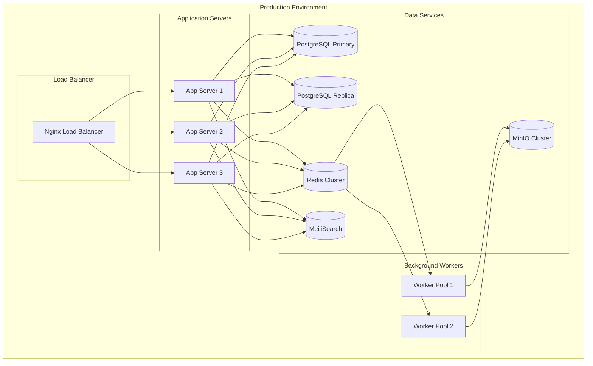

# MediaVerse MVP - Tổng Quan Kiến Trúc Hệ Thống

## 1. Giới Thiệu

MediaVerse MVP là một nền tảng chia sẻ nội dung đa phương tiện toàn diện, kết hợp các tính năng:
- **Video Sharing** - Chia sẻ và xem video
- **Article Publishing** - Viết và đọc bài viết
- **Document Sharing** - Chia sẻ tài liệu
- **Social Interactions** - Tương tác xã hội
- **Learning Features** - Tính năng học tập

## 2. Kiến Trúc Tổng Quan



## 3. Tech Stack

### Backend
- **Runtime**: Node.js 18+
- **Framework**: Express.js
- **Language**: JavaScript (ES6+)
- **ORM**: Prisma

### Database & Storage
- **Primary Database**: PostgreSQL
- **Cache & Queue**: Redis (IORedis)
- **Search Engine**: MeiliSearch
- **Object Storage**: MinIO (S3-compatible)

### Authentication & Security
- **JWT**: jsonwebtoken
- **OAuth**: Passport.js (Google, Facebook, GitHub)
- **Password Hashing**: bcrypt
- **Security Headers**: helmet
- **Rate Limiting**: express-rate-limit

### Background Processing
- **Queue Management**: Bull (Redis-based)
- **Video Processing**: FFmpeg (fluent-ffmpeg)
- **Image Processing**: Sharp

### Real-time Communication
- **WebSocket**: Socket.io

### API Documentation
- **Swagger**: swagger-jsdoc, swagger-ui-express

## 4. Core Modules

### 4.1 Authentication Module
- Local authentication (email/password)
- OAuth 2.0 (Google, Facebook, GitHub)
- JWT token-based authentication
- OTP verification
- Password reset functionality

### 4.2 User Management Module
- User profiles & preferences
- Follow/Unfollow system
- Connected accounts (OAuth)
- User verification
- Privacy settings

### 4.3 Content Management Module
- **Video**: Upload, processing, adaptive streaming (HLS)
- **Article**: Rich text editor, publishing workflow
- **Document**: PDF, Word, etc.
- **Image**: Upload and optimization
- Content categorization & tagging
- Draft/Published/Archived status

### 4.4 Social Interaction Module
- Like/Unlike content
- Comment & reply system
- Share functionality
- Playlist creation & management
- Content bookmarking

### 4.5 Recommendation Module
- Content-based filtering
- Collaborative filtering
- Trending algorithm
- Personalized feed

### 4.6 Analytics Module
- View tracking
- Engagement metrics
- Daily summaries
- Real-time analytics
- User demographics

### 4.7 Moderation Module
- Content reporting system
- User moderation (ban, warn, unban)
- Review workflow
- Audit logs

### 4.8 Notification Module
- Real-time notifications (WebSocket)
- Email notifications
- Web push notifications
- Notification preferences
- Multi-channel delivery

### 4.9 Upload & Storage Module
- Chunked upload for large files
- Resume capability
- S3-compatible storage (MinIO)
- CDN integration ready

## 5. Data Models

### Core Entities
1. **User** - User accounts
2. **Profile** - User profiles
3. **Content** - Videos, Articles, Documents, Images
4. **Like** - Content & comment likes
5. **Comment** - Comments & replies
6. **Follow** - User relationships
7. **Playlist** - Content collections
8. **Notification** - User notifications
9. **Report** - Content & user reports
10. **Job** - Background processing jobs
11. **ContentView** - Analytics tracking
12. **AnalyticsSummaryDaily** - Aggregated analytics

## 6. API Endpoints Structure

```
/api
├── /auth
│   ├── POST /register
│   ├── POST /login
│   ├── POST /logout
│   ├── POST /refresh
│   ├── POST /forgot-password
│   ├── POST /reset-password
│   ├── GET /oauth/google
│   ├── GET /oauth/facebook
│   └── GET /oauth/github
│
├── /users
│   ├── GET /profile
│   ├── PUT /profile
│   ├── GET /:userId
│   ├── POST /:userId/follow
│   ├── DELETE /:userId/unfollow
│   └── GET /:userId/followers
│
├── /content
│   ├── GET /
│   ├── POST /
│   ├── GET /:id
│   ├── PUT /:id
│   ├── DELETE /:id
│   ├── POST /:id/like
│   ├── POST /:id/comment
│   ├── POST /:id/share
│   └── GET /:id/analytics
│
├── /recommendations
│   ├── GET /trending
│   ├── GET /personalized
│   └── GET /related/:contentId
│
├── /notifications
│   ├── GET /
│   ├── PUT /:id/read
│   ├── PUT /mark-all-read
│   └── GET /preferences
│
├── /moderation
│   ├── POST /reports
│   ├── GET /reports
│   ├── PUT /reports/:id
│   ├── POST /ban
│   └── POST /warn
│
├── /analytics
│   ├── GET /content/:id
│   ├── GET /user/dashboard
│   └── GET /realtime
│
├── /playlists
│   ├── GET /
│   ├── POST /
│   ├── PUT /:id
│   ├── DELETE /:id
│   └── POST /:id/items
│
├── /uploads
│   ├── POST /initiate
│   ├── POST /chunk
│   └── POST /complete
│
└── /storage
    └── GET /proxy/*
```

## 7. Background Job Processing



## 8. Deployment Architecture



## 9. Security Features

1. **Authentication Security**
   - JWT with expiration
   - Refresh token rotation
   - OAuth 2.0 integration
   - OTP verification

2. **API Security**
   - Rate limiting
   - Request size limits
   - CORS configuration
   - Security headers (Helmet)
   - Input validation

3. **Data Security**
   - Password hashing (bcrypt)
   - Encrypted connections
   - SQL injection prevention (Prisma ORM)
   - XSS protection

4. **File Upload Security**
   - File type validation
   - Size limits
   - Virus scanning (planned)
   - Content verification

## 10. Performance Optimizations

1. **Caching Strategy**
   - Redis caching for frequently accessed data
   - API response caching
   - Static asset caching

2. **Database Optimization**
   - Indexed queries
   - Connection pooling
   - Query optimization
   - Read replicas

3. **Content Delivery**
   - Adaptive bitrate streaming (HLS)
   - Image optimization
   - CDN integration ready
   - Lazy loading

4. **Background Processing**
   - Asynchronous job processing
   - Queue-based architecture
   - Worker scaling

## 11. Monitoring & Logging

1. **Application Monitoring**
   - Health check endpoints
   - System metrics
   - Performance tracking

2. **Logging**
   - Winston logger
   - Request/Response logging
   - Error tracking
   - Audit logs

3. **Analytics**
   - Real-time analytics
   - Daily summaries
   - User engagement metrics

## 12. Tài Liệu Liên Quan

- [01 - Use Cases Chi Tiết](./01-use-cases.md)
- [02 - Authentication Workflow](./02-authentication-workflow.md)
- [03 - Content Management Workflow](./03-content-workflow.md)
- [04 - Social Interaction Workflow](./04-interaction-workflow.md)
- [05 - Video Processing Workflow](./05-video-processing-workflow.md)
- [06 - Recommendation System](./06-recommendation-system.md)
- [07 - Analytics System](./07-analytics-system.md)
- [08 - Moderation System](./08-moderation-system.md)
- [09 - Notification System](./09-notification-system.md)
- [10 - Database Schema](./10-database-schema.md)
