# Use Cases Chi Tiết - MediaVerse MVP

## 1. Tổng Quan Use Cases

```mermaid
graph TB
    subgraph "Actors"
        GUEST[Guest User]
        USER[Registered User]
        CREATOR[Content Creator]
        MODERATOR[Moderator]
        ADMIN[Administrator]
    end

    subgraph "Authentication Use Cases"
        UC_AUTH_1[Register Account]
        UC_AUTH_2[Login]
        UC_AUTH_3[OAuth Login]
        UC_AUTH_4[Reset Password]
        UC_AUTH_5[Verify Email]
        UC_AUTH_6[Logout]
    end

    subgraph "Content Use Cases"
        UC_CONTENT_1[Browse Content]
        UC_CONTENT_2[Search Content]
        UC_CONTENT_3[View Content]
        UC_CONTENT_4[Upload Video]
        UC_CONTENT_5[Publish Article]
        UC_CONTENT_6[Share Document]
        UC_CONTENT_7[Edit Content]
        UC_CONTENT_8[Delete Content]
    end

    subgraph "Social Interaction Use Cases"
        UC_SOCIAL_1[Like Content]
        UC_SOCIAL_2[Comment]
        UC_SOCIAL_3[Reply to Comment]
        UC_SOCIAL_4[Share Content]
        UC_SOCIAL_5[Follow User]
        UC_SOCIAL_6[Unfollow User]
        UC_SOCIAL_7[Create Playlist]
        UC_SOCIAL_8[Add to Playlist]
    end

    subgraph "User Profile Use Cases"
        UC_PROFILE_1[View Profile]
        UC_PROFILE_2[Edit Profile]
        UC_PROFILE_3[Upload Avatar]
        UC_PROFILE_4[Change Settings]
        UC_PROFILE_5[View Analytics]
    end

    subgraph "Moderation Use Cases"
        UC_MOD_1[Report Content]
        UC_MOD_2[Report User]
        UC_MOD_3[Review Report]
        UC_MOD_4[Ban User]
        UC_MOD_5[Remove Content]
        UC_MOD_6[Warn User]
    end

    subgraph "Notification Use Cases"
        UC_NOTIF_1[Receive Notification]
        UC_NOTIF_2[Mark as Read]
        UC_NOTIF_3[Configure Preferences]
        UC_NOTIF_4[Subscribe to Push]
    end

    GUEST -.-> UC_AUTH_1
    GUEST -.-> UC_AUTH_2
    GUEST -.-> UC_AUTH_3
    GUEST -.-> UC_CONTENT_1
    GUEST -.-> UC_CONTENT_2
    GUEST -.-> UC_CONTENT_3

    USER --> UC_AUTH_6
    USER --> UC_CONTENT_1
    USER --> UC_CONTENT_2
    USER --> UC_CONTENT_3
    USER --> UC_SOCIAL_1
    USER --> UC_SOCIAL_2
    USER --> UC_SOCIAL_3
    USER --> UC_SOCIAL_4
    USER --> UC_SOCIAL_5
    USER --> UC_SOCIAL_6
    USER --> UC_SOCIAL_7
    USER --> UC_SOCIAL_8
    USER --> UC_PROFILE_1
    USER --> UC_PROFILE_2
    USER --> UC_PROFILE_3
    USER --> UC_PROFILE_4
    USER --> UC_MOD_1
    USER --> UC_MOD_2
    USER --> UC_NOTIF_1
    USER --> UC_NOTIF_2
    USER --> UC_NOTIF_3
    USER --> UC_NOTIF_4

    CREATOR --> UC_CONTENT_4
    CREATOR --> UC_CONTENT_5
    CREATOR --> UC_CONTENT_6
    CREATOR --> UC_CONTENT_7
    CREATOR --> UC_CONTENT_8
    CREATOR --> UC_PROFILE_5

    MODERATOR --> UC_MOD_3
    MODERATOR --> UC_MOD_4
    MODERATOR --> UC_MOD_5
    MODERATOR --> UC_MOD_6

    ADMIN --> UC_MOD_3
    ADMIN --> UC_MOD_4
    ADMIN --> UC_MOD_5
    ADMIN --> UC_MOD_6

    style GUEST fill:#e1f5ff
    style USER fill:#b3e5fc
    style CREATOR fill:#81d4fa
    style MODERATOR fill:#ffd54f
    style ADMIN fill:#ff6f00,color:#fff
```

## 2. Authentication Use Cases

### 2.1 UC-AUTH-01: Đăng Ký Tài Khoản

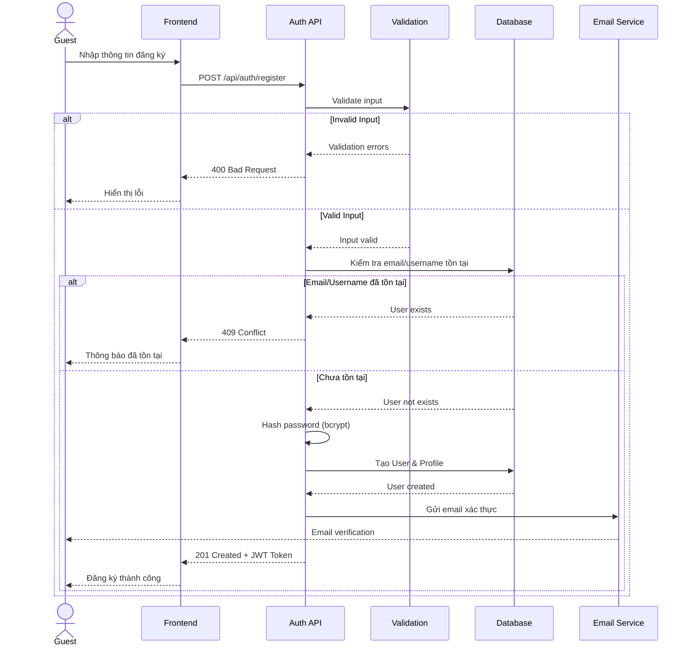
```mermaid
sequenceDiagram
    actor Guest
    participant UI as Frontend
    participant API as Auth API
    participant Validator as Validation
    participant DB as Database
    participant Email as Email Service

    Guest->>UI: Nhập thông tin đăng ký
    UI->>API: POST /api/auth/register
    API->>Validator: Validate input
    
    alt Invalid Input
        Validator-->>API: Validation errors
        API-->>UI: 400 Bad Request
        UI-->>Guest: Hiển thị lỗi
    else Valid Input
        Validator-->>API: Input valid
        API->>DB: Kiểm tra email/username tồn tại
        
        alt Email/Username đã tồn tại
            DB-->>API: User exists
            API-->>UI: 409 Conflict
            UI-->>Guest: Thông báo đã tồn tại
        else Chưa tồn tại
            DB-->>API: User not exists
            API->>API: Hash password (bcrypt)
            API->>DB: Tạo User & Profile
            DB-->>API: User created
            API->>Email: Gửi email xác thực
            Email-->>Guest: Email verification
            API-->>UI: 201 Created + JWT Token
            UI-->>Guest: Đăng ký thành công
        end
    end
```

**Pre-conditions:**
- Guest user chưa đăng nhập
- Email chưa được đăng ký trong hệ thống
- Username chưa được sử dụng

**Post-conditions:**
- User mới được tạo trong database
- Profile được tạo tự động
- Email xác thực được gửi
- JWT token được trả về

**Main Flow:**
1. Guest nhập email, username, password
2. Hệ thống validate dữ liệu đầu vào
3. Kiểm tra email/username đã tồn tại
4. Hash password bằng bcrypt
5. Tạo User record
6. Tạo Profile record
7. Gửi email xác thực
8. Trả về JWT token

**Alternative Flows:**
- Email đã tồn tại → 409 Conflict
- Username đã tồn tại → 409 Conflict
- Dữ liệu không hợp lệ → 400 Bad Request

---

### 2.2 UC-AUTH-02: Đăng Nhập (Local)

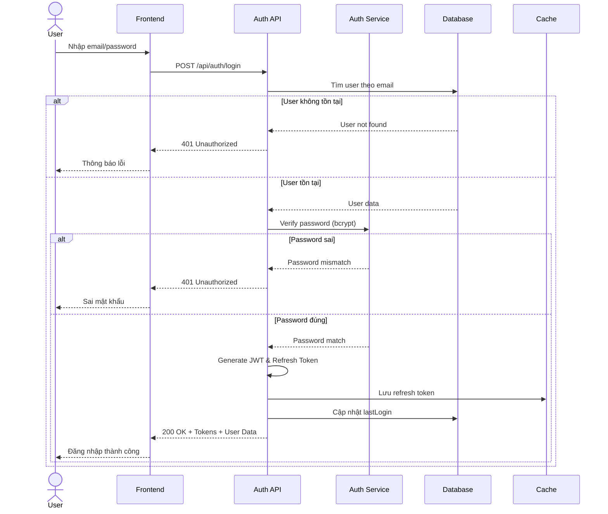
```mermaid
sequenceDiagram
    actor User
    participant UI as Frontend
    participant API as Auth API
    participant Auth as Auth Service
    participant DB as Database
    participant Redis as Cache

    User->>UI: Nhập email/password
    UI->>API: POST /api/auth/login
    API->>DB: Tìm user theo email
    
    alt User không tồn tại
        DB-->>API: User not found
        API-->>UI: 401 Unauthorized
        UI-->>User: Thông báo lỗi
    else User tồn tại
        DB-->>API: User data
        API->>Auth: Verify password (bcrypt)
        
        alt Password sai
            Auth-->>API: Password mismatch
            API-->>UI: 401 Unauthorized
            UI-->>User: Sai mật khẩu
        else Password đúng
            Auth-->>API: Password match
            API->>API: Generate JWT & Refresh Token
            API->>Redis: Lưu refresh token
            API->>DB: Cập nhật lastLogin
            API-->>UI: 200 OK + Tokens + User Data
            UI-->>User: Đăng nhập thành công
        end
    end
```

**Pre-conditions:**
- User đã đăng ký
- User chưa đăng nhập

**Post-conditions:**
- Access token và refresh token được tạo
- Refresh token được lưu trong Redis
- lastLogin được cập nhật
- User được đăng nhập

---

### 2.3 UC-AUTH-03: OAuth Login (Google/Facebook/GitHub)

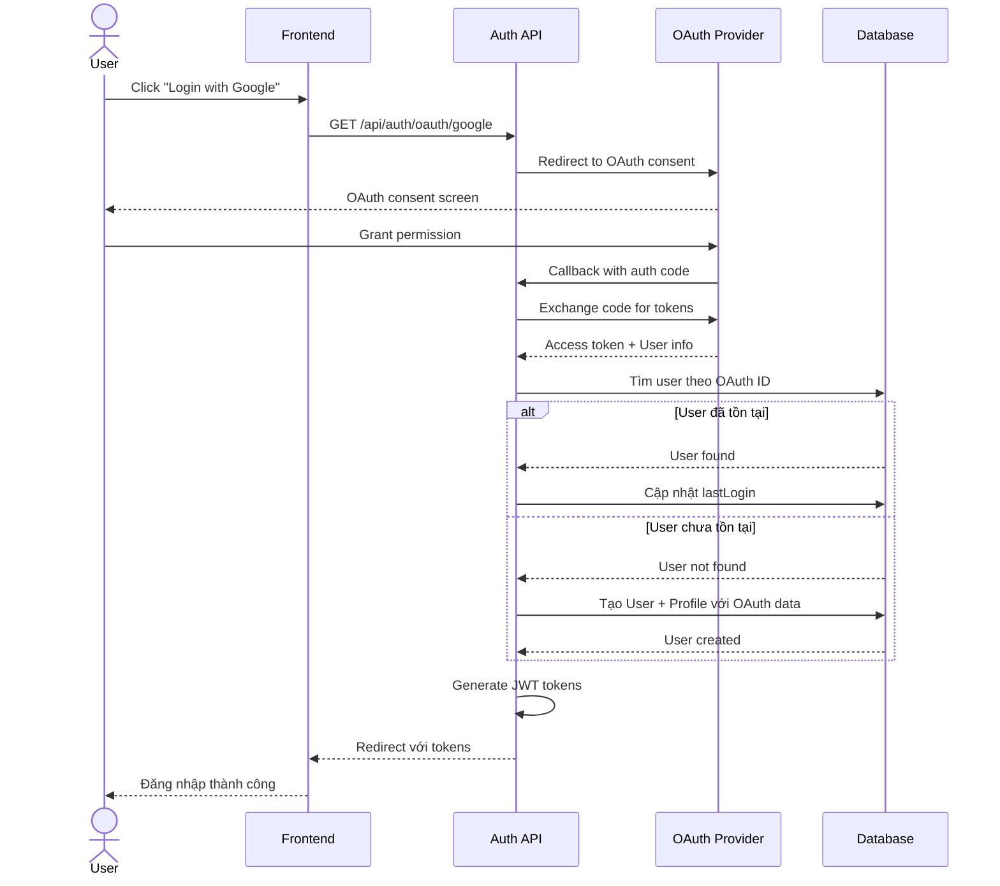
```mermaid
sequenceDiagram
    actor User
    participant UI as Frontend
    participant API as Auth API
    participant OAuth as OAuth Provider
    participant DB as Database

    User->>UI: Click "Login with Google"
    UI->>API: GET /api/auth/oauth/google
    API->>OAuth: Redirect to OAuth consent
    OAuth-->>User: OAuth consent screen
    User->>OAuth: Grant permission
    OAuth->>API: Callback with auth code
    API->>OAuth: Exchange code for tokens
    OAuth-->>API: Access token + User info
    
    API->>DB: Tìm user theo OAuth ID
    
    alt User đã tồn tại
        DB-->>API: User found
        API->>DB: Cập nhật lastLogin
    else User chưa tồn tại
        DB-->>API: User not found
        API->>DB: Tạo User + Profile với OAuth data
        DB-->>API: User created
    end
    
    API->>API: Generate JWT tokens
    API-->>UI: Redirect với tokens
    UI-->>User: Đăng nhập thành công
```

**Pre-conditions:**
- User có tài khoản OAuth hợp lệ
- OAuth provider được cấu hình đúng

**Post-conditions:**
- User được đăng nhập hoặc tạo mới
- OAuth provider data được lưu
- JWT tokens được tạo

---

### 2.4 UC-AUTH-04: Reset Password

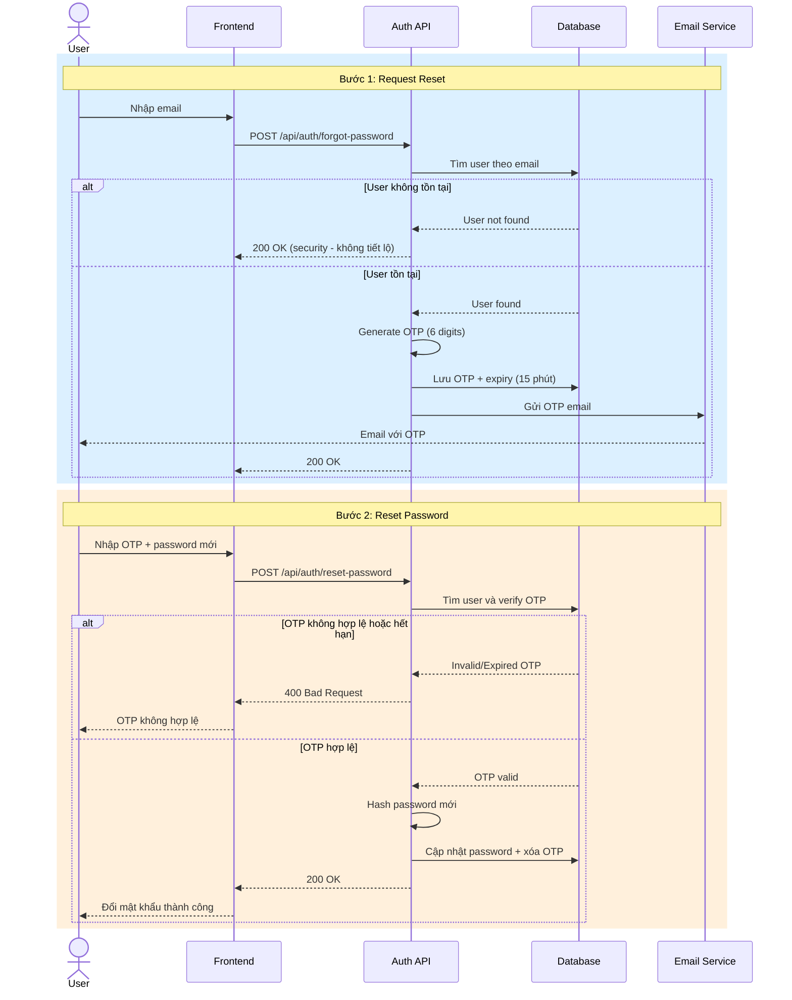
```mermaid
sequenceDiagram
    actor User
    participant UI as Frontend
    participant API as Auth API
    participant DB as Database
    participant Email as Email Service

    rect rgb(220, 240, 255)
        Note over User,Email: Bước 1: Request Reset
        User->>UI: Nhập email
        UI->>API: POST /api/auth/forgot-password
        API->>DB: Tìm user theo email
        
        alt User không tồn tại
            DB-->>API: User not found
            API-->>UI: 200 OK (security - không tiết lộ)
        else User tồn tại
            DB-->>API: User found
            API->>API: Generate OTP (6 digits)
            API->>DB: Lưu OTP + expiry (15 phút)
            API->>Email: Gửi OTP email
            Email-->>User: Email với OTP
            API-->>UI: 200 OK
        end
    end

    rect rgb(255, 240, 220)
        Note over User,Email: Bước 2: Reset Password
        User->>UI: Nhập OTP + password mới
        UI->>API: POST /api/auth/reset-password
        API->>DB: Tìm user và verify OTP
        
        alt OTP không hợp lệ hoặc hết hạn
            DB-->>API: Invalid/Expired OTP
            API-->>UI: 400 Bad Request
            UI-->>User: OTP không hợp lệ
        else OTP hợp lệ
            DB-->>API: OTP valid
            API->>API: Hash password mới
            API->>DB: Cập nhật password + xóa OTP
            API-->>UI: 200 OK
            UI-->>User: Đổi mật khẩu thành công
        end
    end
```

---

## 3. Content Management Use Cases

### 3.1 UC-CONTENT-01: Upload Video

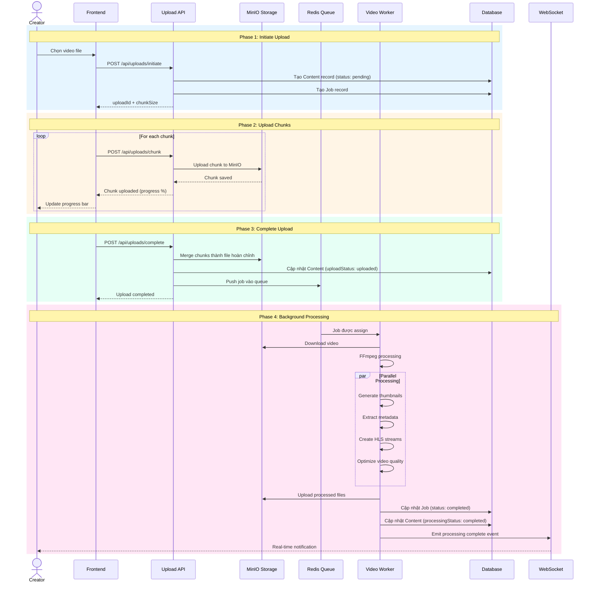
```mermaid
sequenceDiagram
    actor Creator
    participant UI as Frontend
    participant API as Upload API
    participant Storage as MinIO Storage
    participant Queue as Redis Queue
    participant Worker as Video Worker
    participant DB as Database
    participant WS as WebSocket

    rect rgb(230, 245, 255)
        Note over Creator,DB: Phase 1: Initiate Upload
        Creator->>UI: Chọn video file
        UI->>API: POST /api/uploads/initiate
        API->>DB: Tạo Content record (status: pending)
        API->>DB: Tạo Job record
        API-->>UI: uploadId + chunkSize
    end

    rect rgb(255, 245, 230)
        Note over Creator,DB: Phase 2: Upload Chunks
        loop For each chunk
            UI->>API: POST /api/uploads/chunk
            API->>Storage: Upload chunk to MinIO
            Storage-->>API: Chunk saved
            API-->>UI: Chunk uploaded (progress %)
            UI-->>Creator: Update progress bar
        end
    end

    rect rgb(230, 255, 245)
        Note over Creator,DB: Phase 3: Complete Upload
        UI->>API: POST /api/uploads/complete
        API->>Storage: Merge chunks thành file hoàn chỉnh
        API->>DB: Cập nhật Content (uploadStatus: uploaded)
        API->>Queue: Push job vào queue
        API-->>UI: Upload completed
    end

    rect rgb(255, 230, 245)
        Note over Creator,WS: Phase 4: Background Processing
        Queue->>Worker: Job được assign
        Worker->>Storage: Download video
        Worker->>Worker: FFmpeg processing
        
        par Parallel Processing
            Worker->>Worker: Generate thumbnails
            Worker->>Worker: Extract metadata
            Worker->>Worker: Create HLS streams
            Worker->>Worker: Optimize video quality
        end
        
        Worker->>Storage: Upload processed files
        Worker->>DB: Cập nhật Job (status: completed)
        Worker->>DB: Cập nhật Content (processingStatus: completed)
        Worker->>WS: Emit processing complete event
        WS-->>Creator: Real-time notification
    end
```

**Pre-conditions:**
- User đã đăng nhập
- User có quyền upload content
- Video file hợp lệ (format, size)

**Post-conditions:**
- Video được upload lên MinIO
- Content record được tạo
- Job processing được hoàn thành
- Video có thể xem được với adaptive streaming

**Main Flow:**
1. Initiate upload session
2. Upload video theo chunks
3. Complete upload
4. Background job xử lý video
5. Tạo thumbnails, metadata
6. Generate adaptive streaming (HLS)
7. Update database
8. Notify user

---

### 3.2 UC-CONTENT-02: Publish Article

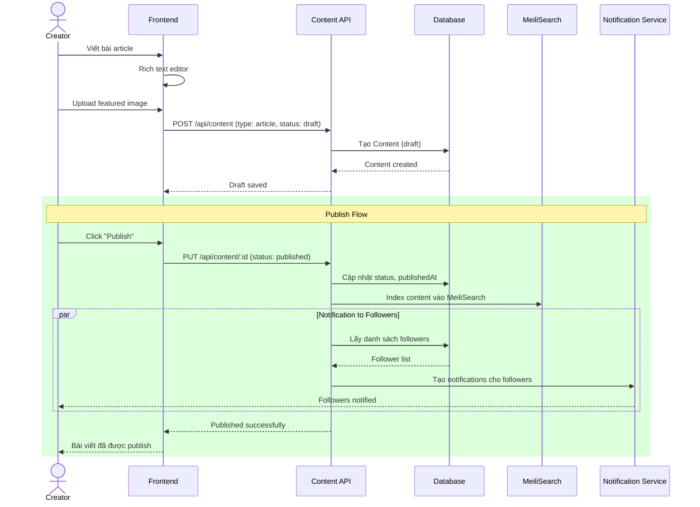
```mermaid
sequenceDiagram
    actor Creator
    participant UI as Frontend
    participant API as Content API
    participant DB as Database
    participant Search as MeiliSearch
    participant Notif as Notification Service

    Creator->>UI: Viết bài article
    UI->>UI: Rich text editor
    Creator->>UI: Upload featured image
    UI->>API: POST /api/content (type: article, status: draft)
    API->>DB: Tạo Content (draft)
    DB-->>API: Content created
    API-->>UI: Draft saved
    
    rect rgb(220, 255, 220)
        Note over Creator,Notif: Publish Flow
        Creator->>UI: Click "Publish"
        UI->>API: PUT /api/content/:id (status: published)
        API->>DB: Cập nhật status, publishedAt
        API->>Search: Index content vào MeiliSearch
        
        par Notification to Followers
            API->>DB: Lấy danh sách followers
            DB-->>API: Follower list
            API->>Notif: Tạo notifications cho followers
            Notif-->>Creator: Followers notified
        end
        
        API-->>UI: Published successfully
        UI-->>Creator: Bài viết đã được publish
    end
```

---

### 3.3 UC-CONTENT-03: Browse & Search Content

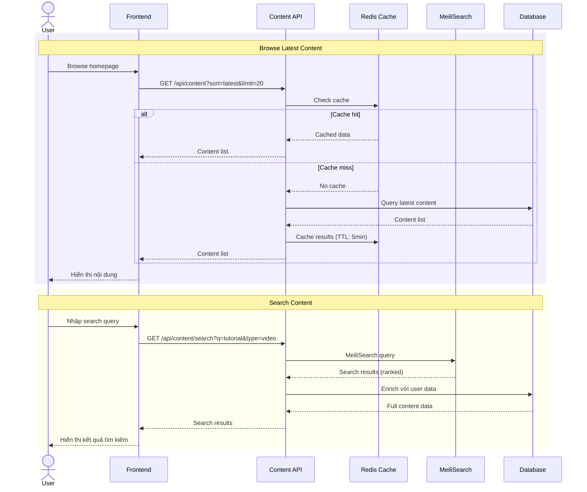
```mermaid
sequenceDiagram
    actor User
    participant UI as Frontend
    participant API as Content API
    participant Cache as Redis Cache
    participant Search as MeiliSearch
    participant DB as Database

    rect rgb(240, 240, 255)
        Note over User,DB: Browse Latest Content
        User->>UI: Browse homepage
        UI->>API: GET /api/content?sort=latest&limit=20
        API->>Cache: Check cache
        
        alt Cache hit
            Cache-->>API: Cached data
            API-->>UI: Content list
        else Cache miss
            Cache-->>API: No cache
            API->>DB: Query latest content
            DB-->>API: Content list
            API->>Cache: Cache results (TTL: 5min)
            API-->>UI: Content list
        end
        
        UI-->>User: Hiển thị nội dung
    end

    rect rgb(255, 255, 240)
        Note over User,DB: Search Content
        User->>UI: Nhập search query
        UI->>API: GET /api/content/search?q=tutorial&type=video
        API->>Search: MeiliSearch query
        Search-->>API: Search results (ranked)
        API->>DB: Enrich với user data
        DB-->>API: Full content data
        API-->>UI: Search results
        UI-->>User: Hiển thị kết quả tìm kiếm
    end
```

---

## 4. Social Interaction Use Cases

### 4.1 UC-SOCIAL-01: Like Content

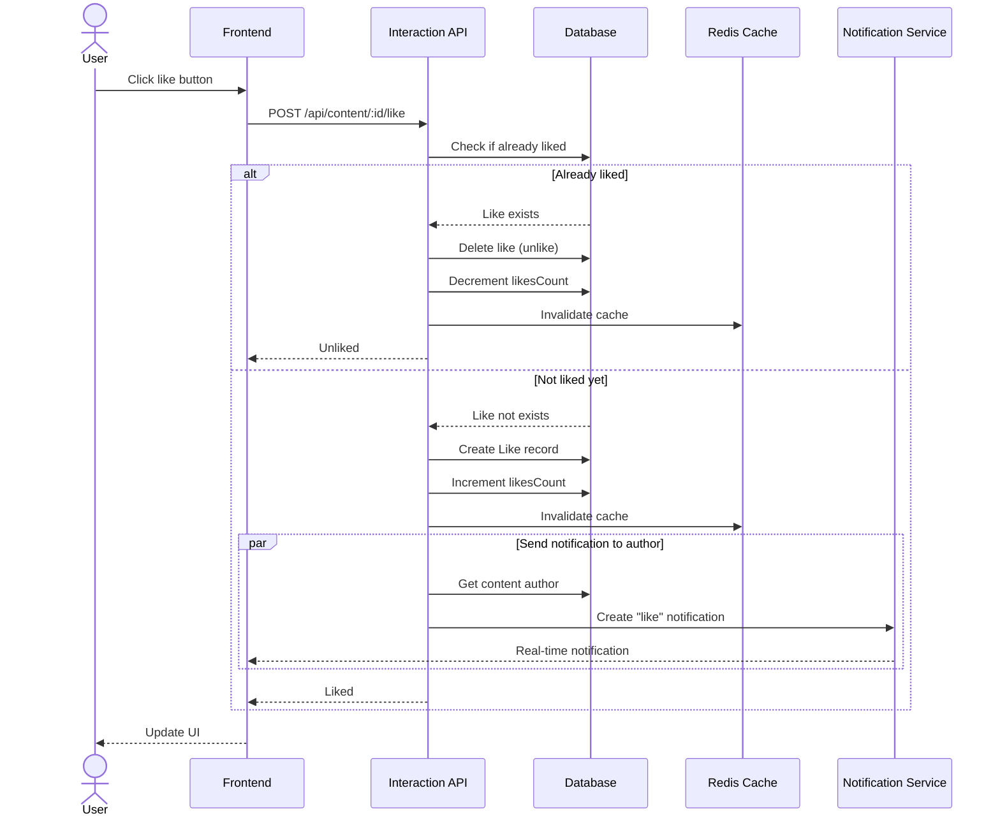
```mermaid
sequenceDiagram
    actor User
    participant UI as Frontend
    participant API as Interaction API
    participant DB as Database
    participant Cache as Redis Cache
    participant Notif as Notification Service

    User->>UI: Click like button
    UI->>API: POST /api/content/:id/like
    API->>DB: Check if already liked
    
    alt Already liked
        DB-->>API: Like exists
        API->>DB: Delete like (unlike)
        API->>DB: Decrement likesCount
        API->>Cache: Invalidate cache
        API-->>UI: Unliked
    else Not liked yet
        DB-->>API: Like not exists
        API->>DB: Create Like record
        API->>DB: Increment likesCount
        API->>Cache: Invalidate cache
        
        par Send notification to author
            API->>DB: Get content author
            API->>Notif: Create "like" notification
            Notif-->>UI: Real-time notification
        end
        
        API-->>UI: Liked
    end
    
    UI-->>User: Update UI
```

---

### 4.2 UC-SOCIAL-02: Comment on Content

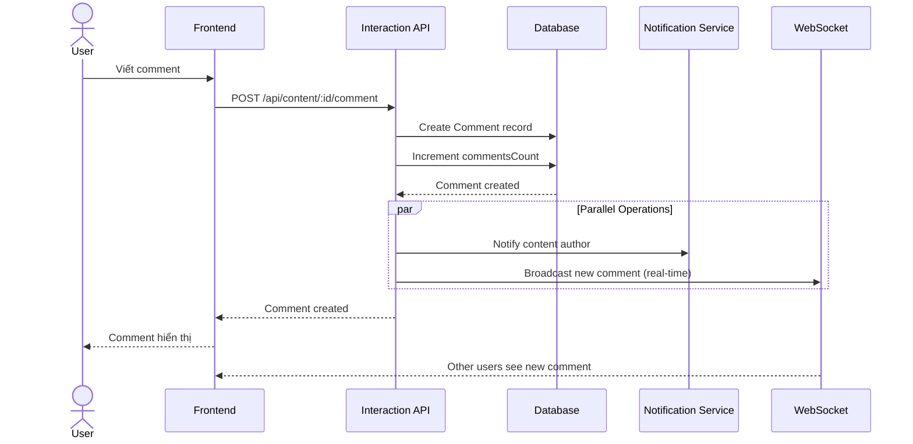
```mermaid
sequenceDiagram
    actor User
    participant UI as Frontend
    participant API as Interaction API
    participant DB as Database
    participant Notif as Notification Service
    participant WS as WebSocket

    User->>UI: Viết comment
    UI->>API: POST /api/content/:id/comment
    API->>DB: Create Comment record
    API->>DB: Increment commentsCount
    DB-->>API: Comment created
    
    par Parallel Operations
        API->>Notif: Notify content author
        API->>WS: Broadcast new comment (real-time)
    end
    
    API-->>UI: Comment created
    UI-->>User: Comment hiển thị
    WS-->>UI: Other users see new comment
```

---

### 4.3 UC-SOCIAL-03: Follow User

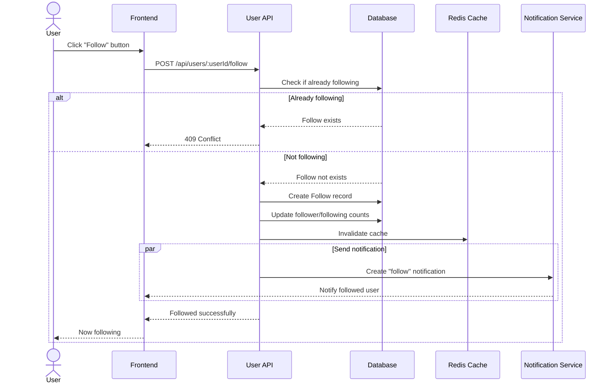
```mermaid
sequenceDiagram
    actor User
    participant UI as Frontend
    participant API as User API
    participant DB as Database
    participant Cache as Redis Cache
    participant Notif as Notification Service

    User->>UI: Click "Follow" button
    UI->>API: POST /api/users/:userId/follow
    API->>DB: Check if already following
    
    alt Already following
        DB-->>API: Follow exists
        API-->>UI: 409 Conflict
    else Not following
        DB-->>API: Follow not exists
        API->>DB: Create Follow record
        API->>DB: Update follower/following counts
        API->>Cache: Invalidate cache
        
        par Send notification
            API->>Notif: Create "follow" notification
            Notif-->>UI: Notify followed user
        end
        
        API-->>UI: Followed successfully
        UI-->>User: Now following
    end
```

---

### 4.4 UC-SOCIAL-04: Create & Manage Playlist

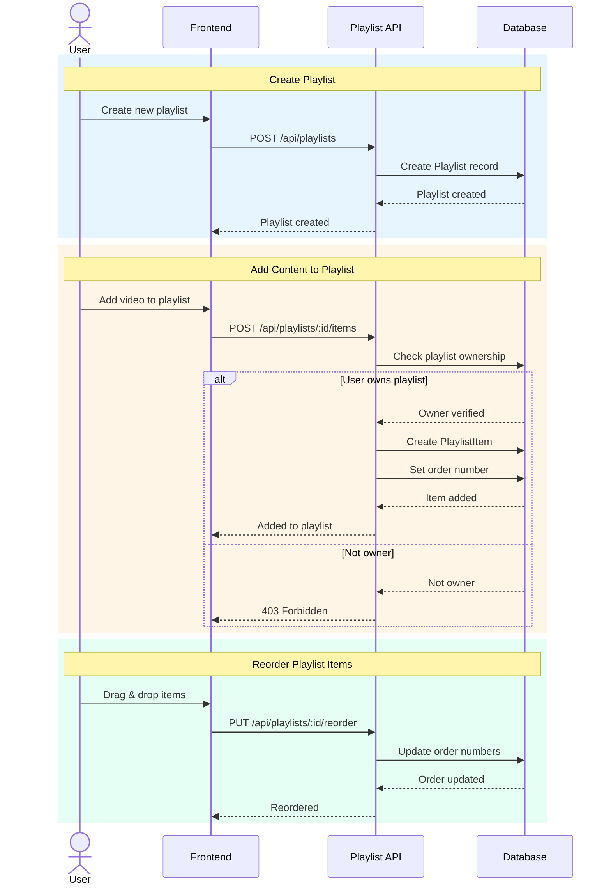
```mermaid
sequenceDiagram
    actor User
    participant UI as Frontend
    participant API as Playlist API
    participant DB as Database

    rect rgb(230, 245, 255)
        Note over User,DB: Create Playlist
        User->>UI: Create new playlist
        UI->>API: POST /api/playlists
        API->>DB: Create Playlist record
        DB-->>API: Playlist created
        API-->>UI: Playlist created
    end

    rect rgb(255, 245, 230)
        Note over User,DB: Add Content to Playlist
        User->>UI: Add video to playlist
        UI->>API: POST /api/playlists/:id/items
        API->>DB: Check playlist ownership
        
        alt User owns playlist
            DB-->>API: Owner verified
            API->>DB: Create PlaylistItem
            API->>DB: Set order number
            DB-->>API: Item added
            API-->>UI: Added to playlist
        else Not owner
            DB-->>API: Not owner
            API-->>UI: 403 Forbidden
        end
    end

    rect rgb(230, 255, 245)
        Note over User,DB: Reorder Playlist Items
        User->>UI: Drag & drop items
        UI->>API: PUT /api/playlists/:id/reorder
        API->>DB: Update order numbers
        DB-->>API: Order updated
        API-->>UI: Reordered
    end
```

---

## 5. Moderation Use Cases

### 5.1 UC-MOD-01: Report Content

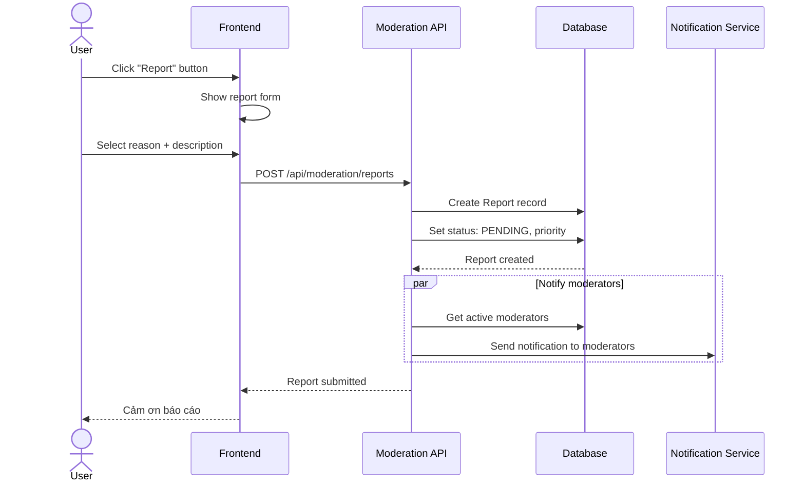
```mermaid
sequenceDiagram
    actor User
    participant UI as Frontend
    participant API as Moderation API
    participant DB as Database
    participant Notif as Notification Service

    User->>UI: Click "Report" button
    UI->>UI: Show report form
    User->>UI: Select reason + description
    UI->>API: POST /api/moderation/reports
    API->>DB: Create Report record
    API->>DB: Set status: PENDING, priority
    DB-->>API: Report created
    
    par Notify moderators
        API->>DB: Get active moderators
        API->>Notif: Send notification to moderators
    end
    
    API-->>UI: Report submitted
    UI-->>User: Cảm ơn báo cáo
```

---

### 5.2 UC-MOD-02: Review Report (Moderator)

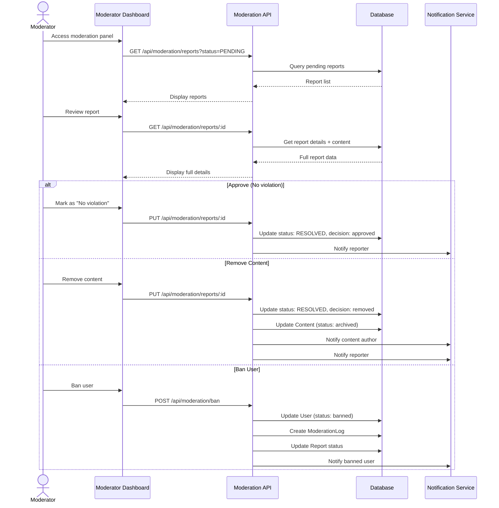
```mermaid
sequenceDiagram
    actor Moderator
    participant UI as Moderator Dashboard
    participant API as Moderation API
    participant DB as Database
    participant Notif as Notification Service

    Moderator->>UI: Access moderation panel
    UI->>API: GET /api/moderation/reports?status=PENDING
    API->>DB: Query pending reports
    DB-->>API: Report list
    API-->>UI: Display reports

    Moderator->>UI: Review report
    UI->>API: GET /api/moderation/reports/:id
    API->>DB: Get report details + content
    DB-->>API: Full report data
    API-->>UI: Display full details

    alt Approve (No violation)
        Moderator->>UI: Mark as "No violation"
        UI->>API: PUT /api/moderation/reports/:id
        API->>DB: Update status: RESOLVED, decision: approved
        API->>Notif: Notify reporter
    else Remove Content
        Moderator->>UI: Remove content
        UI->>API: PUT /api/moderation/reports/:id
        API->>DB: Update status: RESOLVED, decision: removed
        API->>DB: Update Content (status: archived)
        API->>Notif: Notify content author
        API->>Notif: Notify reporter
    else Ban User
        Moderator->>UI: Ban user
        UI->>API: POST /api/moderation/ban
        API->>DB: Update User (status: banned)
        API->>DB: Create ModerationLog
        API->>DB: Update Report status
        API->>Notif: Notify banned user
    end
```

---

## 6. Notification Use Cases

### 6.1 UC-NOTIF-01: Receive Real-time Notification

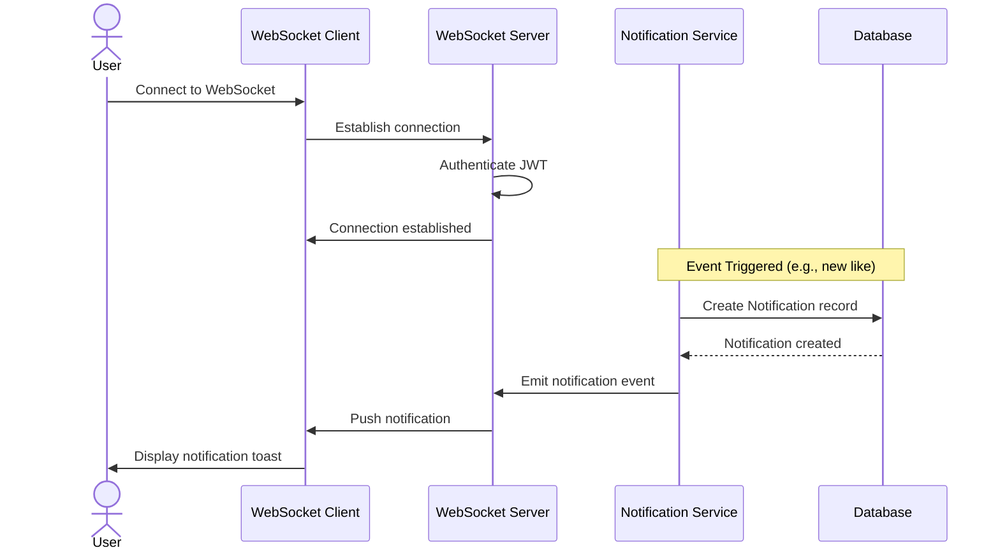
```mermaid
sequenceDiagram
    actor User
    participant WS as WebSocket Client
    participant Server as WebSocket Server
    participant Service as Notification Service
    participant DB as Database

    User->>WS: Connect to WebSocket
    WS->>Server: Establish connection
    Server->>Server: Authenticate JWT
    Server->>WS: Connection established

    Note over Service,DB: Event Triggered (e.g., new like)
    Service->>DB: Create Notification record
    DB-->>Service: Notification created
    Service->>Server: Emit notification event
    Server->>WS: Push notification
    WS->>User: Display notification toast
```

---

### 6.2 UC-NOTIF-02: Configure Notification Preferences

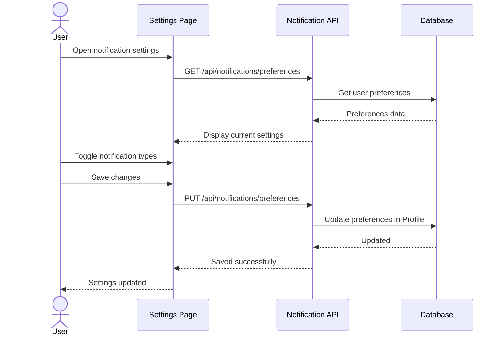
```mermaid
sequenceDiagram
    actor User
    participant UI as Settings Page
    participant API as Notification API
    participant DB as Database

    User->>UI: Open notification settings
    UI->>API: GET /api/notifications/preferences
    API->>DB: Get user preferences
    DB-->>API: Preferences data
    API-->>UI: Display current settings

    User->>UI: Toggle notification types
    User->>UI: Save changes
    UI->>API: PUT /api/notifications/preferences
    API->>DB: Update preferences in Profile
    DB-->>API: Updated
    API-->>UI: Saved successfully
    UI-->>User: Settings updated
```

---

## 7. Analytics Use Cases

### 7.1 UC-ANALYTICS-01: Track Content View

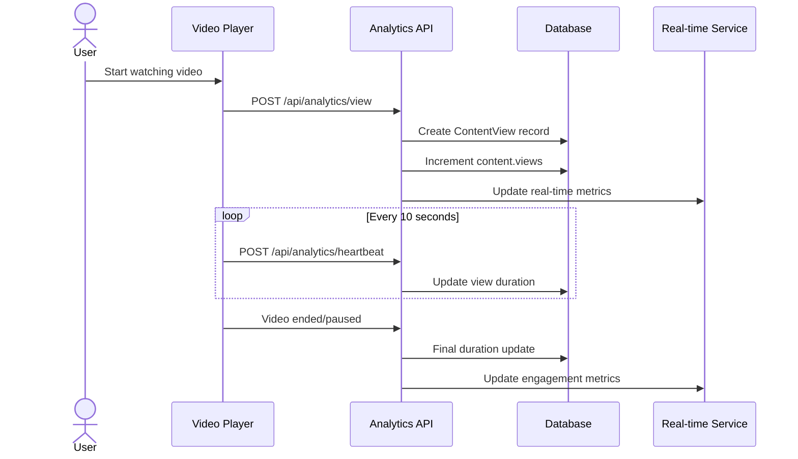
```mermaid
sequenceDiagram
    actor User
    participant Player as Video Player
    participant API as Analytics API
    participant DB as Database
    participant Realtime as Real-time Service

    User->>Player: Start watching video
    Player->>API: POST /api/analytics/view
    API->>DB: Create ContentView record
    API->>DB: Increment content.views
    API->>Realtime: Update real-time metrics
    
    loop Every 10 seconds
        Player->>API: POST /api/analytics/heartbeat
        API->>DB: Update view duration
    end

    Player->>API: Video ended/paused
    API->>DB: Final duration update
    API->>Realtime: Update engagement metrics
```

---

### 7.2 UC-ANALYTICS-02: View Creator Dashboard

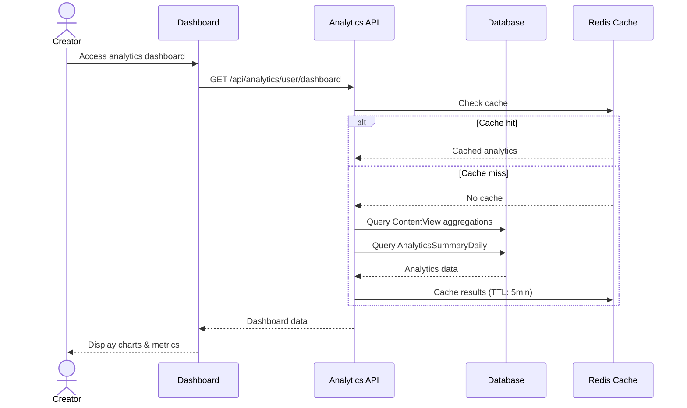
```mermaid
sequenceDiagram
    actor Creator
    participant UI as Dashboard
    participant API as Analytics API
    participant DB as Database
    participant Cache as Redis Cache

    Creator->>UI: Access analytics dashboard
    UI->>API: GET /api/analytics/user/dashboard
    API->>Cache: Check cache
    
    alt Cache hit
        Cache-->>API: Cached analytics
    else Cache miss
        Cache-->>API: No cache
        API->>DB: Query ContentView aggregations
        API->>DB: Query AnalyticsSummaryDaily
        DB-->>API: Analytics data
        API->>Cache: Cache results (TTL: 5min)
    end
    
    API-->>UI: Dashboard data
    UI-->>Creator: Display charts & metrics
```

---

## 8. Use Case Summary Table

| Use Case ID | Name | Actor | Priority | Complexity |
|------------|------|-------|----------|------------|
| UC-AUTH-01 | Register Account | Guest | High | Medium |
| UC-AUTH-02 | Login | Guest | High | Low |
| UC-AUTH-03 | OAuth Login | Guest | Medium | High |
| UC-AUTH-04 | Reset Password | User | Medium | Medium |
| UC-CONTENT-01 | Upload Video | Creator | High | Very High |
| UC-CONTENT-02 | Publish Article | Creator | High | Medium |
| UC-CONTENT-03 | Browse/Search Content | All | High | High |
| UC-CONTENT-04 | Edit Content | Creator | Medium | Medium |
| UC-CONTENT-05 | Delete Content | Creator | Medium | Low |
| UC-SOCIAL-01 | Like Content | User | High | Low |
| UC-SOCIAL-02 | Comment | User | High | Medium |
| UC-SOCIAL-03 | Follow User | User | Medium | Low |
| UC-SOCIAL-04 | Create Playlist | User | Medium | Medium |
| UC-SOCIAL-05 | Share Content | User | Low | Low |
| UC-PROFILE-01 | View Profile | All | High | Low |
| UC-PROFILE-02 | Edit Profile | User | Medium | Medium |
| UC-PROFILE-03 | Upload Avatar | User | Low | Medium |
| UC-MOD-01 | Report Content | User | Medium | Low |
| UC-MOD-02 | Review Report | Moderator | High | High |
| UC-MOD-03 | Ban User | Moderator | High | Medium |
| UC-NOTIF-01 | Receive Notification | User | High | Medium |
| UC-NOTIF-02 | Configure Preferences | User | Low | Low |
| UC-ANALYTICS-01 | Track View | System | High | Medium |
| UC-ANALYTICS-02 | Creator Dashboard | Creator | Medium | High |

## 9. Tài Liệu Liên Quan

- [00 - Overview](./00-overview.md)
- [02 - Authentication Workflow](./02-authentication-workflow.md)
- [03 - Content Management Workflow](./03-content-workflow.md)
- [04 - Social Interaction Workflow](./04-interaction-workflow.md)
