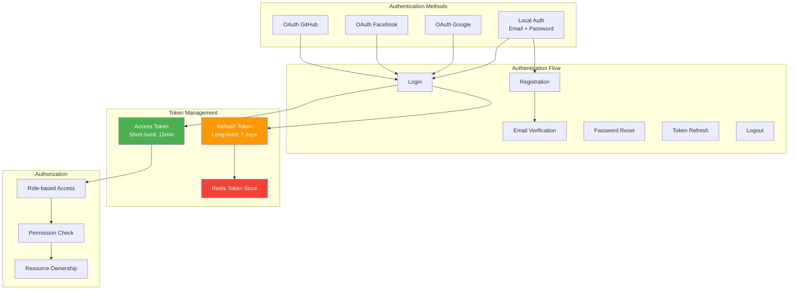
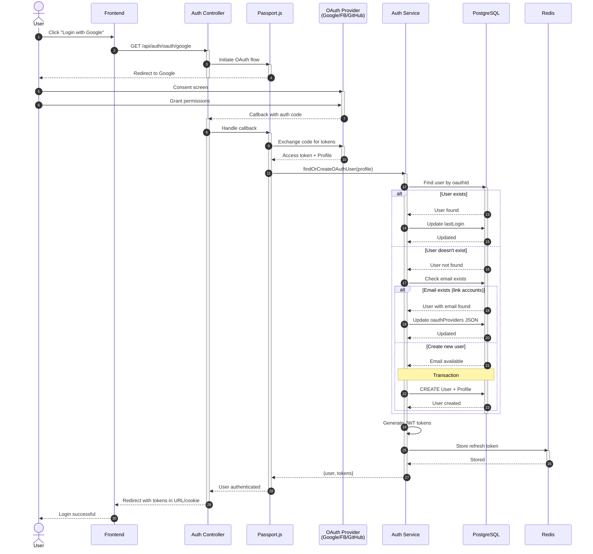
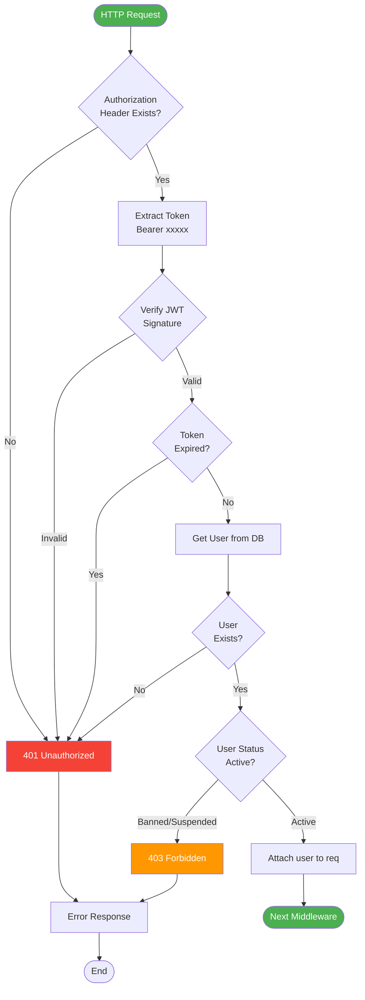
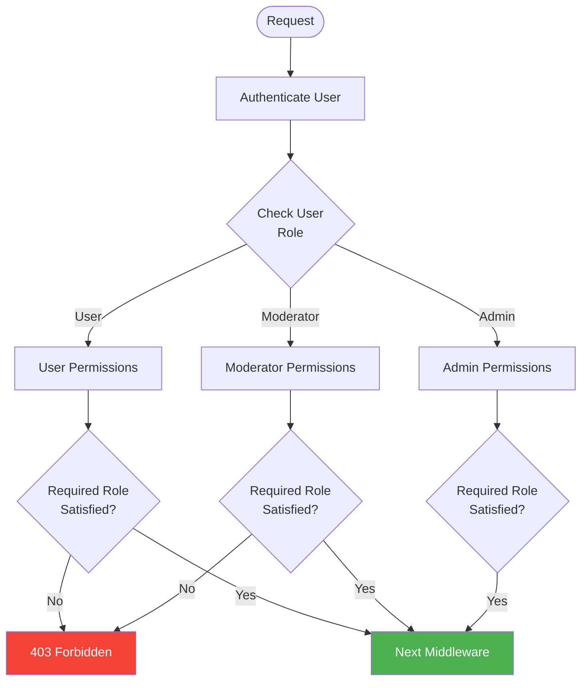
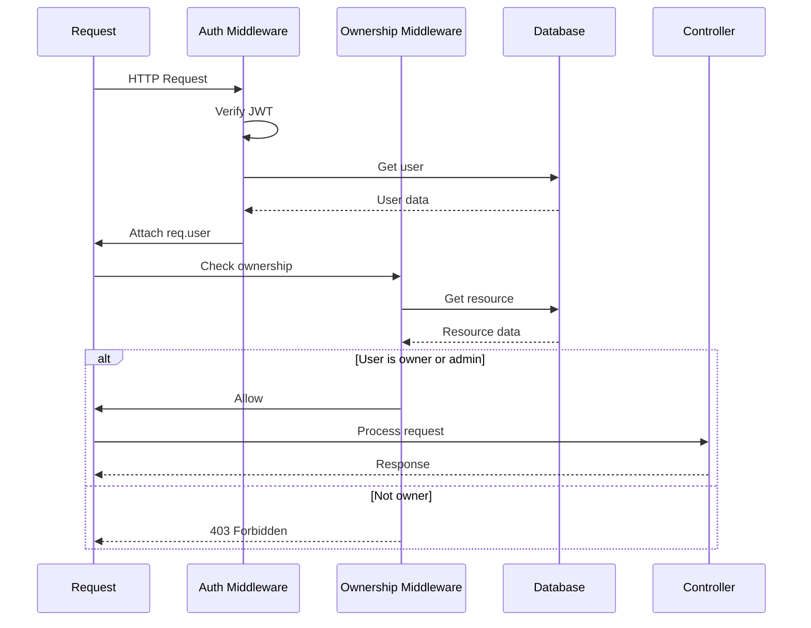
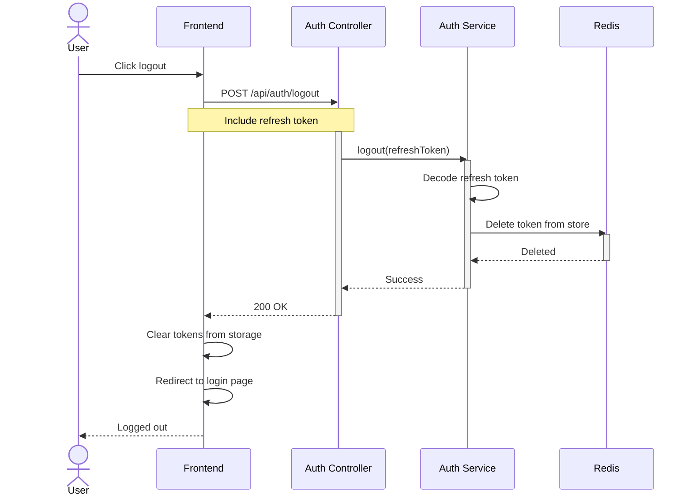

# Authentication & Authorization Workflow

## 1. Tổng Quan Authentication System



## 2. Registration Flow (Chi Tiết)

### 2.1 Local Registration

```mermaid
sequenceDiagram
    autonumber
    actor User
    participant UI as Frontend
    participant Validation as Validator
    participant Auth as Auth Controller
    participant Service as Auth Service
    participant DB as PostgreSQL
    participant Email as Email Service
    participant Redis as Redis Cache

    User->>UI: Fill registration form
    activate UI
    UI->>UI: Client-side validation
    UI->>Validation: Validate input
    activate Validation
    
    alt Invalid Input
        Validation-->>UI: Validation errors
        UI-->>User: Display errors
        deactivate Validation
    else Valid Input
        Validation-->>UI: Input valid
        deactivate Validation
        
        UI->>Auth: POST /api/auth/register
        activate Auth
        Auth->>Service: registerUser(data)
        activate Service
        
        Service->>DB: Check email exists
        activate DB
        
        alt Email exists
            DB-->>Service: Email found
            deactivate DB
            Service-->>Auth: ConflictError
            Auth-->>UI: 409 Conflict
            UI-->>User: Email already registered
        else Email available
            DB-->>Service: Email available
            deactivate DB
            
            Service->>DB: Check username exists
            activate DB
            
            alt Username exists
                DB-->>Service: Username found
                deactivate DB
                Service-->>Auth: ConflictError
                Auth-->>UI: 409 Conflict
                UI-->>User: Username taken
            else Username available
                DB-->>Service: Username available
                deactivate DB
                
                Service->>Service: Hash password (bcrypt, rounds: 10)
                
                Note over Service,DB: Transaction Begin
                Service->>DB: BEGIN TRANSACTION
                activate DB
                
                Service->>DB: INSERT INTO users
                DB-->>Service: User created (userId)
                
                Service->>DB: INSERT INTO profiles
                DB-->>Service: Profile created
                
                Service->>DB: COMMIT TRANSACTION
                deactivate DB
                
                Service->>Service: Generate JWT tokens
                Service->>Redis: Store refresh token
                activate Redis
                Redis-->>Service: Token stored (TTL: 7d)
                deactivate Redis
                
                par Send verification email
                    Service->>Email: Send verification email
                    activate Email
                    Email-->>User: Verification email
                    deactivate Email
                end
                
                Service-->>Auth: {user, tokens}
                deactivate Service
                Auth-->>UI: 201 Created + tokens
                deactivate Auth
                UI-->>User: Registration successful
                deactivate UI
            end
        end
    end
```

**File tham gia:**
- `src/modules/auth/authController.js` - Controller xử lý request
- `src/modules/auth/authService.js` - Business logic
- `src/modules/auth/authValidation.js` - Input validation
- `prisma/schema.prisma` - User & Profile models

**Code Flow:**
```javascript
// 1. authController.js - register()
exports.register = async (req, res, next) => {
  try {
    // Validate input
    const { email, username, password } = req.body;
    
    // Call service
    const result = await authService.registerUser({
      email, username, password
    });
    
    res.status(201).json(result);
  } catch (error) {
    next(error);
  }
};

// 2. authService.js - registerUser()
registerUser = async (data) => {
  // Check email exists
  const emailExists = await prisma.user.findUnique({
    where: { email: data.email }
  });
  if (emailExists) throw new ConflictError('Email already registered');
  
  // Check username exists
  const usernameExists = await prisma.user.findUnique({
    where: { username: data.username }
  });
  if (usernameExists) throw new ConflictError('Username taken');
  
  // Hash password
  const passwordHash = await bcrypt.hash(data.password, 10);
  
  // Create user + profile in transaction
  const user = await prisma.$transaction(async (tx) => {
    const newUser = await tx.user.create({
      data: {
        email: data.email,
        username: data.username,
        passwordHash,
        profile: {
          create: {
            displayName: data.username
          }
        }
      },
      include: { profile: true }
    });
    
    return newUser;
  });
  
  // Generate tokens
  const tokens = generateTokens(user);
  
  // Store refresh token
  await storeRefreshToken(user.id, tokens.refreshToken);
  
  // Send verification email
  await sendVerificationEmail(user);
  
  return { user, tokens };
};
```

---

### 2.2 OAuth Registration/Login Flow



**File tham gia:**
- `src/modules/auth/oauthController.js` - OAuth controller
- `src/config/auth.js` - Passport strategies configuration
- `src/modules/auth/authService.js` - User creation logic

**Passport Strategy Configuration:**
```javascript
// config/auth.js
const GoogleStrategy = require('passport-google-oauth20').Strategy;

passport.use(new GoogleStrategy({
  clientID: process.env.GOOGLE_CLIENT_ID,
  clientSecret: process.env.GOOGLE_CLIENT_SECRET,
  callbackURL: '/api/auth/oauth/google/callback'
}, async (accessToken, refreshToken, profile, done) => {
  try {
    const user = await authService.findOrCreateOAuthUser({
      provider: 'google',
      providerId: profile.id,
      email: profile.emails[0].value,
      displayName: profile.displayName,
      avatarUrl: profile.photos[0].value
    });
    
    done(null, user);
  } catch (error) {
    done(error);
  }
}));
```

---

## 3. Login Flow

### 3.1 Local Login

```mermaid
sequenceDiagram
    autonumber
    actor User
    participant UI as Frontend
    participant Auth as Auth Controller
    participant Service as Auth Service
    participant DB as PostgreSQL
    participant Redis as Redis

    User->>UI: Enter email + password
    UI->>Auth: POST /api/auth/login
    activate Auth
    
    Auth->>Service: login(email, password)
    activate Service
    
    Service->>DB: Find user by email
    activate DB
    
    alt User not found
        DB-->>Service: null
        deactivate DB
        Service-->>Auth: UnauthorizedError
        Auth-->>UI: 401 Unauthorized
        UI-->>User: Invalid credentials
    else User found
        DB-->>Service: User data
        deactivate DB
        
        Service->>Service: bcrypt.compare(password, hash)
        
        alt Password incorrect
            Service-->>Auth: UnauthorizedError
            Auth-->>UI: 401 Unauthorized
            UI-->>User: Invalid credentials
        else Password correct
            Service->>Service: Generate JWT tokens
            
            Service->>Redis: Store refresh token
            activate Redis
            Redis-->>Service: Stored (TTL: 7d)
            deactivate Redis
            
            Service->>DB: Update lastLogin timestamp
            activate DB
            DB-->>Service: Updated
            deactivate DB
            
            Service-->>Auth: {user, tokens}
            deactivate Service
            
            Auth-->>UI: 200 OK + tokens + user data
            deactivate Auth
            
            UI->>UI: Store tokens (localStorage/cookies)
            UI-->>User: Login successful
        end
    end
```

**JWT Token Structure:**

```javascript
// Access Token (15 minutes expiry)
{
  "userId": "abc123",
  "email": "user@example.com",
  "role": "user",
  "type": "access",
  "iat": 1234567890,
  "exp": 1234568790  // +15 minutes
}

// Refresh Token (7 days expiry)
{
  "userId": "abc123",
  "type": "refresh",
  "tokenId": "unique-token-id",
  "iat": 1234567890,
  "exp": 1235172690  // +7 days
}
```

---

### 3.2 Token Refresh Flow

```mermaid
sequenceDiagram
    autonumber
    actor User
    participant UI as Frontend
    participant Auth as Auth Controller
    participant Service as Auth Service
    participant Redis as Redis
    participant DB as PostgreSQL

    Note over UI: Access token expired

    UI->>Auth: POST /api/auth/refresh
    Note over UI,Auth: Include refresh token

    activate Auth
    Auth->>Service: refreshAccessToken(refreshToken)
    activate Service

    Service->>Service: Verify refresh token signature

    alt Invalid signature
        Service-->>Auth: UnauthorizedError
        Auth-->>UI: 401 Unauthorized
        UI-->>User: Please login again
    else Valid signature
        Service->>Redis: Get stored token
        activate Redis

        alt Token not found or expired
            Redis-->>Service: null
            deactivate Redis
            Service-->>Auth: UnauthorizedError
            Auth-->>UI: 401 Unauthorized
            UI-->>User: Session expired
        else Token valid
            Redis-->>Service: Token exists
            deactivate Redis

            Service->>DB: Get user data
            activate DB
            DB-->>Service: User data
            deactivate DB

            Service->>Service: Generate new access token
            Service->>Service: (Optional) Rotate refresh token

            alt Rotate refresh token
                Service->>Redis: Delete old token
                activate Redis
                Redis-->>Service: Deleted
                Service->>Redis: Store new refresh token
                Redis-->>Service: Stored
                deactivate Redis
            end

            Service-->>Auth: New tokens
            deactivate Service
            Auth-->>UI: 200 OK + new tokens
            deactivate Auth
            UI->>UI: Update stored tokens
            UI-->>User: Continue session
        end
    end
```

**Implementation:**
```javascript
// authService.js
refreshAccessToken = async (refreshToken) => {
  // Verify token
  const decoded = jwt.verify(refreshToken, process.env.JWT_REFRESH_SECRET);
  
  // Check Redis
  const storedToken = await redis.get(`refresh:${decoded.userId}:${decoded.tokenId}`);
  if (!storedToken) {
    throw new UnauthorizedError('Invalid refresh token');
  }
  
  // Get user
  const user = await prisma.user.findUnique({
    where: { id: decoded.userId },
    include: { profile: true }
  });
  
  if (!user) {
    throw new UnauthorizedError('User not found');
  }
  
  // Generate new access token
  const accessToken = generateAccessToken(user);
  
  // Optional: Rotate refresh token
  if (process.env.ROTATE_REFRESH_TOKEN === 'true') {
    const newRefreshToken = generateRefreshToken(user);
    
    // Delete old token
    await redis.del(`refresh:${decoded.userId}:${decoded.tokenId}`);
    
    // Store new token
    await storeRefreshToken(user.id, newRefreshToken);
    
    return { accessToken, refreshToken: newRefreshToken };
  }
  
  return { accessToken };
};
```

---

## 4. Password Reset Flow

```mermaid
sequenceDiagram
    autonumber
    actor User
    participant UI as Frontend
    participant Auth as Auth Controller
    participant Service as Auth Service
    participant DB as PostgreSQL
    participant Email as Email Service

    rect rgb(230, 245, 255)
        Note over User,Email: Step 1: Request Reset
        User->>UI: Enter email
        UI->>Auth: POST /api/auth/forgot-password
        activate Auth
        
        Auth->>Service: requestPasswordReset(email)
        activate Service
        
        Service->>DB: Find user by email
        activate DB
        
        alt User not found
            DB-->>Service: null
            deactivate DB
            Note over Service: Security: Don't reveal if email exists
            Service-->>Auth: Success (fake)
            Auth-->>UI: 200 OK
            UI-->>User: Check your email
        else User found
            DB-->>Service: User data
            deactivate DB
            
            Service->>Service: Generate 6-digit OTP
            Service->>Service: Set expiry (15 minutes)
            
            Service->>DB: Update user (otp, otpExpiresAt)
            activate DB
            DB-->>Service: Updated
            deactivate DB
            
            Service->>Email: Send OTP email
            activate Email
            Email-->>User: Email with OTP
            deactivate Email
            
            Service-->>Auth: Success
            deactivate Service
            Auth-->>UI: 200 OK
            deactivate Auth
            UI-->>User: Check your email for OTP
        end
    end

    rect rgb(255, 245, 230)
        Note over User,Email: Step 2: Verify OTP & Reset
        User->>UI: Enter OTP + new password
        UI->>Auth: POST /api/auth/reset-password
        activate Auth
        
        Auth->>Service: resetPassword(email, otp, newPassword)
        activate Service
        
        Service->>DB: Find user by email
        activate DB
        DB-->>Service: User data
        deactivate DB
        
        Service->>Service: Verify OTP
        
        alt OTP invalid or expired
            Service-->>Auth: BadRequestError
            Auth-->>UI: 400 Bad Request
            UI-->>User: Invalid or expired OTP
        else OTP valid
            Service->>Service: Hash new password
            
            Service->>DB: Update password, clear OTP
            activate DB
            DB-->>Service: Updated
            deactivate DB
            
            Service->>Email: Send confirmation email
            activate Email
            Email-->>User: Password changed
            deactivate Email
            
            Service-->>Auth: Success
            deactivate Service
            Auth-->>UI: 200 OK
            deactivate Auth
            UI-->>User: Password reset successful
        end
    end
```

**OTP Generation:**
```javascript
// authService.js
generateOTP = () => {
  return Math.floor(100000 + Math.random() * 900000).toString();
};

requestPasswordReset = async (email) => {
  const user = await prisma.user.findUnique({ where: { email } });
  
  if (!user) {
    // Security: Don't reveal if email exists
    return { success: true };
  }
  
  const otp = generateOTP();
  const otpExpiresAt = new Date(Date.now() + 15 * 60 * 1000); // 15 minutes
  
  await prisma.user.update({
    where: { id: user.id },
    data: { otp, otpExpiresAt }
  });
  
  await emailService.sendOTP(user.email, otp);
  
  return { success: true };
};

resetPassword = async (email, otp, newPassword) => {
  const user = await prisma.user.findUnique({ where: { email } });
  
  if (!user || !user.otp || user.otp !== otp) {
    throw new BadRequestError('Invalid OTP');
  }
  
  if (new Date() > user.otpExpiresAt) {
    throw new BadRequestError('OTP expired');
  }
  
  const passwordHash = await bcrypt.hash(newPassword, 10);
  
  await prisma.user.update({
    where: { id: user.id },
    data: {
      passwordHash,
      otp: null,
      otpExpiresAt: null
    }
  });
  
  await emailService.sendPasswordResetConfirmation(user.email);
  
  return { success: true };
};
```

---

## 5. Authorization & Middleware

### 5.1 Authentication Middleware



**Implementation:**
```javascript
// middleware/auth.js
const authenticate = async (req, res, next) => {
  try {
    // Extract token
    const authHeader = req.headers.authorization;
    if (!authHeader || !authHeader.startsWith('Bearer ')) {
      throw new UnauthorizedError('No token provided');
    }
    
    const token = authHeader.substring(7);
    
    // Verify token
    const decoded = jwt.verify(token, process.env.JWT_ACCESS_SECRET);
    
    // Get user
    const user = await prisma.user.findUnique({
      where: { id: decoded.userId },
      include: { profile: true }
    });
    
    if (!user) {
      throw new UnauthorizedError('User not found');
    }
    
    if (user.status !== 'active') {
      throw new ForbiddenError('Account suspended or banned');
    }
    
    // Attach to request
    req.user = user;
    req.userId = user.id;
    
    next();
  } catch (error) {
    if (error.name === 'TokenExpiredError') {
      return res.status(401).json({
        error: 'Token expired',
        code: 'TOKEN_EXPIRED'
      });
    }
    
    if (error.name === 'JsonWebTokenError') {
      return res.status(401).json({
        error: 'Invalid token',
        code: 'INVALID_TOKEN'
      });
    }
    
    next(error);
  }
};
```

---

### 5.2 Role-based Authorization



**Implementation:**
```javascript
// middleware/authorize.js
const authorize = (...allowedRoles) => {
  return (req, res, next) => {
    if (!req.user) {
      return res.status(401).json({
        error: 'Authentication required'
      });
    }
    
    if (!allowedRoles.includes(req.user.role)) {
      return res.status(403).json({
        error: 'Insufficient permissions',
        required: allowedRoles,
        current: req.user.role
      });
    }
    
    next();
  };
};

// Usage in routes
router.get('/admin/users',
  authenticate,
  authorize('admin'),
  adminController.listUsers
);

router.post('/moderation/ban',
  authenticate,
  authorize('admin', 'moderator'),
  moderationController.banUser
);
```

---

### 5.3 Resource Ownership Check



**Implementation:**
```javascript
// middleware/checkOwnership.js
const checkContentOwnership = async (req, res, next) => {
  try {
    const contentId = req.params.id;
    const userId = req.user.id;
    
    const content = await prisma.content.findUnique({
      where: { id: contentId },
      select: { authorId: true }
    });
    
    if (!content) {
      return res.status(404).json({ error: 'Content not found' });
    }
    
    // Allow if owner or admin
    if (content.authorId === userId || req.user.role === 'admin') {
      req.resource = content;
      return next();
    }
    
    return res.status(403).json({
      error: 'You do not have permission to modify this content'
    });
  } catch (error) {
    next(error);
  }
};

// Usage
router.put('/content/:id',
  authenticate,
  checkContentOwnership,
  contentController.update
);
```

---

## 6. Logout Flow



**Implementation:**
```javascript
// authService.js
logout = async (refreshToken) => {
  try {
    const decoded = jwt.verify(refreshToken, process.env.JWT_REFRESH_SECRET);
    
    // Delete from Redis
    await redis.del(`refresh:${decoded.userId}:${decoded.tokenId}`);
    
    return { success: true };
  } catch (error) {
    // Even if token invalid, consider logout successful
    return { success: true };
  }
};
```

---

## 7. Security Best Practices

### 7.1 Token Security
- Access tokens: Short-lived (15 minutes)
- Refresh tokens: Long-lived (7 days), stored in Redis
- Refresh token rotation for enhanced security
- Tokens stored securely (HttpOnly cookies or secure localStorage)

### 7.2 Password Security
- Bcrypt hashing with 10 rounds
- Minimum password requirements enforced
- Password reset via OTP (15-minute expiry)
- No password hints or recovery questions

### 7.3 Rate Limiting
```javascript
// Stricter limits for auth endpoints
const authRateLimit = rateLimit({
  windowMs: 15 * 60 * 1000, // 15 minutes
  max: 5, // 5 requests per window
  message: 'Too many login attempts, please try again later'
});

app.use('/api/auth/login', authRateLimit);
app.use('/api/auth/register', authRateLimit);
```

### 7.4 Account Protection
- Email verification
- OTP for password reset
- Account status checks (active, suspended, banned)
- Last login tracking
- Audit logs for security events

---

## 8. File Structure

```
src/modules/auth/
├── authController.js       # HTTP request handlers
├── authService.js          # Business logic
├── authRoutes.js          # Route definitions
├── authValidation.js      # Input validation schemas
├── oauthController.js     # OAuth-specific handlers
├── passwordController.js  # Password reset handlers
└── validation.js          # Joi validation schemas

src/config/
├── auth.js                # Passport strategies
└── redis.js               # Redis client

src/middleware/
├── auth.js                # Authentication middleware
├── authorize.js           # Authorization middleware
└── checkOwnership.js      # Resource ownership checks
```

---

## Tài Liệu Liên Quan

- [00 - Overview](./00-overview.md)
- [01 - Use Cases](./01-use-cases.md)
- [03 - Content Management Workflow](./03-content-workflow.md)
