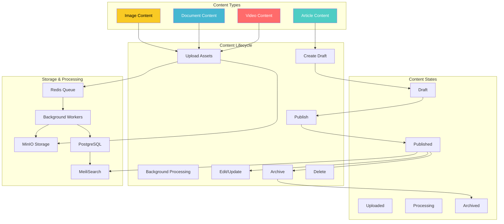
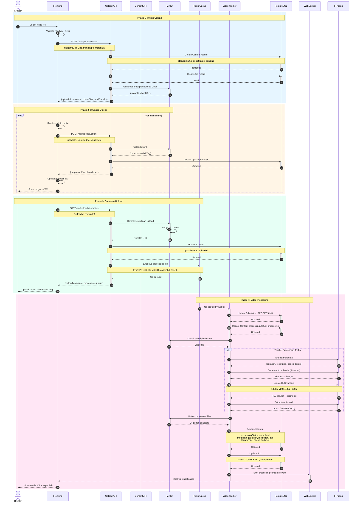
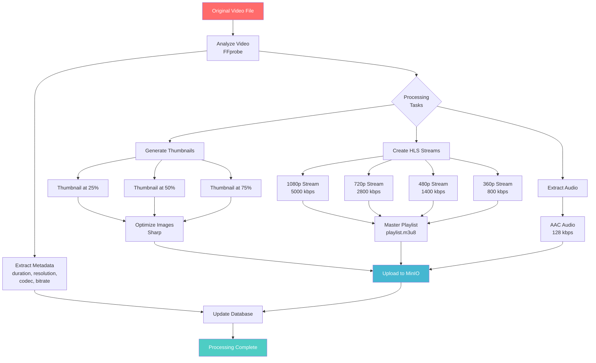
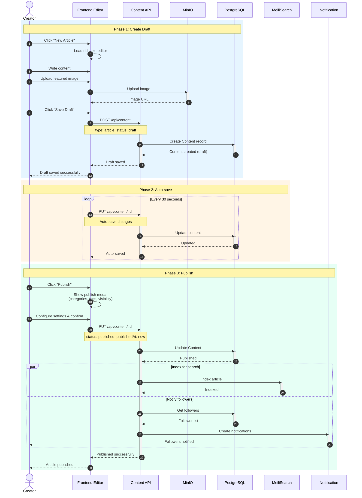
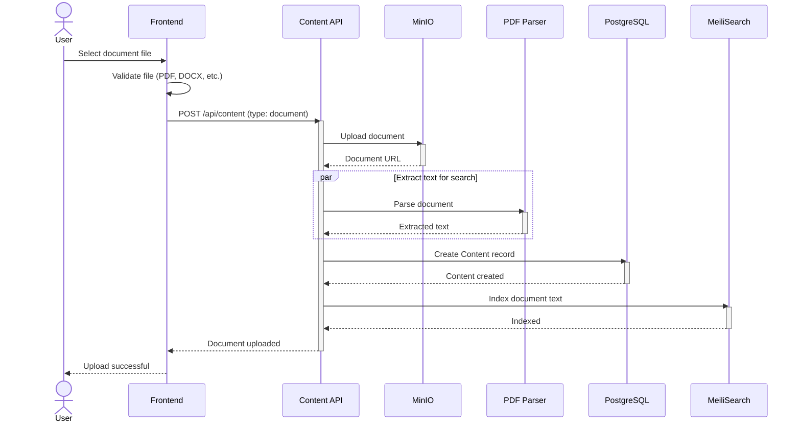
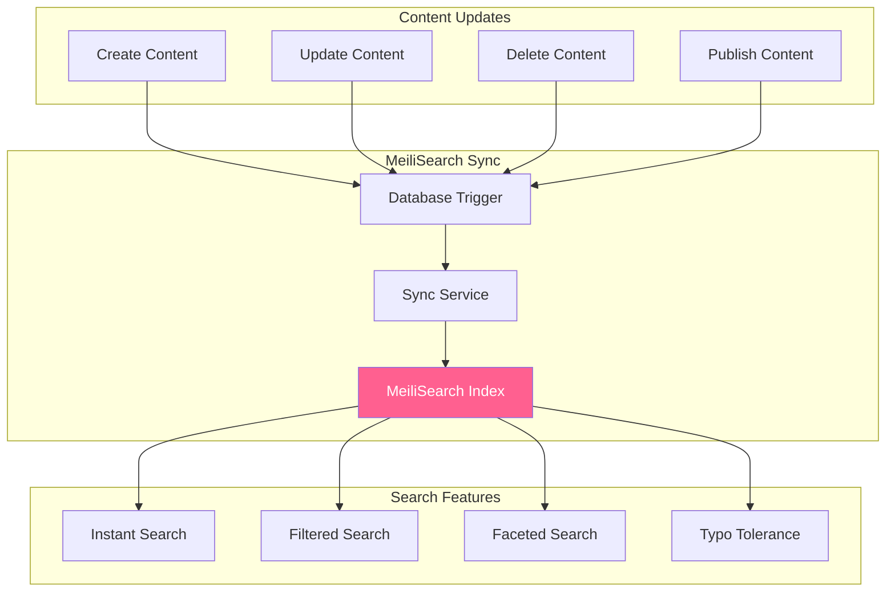
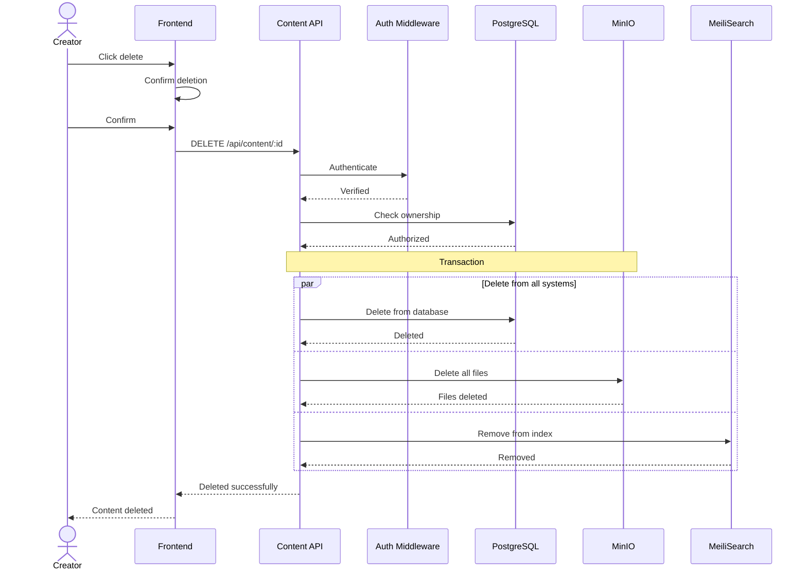
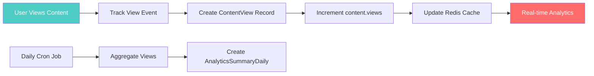

# Content Management Workflow

## 1. Tổng Quan Content System



## 2. Video Upload & Processing Workflow

### 2.1 Complete Video Upload Flow



**File tham gia:**
- `src/modules/uploads/uploadController.js` - Chunked upload controller
- `src/modules/uploads/uploadService.js` - Upload business logic
- `src/modules/content/videoController.js` - Video content management
- `src/jobs/queues/videoQueue.js` - Video job queue
- `src/jobs/workers/videoProcessing.worker.js` - Video processing worker
- `src/services/media/videoProcessor.js` - FFmpeg wrapper

---

### 2.2 FFmpeg Processing Details



**FFmpeg Commands Used:**

```javascript
// 1. Extract metadata
ffprobe -v quiet -print_format json -show_format -show_streams input.mp4

// 2. Generate thumbnail at specific time
ffmpeg -i input.mp4 -ss 00:00:30 -vframes 1 -vf scale=1280:720 thumbnail.jpg

// 3. Create HLS streams (adaptive bitrate)
// 1080p
ffmpeg -i input.mp4 \
  -vf scale=1920:1080 \
  -c:v libx264 -b:v 5000k -maxrate 5350k -bufsize 7500k \
  -c:a aac -b:a 192k \
  -hls_time 10 -hls_playlist_type vod \
  -hls_segment_filename "1080p_%03d.ts" \
  1080p.m3u8

// 720p
ffmpeg -i input.mp4 \
  -vf scale=1280:720 \
  -c:v libx264 -b:v 2800k -maxrate 2996k -bufsize 4200k \
  -c:a aac -b:a 128k \
  -hls_time 10 -hls_playlist_type vod \
  -hls_segment_filename "720p_%03d.ts" \
  720p.m3u8

// 480p
ffmpeg -i input.mp4 \
  -vf scale=854:480 \
  -c:v libx264 -b:v 1400k -maxrate 1498k -bufsize 2100k \
  -c:a aac -b:a 128k \
  -hls_time 10 -hls_playlist_type vod \
  -hls_segment_filename "480p_%03d.ts" \
  480p.m3u8

// 360p
ffmpeg -i input.mp4 \
  -vf scale=640:360 \
  -c:v libx264 -b:v 800k -maxrate 856k -bufsize 1200k \
  -c:a aac -b:a 96k \
  -hls_time 10 -hls_playlist_type vod \
  -hls_segment_filename "360p_%03d.ts" \
  360p.m3u8

// 4. Extract audio
ffmpeg -i input.mp4 -vn -acodec libmp3lame -b:a 128k audio.mp3
```

**Implementation:**

```javascript
// services/media/videoProcessor.js
const ffmpeg = require('fluent-ffmpeg');
const ffmpegPath = require('ffmpeg-static');
const ffprobePath = require('ffprobe-static').path;

ffmpeg.setFfmpegPath(ffmpegPath);
ffmpeg.setFfprobePath(ffprobePath);

class VideoProcessor {
  async extractMetadata(inputPath) {
    return new Promise((resolve, reject) => {
      ffmpeg.ffprobe(inputPath, (err, metadata) => {
        if (err) return reject(err);
        
        const videoStream = metadata.streams.find(s => s.codec_type === 'video');
        const audioStream = metadata.streams.find(s => s.codec_type === 'audio');
        
        resolve({
          duration: metadata.format.duration,
          size: metadata.format.size,
          bitrate: metadata.format.bit_rate,
          format: metadata.format.format_name,
          video: {
            codec: videoStream.codec_name,
            width: videoStream.width,
            height: videoStream.height,
            fps: eval(videoStream.r_frame_rate), // e.g., "30/1"
            bitrate: videoStream.bit_rate
          },
          audio: audioStream ? {
            codec: audioStream.codec_name,
            sampleRate: audioStream.sample_rate,
            channels: audioStream.channels,
            bitrate: audioStream.bit_rate
          } : null
        });
      });
    });
  }

  async generateThumbnail(inputPath, outputPath, timeInSeconds) {
    return new Promise((resolve, reject) => {
      ffmpeg(inputPath)
        .screenshots({
          timestamps: [timeInSeconds],
          filename: path.basename(outputPath),
          folder: path.dirname(outputPath),
          size: '1280x720'
        })
        .on('end', () => resolve(outputPath))
        .on('error', reject);
    });
  }

  async createHLSStream(inputPath, outputDir, quality) {
    const configs = {
      '1080p': { scale: '1920:1080', videoBitrate: '5000k', audioBitrate: '192k' },
      '720p': { scale: '1280:720', videoBitrate: '2800k', audioBitrate: '128k' },
      '480p': { scale: '854:480', videoBitrate: '1400k', audioBitrate: '128k' },
      '360p': { scale: '640:360', videoBitrate: '800k', audioBitrate: '96k' }
    };

    const config = configs[quality];
    const playlistPath = path.join(outputDir, `${quality}.m3u8`);
    
    return new Promise((resolve, reject) => {
      ffmpeg(inputPath)
        .outputOptions([
          `-vf scale=${config.scale}`,
          '-c:v libx264',
          `-b:v ${config.videoBitrate}`,
          '-c:a aac',
          `-b:a ${config.audioBitrate}`,
          '-hls_time 10',
          '-hls_playlist_type vod',
          `-hls_segment_filename ${outputDir}/${quality}_%03d.ts`
        ])
        .output(playlistPath)
        .on('end', () => resolve(playlistPath))
        .on('error', reject)
        .on('progress', (progress) => {
          console.log(`Processing ${quality}: ${progress.percent}%`);
        })
        .run();
    });
  }

  async processVideo(videoPath, contentId) {
    const outputDir = path.join('/tmp', contentId);
    await fs.ensureDir(outputDir);

    // 1. Extract metadata
    const metadata = await this.extractMetadata(videoPath);

    // 2. Generate thumbnails
    const thumbnails = [];
    const duration = metadata.duration;
    for (const percent of [0.25, 0.5, 0.75]) {
      const time = duration * percent;
      const thumbPath = path.join(outputDir, `thumb_${percent * 100}.jpg`);
      await this.generateThumbnail(videoPath, thumbPath, time);
      
      // Optimize with Sharp
      await sharp(thumbPath)
        .resize(1280, 720, { fit: 'inside' })
        .jpeg({ quality: 85 })
        .toFile(thumbPath + '.optimized.jpg');
      
      thumbnails.push(thumbPath + '.optimized.jpg');
    }

    // 3. Create HLS streams
    const hlsQualities = ['1080p', '720p', '480p', '360p'];
    const playlists = {};
    
    for (const quality of hlsQualities) {
      playlists[quality] = await this.createHLSStream(videoPath, outputDir, quality);
    }

    // 4. Create master playlist
    const masterPlaylist = this.generateMasterPlaylist(hlsQualities);
    const masterPath = path.join(outputDir, 'playlist.m3u8');
    await fs.writeFile(masterPath, masterPlaylist);

    // 5. Extract audio
    const audioPath = path.join(outputDir, 'audio.mp3');
    await this.extractAudio(videoPath, audioPath);

    return {
      metadata,
      thumbnails,
      hlsPath: masterPath,
      audioPath,
      outputDir
    };
  }

  generateMasterPlaylist(qualities) {
    const bandwidths = {
      '1080p': 5000000,
      '720p': 2800000,
      '480p': 1400000,
      '360p': 800000
    };
    
    const resolutions = {
      '1080p': '1920x1080',
      '720p': '1280x720',
      '480p': '854x480',
      '360p': '640x360'
    };

    let playlist = '#EXTM3U\n#EXT-X-VERSION:3\n\n';
    
    for (const quality of qualities) {
      playlist += `#EXT-X-STREAM-INF:BANDWIDTH=${bandwidths[quality]},RESOLUTION=${resolutions[quality]}\n`;
      playlist += `${quality}.m3u8\n\n`;
    }

    return playlist;
  }

  async extractAudio(inputPath, outputPath) {
    return new Promise((resolve, reject) => {
      ffmpeg(inputPath)
        .noVideo()
        .audioCodec('libmp3lame')
        .audioBitrate('128k')
        .output(outputPath)
        .on('end', () => resolve(outputPath))
        .on('error', reject)
        .run();
    });
  }
}

module.exports = new VideoProcessor();
```

---

### 2.3 Background Job Worker

```javascript
// jobs/workers/videoProcessing.worker.js
const videoProcessor = require('../../services/media/videoProcessor');
const minioClient = require('../../config/minio');
const prisma = require('../../prisma/prismaClient');
const { queue } = require('../../config/redis');
const path = require('path');
const fs = require('fs-extra');

async function processJob(job) {
  const { contentId, fileUrl, userId } = job.data;
  
  console.log(`[Worker] Processing video for content ${contentId}`);
  
  try {
    // Update job status
    await prisma.job.update({
      where: { id: job.id },
      data: {
        status: 'PROCESSING',
        progress: 10
      }
    });

    // Update content status
    await prisma.content.update({
      where: { id: contentId },
      data: { processingStatus: 'processing' }
    });

    // Download video from MinIO
    const tempDir = path.join('/tmp', contentId);
    await fs.ensureDir(tempDir);
    const videoPath = path.join(tempDir, 'input.mp4');
    
    await minioClient.fGetObject(
      process.env.MINIO_BUCKET,
      fileUrl,
      videoPath
    );

    await prisma.job.update({
      where: { id: job.id },
      data: { progress: 20 }
    });

    // Process video
    const result = await videoProcessor.processVideo(videoPath, contentId);

    await prisma.job.update({
      where: { id: job.id },
      data: { progress: 70 }
    });

    // Upload processed files to MinIO
    const uploadPromises = [];
    const uploadedFiles = {
      thumbnails: [],
      hlsSegments: [],
      audio: null
    };

    // Upload thumbnails
    for (let i = 0; i < result.thumbnails.length; i++) {
      const thumbPath = result.thumbnails[i];
      const objectName = `content/${contentId}/thumbnails/thumb_${i}.jpg`;
      
      uploadPromises.push(
        minioClient.fPutObject(
          process.env.MINIO_BUCKET,
          objectName,
          thumbPath,
          { 'Content-Type': 'image/jpeg' }
        ).then(() => {
          uploadedFiles.thumbnails.push(objectName);
        })
      );
    }

    // Upload HLS files
    const hlsFiles = await fs.readdir(result.outputDir);
    for (const file of hlsFiles) {
      if (file.endsWith('.m3u8') || file.endsWith('.ts')) {
        const filePath = path.join(result.outputDir, file);
        const objectName = `content/${contentId}/hls/${file}`;
        
        uploadPromises.push(
          minioClient.fPutObject(
            process.env.MINIO_BUCKET,
            objectName,
            filePath,
            { 'Content-Type': file.endsWith('.m3u8') ? 'application/vnd.apple.mpegurl' : 'video/mp2t' }
          ).then(() => {
            uploadedFiles.hlsSegments.push(objectName);
          })
        );
      }
    }

    // Upload audio
    const audioObjectName = `content/${contentId}/audio/audio.mp3`;
    uploadPromises.push(
      minioClient.fPutObject(
        process.env.MINIO_BUCKET,
        audioObjectName,
        result.audioPath,
        { 'Content-Type': 'audio/mpeg' }
      ).then(() => {
        uploadedFiles.audio = audioObjectName;
      })
    );

    await Promise.all(uploadPromises);

    await prisma.job.update({
      where: { id: job.id },
      data: { progress: 90 }
    });

    // Update content with processed data
    await prisma.content.update({
      where: { id: contentId },
      data: {
        processingStatus: 'completed',
        uploadStatus: 'completed',
        metadata: {
          duration: result.metadata.duration,
          resolution: `${result.metadata.video.width}x${result.metadata.video.height}`,
          codec: result.metadata.video.codec,
          bitrate: result.metadata.bitrate,
          size: result.metadata.size,
          fps: result.metadata.video.fps,
          thumbnails: uploadedFiles.thumbnails,
          hlsUrl: `content/${contentId}/hls/playlist.m3u8`,
          audioUrl: uploadedFiles.audio
        }
      }
    });

    // Update job as completed
    await prisma.job.update({
      where: { id: job.id },
      data: {
        status: 'COMPLETED',
        progress: 100,
        completedAt: new Date(),
        result: {
          success: true,
          filesProcessed: uploadedFiles
        }
      }
    });

    // Send notification via WebSocket
    if (global.webSocketManager) {
      global.webSocketManager.sendToUser(userId, {
        type: 'VIDEO_PROCESSING_COMPLETE',
        contentId,
        message: 'Your video is ready!'
      });
    }

    // Cleanup temp files
    await fs.remove(tempDir);

    console.log(`[Worker] Video processing completed for ${contentId}`);
    
  } catch (error) {
    console.error(`[Worker] Error processing video ${contentId}:`, error);
    
    // Update job as failed
    await prisma.job.update({
      where: { id: job.id },
      data: {
        status: 'FAILED',
        error: {
          message: error.message,
          stack: error.stack
        }
      }
    });

    // Update content
    await prisma.content.update({
      where: { id: contentId },
      data: { processingStatus: 'failed' }
    });

    // Notify user of failure
    if (global.webSocketManager) {
      global.webSocketManager.sendToUser(userId, {
        type: 'VIDEO_PROCESSING_FAILED',
        contentId,
        message: 'Video processing failed. Please try again.'
      });
    }

    throw error;
  }
}

module.exports = { processJob };
```

---

## 3. Article Publishing Workflow

### 3.1 Article Creation & Publishing



**File tham gia:**
- `src/modules/content/articleController.js`
- `src/modules/content/services/articleService.js`
- `src/services/searchService.js`

---

## 4. Document Upload Workflow



---

## 5. Content Search & Discovery

### 5.1 MeiliSearch Integration



**Search Service Implementation:**

```javascript
// services/searchService.js
const { MeiliSearch } = require('meilisearch');

class SearchService {
  constructor() {
    this.client = new MeiliSearch({
      host: process.env.MEILI_HOST,
      apiKey: process.env.MEILI_MASTER_KEY
    });
  }

  async initIndex(indexName, settings) {
    const index = this.client.index(indexName);
    
    await index.updateSettings({
      filterableAttributes: settings.filterableAttributes || [],
      sortableAttributes: settings.sortableAttributes || [],
      searchableAttributes: settings.searchableAttributes || [],
      rankingRules: [
        'words',
        'typo',
        'proximity',
        'attribute',
        'sort',
        'exactness'
      ],
      typoTolerance: {
        enabled: true,
        minWordSizeForTypos: {
          oneTypo: 5,
          twoTypos: 9
        }
      }
    });

    console.log(`MeiliSearch index '${indexName}' configured`);
  }

  async indexContent(content) {
    const index = this.client.index('content');
    
    const document = {
      id: content.id,
      contentType: content.type,
      title: content.title,
      description: content.description,
      body: content.body,
      authorId: content.authorId,
      authorName: content.author.profile.displayName,
      tags: content.tags,
      category: content.category,
      createdAt: content.createdAt.getTime(),
      updatedAt: content.updatedAt.getTime(),
      views: content.views,
      likesCount: content.likesCount
    };

    await index.addDocuments([document]);
  }

  async searchContent(query, filters = {}) {
    const index = this.client.index('content');
    
    const filterArray = [];
    if (filters.contentType) {
      filterArray.push(`contentType = ${filters.contentType}`);
    }
    if (filters.category) {
      filterArray.push(`category = ${filters.category}`);
    }
    if (filters.tags && filters.tags.length > 0) {
      const tagFilters = filters.tags.map(tag => `tags = ${tag}`).join(' OR ');
      filterArray.push(`(${tagFilters})`);
    }

    const results = await index.search(query, {
      filter: filterArray.length > 0 ? filterArray.join(' AND ') : undefined,
      limit: filters.limit || 20,
      offset: filters.offset || 0,
      sort: filters.sort || ['createdAt:desc']
    });

    return results;
  }

  async deleteContent(contentId) {
    const index = this.client.index('content');
    await index.deleteDocument(contentId);
  }
}

module.exports = new SearchService();
```

---

## 6. Content Metadata & Storage Structure

### MinIO Storage Organization

```
s3://mediacms-bucket/
├── content/
│   ├── {contentId}/
│   │   ├── original/
│   │   │   └── video.mp4
│   │   ├── thumbnails/
│   │   │   ├── thumb_0.jpg
│   │   │   ├── thumb_1.jpg
│   │   │   └── thumb_2.jpg
│   │   ├── hls/
│   │   │   ├── playlist.m3u8 (master)
│   │   │   ├── 1080p.m3u8
│   │   │   ├── 1080p_000.ts
│   │   │   ├── 1080p_001.ts
│   │   │   ├── ...
│   │   │   ├── 720p.m3u8
│   │   │   ├── 720p_000.ts
│   │   │   └── ...
│   │   └── audio/
│   │       └── audio.mp3
├── images/
│   ├── featured/
│   │   └── {imageId}.jpg
│   └── inline/
│       └── {imageId}.jpg
├── documents/
│   └── {documentId}.pdf
└── avatars/
    └── {userId}.jpg
```

---

## 7. Content CRUD Operations

### 7.1 Update Content

```mermaid
sequenceDiagram
    actor Creator
    participant UI as Frontend
    participant API as Content API
    participant Auth as Auth Middleware
    participant Owner as Ownership Check
    participant DB as PostgreSQL
    participant Search as MeiliSearch

    Creator->>UI: Edit content
    UI->>API: PUT /api/content/:id
    
    API->>Auth: Authenticate
    Auth-->>API: User verified
    
    API->>Owner: Check ownership
    activate Owner
    Owner->>DB: Get content
    activate DB
    DB-->>Owner: Content data
    deactivate DB
    
    alt Not owner and not admin
        Owner-->>API: 403 Forbidden
        API-->>UI: Not authorized
    else Owner or admin
        Owner-->>API: Authorized
        deactivate Owner
        
        API->>DB: Update content
        activate DB
        DB-->>API: Updated
        deactivate DB
        
        API->>Search: Re-index content
        activate Search
        Search-->>API: Indexed
        deactivate Search
        
        API-->>UI: Update successful
        deactivate API
        UI-->>Creator: Content updated
    end
```

### 7.2 Delete Content



---

## 8. Content Analytics Tracking



---

## 9. File Structure

```
src/modules/content/
├── articleController.js
├── documentController.js
├── videoController.js
├── feedController.js
├── interactionController.js
├── playlistController.js
├── contentService.js
├── routes.js
├── playlistRoutes.js
├── validation.js
├── services/
│   ├── articleService.js
│   ├── videoService.js
│   └── documentService.js
└── validators/
    ├── articleValidator.js
    ├── videoValidator.js
    └── documentValidator.js

src/modules/uploads/
├── uploadController.js
├── uploadService.js
├── routes.js
└── validation.js

src/jobs/
├── queues/
│   └── videoQueue.js
└── workers/
    └── videoProcessing.worker.js

src/services/media/
├── videoProcessor.js
├── imageProcessor.js
└── documentParser.js
```

---

## Tài Liệu Liên Quan

- [00 - Overview](./00-overview.md)
- [01 - Use Cases](./01-use-cases.md)
- [02 - Authentication Workflow](./02-authentication-workflow.md)
- [04 - Social Interaction Workflow](./04-interaction-workflow.md)
- [05 - Video Processing Details](./05-video-processing-workflow.md)
