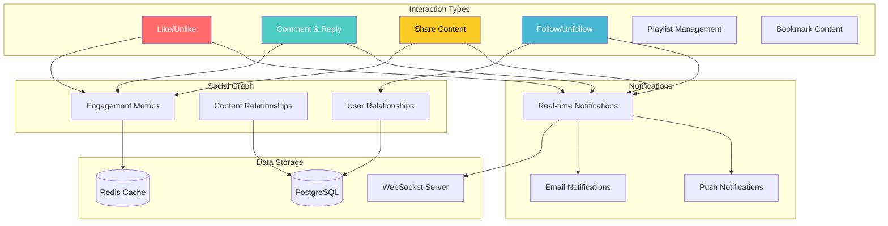
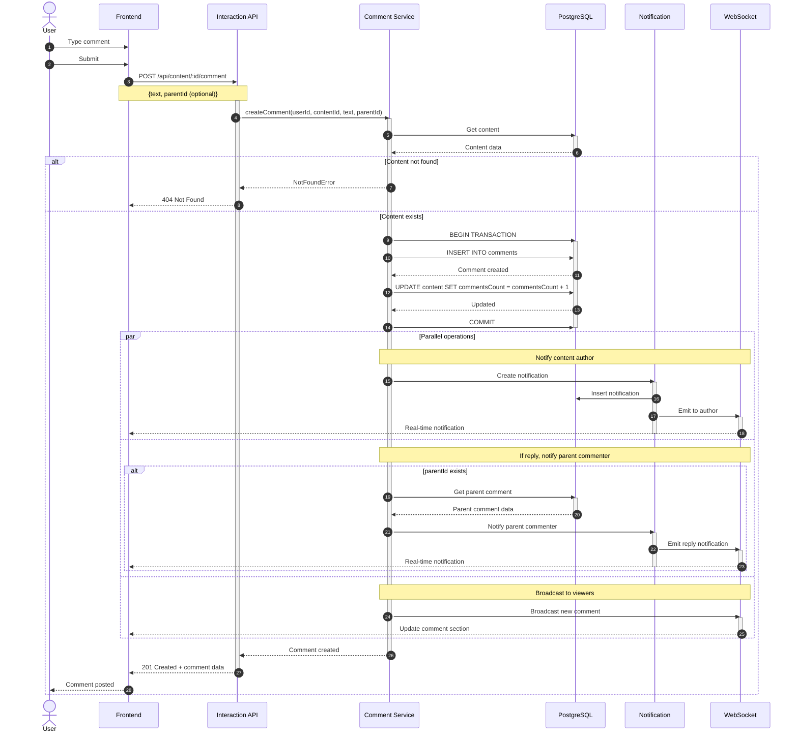
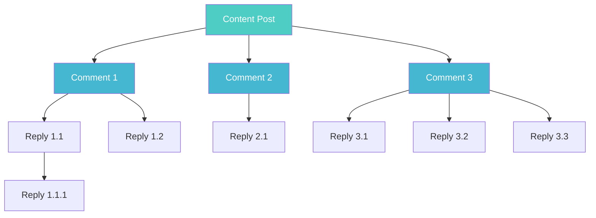
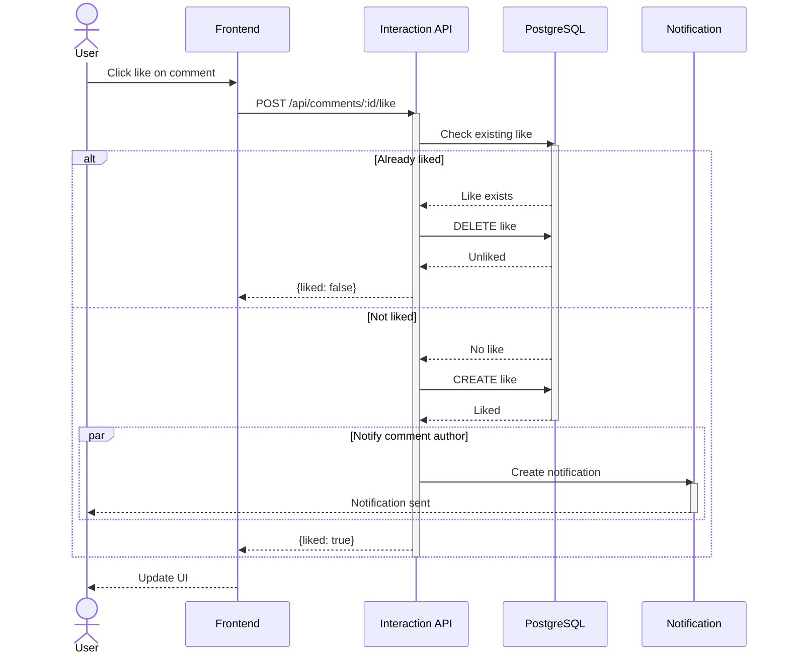
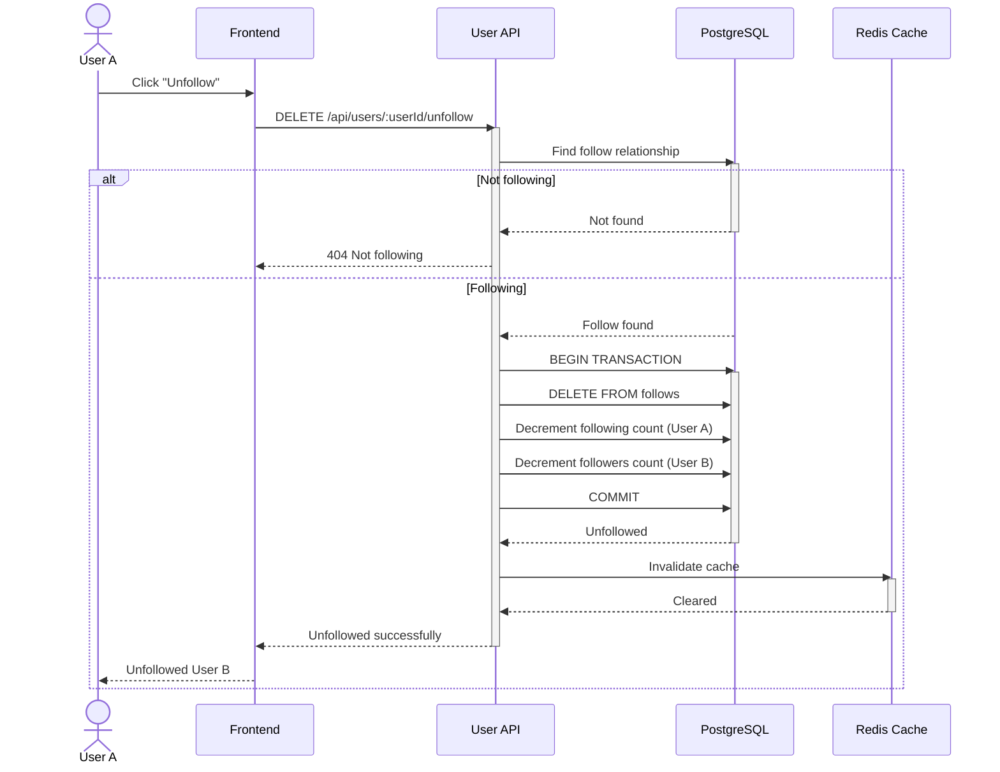
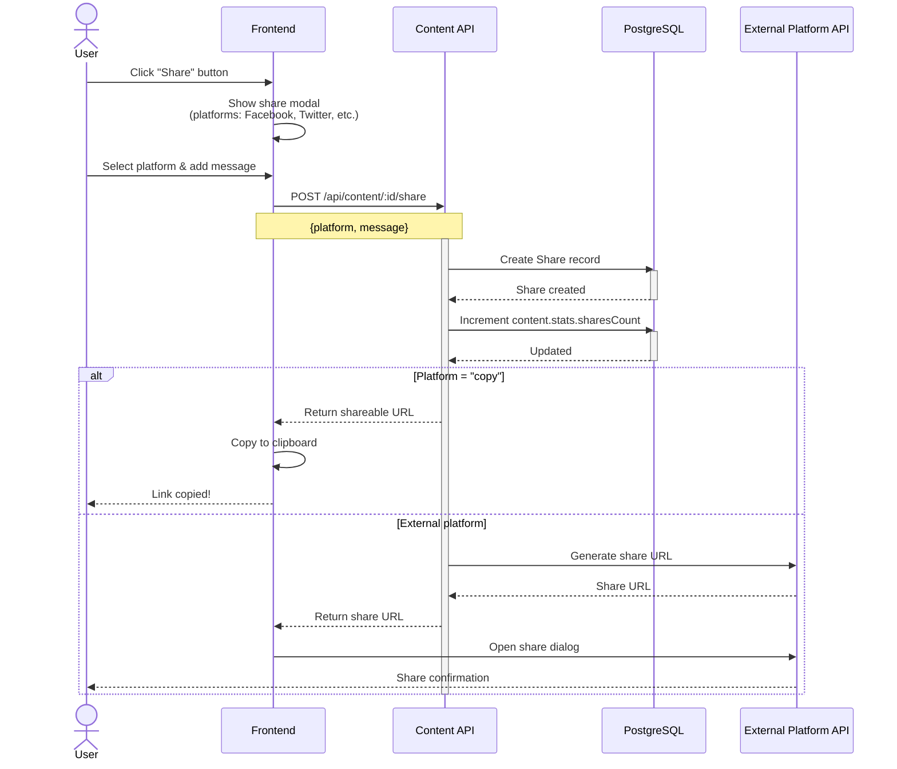
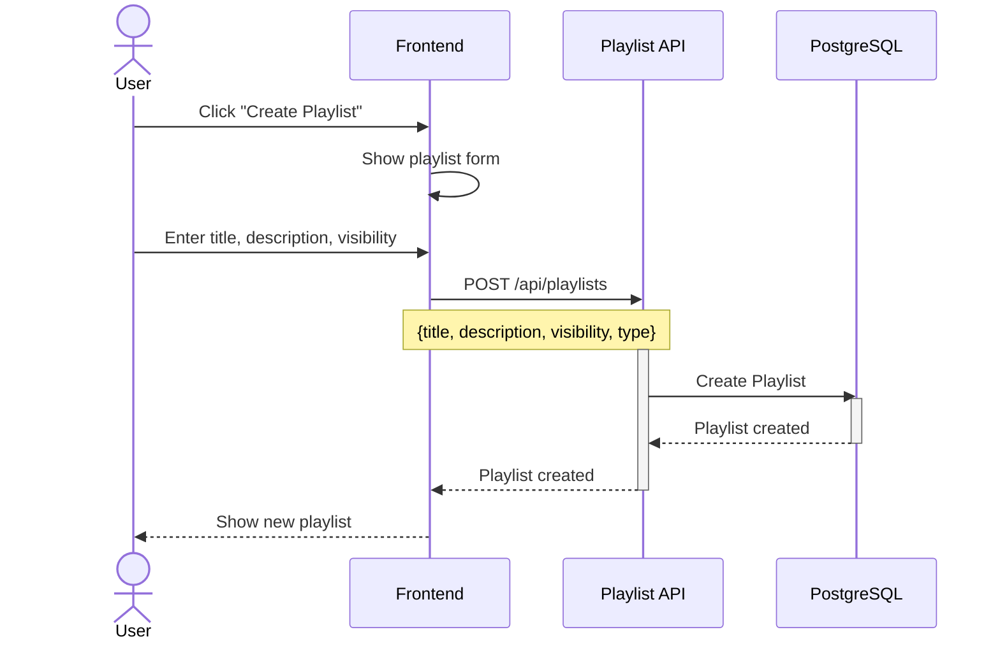
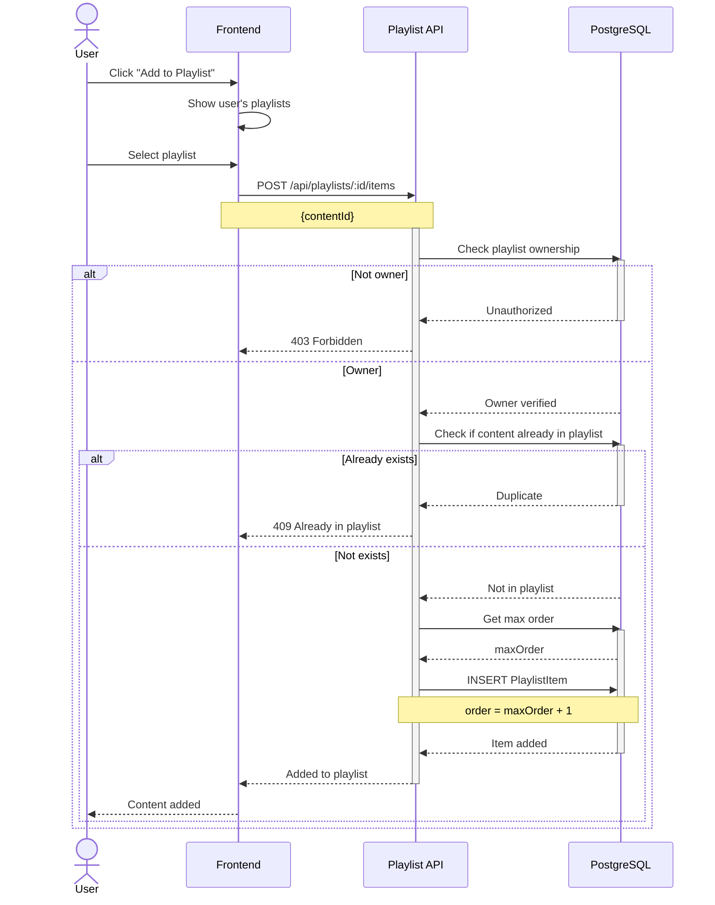
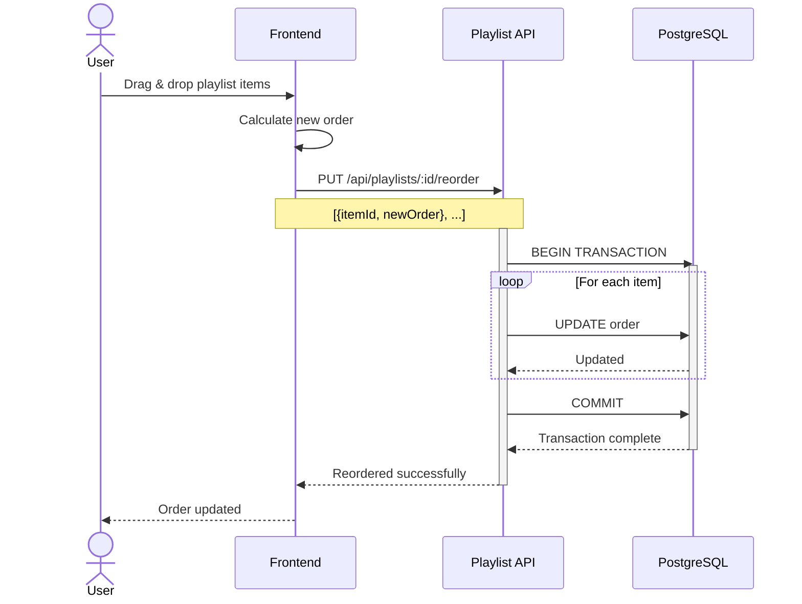
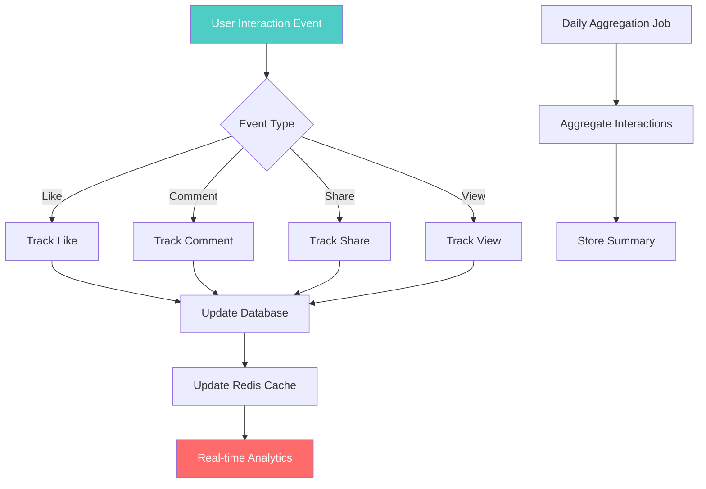

# Social Interaction Workflow

## 1. Tổng Quan Social Features



## 2. Like/Unlike Workflow

### 2.1 Like Content Flow

```mermaid
sequenceDiagram
    autonumber
    actor User
    participant UI as Frontend
    participant API as Interaction API
    participant Auth as Auth Middleware
    participant Service as Interaction Service
    participant DB as PostgreSQL
    participant Cache as Redis Cache
    participant Notif as Notification Service
    participant WS as WebSocket

    User->>UI: Click like button
    activate UI
    UI->>UI: Optimistic UI update
    UI-->>User: Show liked state
    
    UI->>API: POST /api/content/:id/like
    activate API
    
    API->>Auth: Verify user
    activate Auth
    Auth-->>API: User authenticated
    deactivate Auth
    
    API->>Service: likeContent(userId, contentId)
    activate Service
    
    Service->>DB: Check existing like
    activate DB
    
    alt Already liked
        DB-->>Service: Like exists
        Service->>DB: BEGIN TRANSACTION
        Service->>DB: DELETE FROM likes
        Service->>DB: UPDATE content SET likesCount = likesCount - 1
        Service->>DB: COMMIT
        DB-->>Service: Unlike successful
        
        Service->>Cache: Invalidate cache
        activate Cache
        Cache->>Cache: DEL content:{id}:likes
        Cache->>Cache: DEL user:{userId}:liked_content
        Cache-->>Service: Cache cleared
        deactivate Cache
        
        Service-->>API: {liked: false, likesCount}
        deactivate Service
        API-->>UI: Unlike successful
        deactivate API
        UI-->>User: Show unliked state
        
    else Not liked yet
        DB-->>Service: Like not exists
        
        Service->>DB: BEGIN TRANSACTION
        activate DB
        Service->>DB: INSERT INTO likes (userId, contentId)
        Service->>DB: UPDATE content SET likesCount = likesCount + 1
        Service->>DB: COMMIT
        DB-->>Service: Like created
        deactivate DB
        
        Service->>Cache: Invalidate cache
        activate Cache
        Cache-->>Service: Cache cleared
        deactivate Cache
        
        par Send notification to author
            Service->>DB: Get content author
            activate DB
            DB-->>Service: Author data
            deactivate DB
            
            Service->>Notif: Create notification
            activate Notif
            Notif->>DB: INSERT INTO notifications
            Notif->>WS: Emit real-time event
            activate WS
            WS-->>UI: Push notification
            deactivate WS
            deactivate Notif
        end
        
        Service-->>API: {liked: true, likesCount}
        deactivate Service
        API-->>UI: Like successful
        deactivate API
        UI-->>User: Show liked state
    end
    deactivate UI
```

**Implementation:**

```javascript
// modules/content/interactionController.js
exports.likeContent = async (req, res, next) => {
  try {
    const { id: contentId } = req.params;
    const userId = req.user.id;
    
    const result = await interactionService.toggleLike(userId, contentId);
    
    res.json({
      success: true,
      liked: result.liked,
      likesCount: result.likesCount
    });
  } catch (error) {
    next(error);
  }
};

// services/interactionService.js
const toggleLike = async (userId, contentId) => {
  // Check if content exists
  const content = await prisma.content.findUnique({
    where: { id: contentId },
    select: { id: true, authorId: true, likesCount: true }
  });
  
  if (!content) {
    throw new NotFoundError('Content not found');
  }
  
  // Check if already liked
  const existingLike = await prisma.like.findUnique({
    where: {
      userId_contentId: {
        userId,
        contentId
      }
    }
  });
  
  if (existingLike) {
    // Unlike
    await prisma.$transaction([
      prisma.like.delete({
        where: { id: existingLike.id }
      }),
      prisma.content.update({
        where: { id: contentId },
        data: { likesCount: { decrement: 1 } }
      })
    ]);
    
    // Invalidate cache
    await invalidateLikeCache(userId, contentId);
    
    return {
      liked: false,
      likesCount: content.likesCount - 1
    };
  } else {
    // Like
    await prisma.$transaction([
      prisma.like.create({
        data: {
          userId,
          contentId
        }
      }),
      prisma.content.update({
        where: { id: contentId },
        data: { likesCount: { increment: 1 } }
      })
    ]);
    
    // Invalidate cache
    await invalidateLikeCache(userId, contentId);
    
    // Send notification (async, don't wait)
    if (content.authorId !== userId) {
      notificationService.createNotification({
        userId: content.authorId,
        type: 'like',
        category: 'likes',
        title: 'New Like',
        content: `${req.user.profile.displayName} liked your content`,
        data: {
          contentId,
          likedBy: {
            id: userId,
            displayName: req.user.profile.displayName,
            avatarUrl: req.user.profile.avatarUrl
          }
        }
      }).catch(err => console.error('Notification error:', err));
    }
    
    return {
      liked: true,
      likesCount: content.likesCount + 1
    };
  }
};
```

---

### 2.2 Get User's Liked Content

```mermaid
sequenceDiagram
    actor User
    participant UI as Frontend
    participant API as Content API
    participant Cache as Redis Cache
    participant DB as PostgreSQL

    User->>UI: View "Liked Videos"
    UI->>API: GET /api/users/:userId/liked-content
    
    activate API
    API->>Cache: GET user:{userId}:liked_content
    activate Cache
    
    alt Cache hit
        Cache-->>API: Cached content list
        deactivate Cache
        API-->>UI: Return content
    else Cache miss
        Cache-->>API: Cache miss
        deactivate Cache
        
        API->>DB: Query liked content
        activate DB
        Note over API,DB: SELECT content.* FROM content<br/>JOIN likes ON content.id = likes.contentId<br/>WHERE likes.userId = ?<br/>ORDER BY likes.createdAt DESC
        DB-->>API: Content list
        deactivate DB
        
        API->>Cache: SET cache (TTL: 5min)
        activate Cache
        Cache-->>API: Cached
        deactivate Cache
        
        API-->>UI: Return content
    end
    deactivate API
    UI-->>User: Display liked content
```

---

## 3. Comment System

### 3.1 Add Comment Flow



**Implementation:**

```javascript
// services/commentService.js
const createComment = async (userId, contentId, text, parentId = null) => {
  // Validate content exists
  const content = await prisma.content.findUnique({
    where: { id: contentId },
    include: { author: { include: { profile: true } } }
  });
  
  if (!content) {
    throw new NotFoundError('Content not found');
  }
  
  // If reply, validate parent comment exists
  let parentComment = null;
  if (parentId) {
    parentComment = await prisma.comment.findUnique({
      where: { id: parentId },
      include: { user: { include: { profile: true } } }
    });
    
    if (!parentComment || parentComment.contentId !== contentId) {
      throw new BadRequestError('Invalid parent comment');
    }
  }
  
  // Create comment in transaction
  const comment = await prisma.$transaction(async (tx) => {
    const newComment = await tx.comment.create({
      data: {
        userId,
        contentId,
        text,
        parentId
      },
      include: {
        user: {
          include: { profile: true }
        }
      }
    });
    
    // Increment comments count
    await tx.content.update({
      where: { id: contentId },
      data: { commentsCount: { increment: 1 } }
    });
    
    return newComment;
  });
  
  // Notify content author (async)
  if (content.authorId !== userId) {
    notificationService.createNotification({
      userId: content.authorId,
      type: 'comment',
      category: 'comments',
      title: 'New Comment',
      content: `${comment.user.profile.displayName} commented on your ${content.type}`,
      data: {
        contentId,
        commentId: comment.id,
        commenter: {
          id: userId,
          displayName: comment.user.profile.displayName,
          avatarUrl: comment.user.profile.avatarUrl
        }
      }
    }).catch(console.error);
  }
  
  // If reply, notify parent commenter
  if (parentComment && parentComment.userId !== userId) {
    notificationService.createNotification({
      userId: parentComment.userId,
      type: 'comment',
      category: 'comments',
      title: 'New Reply',
      content: `${comment.user.profile.displayName} replied to your comment`,
      data: {
        contentId,
        commentId: comment.id,
        parentCommentId: parentId,
        replier: {
          id: userId,
          displayName: comment.user.profile.displayName,
          avatarUrl: comment.user.profile.avatarUrl
        }
      }
    }).catch(console.error);
  }
  
  // Broadcast via WebSocket
  if (global.webSocketManager) {
    global.webSocketManager.broadcastToContent(contentId, {
      type: 'NEW_COMMENT',
      comment: {
        id: comment.id,
        text: comment.text,
        user: {
          displayName: comment.user.profile.displayName,
          avatarUrl: comment.user.profile.avatarUrl
        },
        createdAt: comment.createdAt,
        parentId
      }
    });
  }
  
  return comment;
};
```

---

### 3.2 Comment Thread Structure



**Fetch Comments API:**

```javascript
// GET /api/content/:id/comments
const getContentComments = async (req, res, next) => {
  try {
    const { id: contentId } = req.params;
    const { limit = 20, offset = 0, sort = 'createdAt' } = req.query;
    
    // Get root comments (parentId = null)
    const comments = await prisma.comment.findMany({
      where: {
        contentId,
        parentId: null
      },
      include: {
        user: {
          select: {
            id: true,
            username: true,
            profile: {
              select: {
                displayName: true,
                avatarUrl: true
              }
            }
          }
        },
        likes: {
          select: {
            userId: true
          }
        },
        replies: {
          include: {
            user: {
              select: {
                id: true,
                username: true,
                profile: {
                  select: {
                    displayName: true,
                    avatarUrl: true
                  }
                }
              }
            },
            likes: {
              select: {
                userId: true
              }
            }
          },
          orderBy: {
            createdAt: 'asc'
          },
          take: 3 // Load first 3 replies
        },
        _count: {
          select: {
            replies: true
          }
        }
      },
      orderBy: {
        [sort]: 'desc'
      },
      skip: parseInt(offset),
      take: parseInt(limit)
    });
    
    // Format response
    const formattedComments = comments.map(comment => ({
      id: comment.id,
      text: comment.text,
      user: {
        id: comment.user.id,
        username: comment.user.username,
        displayName: comment.user.profile.displayName,
        avatarUrl: comment.user.profile.avatarUrl
      },
      likesCount: comment.likes.length,
      isLiked: req.user ? comment.likes.some(like => like.userId === req.user.id) : false,
      repliesCount: comment._count.replies,
      replies: comment.replies.map(reply => ({
        id: reply.id,
        text: reply.text,
        user: {
          id: reply.user.id,
          username: reply.user.username,
          displayName: reply.user.profile.displayName,
          avatarUrl: reply.user.profile.avatarUrl
        },
        likesCount: reply.likes.length,
        isLiked: req.user ? reply.likes.some(like => like.userId === req.user.id) : false,
        createdAt: reply.createdAt
      })),
      createdAt: comment.createdAt,
      updatedAt: comment.updatedAt
    }));
    
    res.json({
      comments: formattedComments,
      pagination: {
        total: await prisma.comment.count({
          where: { contentId, parentId: null }
        }),
        offset: parseInt(offset),
        limit: parseInt(limit)
      }
    });
  } catch (error) {
    next(error);
  }
};
```

---

### 3.3 Like Comment



---

## 4. Follow/Unfollow System

### 4.1 Follow User Flow

```mermaid
sequenceDiagram
    autonumber
    actor UserA as User A (Follower)
    participant UI as Frontend
    participant API as User API
    participant Service as User Service
    participant DB as PostgreSQL
    participant Cache as Redis Cache
    participant Notif as Notification
    participant WS as WebSocket

    UserA->>UI: Click "Follow" on User B's profile
    UI->>API: POST /api/users/:userId/follow
    
    activate API
    API->>Service: followUser(followerIdFollowerId: A, followeeId: B)
    activate Service
    
    Service->>DB: Check if already following
    activate DB
    
    alt Already following
        DB-->>Service: Follow exists
        deactivate DB
        Service-->>API: ConflictError
        API-->>UI: 409 Already following
        UI-->>UserA: Already following
    else Not following yet
        DB-->>Service: Follow not exists
        deactivate DB
        
        Service->>DB: BEGIN TRANSACTION
        activate DB
        
        Service->>DB: INSERT INTO follows
        DB-->>Service: Follow created
        
        Service->>DB: Update follower count in Profile
        Note over Service,DB: UPDATE profiles<br/>SET stats.followingCount++<br/>WHERE userId = A
        DB-->>Service: Updated
        
        Service->>DB: Update followee count in Profile
        Note over Service,DB: UPDATE profiles<br/>SET stats.followersCount++<br/>WHERE userId = B
        DB-->>Service: Updated
        
        Service->>DB: COMMIT
        deactivate DB
        
        Service->>Cache: Invalidate cache
        activate Cache
        Cache->>Cache: DEL user:A:following
        Cache->>Cache: DEL user:B:followers
        Cache-->>Service: Cleared
        deactivate Cache
        
        par Send notification to followee
            Service->>Notif: Create notification
            activate Notif
            Notif->>DB: Insert notification
            Notif->>WS: Emit real-time event
            activate WS
            WS-->>UI: Push to User B
            deactivate WS
            deactivate Notif
        end
        
        Service-->>API: Follow successful
        deactivate Service
        API-->>UI: 200 OK {following: true}
        deactivate API
        UI-->>UserA: Now following User B
    end
```

**Implementation:**

```javascript
// modules/users/followController.js
exports.followUser = async (req, res, next) => {
  try {
    const followerId = req.user.id;
    const { userId: followeeId } = req.params;
    
    // Can't follow yourself
    if (followerId === followeeId) {
      return res.status(400).json({
        error: 'You cannot follow yourself'
      });
    }
    
    const result = await userService.followUser(followerId, followeeId);
    
    res.json(result);
  } catch (error) {
    next(error);
  }
};

// modules/users/userService.js
const followUser = async (followerId, followeeId) => {
  // Check if followee exists
  const followee = await prisma.user.findUnique({
    where: { id: followeeId },
    include: { profile: true }
  });
  
  if (!followee) {
    throw new NotFoundError('User not found');
  }
  
  // Check if already following
  const existingFollow = await prisma.follow.findUnique({
    where: {
      followerId_followeeId: {
        followerId,
        followeeId
      }
    }
  });
  
  if (existingFollow) {
    throw new ConflictError('Already following this user');
  }
  
  // Create follow relationship
  await prisma.$transaction(async (tx) => {
    await tx.follow.create({
      data: {
        followerId,
        followeeId
      }
    });
    
    // Update stats in profiles
    await tx.profile.update({
      where: { userId: followerId },
      data: {
        stats: {
          ...followerProfile.stats,
          followingCount: (followerProfile.stats.followingCount || 0) + 1
        }
      }
    });
    
    await tx.profile.update({
      where: { userId: followeeId },
      data: {
        stats: {
          ...followee.profile.stats,
          followersCount: (followee.profile.stats.followersCount || 0) + 1
        }
      }
    });
  });
  
  // Invalidate cache
  await redis.del(`user:${followerId}:following`);
  await redis.del(`user:${followeeId}:followers`);
  
  // Send notification
  notificationService.createNotification({
    userId: followeeId,
    type: 'follow',
    category: 'follows',
    title: 'New Follower',
    content: `${followerProfile.displayName} started following you`,
    data: {
      followerId,
      follower: {
        id: followerId,
        username: req.user.username,
        displayName: followerProfile.displayName,
        avatarUrl: followerProfile.avatarUrl
      }
    }
  }).catch(console.error);
  
  return {
    success: true,
    following: true
  };
};
```

---

### 4.2 Unfollow User Flow



---

## 5. Share Content

### 5.1 Share Workflow



**Implementation:**

```javascript
// interactionController.js
exports.shareContent = async (req, res, next) => {
  try {
    const { id: contentId } = req.params;
    const { platform, message } = req.body;
    const userId = req.user.id;
    
    const content = await prisma.content.findUnique({
      where: { id: contentId },
      include: {
        author: {
          include: { profile: true }
        }
      }
    });
    
    if (!content) {
      return res.status(404).json({ error: 'Content not found' });
    }
    
    // Generate share URL
    const baseUrl = process.env.FRONTEND_URL || 'http://localhost:3000';
    const shareUrl = `${baseUrl}/content/${contentId}`;
    
    // Create share record
    await prisma.share.create({
      data: {
        userId,
        contentId,
        platform,
        message,
        url: shareUrl
      }
    });
    
    // Increment share count
    await prisma.content.update({
      where: { id: contentId },
      data: {
        stats: {
          ...content.stats,
          sharesCount: (content.stats.sharesCount || 0) + 1
        }
      }
    });
    
    // Generate platform-specific share URLs
    const shareLinks = {
      facebook: `https://www.facebook.com/sharer/sharer.php?u=${encodeURIComponent(shareUrl)}`,
      twitter: `https://twitter.com/intent/tweet?url=${encodeURIComponent(shareUrl)}&text=${encodeURIComponent(content.title)}`,
      linkedin: `https://www.linkedin.com/sharing/share-offsite/?url=${encodeURIComponent(shareUrl)}`,
      whatsapp: `https://wa.me/?text=${encodeURIComponent(content.title + ' ' + shareUrl)}`,
      telegram: `https://t.me/share/url?url=${encodeURIComponent(shareUrl)}&text=${encodeURIComponent(content.title)}`,
      copy: shareUrl
    };
    
    res.json({
      success: true,
      shareUrl: shareLinks[platform] || shareUrl,
      directUrl: shareUrl
    });
  } catch (error) {
    next(error);
  }
};
```

---

## 6. Playlist Management

### 6.1 Create Playlist



---

### 6.2 Add Content to Playlist



---

### 6.3 Reorder Playlist Items



---

## 7. Engagement Analytics

### Real-time Engagement Tracking



---

## 8. File Structure

```
src/modules/content/
├── interactionController.js    # Like, comment, share handlers
├── playlistController.js        # Playlist CRUD
├── services/
│   ├── interactionService.js
│   ├── commentService.js
│   └── playlistService.js
└── playlistRoutes.js

src/modules/users/
├── followController.js          # Follow/unfollow handlers
└── userService.js

src/modules/notifications/
├── services/
│   └── notificationService.js
└── websocket/
    └── webSocketManager.js
```

---

## Tài Liệu Liên Quan

- [00 - Overview](./00-overview.md)
- [01 - Use Cases](./01-use-cases.md)
- [02 - Authentication Workflow](./02-authentication-workflow.md)
- [03 - Content Management Workflow](./03-content-workflow.md)
- [09 - Notification System](./09-notification-system.md)
