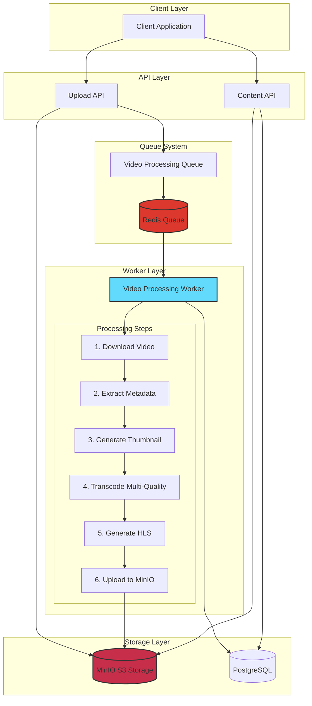
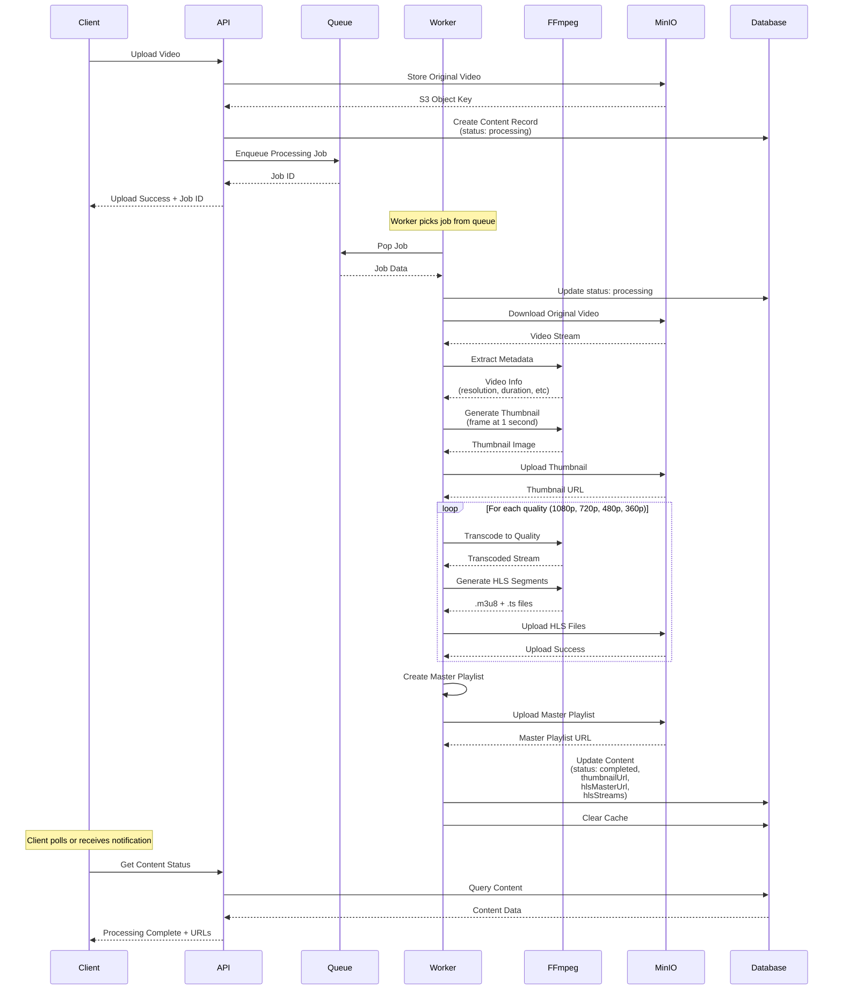
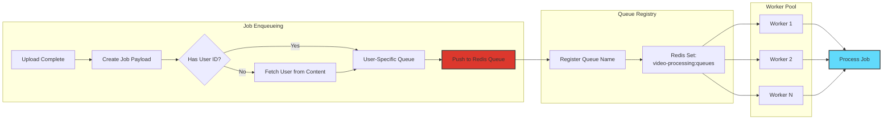
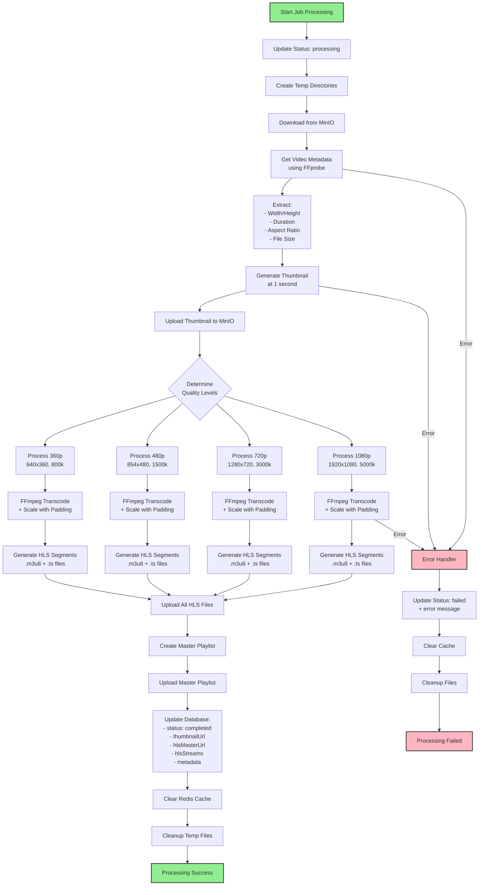
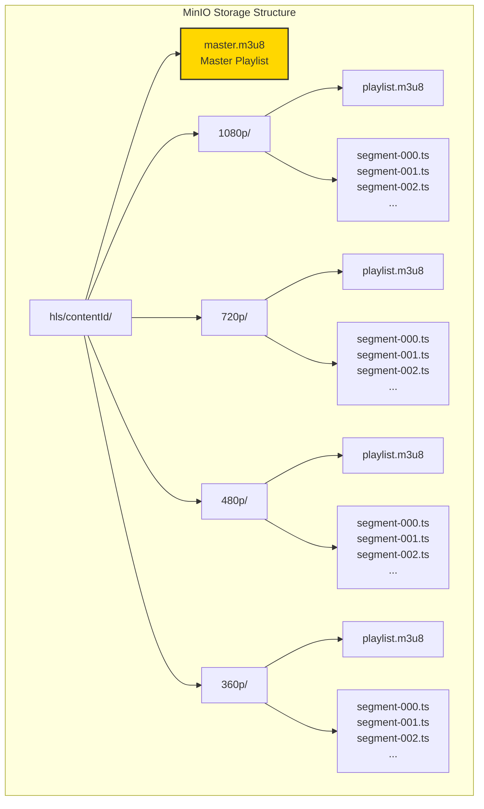
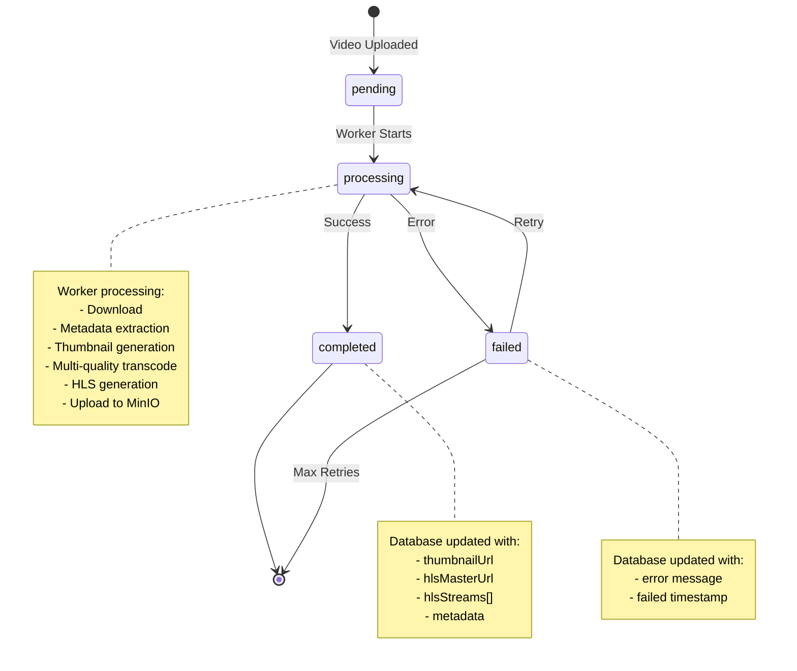
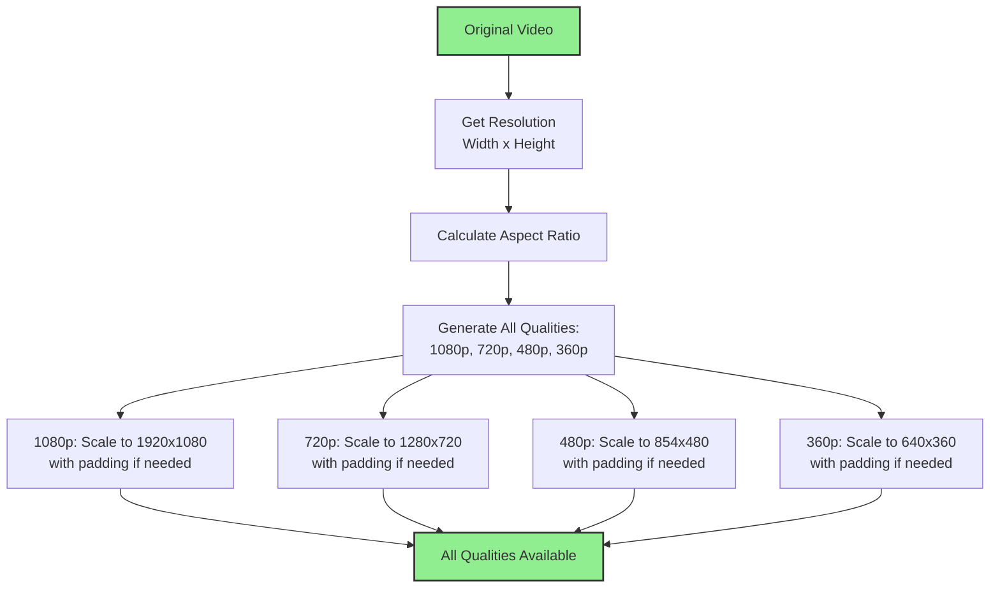
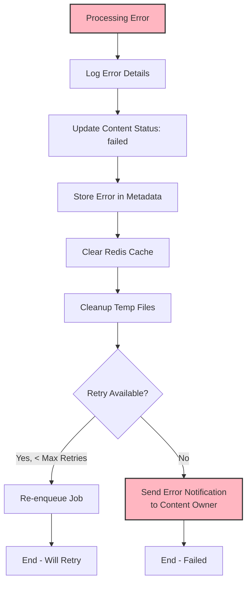
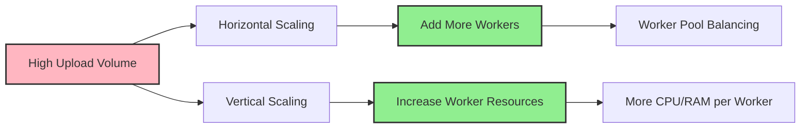
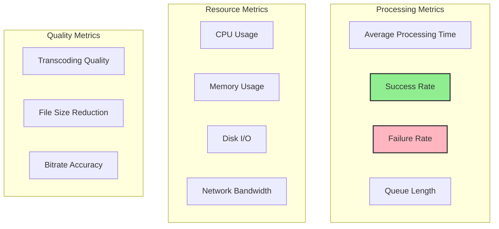

# MediaVerse MVP - Video Processing Workflow

## 1. Giới Thiệu

Video Processing là hệ thống xử lý video bất đồng bộ, chuyển đổi video upload thành nhiều chất lượng khác nhau và tạo HLS (HTTP Live Streaming) để phát video adaptive.

### Tính Năng Chính
- **Multi-quality transcoding** - Chuyển đổi sang 4 mức chất lượng (1080p, 720p, 480p, 360p)
- **HLS Adaptive Streaming** - Phát video tự động điều chỉnh chất lượng
- **Thumbnail Generation** - Tạo ảnh thumbnail tự động
- **Metadata Extraction** - Trích xuất thông tin video
- **Background Processing** - Xử lý bất đồng bộ với Bull Queue
- **MinIO Storage** - Lưu trữ file trên S3-compatible storage

## 2. Kiến Trúc Tổng Quan



## 3. Video Processing Pipeline



## 4. Queue System Architecture



### Queue Implementation

```javascript
// src/jobs/queues/videoQueue.js
const { queue, redisQueue } = require('../../config/redis');
const { prisma } = require('../../config/database');

const VIDEO_QUEUE_BASE = 'video-processing';
const REGISTRY_KEY = 'set:video-processing:queues';

function getUserQueueName(userId) {
  return `${VIDEO_QUEUE_BASE}:user:${userId}`;
}

async function enqueueProcessVideo(_q, payload) {
  const jobId = uuidv7();
  let userId = payload.userId;
  
  if (!userId) {
    // Fallback: fetch authorId from content
    const content = await prisma.content.findUnique({ 
      where: { id: payload.contentId }, 
      select: { authorId: true } 
    });
    userId = content?.authorId;
  }
  
  const queueName = userId ? getUserQueueName(userId) : VIDEO_QUEUE_BASE;
  const job = { 
    id: jobId, 
    type: 'PROCESS_VIDEO', 
    payload: { ...payload, userId } 
  };
  
  // Register this per-user queue for workers discovery
  await redisQueue.sAdd(REGISTRY_KEY, queueName);
  await queue.push(queueName, job);
  
  return { jobId };
}
```

## 5. Video Processing Worker



### Worker Implementation Core

```javascript
// src/jobs/workers/videoProcessing.worker.js
const HLS_CONFIGS = [
  { name: '1080p', bitrate: '5000k', audioBitrate: '192k' },
  { name: '720p', bitrate: '3000k', audioBitrate: '128k' },
  { name: '480p', bitrate: '1500k', audioBitrate: '128k' },
  { name: '360p', bitrate: '800k', audioBitrate: '96k' }
];

async function processJob(job) {
  const { contentId, sourceObjectKey } = job.payload;
  
  const tempDir = path.join(TEMP_DIR, contentId);
  const localInputPath = path.join(tempDir, 'input.mp4');
  const thumbnailPath = path.join(tempDir, 'thumbnail.jpg');
  const hlsDir = path.join(tempDir, 'hls');
  
  try {
    // 1. Update status to 'processing'
    await prisma.content.update({
      where: { id: contentId },
      data: { processingStatus: 'processing' }
    });
    
    // 2. Create temp directories
    await fs.ensureDir(tempDir);
    await fs.ensureDir(hlsDir);
    
    // 3. Download from MinIO
    const readStream = await getObjectStream(sourceObjectKey);
    const writeStream = fs.createWriteStream(localInputPath);
    await new Promise((resolve, reject) => {
      readStream.pipe(writeStream);
      writeStream.on('finish', resolve);
      writeStream.on('error', reject);
    });
    
    // 4. Get video metadata using FFprobe
    const metadataCommand = `ffprobe -v quiet -print_format json -show_format -show_streams "${localInputPath}"`;
    const { stdout: metadataOutput } = await execAsync(metadataCommand);
    const metadata = JSON.parse(metadataOutput);
    const videoStream = metadata.streams.find(s => s.codec_type === 'video');
    
    const originalWidth = parseInt(videoStream.width);
    const originalHeight = parseInt(videoStream.height);
    const originalAspectRatio = originalWidth / originalHeight;
    
    // 5. Generate thumbnail at 1 second
    const thumbnailCommand = `ffmpeg -i "${localInputPath}" -ss 00:00:01.000 -vframes 1 "${thumbnailPath}"`;
    await execAsync(thumbnailCommand);
    
    // 6. Upload thumbnail to MinIO
    const thumbnailKey = `thumbnails/${contentId}.jpg`;
    const thumbnailBuffer = await fs.readFile(thumbnailPath);
    const thumbnailUrl = await putObjectBuffer(thumbnailKey, thumbnailBuffer, 'image/jpeg');
    
    // 7. Process all quality levels
    const hlsStreams = [];
    for (const config of HLS_CONFIGS) {
      const streamDir = path.join(hlsDir, config.name);
      await fs.ensureDir(streamDir);
      
      const playlistPath = path.join(streamDir, 'playlist.m3u8');
      const segmentPattern = path.join(streamDir, 'segment-%03d.ts');
      
      // Target resolutions
      const targetResolutions = {
        '1080p': { width: 1920, height: 1080 },
        '720p': { width: 1280, height: 720 },
        '480p': { width: 854, height: 480 },
        '360p': { width: 640, height: 360 }
      };
      
      const target = targetResolutions[config.name];
      
      // FFmpeg command with scale and pad to maintain aspect ratio
      const hlsCommand = `ffmpeg -i "${localInputPath}" ` +
        `-vf "scale=w=${target.width}:h=${target.height}:force_original_aspect_ratio=decrease,pad=${target.width}:${target.height}:(ow-iw)/2:(oh-ih)/2:black" ` +
        `-c:v libx264 -c:a aac ` +
        `-b:v ${config.bitrate} -b:a ${config.audioBitrate} ` +
        `-f hls -hls_time 10 -hls_list_size 0 ` +
        `-hls_segment_filename "${segmentPattern}" ` +
        `"${playlistPath}"`;
      
      await execAsync(hlsCommand);
      
      hlsStreams.push({
        name: config.name,
        width: target.width,
        height: target.height,
        bitrate: config.bitrate,
        playlistPath,
        streamDir
      });
    }
    
    // 8. Create and upload master playlist
    const masterPlaylist = createMasterPlaylist(hlsStreams);
    const masterPlaylistPath = path.join(hlsDir, 'master.m3u8');
    await fs.writeFile(masterPlaylistPath, masterPlaylist);
    
    // 9. Upload all HLS files to MinIO
    const hlsBaseKey = `hls/${contentId}`;
    const uploadedFiles = [];
    
    // Upload master playlist
    const masterBuffer = await fs.readFile(masterPlaylistPath);
    await putObjectBuffer(`${hlsBaseKey}/master.m3u8`, masterBuffer, 'application/vnd.apple.mpegurl');
    
    // Upload stream files
    for (const stream of hlsStreams) {
      const streamFiles = await fs.readdir(stream.streamDir);
      for (const file of streamFiles) {
        const filePath = path.join(stream.streamDir, file);
        const fileBuffer = await fs.readFile(filePath);
        const fileKey = `${hlsBaseKey}/${stream.name}/${file}`;
        const contentType = file.endsWith('.m3u8') ? 'application/vnd.apple.mpegurl' : 'video/MP2T';
        await putObjectBuffer(fileKey, fileBuffer, contentType);
        uploadedFiles.push(fileKey);
      }
    }
    
    // 10. Update database with results
    await prisma.content.update({
      where: { id: contentId },
      data: {
        processingStatus: 'completed',
        featuredImage: thumbnailUrl,
        metadata: {
          thumbnailUrl,
          hlsMasterUrl: `s3://videos/${hlsBaseKey}/master.m3u8`,
          hlsStreams: hlsStreams.map(s => ({
            name: s.name,
            width: s.width,
            height: s.height,
            bitrate: s.bitrate,
            playlistUrl: `s3://videos/${hlsBaseKey}/${s.name}/playlist.m3u8`
          })),
          uploadedFiles,
          duration: parseFloat(videoStream.duration) || 0,
          resolution: `${originalWidth}x${originalHeight}`,
          fileSize: parseInt(metadata.format.size) || 0
        }
      }
    });
    
    // 11. Clear cache
    await cache.del(`content:${contentId}`);
    
  } catch (error) {
    // Update status to failed
    await prisma.content.update({
      where: { id: contentId },
      data: { 
        processingStatus: 'failed',
        metadata: { error: error.message }
      }
    });
    await cache.del(`content:${contentId}`);
  } finally {
    // Cleanup temp files
    await fs.remove(tempDir);
  }
}

function createMasterPlaylist(streams) {
  let playlist = '#EXTM3U\n#EXT-X-VERSION:3\n\n';
  const sorted = streams.sort((a, b) => parseInt(a.bitrate) - parseInt(b.bitrate));
  
  sorted.forEach(stream => {
    playlist += `#EXT-X-STREAM-INF:BANDWIDTH=${parseInt(stream.bitrate) * 1000},RESOLUTION=${stream.width}x${stream.height},NAME="${stream.name}"\n`;
    playlist += `${stream.name}/playlist.m3u8\n\n`;
  });
  
  return playlist;
}
```

## 6. HLS Structure



### Master Playlist Example

```m3u8
#EXTM3U
#EXT-X-VERSION:3

#EXT-X-STREAM-INF:BANDWIDTH=800000,RESOLUTION=640x360,NAME="360p"
360p/playlist.m3u8

#EXT-X-STREAM-INF:BANDWIDTH=1500000,RESOLUTION=854x480,NAME="480p"
480p/playlist.m3u8

#EXT-X-STREAM-INF:BANDWIDTH=3000000,RESOLUTION=1280x720,NAME="720p"
720p/playlist.m3u8

#EXT-X-STREAM-INF:BANDWIDTH=5000000,RESOLUTION=1920x1080,NAME="1080p"
1080p/playlist.m3u8
```

### Individual Stream Playlist Example

```m3u8
#EXTM3U
#EXT-X-VERSION:3
#EXT-X-TARGETDURATION:10
#EXT-X-MEDIA-SEQUENCE:0

#EXTINF:10.0,
segment-000.ts
#EXTINF:10.0,
segment-001.ts
#EXTINF:10.0,
segment-002.ts
#EXT-X-ENDLIST
```

## 7. FFmpeg Commands Reference

### Extract Metadata
```bash
ffprobe -v quiet -print_format json -show_format -show_streams "input.mp4"
```

### Generate Thumbnail
```bash
ffmpeg -i "input.mp4" -ss 00:00:01.000 -vframes 1 "thumbnail.jpg"
```

### Transcode with Scale and Padding (Maintain Aspect Ratio)
```bash
ffmpeg -i "input.mp4" \
  -vf "scale=w=1920:h=1080:force_original_aspect_ratio=decrease,pad=1920:1080:(ow-iw)/2:(oh-ih)/2:black" \
  -c:v libx264 -c:a aac \
  -b:v 5000k -b:a 192k \
  -f hls -hls_time 10 -hls_list_size 0 \
  -hls_segment_filename "segment-%03d.ts" \
  "playlist.m3u8"
```

## 8. Processing Status Flow



## 9. Quality Selection Logic



**Lưu ý**: Hệ thống luôn tạo tất cả 4 mức chất lượng, sử dụng scale filter với padding để duy trì tỷ lệ khung hình gốc.

## 10. Error Handling



### Common Errors

| Error Type | Cause | Solution |
|------------|-------|----------|
| **Download Failed** | MinIO connection issue, invalid object key | Check MinIO connection, verify object exists |
| **FFprobe Failed** | Corrupted video, unsupported format | Validate video file before upload |
| **Transcode Failed** | Insufficient resources, codec issues | Check server resources, FFmpeg installation |
| **Upload Failed** | MinIO storage full, network issue | Check storage capacity, network connectivity |
| **Timeout** | Video too large, slow processing | Increase timeout, optimize worker resources |

## 11. Performance Optimization

### Parallel Processing
```javascript
// Process multiple quality levels in parallel
const transcodePromises = HLS_CONFIGS.map(config => 
  transcodeQuality(inputPath, config)
);
await Promise.all(transcodePromises);
```

### Resource Management
- **CPU**: FFmpeg uses multiple threads by default
- **Memory**: Limit concurrent jobs per worker
- **Disk**: Regular cleanup of temp files
- **Network**: Stream large files instead of loading into memory

### Scaling Strategy


## 12. Monitoring & Metrics

### Key Metrics to Track



### Monitoring Implementation
```javascript
// Track processing time
const startTime = Date.now();
await processJob(job);
const duration = Date.now() - startTime;

await redis.hSet(`metrics:video-processing:${contentId}`, {
  duration,
  timestamp: new Date().toISOString(),
  status: 'completed',
  qualitiesGenerated: hlsStreams.length
});
```

## 13. Tài Liệu Liên Quan

- [00 - System Overview](./00-overview.md)
- [03 - Content Management Workflow](./03-content-workflow.md)
- [06 - Recommendation System](./06-recommendation-system.md)
- [10 - Database Schema](./10-database-schema.md)
