# MediaVerse MVP - Recommendation System

## 1. Giới Thiệu

Hệ thống Recommendation (Gợi ý) sử dụng kết hợp nhiều thuật toán để đề xuất nội dung phù hợp với từng người dùng, tương tự như "For You" feed của TikTok/Facebook.

### Các Phương Pháp Recommendation
- **Content-Based Filtering** - Dựa trên đặc điểm nội dung
- **Collaborative Filtering** - Dựa trên hành vi người dùng tương tự
- **Behavior-Based** - Dựa trên lịch sử tương tác
- **Trending Algorithm** - Nội dung đang thịnh hành
- **Social Graph** - Nội dung từ người dùng theo dõi

## 2. Kiến Trúc Recommendation System

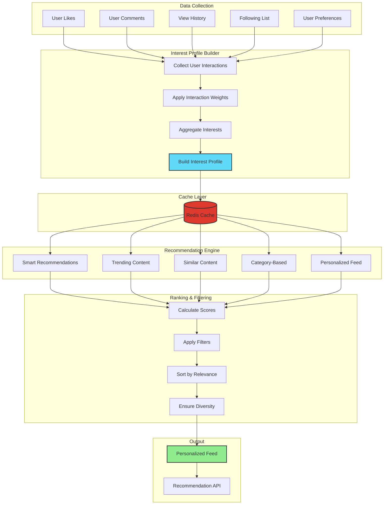

## 3. User Interest Profile

### Building Interest Profile

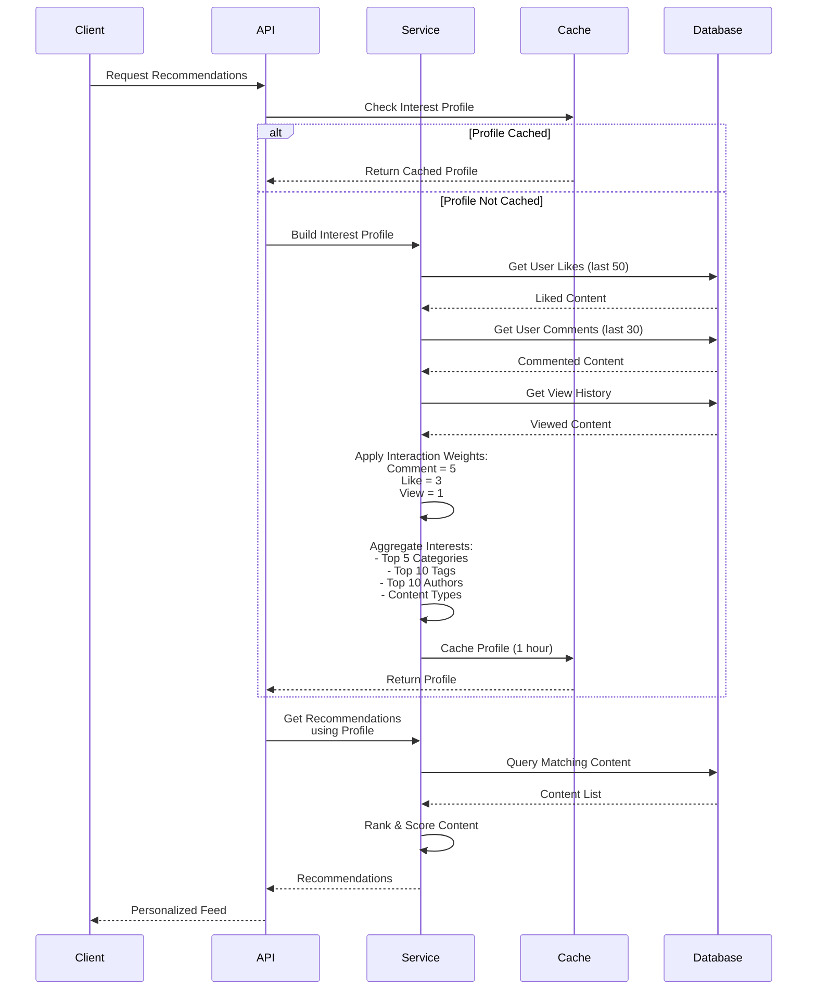

### Interest Profile Structure

```javascript
{
  userId: "user-123",
  categories: ["technology", "science", "education", "programming", "ai"],
  tags: ["javascript", "react", "nodejs", "python", "machine-learning", "tutorial", "beginner", "advanced", "web-dev", "backend"],
  contentTypes: ["video", "article", "document"],
  authors: ["author-1", "author-2", "author-3", ...],
  totalInteractions: 85,
  lastUpdated: "2025-10-15T10:30:00Z"
}
```

## 4. Interaction Weight System

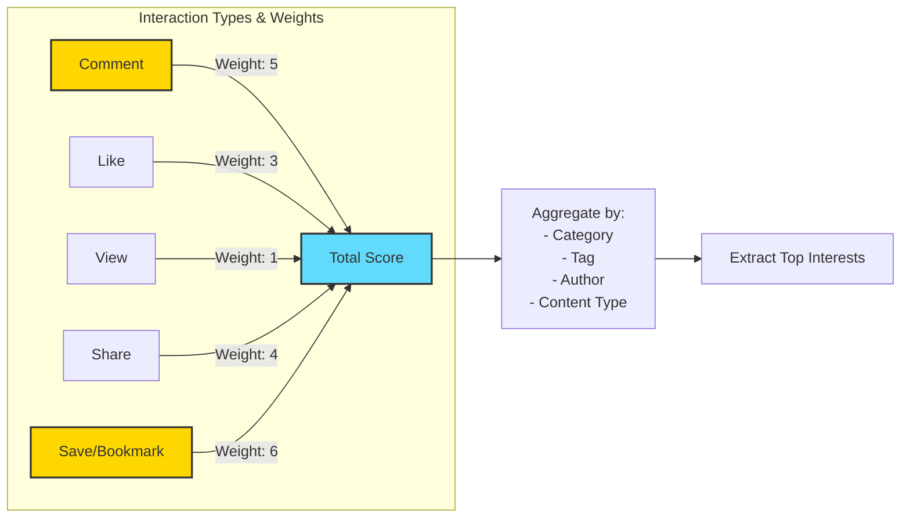

### Weight Calculation Example

```javascript
const WEIGHTS = {
  like: 3,      // Strong signal - user actively liked
  comment: 5,   // Very strong signal - user engaged deeply
  view: 1,      // Weak signal - passive consumption
  share: 4,     // Strong signal - user found valuable
  bookmark: 6   // Very strong signal - user wants to keep
};

// Example: User interactions with "JavaScript Tutorial" content
// - Viewed: +1
// - Liked: +3
// - Commented: +5
// Total Score for "JavaScript" tag = 9 points
```

## 5. Smart Recommendations Algorithm

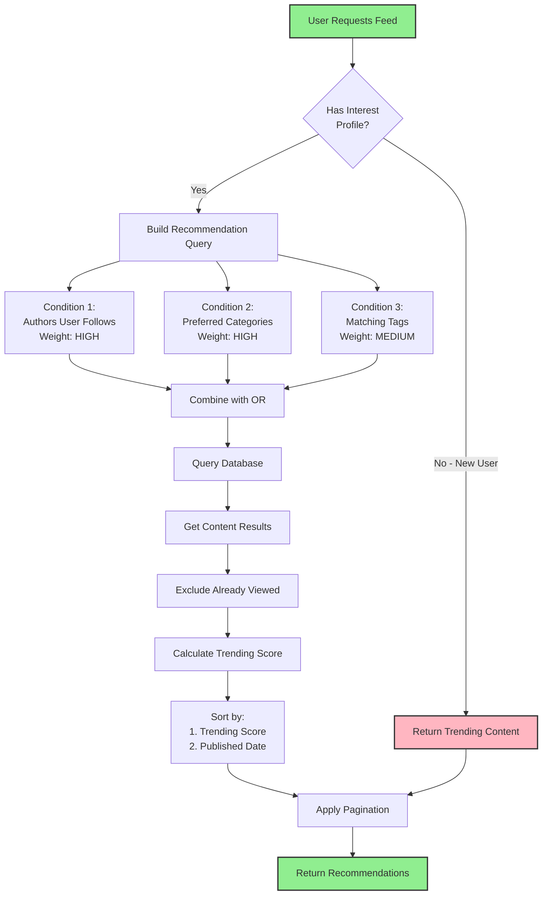

### Smart Recommendation Implementation

```javascript
// src/services/smartRecommendationService.js
class SmartRecommendationService {
  static async getSmartRecommendations(userId, options = {}) {
    const { page = 1, limit = 20, excludeContentIds = [] } = options;
    const skip = (page - 1) * limit;
    
    // Get user's interest profile
    const interestProfile = await this.getUserInterestProfile(userId);
    
    // Build recommendation query
    const conditions = [];
    
    // 1. Content from followed authors (high weight)
    if (interestProfile.authors.length > 0) {
      conditions.push({
        authorId: { in: interestProfile.authors }
      });
    }
    
    // 2. Content in preferred categories (high weight)
    if (interestProfile.categories.length > 0) {
      conditions.push({
        category: { in: interestProfile.categories }
      });
    }
    
    // 3. Content with matching tags (medium weight)
    if (interestProfile.tags.length > 0) {
      conditions.push({
        tags: { hasSome: interestProfile.tags }
      });
    }
    
    // If new user with no interactions, show trending
    if (interestProfile.totalInteractions === 0) {
      return this.getTrendingContent({ page, limit });
    }
    
    // Query database
    const content = await prisma.content.findMany({
      where: {
        status: 'published',
        visibility: { in: ['public', 'unlisted'] },
        id: { notIn: excludeContentIds },
        OR: conditions
      },
      include: {
        author: {
          select: {
            id: true,
            username: true,
            profile: {
              select: { displayName: true, avatarUrl: true }
            }
          }
        },
        _count: {
          select: { likes: true, comments: true, shares: true }
        }
      },
      orderBy: [
        { trendingScore: 'desc' },
        { publishedAt: 'desc' }
      ],
      skip,
      take: limit
    });
    
    return content;
  }
}
```

## 6. Trending Algorithm

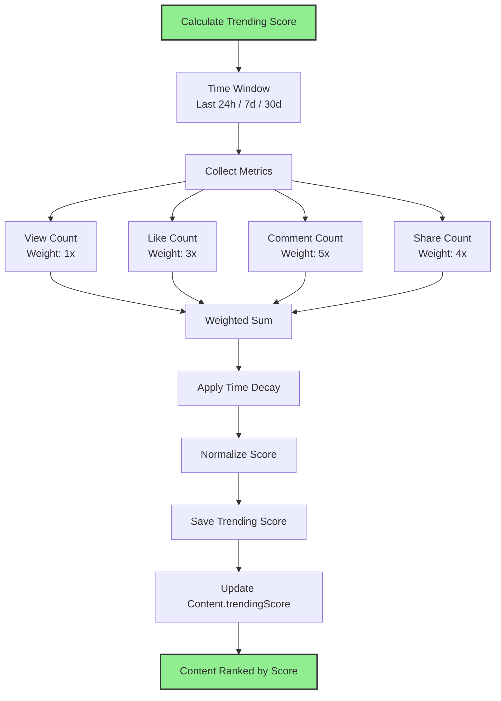

### Trending Score Formula

```javascript
/**
 * Trending Score Calculation
 * 
 * Score = (Views × 1 + Likes × 3 + Comments × 5 + Shares × 4) × TimeDecay
 * 
 * TimeDecay = e^(-λt)
 * where:
 *   λ = decay constant (0.1 for 24h window)
 *   t = hours since published
 */

function calculateTrendingScore(content) {
  const { views, likes, comments, shares, publishedAt } = content;
  
  // Weighted engagement
  const engagementScore = 
    (views * 1) + 
    (likes * 3) + 
    (comments * 5) + 
    (shares * 4);
  
  // Time decay (exponential)
  const hoursOld = (Date.now() - new Date(publishedAt)) / (1000 * 60 * 60);
  const decayConstant = 0.1; // Adjust for faster/slower decay
  const timeDecay = Math.exp(-decayConstant * hoursOld);
  
  // Final score
  const trendingScore = engagementScore * timeDecay;
  
  return Math.round(trendingScore * 100) / 100; // Round to 2 decimals
}
```

### Time Decay Visualization

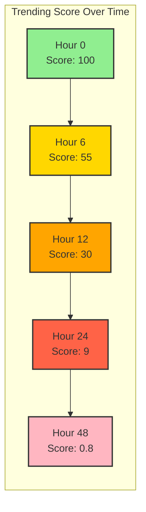

## 7. Personalized Feed Generation

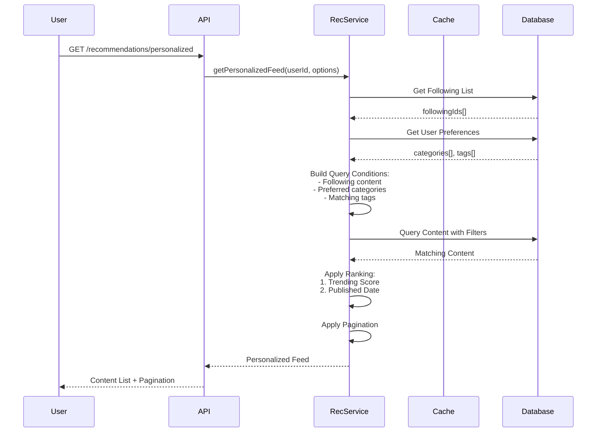

### Feed Composition Strategy

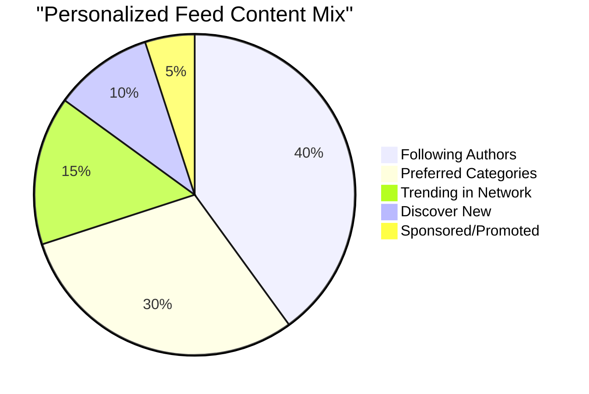

## 8. Similar Content Recommendations

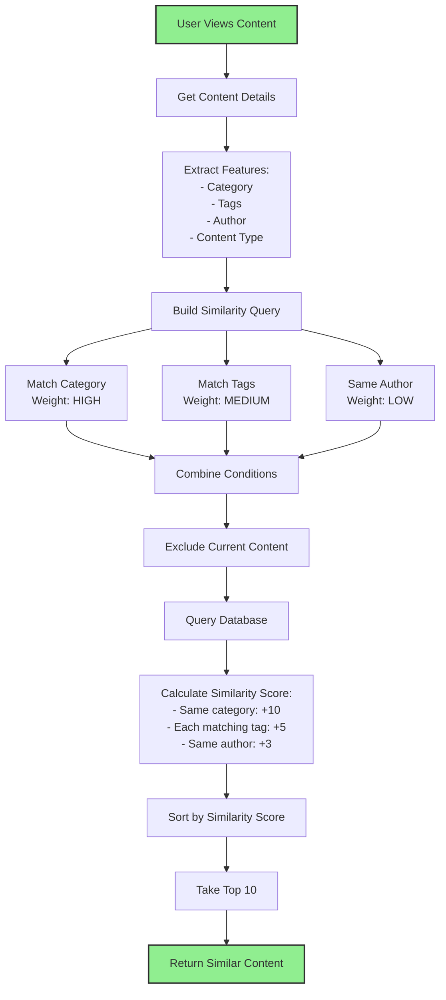

### Similar Content Implementation

```javascript
async function getSimilarContent(contentId, userId, options = {}) {
  const { limit = 10 } = options;
  
  // Get original content
  const original = await prisma.content.findUnique({
    where: { id: contentId },
    select: { category: true, tags: true, authorId: true, type: true }
  });
  
  if (!original) return [];
  
  // Find similar content
  const similar = await prisma.content.findMany({
    where: {
      id: { not: contentId },
      status: 'published',
      visibility: 'public',
      OR: [
        { category: original.category },          // Same category
        { tags: { hasSome: original.tags } },     // Overlapping tags
        { authorId: original.authorId }           // Same author
      ]
    },
    include: {
      author: {
        select: {
          id: true,
          username: true,
          profile: { select: { displayName: true, avatarUrl: true } }
        }
      },
      _count: {
        select: { likes: true, comments: true }
      }
    },
    take: limit * 2 // Get more to score and filter
  });
  
  // Calculate similarity score
  const scored = similar.map(content => {
    let score = 0;
    
    // Same category: +10 points
    if (content.category === original.category) score += 10;
    
    // Each matching tag: +5 points
    const matchingTags = content.tags.filter(tag => 
      original.tags.includes(tag)
    );
    score += matchingTags.length * 5;
    
    // Same author: +3 points
    if (content.authorId === original.authorId) score += 3;
    
    return { ...content, similarityScore: score };
  });
  
  // Sort by score and return top results
  return scored
    .sort((a, b) => b.similarityScore - a.similarityScore)
    .slice(0, limit);
}
```

## 9. Category-Based Recommendations

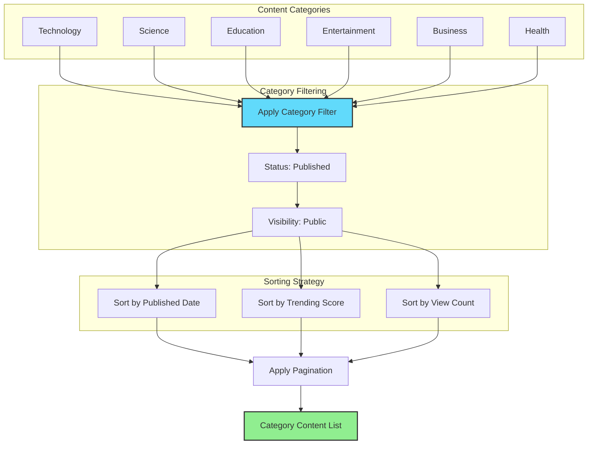

## 10. Search-Based Recommendations

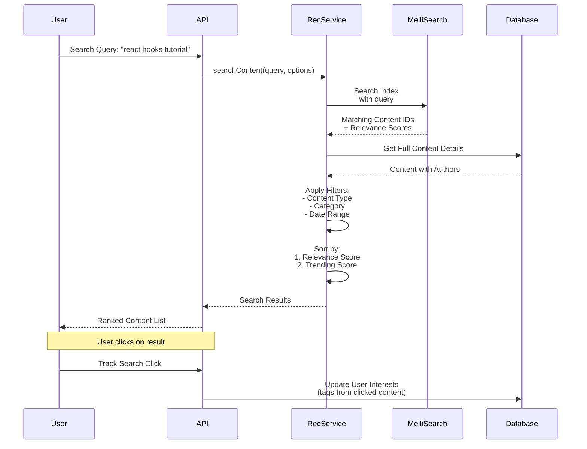

### MeiliSearch Integration

```javascript
// src/services/searchService.js
async function search(indexName, query, options = {}) {
  const {
    limit = 20,
    offset = 0,
    filters = '',
    sortBy = 'relevance'
  } = options;
  
  const searchParams = {
    q: query,
    limit,
    offset,
    filter: filters,
    attributesToHighlight: ['title', 'description'],
    highlightPreTag: '<mark>',
    highlightPostTag: '</mark>'
  };
  
  // Add sorting
  if (sortBy !== 'relevance') {
    searchParams.sort = [mapSortByToMeiliSearch(sortBy)];
  }
  
  const index = meiliClient.index(indexName);
  const results = await index.search(query, searchParams);
  
  return {
    hits: results.hits,
    nbHits: results.estimatedTotalHits,
    processingTimeMs: results.processingTimeMs,
    query: results.query
  };
}
```

## 11. Diversity & Freshness

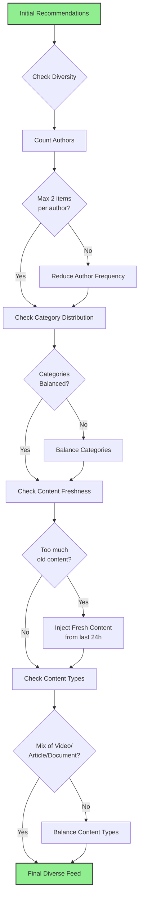

### Diversity Rules

| Rule | Constraint | Purpose |
|------|-----------|---------|
| **Author Diversity** | Max 2 items per author in top 20 | Prevent author monopoly |
| **Category Balance** | Each category < 40% of feed | Ensure variety |
| **Freshness** | At least 30% from last 24h | Show recent content |
| **Type Mix** | Video, Article, Document balanced | Cater to different consumption modes |
| **No Duplicates** | Exclude already viewed | Better user experience |

## 12. Caching Strategy

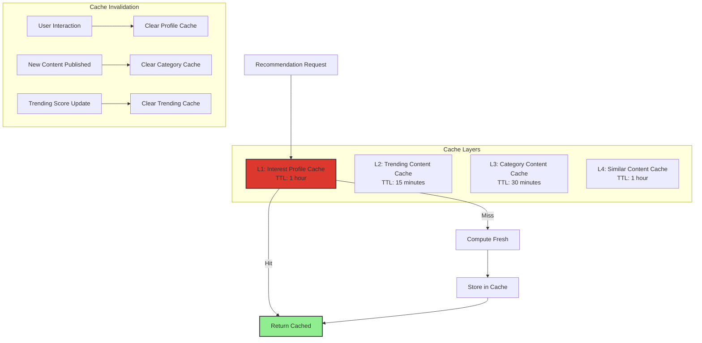

### Cache Key Structure

```javascript
// Interest Profile
const profileKey = `user:${userId}:interest-profile`;

// Trending Content
const trendingKey = `trending:${timeframe}:${contentTypes}`;

// Category Content
const categoryKey = `category:${category}:page:${page}`;

// Similar Content
const similarKey = `similar:${contentId}:limit:${limit}`;

// Personalized Feed
const feedKey = `feed:${userId}:page:${page}`;
```

## 13. API Endpoints

### Get Personalized Feed
```http
GET /api/recommendations/personalized
Headers: Authorization: Bearer <token>
Query Parameters:
  - limit: number (default: 20)
  - offset: number (default: 0)
  - contentTypes: string (default: "video,article,document")
  - includeFollowing: boolean (default: true)
```

### Get Trending Content
```http
GET /api/recommendations/trending
Query Parameters:
  - limit: number (default: 20)
  - timeframe: string (default: "24h", options: "24h", "7d", "30d")
  - contentTypes: string
  - categories: string
```

### Get Similar Content
```http
GET /api/recommendations/similar/:contentId
Headers: Authorization: Bearer <token>
Query Parameters:
  - limit: number (default: 10)
```

### Get Category Content
```http
GET /api/recommendations/category/:category
Query Parameters:
  - limit: number (default: 20)
  - offset: number (default: 0)
  - sortBy: string (default: "recent", options: "recent", "trending", "popular")
```

### Search Content
```http
GET /api/recommendations/search
Query Parameters:
  - q: string (required)
  - limit: number (default: 20)
  - offset: number (default: 0)
  - filters: string (MeiliSearch filter syntax)
  - sortBy: string (default: "relevance")
```

## 14. Performance Metrics

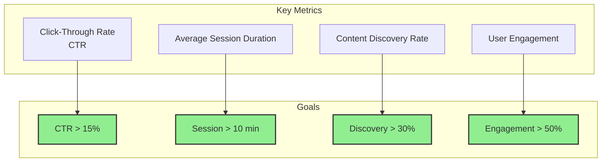

## 15. Tài Liệu Liên Quan

- [00 - System Overview](./00-overview.md)
- [03 - Content Management Workflow](./03-content-workflow.md)
- [04 - Social Interaction Workflow](./04-interaction-workflow.md)
- [07 - Analytics System](./07-analytics-system.md)
- [10 - Database Schema](./10-database-schema.md)
