# MediaVerse MVP - Analytics System

## 1. Giới Thiệu

Hệ thống Analytics thu thập, xử lý và phân tích dữ liệu về hành vi người dùng và hiệu suất nội dung để cung cấp insights có giá trị.

### Tính Năng Chính
- **Real-time Analytics** - Phân tích theo thời gian thực
- **Content Analytics** - Metrics của từng nội dung
- **User Analytics** - Hành vi và engagement của người dùng
- **Daily Summaries** - Tổng hợp hàng ngày
- **Demographic Analysis** - Phân tích đối tượng người dùng
- **Traffic Source Tracking** - Theo dõi nguồn traffic
- **Engagement Metrics** - Đo lường tương tác

## 2. Analytics Architecture

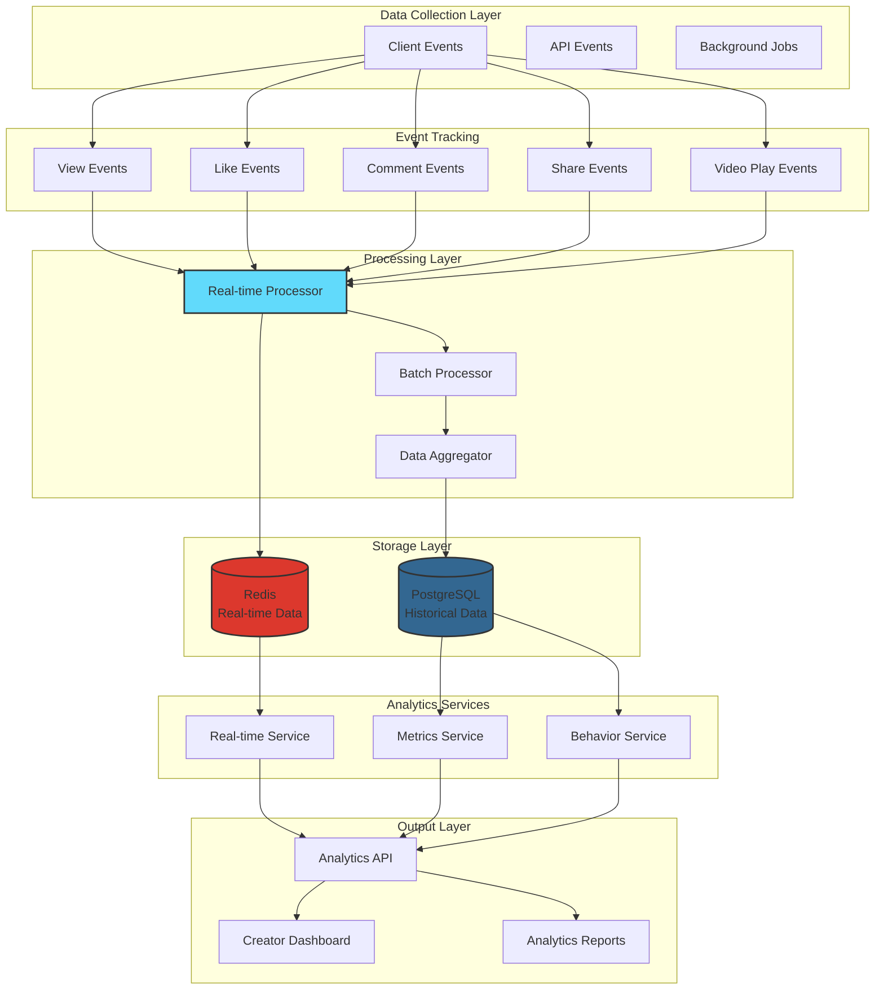

## 3. Event Tracking System

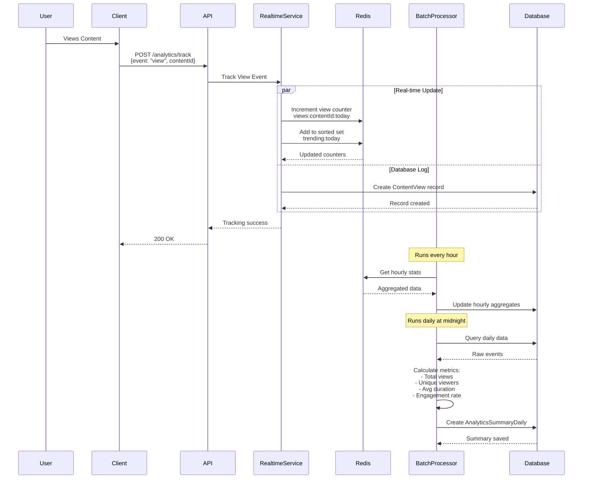

## 4. Content Analytics

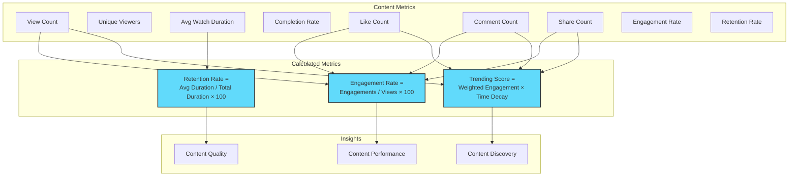

### Metrics Calculation Service

```javascript
// src/modules/analytics/services/metricsService.js

/**
 * Calculate engagement rate for content
 * Engagement Rate = (Total Engagements / Total Views) × 100
 */
exports.calculateEngagementRate = (likes = 0, comments = 0, shares = 0, views = 0) => {
  if (views === 0) return 0;
  
  const totalEngagements = likes + comments + shares;
  const rate = (totalEngagements / views) * 100;
  
  return parseFloat(rate.toFixed(2));
};

/**
 * Calculate retention rate
 * Retention Rate = (Average Watch Duration / Total Duration) × 100
 */
exports.calculateRetentionRate = (avgDuration = 0, totalDuration = 0) => {
  if (totalDuration === 0) return 0;
  
  const rate = (avgDuration / totalDuration) * 100;
  
  return parseFloat(rate.toFixed(2));
};

/**
 * Calculate growth metrics between periods
 */
exports.calculateGrowthMetrics = (previousValue = 0, currentValue = 0) => {
  if (previousValue === 0) {
    return currentValue > 0 ? 100.0 : 0.0;
  }
  
  const growth = ((currentValue - previousValue) / previousValue) * 100;
  
  return parseFloat(growth.toFixed(2));
};
```

## 5. Real-time Analytics

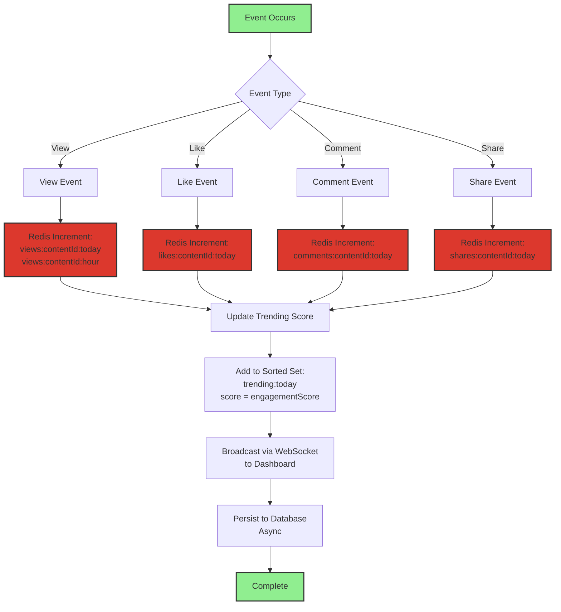

### Redis Key Structure

```javascript
// View tracking
const viewKeyToday = `views:${contentId}:${YYYY-MM-DD}`;
const viewKeyHour = `views:${contentId}:${YYYY-MM-DD}:${HH}`;

// Engagement tracking
const likesKey = `likes:${contentId}:${YYYY-MM-DD}`;
const commentsKey = `comments:${contentId}:${YYYY-MM-DD}`;
const sharesKey = `shares:${contentId}:${YYYY-MM-DD}`;

// Trending sorted set (score = engagement score)
const trendingKey = `trending:${YYYY-MM-DD}`;
// ZADD trending:2025-10-15 1250 contentId-123

// Unique viewers (using HyperLogLog)
const uniqueViewersKey = `unique:viewers:${contentId}:${YYYY-MM-DD}`;
// PFADD unique:viewers:contentId:2025-10-15 userId
```

### Real-time Service Implementation

```javascript
// src/modules/analytics/services/realtimeService.js
const { redisCache } = require('../../../config/redis');
const { startOfDay, format } = require('date-fns');

class RealtimeAnalyticsService {
  /**
   * Track a view event in real-time
   */
  static async trackView(contentId, userId, metadata = {}) {
    const today = format(new Date(), 'yyyy-MM-dd');
    const hour = format(new Date(), 'yyyy-MM-dd:HH');
    
    // Increment view counters
    await Promise.all([
      redisCache.incr(`views:${contentId}:${today}`),
      redisCache.incr(`views:${contentId}:${hour}`),
      redisCache.pfAdd(`unique:viewers:${contentId}:${today}`, userId)
    ]);
    
    // Update trending score
    await this.updateTrendingScore(contentId);
    
    // Persist to database (async)
    await this.persistViewEvent(contentId, userId, metadata);
  }
  
  /**
   * Get real-time stats for content
   */
  static async getRealtimeStats(contentId) {
    const today = format(new Date(), 'yyyy-MM-dd');
    
    const [views, likes, comments, shares, uniqueViewers] = await Promise.all([
      redisCache.get(`views:${contentId}:${today}`),
      redisCache.get(`likes:${contentId}:${today}`),
      redisCache.get(`comments:${contentId}:${today}`),
      redisCache.get(`shares:${contentId}:${today}`),
      redisCache.pfCount(`unique:viewers:${contentId}:${today}`)
    ]);
    
    return {
      views: parseInt(views || 0),
      likes: parseInt(likes || 0),
      comments: parseInt(comments || 0),
      shares: parseInt(shares || 0),
      uniqueViewers,
      engagementRate: this.calculateEngagementRate(
        parseInt(likes || 0),
        parseInt(comments || 0),
        parseInt(shares || 0),
        parseInt(views || 0)
      )
    };
  }
  
  /**
   * Update trending score in sorted set
   */
  static async updateTrendingScore(contentId) {
    const stats = await this.getRealtimeStats(contentId);
    
    // Calculate weighted engagement score
    const score = 
      (stats.views * 1) +
      (stats.likes * 3) +
      (stats.comments * 5) +
      (stats.shares * 4);
    
    const today = format(new Date(), 'yyyy-MM-dd');
    await redisCache.zAdd(`trending:${today}`, {
      score,
      value: contentId
    });
  }
}
```

## 6. Daily Summary Aggregation

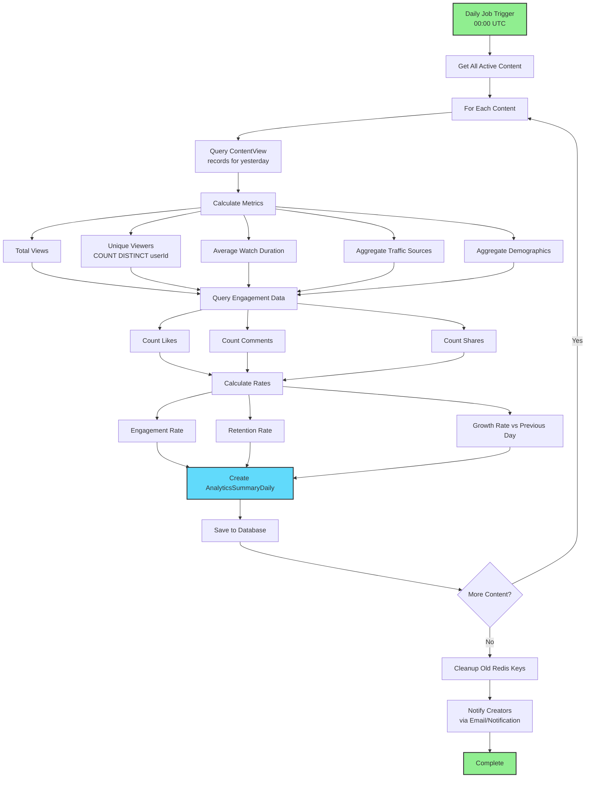

### Daily Summary Data Model

```javascript
// AnalyticsSummaryDaily Schema
{
  id: "summary-123",
  contentId: "content-456",
  date: "2025-10-15",
  
  // View metrics
  totalViews: 1500,
  uniqueViewers: 850,
  averageViewDuration: 245.5, // seconds
  
  // Engagement metrics
  totalLikes: 120,
  totalComments: 45,
  totalShares: 30,
  
  // Calculated metrics
  engagementRate: 13.00, // percentage
  retentionRate: 65.50,  // percentage
  
  // Traffic sources
  trafficSources: {
    "direct": 600,
    "search": 400,
    "social": 300,
    "referral": 200
  },
  
  // Demographics
  demographics: {
    "ageGroups": {
      "18-24": 450,
      "25-34": 600,
      "35-44": 300,
      "45+": 150
    },
    "countries": {
      "US": 500,
      "UK": 300,
      "CA": 200,
      "VN": 500
    }
  },
  
  // Growth metrics
  viewsGrowth: 15.5, // percentage vs previous day
  likesGrowth: 8.2,
  
  createdAt: "2025-10-16T00:05:00Z"
}
```

## 7. Traffic Source Analysis

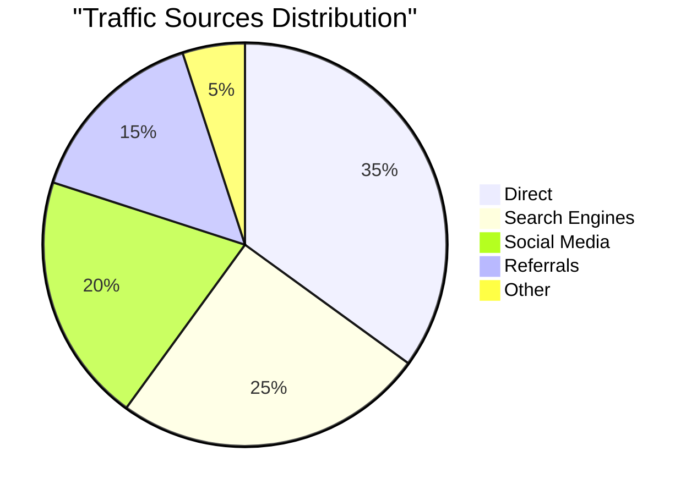

### Traffic Source Tracking

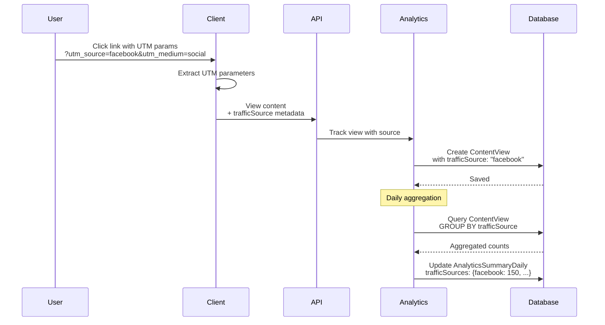

### UTM Parameter Structure

```javascript
// Client-side tracking
const urlParams = new URLSearchParams(window.location.search);
const trafficSource = {
  source: urlParams.get('utm_source') || 'direct',
  medium: urlParams.get('utm_medium') || null,
  campaign: urlParams.get('utm_campaign') || null,
  term: urlParams.get('utm_term') || null,
  content: urlParams.get('utm_content') || null,
  referrer: document.referrer || null
};

// Send with view event
await trackView(contentId, { trafficSource });
```

## 8. Demographics Analysis

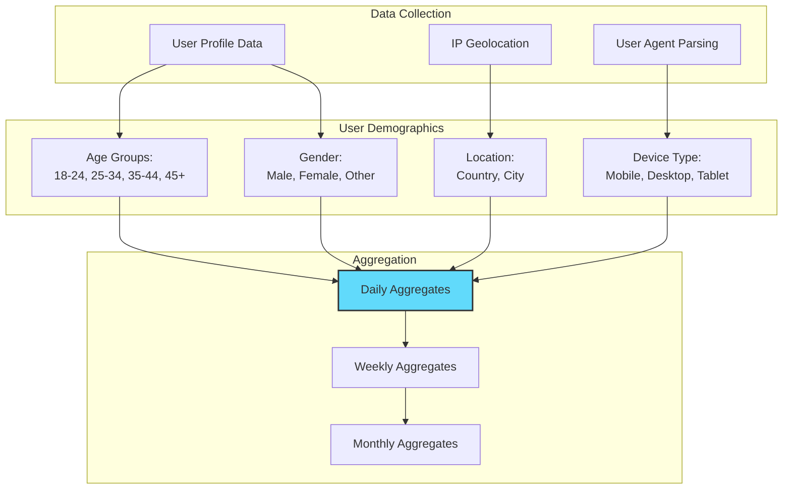

### Demographics Data Structure

```javascript
// Demographics in AnalyticsSummaryDaily
demographics: {
  ageGroups: {
    "18-24": 450,
    "25-34": 600,
    "35-44": 300,
    "45+": 150
  },
  
  gender: {
    "male": 800,
    "female": 600,
    "other": 100
  },
  
  countries: {
    "US": 500,
    "UK": 300,
    "CA": 200,
    "VN": 500
  },
  
  cities: {
    "New York": 200,
    "London": 150,
    "Ho Chi Minh": 300,
    "Toronto": 100
  },
  
  devices: {
    "mobile": 900,
    "desktop": 500,
    "tablet": 100
  }
}
```

## 9. Creator Dashboard Analytics

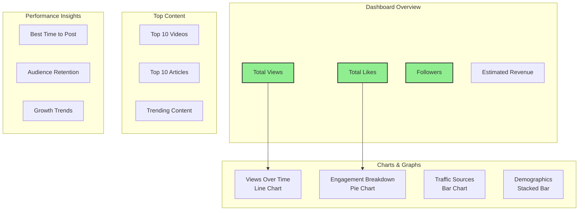

### Dashboard API Endpoints

```http
# Get creator dashboard overview
GET /api/analytics/creator/dashboard
Headers: Authorization: Bearer <token>
Query Parameters:
  - startDate: ISO date (default: 30 days ago)
  - endDate: ISO date (default: today)

Response:
{
  "overview": {
    "totalViews": 15000,
    "totalLikes": 1200,
    "totalComments": 450,
    "totalShares": 300,
    "followers": 5000,
    "viewsGrowth": 15.5,
    "likesGrowth": 8.2
  },
  "topContent": [...],
  "viewsOverTime": [...],
  "trafficSources": {...},
  "demographics": {...}
}
```

```http
# Get content-specific analytics
GET /api/analytics/content/:contentId
Headers: Authorization: Bearer <token>
Query Parameters:
  - period: string (default: "30d", options: "24h", "7d", "30d", "90d", "all")

Response:
{
  "contentId": "content-123",
  "title": "React Hooks Tutorial",
  "metrics": {
    "totalViews": 2500,
    "uniqueViewers": 1800,
    "averageWatchDuration": 245.5,
    "totalLikes": 200,
    "totalComments": 75,
    "totalShares": 50,
    "engagementRate": 13.0,
    "retentionRate": 65.5
  },
  "viewsOverTime": [...],
  "trafficSources": {...},
  "demographics": {...}
}
```

## 10. Behavior Analytics

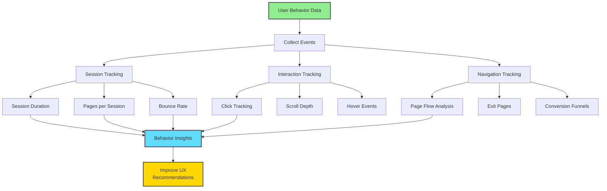

### Key Behavior Metrics

| Metric | Description | Formula |
|--------|-------------|---------|
| **Session Duration** | Average time user spends per session | Total time / Sessions |
| **Pages per Session** | Average pages viewed per session | Total page views / Sessions |
| **Bounce Rate** | % of single-page sessions | Single-page sessions / Total sessions × 100 |
| **Exit Rate** | % of users leaving from a page | Exits from page / Total page views × 100 |
| **Conversion Rate** | % of users completing goal | Conversions / Total visitors × 100 |

## 11. Performance Monitoring

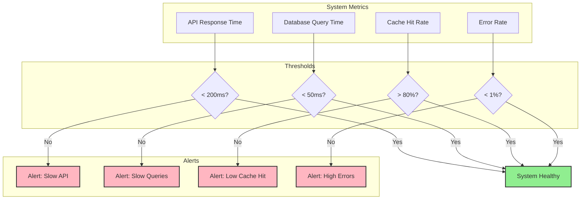

## 12. Export & Reporting

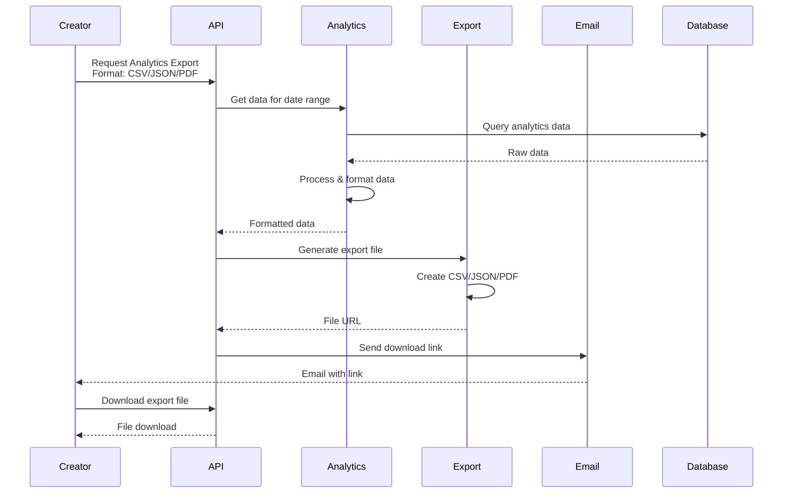

## 13. Tài Liệu Liên Quan

- [00 - System Overview](./00-overview.md)
- [03 - Content Management Workflow](./03-content-workflow.md)
- [04 - Social Interaction Workflow](./04-interaction-workflow.md)
- [06 - Recommendation System](./06-recommendation-system.md)
- [10 - Database Schema](./10-database-schema.md)
