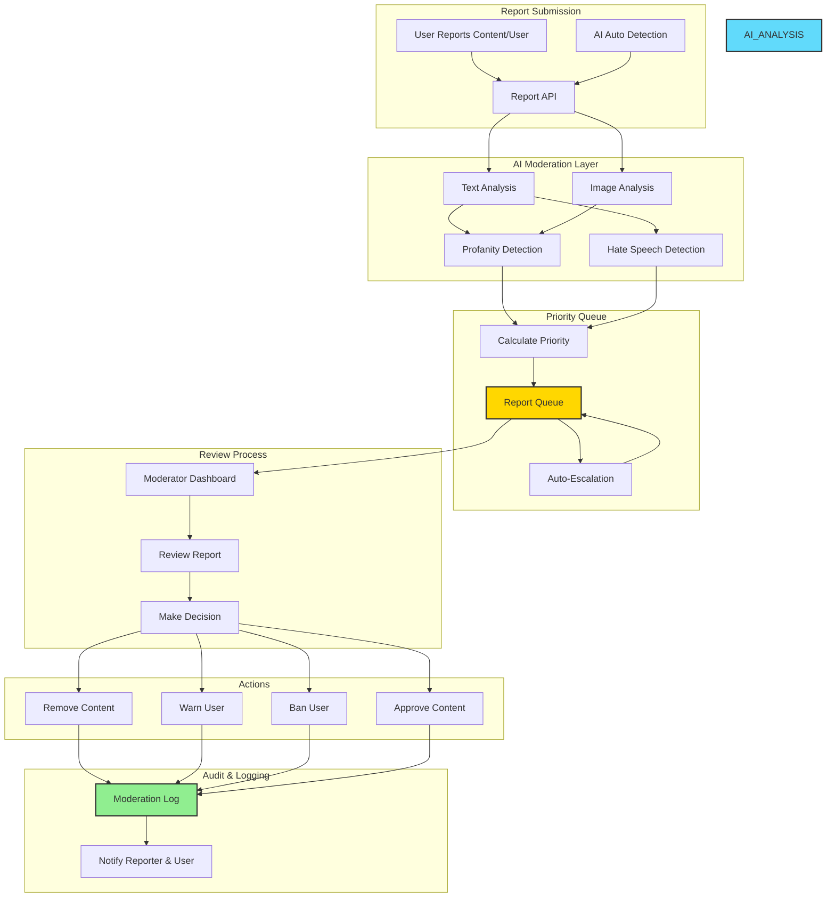
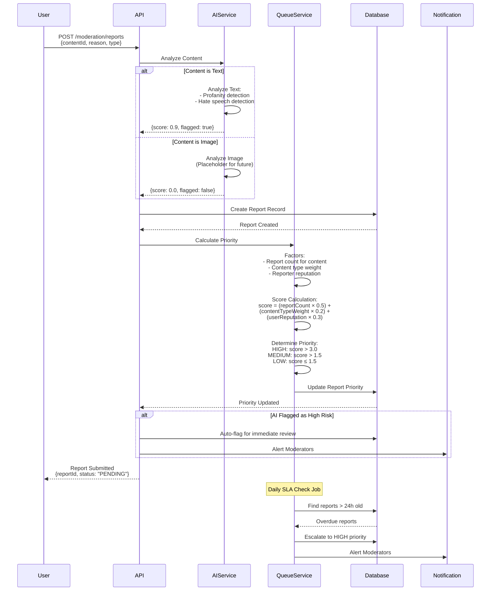
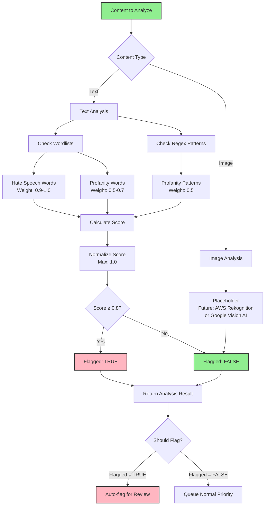
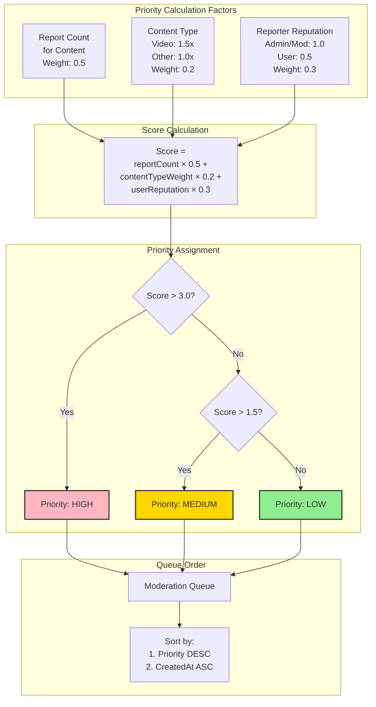
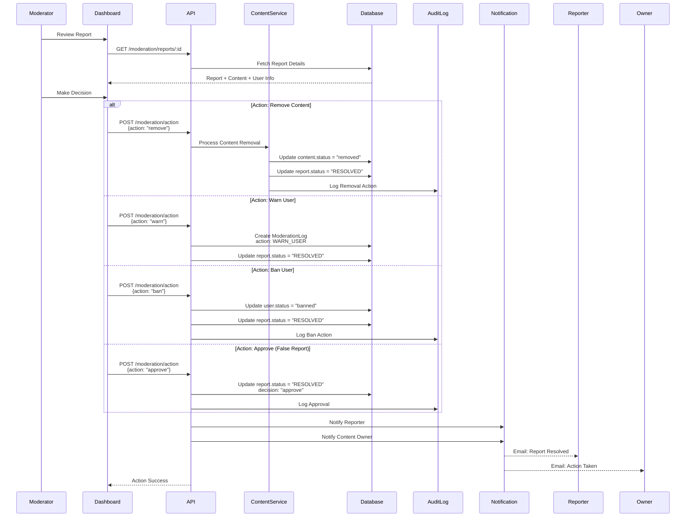
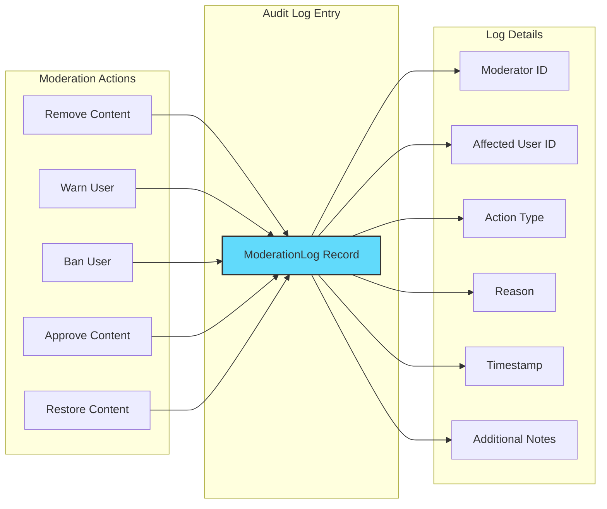
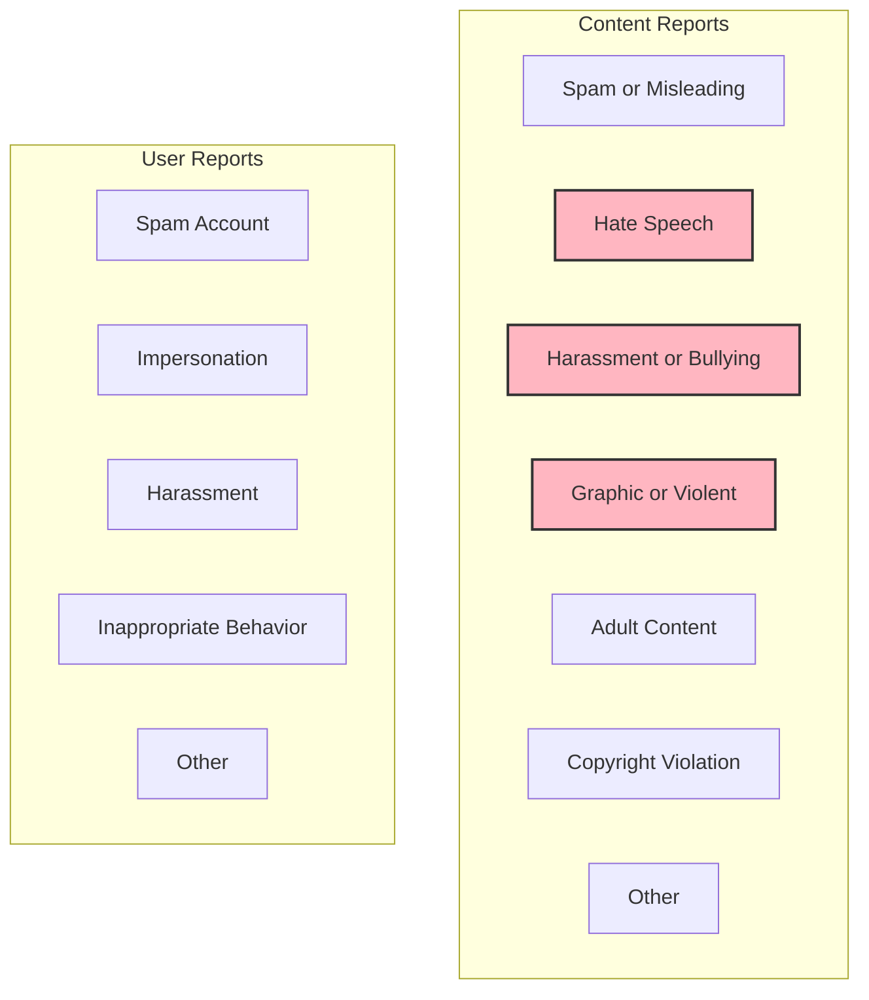
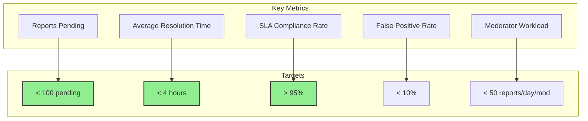

# MediaVerse MVP - Moderation System

## 1. Giới Thiệu

Hệ thống Moderation (Kiểm duyệt) đảm bảo nội dung và người dùng tuân thủ các quy tắc cộng đồng thông qua việc kết hợp kiểm duyệt tự động (AI) và thủ công (con người).

### Tính Năng Chính
- **Content Reporting** - Báo cáo nội dung vi phạm
- **User Reporting** - Báo cáo người dùng vi phạm
- **AI-Powered Moderation** - Phát hiện tự động nội dung độc hại
- **Priority Queue System** - Hệ thống ưu tiên xử lý
- **Moderation Actions** - Xóa, cảnh báo, ban user
- **Audit Logging** - Ghi lại mọi hành động kiểm duyệt
- **SLA Management** - Quản lý thời gian phản hồi

## 2. Moderation System Architecture



## 3. Report Workflow



## 4. AI Moderation Service



### AI Moderation Implementation

```javascript
// src/modules/moderation/services/aiModerationService.js

const PROFANITY_THRESHOLD = 0.8;

// Hate speech wordlist with weights
const HATE_SPEECH_WORDS = {
  word1: 0.9,
  word2: 1.0
  // More words in production
};

// Profanity wordlist with weights
const PROFANITY_WORDS = {
  badword1: 0.5,
  badword2: 0.7
  // More words in production
};

// Regex patterns for profanity variations
const PROFANITY_REGEX = [
  /f\*[ck]{2}/i
  // More patterns in production
];

/**
 * Analyze text content for moderation flags
 */
const analyzeText = async (text) => {
  if (!text || typeof text !== 'string') {
    return { score: 0, flagged: false, details: { reason: 'No text provided.' } };
  }
  
  let score = 0;
  const matchedWords = new Set();
  const lowerCaseText = text.toLowerCase();
  
  // 1. Check against hate speech wordlist
  for (const word in HATE_SPEECH_WORDS) {
    if (lowerCaseText.includes(word)) {
      score += HATE_SPEECH_WORDS[word];
      matchedWords.add(word);
    }
  }
  
  // 2. Check against profanity wordlist
  for (const word in PROFANITY_WORDS) {
    if (lowerCaseText.includes(word)) {
      score += PROFANITY_WORDS[word];
      matchedWords.add(word);
    }
  }
  
  // 3. Check against regex patterns
  for (const regex of PROFANITY_REGEX) {
    if (regex.test(lowerCaseText)) {
      score += 0.5;
      matchedWords.add(regex.toString());
    }
  }
  
  // Normalize score (cap at 1.0)
  const finalScore = Math.min(score, 1.0);
  const flagged = finalScore >= PROFANITY_THRESHOLD;
  
  return {
    score: finalScore,
    flagged,
    details: {
      matched: Array.from(matchedWords),
      threshold: PROFANITY_THRESHOLD
    }
  };
};

/**
 * Analyze image content (placeholder for future)
 * Will integrate with AWS Rekognition or Google Vision AI
 */
const analyzeImage = async (imageUrl) => {
  console.log(`[STUB] Analyzing image at: ${imageUrl}`);
  
  // Future implementation:
  // 1. Call third-party AI service (AWS Rekognition, Google Vision)
  // 2. Analyze labels: 'Violence', 'Nudity', 'Explicit Content'
  // 3. Return score and flagged status
  
  return { score: 0, flagged: false, details: { reason: 'Image analysis not implemented.' } };
};

/**
 * Determine if content should be flagged
 */
const shouldFlagContent = async (content, contentType = 'text') => {
  let result;
  
  if (contentType === 'text') {
    result = await analyzeText(content);
  } else if (contentType === 'image') {
    result = await analyzeImage(content);
  } else {
    return false;
  }
  
  return result.flagged;
};

module.exports = {
  analyzeText,
  analyzeImage,
  shouldFlagContent,
  PROFANITY_THRESHOLD
};
```

## 5. Priority Queue System



### Queue Service Implementation

```javascript
// src/modules/moderation/services/queueService.js

const SLA_HOURS = 24;

/**
 * Get user reputation score
 * Admin/Moderator: 1.0
 * Verified User: 0.7
 * Regular User: 0.5
 */
const getUserReputation = async (userId) => {
  const user = await prisma.user.findUnique({ where: { id: userId } });
  
  if (user && (user.role === 'admin' || user.role === 'moderator')) {
    return 1.0;
  }
  
  if (user && user.isVerified) {
    return 0.7;
  }
  
  return 0.5;
};

/**
 * Calculate priority for a report
 */
const calculatePriority = async (report) => {
  if (!report.contentId) return 'LOW';
  
  // Factor 1: How many times has this content been reported?
  const reportCount = await prisma.report.count({
    where: { contentId: report.contentId }
  });
  
  // Factor 2: Content type (video has higher priority)
  const content = await prisma.content.findUnique({
    where: { id: report.contentId },
    select: { type: true }
  });
  const contentTypeWeight = (content && content.type === 'video') ? 1.5 : 1.0;
  
  // Factor 3: Reporter reputation
  const userReputation = await getUserReputation(report.reporterId);
  
  // Calculate score
  const score = 
    (reportCount * 0.5) + 
    (contentTypeWeight * 0.2) + 
    (userReputation * 0.3);
  
  // Assign priority
  if (score > 3.0) return 'HIGH';
  if (score > 1.5) return 'MEDIUM';
  return 'LOW';
};

/**
 * Enqueue a report with calculated priority
 */
const enqueueReport = async (report) => {
  const priority = await calculatePriority(report);
  
  return prisma.report.update({
    where: { id: report.id },
    data: { priority }
  });
};

/**
 * Escalate overdue reports (run as daily cron job)
 * Reports pending > 24 hours are escalated to HIGH priority
 */
const escalateOverdueReports = async () => {
  const slaThreshold = new Date(Date.now() - SLA_HOURS * 60 * 60 * 1000);
  
  const { count } = await prisma.report.updateMany({
    where: {
      status: 'PENDING',
      priority: { not: 'HIGH' },
      createdAt: { lt: slaThreshold }
    },
    data: {
      priority: 'HIGH'
    }
  });
  
  if (count > 0) {
    console.log(`Escalated ${count} overdue reports.`);
    // Notify moderators
  }
  
  return count;
};

/**
 * Get batch of reports for moderator to review
 */
const getReportBatch = async (limit = 10) => {
  return prisma.report.findMany({
    where: { status: 'PENDING' },
    orderBy: [
      { priority: 'desc' },  // HIGH -> MEDIUM -> LOW
      { createdAt: 'asc' }   // Oldest first
    ],
    take: limit,
    include: {
      reporter: { 
        select: { id: true, username: true } 
      },
      reportedContent: { 
        select: { id: true, title: true, type: true } 
      }
    }
  });
};
```

## 6. SLA Management

```mermaid
gantt
    title Report Resolution SLA
    dateFormat  HH:mm
    
    section HIGH Priority
    Review & Action    :active, h1, 00:00, 2h
    
    section MEDIUM Priority
    Review & Action    :m1, 00:00, 8h
    
    section LOW Priority
    Review & Action    :l1, 00:00, 24h
    
    section Escalation
    Auto-escalate to HIGH    :crit, e1, 24:00, 1h
```

### SLA Targets

| Priority | Target Response Time | Auto-Escalation |
|----------|---------------------|-----------------|
| **HIGH** | 2 hours | - |
| **MEDIUM** | 8 hours | After 24 hours → HIGH |
| **LOW** | 24 hours | After 24 hours → HIGH |

### Daily SLA Check Job

```javascript
// Run as cron job: 0 */6 * * * (every 6 hours)
const checkAndEscalateReports = async () => {
  const escalatedCount = await escalateOverdueReports();
  
  if (escalatedCount > 0) {
    // Send notification to moderators
    await notificationService.notifyModerators({
      type: 'SLA_BREACH',
      message: `${escalatedCount} reports have been escalated to HIGH priority`,
      escalatedCount
    });
  }
};
```

## 7. Moderation Actions



### Content Moderation Service

```javascript
// src/modules/moderation/services/contentModerationService.js

/**
 * Process moderation action on content
 */
const processContentAction = async (contentId, action, details) => {
  const { reportId, moderatorId, reason } = details;
  
  const content = await prisma.content.findUnique({ 
    where: { id: contentId } 
  });
  
  if (!content) {
    throw new Error('Content not found.');
  }
  
  const transactions = [];
  
  // 1. Update content status if action is 'remove'
  if (action === 'remove') {
    transactions.push(
      prisma.content.update({
        where: { id: contentId },
        data: { status: 'removed' }
      })
    );
  }
  
  // 2. Resolve the report
  transactions.push(
    prisma.report.update({
      where: { id: reportId },
      data: {
        status: 'RESOLVED',
        reviewedBy: moderatorId,
        reviewedAt: new Date(),
        decision: action
      }
    })
  );
  
  // 3. Create audit log
  transactions.push(
    prisma.moderationLog.create({
      data: {
        moderatorId,
        userId: content.authorId,
        action: action === 'remove' ? 'REMOVE_CONTENT' : 'APPROVE_CONTENT',
        reason,
        notes: `Action on content ID: ${content.id}`
      }
    })
  );
  
  // Execute all operations in a single transaction
  const [updatedContent, updatedReport, log] = await prisma.$transaction(transactions);
  
  return {
    success: true,
    message: `Content successfully ${action}d.`,
    updatedContent,
    updatedReport,
    log
  };
};
```

## 8. Moderation Dashboard

```mermaid
graph TB
    subgraph "Dashboard Overview"
        PENDING[Pending Reports:<br/>Count by Priority]
        QUEUE[Moderation Queue]
        STATS[Today's Statistics]
    end
    
    subgraph "Queue View"
        HIGH_REPORTS[HIGH Priority<br/>Red Badge]
        MEDIUM_REPORTS[MEDIUM Priority<br/>Yellow Badge]
        LOW_REPORTS[LOW Priority<br/>Green Badge]
    end
    
    subgraph "Report Details"
        CONTENT_PREVIEW[Content Preview]
        REPORTER_INFO[Reporter Info]
        REPORT_REASON[Report Reason]
        AI_ANALYSIS[AI Analysis Results]
        HISTORY[Previous Reports<br/>on this Content]
    end
    
    subgraph "Actions"
        REMOVE_BTN[Remove Content]
        WARN_BTN[Warn User]
        BAN_BTN[Ban User]
        APPROVE_BTN[Approve (Dismiss)]
    end
    
    PENDING --> QUEUE
    QUEUE --> HIGH_REPORTS
    QUEUE --> MEDIUM_REPORTS
    QUEUE --> LOW_REPORTS
    
    HIGH_REPORTS --> CONTENT_PREVIEW
    MEDIUM_REPORTS --> CONTENT_PREVIEW
    LOW_REPORTS --> CONTENT_PREVIEW
    
    CONTENT_PREVIEW --> REPORTER_INFO
    REPORTER_INFO --> REPORT_REASON
    REPORT_REASON --> AI_ANALYSIS
    AI_ANALYSIS --> HISTORY
    
    HISTORY --> REMOVE_BTN
    HISTORY --> WARN_BTN
    HISTORY --> BAN_BTN
    HISTORY --> APPROVE_BTN
    
    style HIGH_REPORTS fill:#FFB6C1,stroke:#333,stroke-width:2px
    style MEDIUM_REPORTS fill:#FFD700,stroke:#333,stroke-width:2px
    style LOW_REPORTS fill:#90EE90,stroke:#333,stroke-width:2px
```

## 9. Audit Logging



### Moderation Log Schema

```javascript
// Moderation Log Model
{
  id: "log-123",
  moderatorId: "mod-456",
  userId: "user-789",          // Affected user
  action: "REMOVE_CONTENT",    // REMOVE_CONTENT, WARN_USER, BAN_USER, etc.
  reason: "Hate speech",
  notes: "Action on content ID: content-999",
  contentId: "content-999",    // Optional
  reportId: "report-888",      // Optional
  createdAt: "2025-10-15T14:30:00Z"
}
```

## 10. Report Types & Reasons



### Report Model

```javascript
// Report Schema
{
  id: "report-123",
  type: "CONTENT",              // CONTENT or USER
  reporterId: "user-456",
  
  // For content reports
  contentId: "content-789",
  
  // For user reports
  reportedUserId: "user-999",
  
  reason: "HATE_SPEECH",        // Enum
  description: "User explanation of the issue",
  
  priority: "HIGH",             // HIGH, MEDIUM, LOW
  status: "PENDING",            // PENDING, RESOLVED, DISMISSED
  
  // AI analysis results
  aiAnalysis: {
    score: 0.9,
    flagged: true,
    matched: ["word1", "word2"]
  },
  
  // Resolution
  reviewedBy: "mod-123",
  reviewedAt: "2025-10-15T14:30:00Z",
  decision: "remove",           // remove, warn, ban, approve
  
  createdAt: "2025-10-15T10:00:00Z"
}
```

## 11. API Endpoints

### Create Report
```http
POST /api/moderation/reports
Headers: Authorization: Bearer <token>
Body:
{
  "type": "CONTENT",
  "contentId": "content-123",
  "reason": "HATE_SPEECH",
  "description": "This content contains offensive language"
}
```

### Get Reports (Moderator)
```http
GET /api/moderation/reports
Headers: Authorization: Bearer <token>
Query Parameters:
  - status: string (default: "PENDING")
  - priority: string
  - limit: number (default: 10)
  - offset: number (default: 0)
```

### Get Report Details
```http
GET /api/moderation/reports/:id
Headers: Authorization: Bearer <token>
```

### Take Moderation Action
```http
POST /api/moderation/reports/:id/action
Headers: Authorization: Bearer <token>
Body:
{
  "action": "remove",  // remove, warn, ban, approve
  "reason": "Violates community guidelines"
}
```

### Get Moderation Logs
```http
GET /api/moderation/logs
Headers: Authorization: Bearer <token>
Query Parameters:
  - moderatorId: string
  - userId: string
  - action: string
  - startDate: ISO date
  - endDate: ISO date
```

## 12. Performance & Metrics



## 13. Tài Liệu Liên Quan

- [00 - System Overview](./00-overview.md)
- [02 - Authentication Workflow](./02-authentication-workflow.md)
- [03 - Content Management Workflow](./03-content-workflow.md)
- [09 - Notification System](./09-notification-system.md)
- [10 - Database Schema](./10-database-schema.md)
