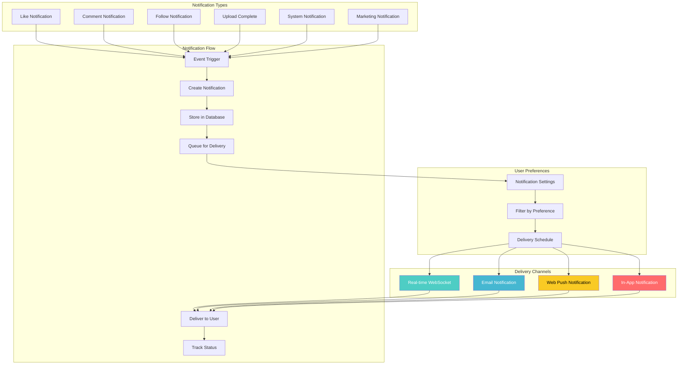
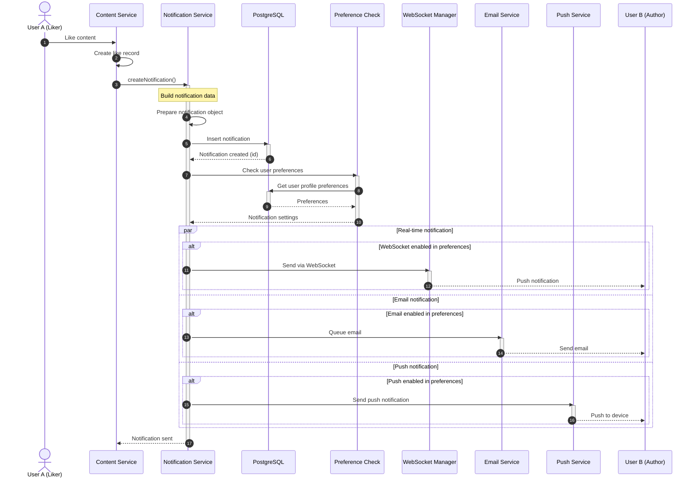
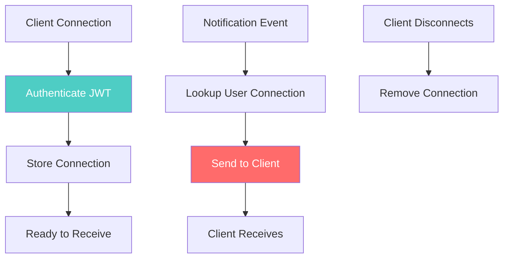

# Notification System

## 1. Tổng Quan Notification System



## 2. Notification Model

```prisma
model Notification {
  id        String    @id @default(uuid(7))
  userId    String
  type      String    // like, comment, follow, upload, system, marketing
  category  String    // likes, comments, follows, uploads, system, marketing
  title     String
  content   String    // Main notification content/message
  data      Json      @default("{}") // Additional structured data
  status    String    @default("unread") // unread, read, archived, deleted
  createdAt DateTime  @default(now())
  readAt    DateTime? // When notification was read
  updatedAt DateTime  @updatedAt

  // Relations
  user User @relation(fields: [userId], references: [id], onDelete: Cascade)

  @@index([userId, status], name: "idx_notifications_user_status")
  @@index([userId, createdAt], name: "idx_notifications_user_created")
  @@index([category, createdAt], name: "idx_notifications_category_created")
  @@map("notifications")
}
```

## 3. Create Notification Workflow

### 3.1 Like Notification



**Implementation:**

```javascript
// modules/notifications/services/notificationService.js
class NotificationService {
  constructor() {
    this.webSocketManager = null;
  }

  setWebSocketManager(wsManager) {
    this.webSocketManager = wsManager;
  }

  async createNotification(data) {
    const {
      userId,
      type,
      category,
      title,
      content,
      data: additionalData = {}
    } = data;

    try {
      // Create notification in database
      const notification = await prisma.notification.create({
        data: {
          userId,
          type,
          category,
          title,
          content,
          data: additionalData,
          status: 'unread'
        }
      });

      // Get user preferences
      const userProfile = await prisma.profile.findUnique({
        where: { userId },
        select: { preferences: true }
      });

      const preferences = userProfile?.preferences?.notifications || {};

      // Send via enabled channels
      await this.deliverNotification(notification, preferences);

      return notification;
    } catch (error) {
      console.error('Error creating notification:', error);
      throw error;
    }
  }

  async deliverNotification(notification, preferences) {
    // Real-time WebSocket delivery (always enabled)
    if (this.webSocketManager) {
      await this.deliverViaWebSocket(notification);
    }

    // Email delivery
    if (preferences[notification.category] !== false && preferences.email !== false) {
      await this.deliverViaEmail(notification);
    }

    // Push notification
    if (preferences.push !== false) {
      await this.deliverViaPush(notification);
    }
  }

  async deliverViaWebSocket(notification) {
    try {
      if (!this.webSocketManager) return;

      this.webSocketManager.sendToUser(notification.userId, {
        type: 'NOTIFICATION',
        notification: {
          id: notification.id,
          type: notification.type,
          category: notification.category,
          title: notification.title,
          content: notification.content,
          data: notification.data,
          createdAt: notification.createdAt
        }
      });
    } catch (error) {
      console.error('WebSocket delivery error:', error);
    }
  }

  async deliverViaEmail(notification) {
    try {
      const user = await prisma.user.findUnique({
        where: { id: notification.userId },
        include: { profile: true }
      });

      if (!user || !user.email) return;

      // Queue email (don't wait)
      emailService.sendNotificationEmail({
        to: user.email,
        displayName: user.profile.displayName,
        notification: {
          title: notification.title,
          content: notification.content,
          type: notification.type,
          data: notification.data
        }
      }).catch(err => console.error('Email error:', err));
    } catch (error) {
      console.error('Email delivery error:', error);
    }
  }

  async deliverViaPush(notification) {
    try {
      // Get user's push subscriptions
      const subscriptions = await this.getPushSubscriptions(notification.userId);

      for (const subscription of subscriptions) {
        await webPush.sendNotification(
          subscription,
          JSON.stringify({
            title: notification.title,
            body: notification.content,
            icon: '/icons/notification-icon.png',
            badge: '/icons/badge-icon.png',
            data: {
              notificationId: notification.id,
              ...notification.data
            }
          })
        ).catch(err => {
          // If subscription is invalid, remove it
          if (err.statusCode === 410) {
            this.removePushSubscription(subscription);
          }
        });
      }
    } catch (error) {
      console.error('Push delivery error:', error);
    }
  }

  async getPushSubscriptions(userId) {
    // Implementation to get push subscriptions from database
    // This would be stored in a separate PushSubscription model
    return [];
  }

  async removePushSubscription(subscription) {
    // Remove invalid subscription
  }
}

module.exports = new NotificationService();
```

---

## 4. WebSocket Real-time Notifications

### 4.1 WebSocket Manager



**Implementation:**

```javascript
// modules/notifications/websocket/webSocketManager.js
const { Server } = require('socket.io');
const jwt = require('jsonwebtoken');

class WebSocketManager {
  constructor() {
    this.io = null;
    this.userSockets = new Map(); // userId -> Set of socket IDs
  }

  initialize(httpServer) {
    this.io = new Server(httpServer, {
      cors: {
        origin: process.env.FRONTEND_URL || 'http://localhost:3000',
        credentials: true
      },
      path: '/socket.io/'
    });

    this.io.use(this.authenticate.bind(this));
    this.io.on('connection', this.handleConnection.bind(this));

    console.log('WebSocket server initialized');
  }

  async authenticate(socket, next) {
    try {
      const token = socket.handshake.auth.token;
      
      if (!token) {
        return next(new Error('Authentication required'));
      }

      const decoded = jwt.verify(token, process.env.JWT_ACCESS_SECRET);
      socket.userId = decoded.userId;
      
      next();
    } catch (error) {
      next(new Error('Invalid token'));
    }
  }

  handleConnection(socket) {
    const userId = socket.userId;
    
    console.log(`User ${userId} connected via WebSocket`);

    // Store socket connection
    if (!this.userSockets.has(userId)) {
      this.userSockets.set(userId, new Set());
    }
    this.userSockets.get(userId).add(socket.id);

    // Join user-specific room
    socket.join(`user:${userId}`);

    // Handle disconnect
    socket.on('disconnect', () => {
      console.log(`User ${userId} disconnected`);
      const sockets = this.userSockets.get(userId);
      if (sockets) {
        sockets.delete(socket.id);
        if (sockets.size === 0) {
          this.userSockets.delete(userId);
        }
      }
    });

    // Handle mark as read
    socket.on('notification:read', async (notificationId) => {
      await this.markAsRead(userId, notificationId);
    });

    // Handle mark all as read
    socket.on('notifications:read_all', async () => {
      await this.markAllAsRead(userId);
    });
  }

  sendToUser(userId, message) {
    this.io.to(`user:${userId}`).emit('notification', message);
  }

  broadcast(message) {
    this.io.emit('broadcast', message);
  }

  broadcastToContent(contentId, message) {
    this.io.to(`content:${contentId}`).emit('content_update', message);
  }

  async markAsRead(userId, notificationId) {
    try {
      await prisma.notification.update({
        where: {
          id: notificationId,
          userId // Ensure user owns the notification
        },
        data: {
          status: 'read',
          readAt: new Date()
        }
      });

      this.sendToUser(userId, {
        type: 'NOTIFICATION_READ',
        notificationId
      });
    } catch (error) {
      console.error('Error marking notification as read:', error);
    }
  }

  async markAllAsRead(userId) {
    try {
      await prisma.notification.updateMany({
        where: {
          userId,
          status: 'unread'
        },
        data: {
          status: 'read',
          readAt: new Date()
        }
      });

      this.sendToUser(userId, {
        type: 'ALL_NOTIFICATIONS_READ'
      });
    } catch (error) {
      console.error('Error marking all notifications as read:', error);
    }
  }

  getConnectedUsers() {
    return Array.from(this.userSockets.keys());
  }

  isUserConnected(userId) {
    return this.userSockets.has(userId);
  }
}

module.exports = WebSocketManager;
```

---

## 5. Email Notifications

### 5.1 Email Templates

```javascript
// modules/notifications/templates/emailTemplates.js
const Handlebars = require('handlebars');

const notificationEmailTemplate = `
<!DOCTYPE html>
<html>
<head>
  <style>
    body { font-family: Arial, sans-serif; }
    .container { max-width: 600px; margin: 0 auto; padding: 20px; }
    .header { background-color: #4ecdc4; color: white; padding: 20px; text-align: center; }
    .content { background-color: #f9f9f9; padding: 20px; margin-top: 20px; }
    .button { display: inline-block; padding: 10px 20px; background-color: #4ecdc4; color: white; text-decoration: none; border-radius: 5px; margin-top: 20px; }
    .footer { text-align: center; color: #666; margin-top: 20px; font-size: 12px; }
  </style>
</head>
<body>
  <div class="container">
    <div class="header">
      <h1>{{title}}</h1>
    </div>
    <div class="content">
      <p>Hi {{displayName}},</p>
      <p>{{content}}</p>
      {{#if actionUrl}}
      <a href="{{actionUrl}}" class="button">View</a>
      {{/if}}
    </div>
    <div class="footer">
      <p>You're receiving this email because you have notifications enabled.</p>
      <p><a href="{{settingsUrl}}">Manage notification preferences</a></p>
    </div>
  </div>
</body>
</html>
`;

const compiledTemplate = Handlebars.compile(notificationEmailTemplate);

module.exports = {
  renderNotificationEmail: (data) => {
    return compiledTemplate(data);
  }
};
```

---

### 5.2 Email Service

```javascript
// services/emailService.js
const sgMail = require('@sendgrid/mail');
const { renderNotificationEmail } = require('../modules/notifications/templates/emailTemplates');

sgMail.setApiKey(process.env.SENDGRID_API_KEY);

class EmailService {
  async sendNotificationEmail(options) {
    const { to, displayName, notification } = options;

    const html = renderNotificationEmail({
      title: notification.title,
      displayName,
      content: notification.content,
      actionUrl: this.getActionUrl(notification),
      settingsUrl: `${process.env.FRONTEND_URL}/settings/notifications`
    });

    const msg = {
      to,
      from: {
        email: process.env.FROM_EMAIL,
        name: 'MediaVerse'
      },
      subject: notification.title,
      html
    };

    try {
      await sgMail.send(msg);
      console.log(`Email sent to ${to}`);
    } catch (error) {
      console.error('Email sending error:', error);
      throw error;
    }
  }

  getActionUrl(notification) {
    const baseUrl = process.env.FRONTEND_URL;
    
    switch (notification.type) {
      case 'like':
      case 'comment':
        return `${baseUrl}/content/${notification.data.contentId}`;
      case 'follow':
        return `${baseUrl}/users/${notification.data.followerId}`;
      case 'upload':
        return `${baseUrl}/content/${notification.data.contentId}`;
      default:
        return `${baseUrl}/notifications`;
    }
  }
}

module.exports = new EmailService();
```

---

## 6. Web Push Notifications

```javascript
// services/pushService.js
const webPush = require('web-push');

webPush.setVapidDetails(
  'mailto:' + process.env.VAPID_EMAIL,
  process.env.VAPID_PUBLIC_KEY,
  process.env.VAPID_PRIVATE_KEY
);

class PushService {
  async sendPush(subscription, payload) {
    try {
      await webPush.sendNotification(subscription, JSON.stringify(payload));
    } catch (error) {
      if (error.statusCode === 410) {
        // Subscription expired, should be removed
        console.log('Push subscription expired');
        return { expired: true };
      }
      throw error;
    }
  }

  async subscribe(userId, subscription) {
    // Store subscription in database
    await prisma.pushSubscription.create({
      data: {
        userId,
        endpoint: subscription.endpoint,
        keys: subscription.keys
      }
    });
  }

  async unsubscribe(userId, endpoint) {
    await prisma.pushSubscription.deleteMany({
      where: { userId, endpoint }
    });
  }
}

module.exports = new PushService();
```

---

## 7. Notification API Endpoints

### 7.1 Get Notifications

```javascript
// GET /api/notifications
exports.getNotifications = async (req, res, next) => {
  try {
    const userId = req.user.id;
    const { status = 'unread', limit = 20, offset = 0 } = req.query;

    const notifications = await prisma.notification.findMany({
      where: {
        userId,
        ...(status !== 'all' && { status })
      },
      orderBy: {
        createdAt: 'desc'
      },
      skip: parseInt(offset),
      take: parseInt(limit)
    });

    const unreadCount = await prisma.notification.count({
      where: { userId, status: 'unread' }
    });

    res.json({
      notifications,
      unreadCount,
      pagination: {
        total: await prisma.notification.count({ where: { userId } }),
        offset: parseInt(offset),
        limit: parseInt(limit)
      }
    });
  } catch (error) {
    next(error);
  }
};
```

### 7.2 Mark as Read

```javascript
// PUT /api/notifications/:id/read
exports.markAsRead = async (req, res, next) => {
  try {
    const { id } = req.params;
    const userId = req.user.id;

    const notification = await prisma.notification.update({
      where: {
        id,
        userId // Ensure ownership
      },
      data: {
        status: 'read',
        readAt: new Date()
      }
    });

    res.json(notification);
  } catch (error) {
    next(error);
  }
};
```

### 7.3 Mark All as Read

```javascript
// PUT /api/notifications/mark-all-read
exports.markAllAsRead = async (req, res, next) => {
  try {
    const userId = req.user.id;

    await prisma.notification.updateMany({
      where: {
        userId,
        status: 'unread'
      },
      data: {
        status: 'read',
        readAt: new Date()
      }
    });

    res.json({ success: true });
  } catch (error) {
    next(error);
  }
};
```

### 7.4 Update Preferences

```javascript
// PUT /api/notifications/preferences
exports.updatePreferences = async (req, res, next) => {
  try {
    const userId = req.user.id;
    const preferences = req.body;

    const profile = await prisma.profile.update({
      where: { userId },
      data: {
        preferences: {
          ...profile.preferences,
          notifications: preferences
        }
      }
    });

    res.json({
      success: true,
      preferences: profile.preferences.notifications
    });
  } catch (error) {
    next(error);
  }
};
```

---

## 8. Notification Preferences UI Structure

```javascript
// Example notification preferences object
{
  "email": true,              // Master email toggle
  "push": true,               // Master push toggle
  "likes": true,              // Receive like notifications
  "comments": true,           // Receive comment notifications
  "follows": true,            // Receive follow notifications
  "uploads": true,            // Receive upload complete notifications
  "system": true,             // Receive system notifications
  "marketing": false,         // Receive marketing notifications
  "digest": {
    "enabled": true,
    "frequency": "daily"      // daily, weekly, never
  }
}
```

---

## 9. File Structure

```
src/modules/notifications/
├── controllers/
│   └── notificationController.js
├── services/
│   └── notificationService.js
├── websocket/
│   └── webSocketManager.js
├── templates/
│   └── emailTemplates.js
├── routes/
│   └── index.js
├── validation.js
└── schemas.js

src/services/
├── emailService.js
└── pushService.js
```

---

## Tài Liệu Liên Quan

- [00 - Overview](./00-overview.md)
- [01 - Use Cases](./01-use-cases.md)
- [04 - Social Interactions](./04-interaction-workflow.md)
