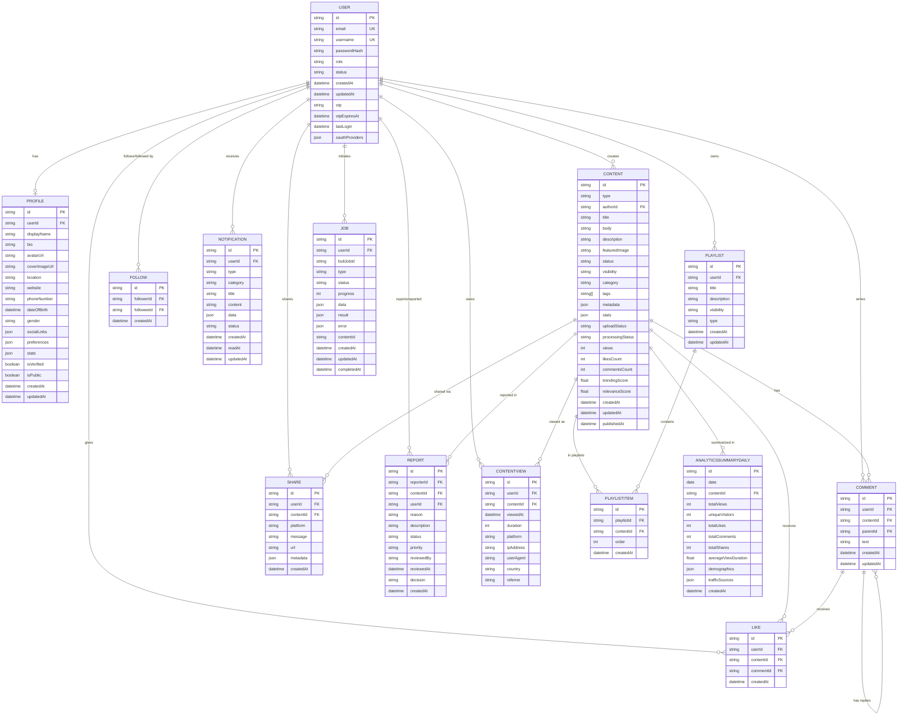

# Database Schema & Models

## 1. Tổng Quan Database



## 2. Core Models Chi Tiết

### 2.1 User Model

```prisma
model User {
  id           String   @id @default(uuid(7))
  email        String   @unique
  username     String   @unique
  passwordHash String?  // Optional for OAuth users
  role         String   @default("user") // user, admin, moderator
  status       String   @default("active") // active, suspended, banned
  createdAt    DateTime @default(now())
  updatedAt    DateTime @updatedAt

  otp                  String?
  otpExpiresAt         DateTime?
  lastLogin            DateTime?

  // OAuth providers data stored as JSON
  oauthProviders       Json?

  // Relations
  profile         Profile?
  content         Content[]           @relation("ContentAuthor")
  playlists       Playlist[]
  likes           Like[]
  comments        Comment[]
  followers       Follow[]            @relation("UserFollowers")
  following       Follow[]            @relation("UserFollowing")
  reports         Report[]            @relation("ReportReporter")
  reportedContent Report[]            @relation("ReportedUser")
  notifications   Notification[]
  shares          Share[]
  jobs            Job[]
  moderationLogs  ModerationLog[]     @relation("ModeratedUser")
  moderatorActions ModerationLog[]    @relation("Moderator")
  contentViews    ContentView[]

  @@index([email], name: "idx_users_email")
  @@index([username], name: "idx_users_username")
  @@map("users")
}
```

**Key Features:**
- UUID v7 for IDs (time-sortable)
- Unique constraints on email and username
- Nullable passwordHash for OAuth-only users
- Role-based access control
- Account status management
- OTP support for password reset
- OAuth providers stored as JSON
- Comprehensive relations with other models

**Indexes:**
- `idx_users_email` - Fast email lookup for login
- `idx_users_username` - Fast username lookup

---

### 2.2 Profile Model

```prisma
model Profile {
  id            String   @id @default(uuid(7))
  userId        String   @unique
  displayName   String
  bio           String?
  avatarUrl     String?
  coverImageUrl String?
  location      String?
  website       String?
  phoneNumber   String?
  dateOfBirth   DateTime?
  gender        String?
  occupation    String?
  company       String?
  education     String?
  socialLinks   Json     @default("{}")
  preferences   Json     @default("{}")
  stats         Json     @default("{}")
  isVerified    Boolean  @default(false)
  isPublic      Boolean  @default(true)
  createdAt     DateTime @default(now())
  updatedAt     DateTime @updatedAt

  // Relations
  user User @relation(fields: [userId], references: [id], onDelete: Cascade)

  @@map("profiles")
}
```

**JSON Fields Structure:**

```javascript
// socialLinks
{
  "facebook": "https://facebook.com/user",
  "twitter": "https://twitter.com/user",
  "instagram": "https://instagram.com/user",
  "linkedin": "https://linkedin.com/in/user",
  "github": "https://github.com/user",
  "youtube": "https://youtube.com/@user"
}

// preferences
{
  "notifications": {
    "email": true,
    "push": true,
    "likes": true,
    "comments": true,
    "follows": true,
    "marketing": false
  },
  "privacy": {
    "showEmail": false,
    "showLocation": true,
    "allowMessages": true
  },
  "theme": "dark",
  "language": "en"
}

// stats
{
  "followersCount": 1234,
  "followingCount": 567,
  "videosCount": 45,
  "articlesCount": 23,
  "totalViews": 123456,
  "totalLikes": 5678
}
```

---

### 2.3 Content Model

```prisma
model Content {
  id             String    @id @default(uuid(7))
  type           String    // article, video, document, image
  authorId       String
  title          String
  body           String?
  description    String?
  featuredImage  String?
  status         String    @default("draft") // draft, published, archived
  visibility     String    @default("public") // public, private, unlisted
  category       String
  tags           String[]
  metadata       Json      @default("{}")
  stats          Json      @default("{}")

  // Video upload and processing status fields
  uploadStatus   String?   @default("pending") // pending, uploaded, completed, failed
  processingStatus String? @default("pending") // pending, queued, processing, completed, failed

  // Recommendation system fields
  views          Int       @default(0)
  likesCount     Int       @default(0)
  commentsCount  Int       @default(0)
  trendingScore  Float     @default(0.0)
  relevanceScore Float     @default(0.0)

  createdAt      DateTime  @default(now())
  updatedAt      DateTime  @updatedAt
  publishedAt    DateTime?

  // Relations
  author   User           @relation("ContentAuthor", fields: [authorId], references: [id], onDelete: Cascade)
  likes    Like[]
  comments Comment[]
  reports  Report[]       @relation("ReportedContent")
  shares   Share[]
  playlistItems PlaylistItem[]
  contentViews ContentView[]
  dailySummaries AnalyticsSummaryDaily[]

  @@index([authorId], name: "idx_content_author_id")
  @@index([category], name: "idx_content_category")
  @@index([publishedAt], name: "idx_content_published_at")
  @@index([tags], name: "idx_content_tags", type: Gin)
  @@map("content")
}
```

**Content Types:**
- `article` - Blog posts, articles
- `video` - Video content with adaptive streaming
- `document` - PDFs, Word docs, presentations
- `image` - Image galleries

**Metadata JSON Structure:**

```javascript
// For Video Content
{
  "duration": 1234.56,        // seconds
  "resolution": "1920x1080",
  "codec": "h264",
  "bitrate": 5000000,
  "size": 123456789,          // bytes
  "fps": 30,
  "thumbnails": [
    "content/abc/thumbnails/thumb_0.jpg",
    "content/abc/thumbnails/thumb_1.jpg",
    "content/abc/thumbnails/thumb_2.jpg"
  ],
  "hlsUrl": "content/abc/hls/playlist.m3u8",
  "audioUrl": "content/abc/audio/audio.mp3"
}

// For Article Content
{
  "readingTime": 5,          // minutes
  "wordCount": 1200,
  "language": "en",
  "seoKeywords": ["tech", "tutorial"],
  "featuredAt": "2025-01-15T10:00:00Z"
}

// For Document Content
{
  "fileType": "pdf",
  "fileSize": 2048576,       // bytes
  "pageCount": 45,
  "extractedText": "...",
  "downloadUrl": "documents/abc.pdf"
}
```

**Stats JSON Structure:**

```javascript
{
  "sharesCount": 123,
  "bookmarksCount": 456,
  "avgWatchTime": 234.5,     // seconds (for videos)
  "completionRate": 0.75,    // percentage
  "engagementRate": 0.12     // percentage
}
```

**Indexes:**
- `idx_content_author_id` - Fast author content lookup
- `idx_content_category` - Category filtering
- `idx_content_published_at` - Chronological sorting
- `idx_content_tags` - GIN index for array contains queries

---

### 2.4 Like Model

```prisma
model Like {
  id               String   @id @default(uuid(7))
  userId           String
  contentId        String?
  commentId        String?
  createdAt        DateTime @default(now())

  // Relations
  user         User             @relation(fields: [userId], references: [id], onDelete: Cascade)
  content      Content?         @relation(fields: [contentId], references: [id], onDelete: Cascade)
  comment      Comment?         @relation(fields: [commentId], references: [id], onDelete: Cascade)

  @@unique([userId, contentId])
  @@unique([userId, commentId])
  @@map("likes")
}
```

**Key Features:**
- Polymorphic likes (content OR comment)
- Unique constraints prevent duplicate likes
- Cascade delete when user/content/comment deleted

---

### 2.5 Comment Model

```prisma
model Comment {
  id               String   @id @default(uuid(7))
  userId           String
  contentId        String?
  parentId         String?
  text             String
  createdAt        DateTime @default(now())
  updatedAt        DateTime @updatedAt

  // Relations
  user         User            @relation(fields: [userId], references: [id], onDelete: Cascade)
  content      Content?        @relation(fields: [contentId], references: [id], onDelete: Cascade)
  parent       Comment?        @relation("CommentReplies", fields: [parentId], references: [id], onDelete: Cascade)
  replies      Comment[]       @relation("CommentReplies")
  likes        Like[]

  @@map("comments")
}
```

**Key Features:**
- Self-referential relationship for nested comments
- Thread structure with parent-child relations
- Comments can be liked
- Full cascade delete chain

---

### 2.6 Follow Model

```prisma
model Follow {
  id          String   @id @default(uuid(7))
  followerId  String
  followeeId  String
  createdAt   DateTime @default(now())

  // Relations
  follower User @relation("UserFollowers", fields: [followerId], references: [id], onDelete: Cascade)
  followee User @relation("UserFollowing", fields: [followeeId], references: [id], onDelete: Cascade)

  @@unique([followerId, followeeId])
  @@map("follows")
}
```

**Key Features:**
- Directional relationship (follower → followee)
- Unique constraint prevents duplicate follows
- Named relations for clarity

---

## 3. Analytics Models

### 3.1 ContentView Model

```prisma
model ContentView {
  id        String   @id @default(uuid())
  userId    String?
  contentId String
  viewedAt  DateTime @default(now())
  duration  Int?     // in seconds
  platform  String?  // web, mobile-ios, mobile-android
  ipAddress String?
  userAgent String?
  country   String?
  referrer  String?

  // Relations
  user    User?   @relation(fields: [userId], references: [id], onDelete: SetNull)
  content Content @relation(fields: [contentId], references: [id], onDelete: Cascade)

  @@index([userId, contentId])
  @@index([contentId, viewedAt])
  @@map("content_views")
}
```

**Key Features:**
- Nullable userId (anonymous views allowed)
- Rich metadata for analytics
- Time-series data for trend analysis

---

### 3.2 AnalyticsSummaryDaily Model

```prisma
model AnalyticsSummaryDaily {
  id                  String   @id @default(uuid())
  date                DateTime @db.Date
  contentId           String?
  totalViews          Int      @default(0)
  uniqueVisitors      Int      @default(0)
  totalLikes          Int      @default(0)
  totalComments       Int      @default(0)
  totalShares         Int      @default(0)
  averageViewDuration Float    @default(0)
  demographics        Json     @default("{}")
  trafficSources      Json     @default("{}")
  createdAt           DateTime @default(now())

  // Relations
  content Content? @relation(fields: [contentId], references: [id], onDelete: Cascade)

  @@unique([date, contentId])
  @@map("analytics_summary_daily")
}
```

**Demographics JSON:**
```javascript
{
  "age": {
    "18-24": 120,
    "25-34": 250,
    "35-44": 180,
    "45-54": 90,
    "55+": 60
  },
  "gender": {
    "male": 420,
    "female": 280
  }
}
```

**Traffic Sources JSON:**
```javascript
{
  "direct": 300,
  "google": 200,
  "facebook": 150,
  "twitter": 50,
  "other": 0
}
```

---

## 4. Moderation Models

### 4.1 Report Model

```prisma
model Report {
  id          String         @id @default(uuid(7))
  reporterId  String
  contentId   String?
  userId      String?
  reason      ReportReason
  description String?
  status      ReportStatus   @default(PENDING)
  priority    ReportPriority @default(MEDIUM)
  reviewedBy  String?
  reviewedAt  DateTime?
  decision    String?
  createdAt   DateTime       @default(now())

  // Relations
  reporter        User     @relation("ReportReporter", fields: [reporterId], references: [id], onDelete: Cascade)
  reportedContent Content? @relation("ReportedContent", fields: [contentId], references: [id], onDelete: Cascade)
  reportedUser    User?    @relation("ReportedUser", fields: [userId], references: [id], onDelete: Cascade)

  @@map("reports")
}

enum ReportStatus {
  PENDING
  UNDER_REVIEW
  RESOLVED
}

enum ReportReason {
  SPAM
  HARASSMENT
  INAPPROPRIATE
  COPYRIGHT
  OTHER
}

enum ReportPriority {
  LOW
  MEDIUM
  HIGH
}
```

---

### 4.2 ModerationLog Model

```prisma
model ModerationLog {
  id           String   @id @default(uuid(7))
  moderatorId  String
  userId       String
  action       String   // ban, warn, unban, remove_content
  reason       String?
  duration     String?  // For bans
  notes        String?
  createdAt    DateTime @default(now())

  // Relations
  moderator User @relation("Moderator", fields: [moderatorId], references: [id], onDelete: Cascade)
  user      User @relation("ModeratedUser", fields: [userId], references: [id], onDelete: Cascade)

  @@map("moderation_logs")
}
```

---

## 5. Playlist Models

```prisma
model Playlist {
  id          String             @id @default(uuid())
  userId      String
  title       String
  description String?
  visibility  PlaylistVisibility @default(PUBLIC)
  type        PlaylistType       @default(PLAYLIST)
  createdAt   DateTime           @default(now())
  updatedAt   DateTime           @updatedAt

  // Relations
  user    User          @relation(fields: [userId], references: [id], onDelete: Cascade)
  items   PlaylistItem[]

  @@map("playlists")
}

model PlaylistItem {
  id         String   @id @default(uuid())
  playlistId String
  contentId  String
  order      Int
  createdAt  DateTime @default(now())

  // Relations
  playlist Playlist @relation(fields: [playlistId], references: [id], onDelete: Cascade)
  content  Content  @relation(fields: [contentId], references: [id], onDelete: Cascade)

  @@unique([playlistId, order])
  @@unique([playlistId, contentId])
  @@map("playlist_items")
}

enum PlaylistVisibility {
  PUBLIC
  PRIVATE
  UNLISTED
}

enum PlaylistType {
  PLAYLIST
  SERIES
}
```

---

## 6. Common Query Patterns

### 6.1 Get User Feed

```sql
-- Get published content from followed users
SELECT c.*, u.username, p.displayName, p.avatarUrl
FROM content c
INNER JOIN users u ON c.authorId = u.id
INNER JOIN profiles p ON u.id = p.userId
INNER JOIN follows f ON c.authorId = f.followeeId
WHERE f.followerId = $userId
  AND c.status = 'published'
  AND c.visibility = 'public'
ORDER BY c.publishedAt DESC
LIMIT 20 OFFSET $offset;
```

### 6.2 Get Trending Content

```sql
-- Get trending content based on recent engagement
SELECT c.*, 
  (c.views * 0.1 + c.likesCount * 2 + c.commentsCount * 3 + c.sharesCount * 5) as engagement_score
FROM content c
WHERE c.status = 'published'
  AND c.publishedAt > NOW() - INTERVAL '7 days'
ORDER BY engagement_score DESC
LIMIT 20;
```

### 6.3 Get User Analytics

```sql
-- Get daily views for user's content
SELECT 
  DATE(cv.viewedAt) as date,
  COUNT(*) as views,
  COUNT(DISTINCT cv.userId) as unique_visitors,
  AVG(cv.duration) as avg_duration
FROM content_views cv
INNER JOIN content c ON cv.contentId = c.id
WHERE c.authorId = $userId
  AND cv.viewedAt > NOW() - INTERVAL '30 days'
GROUP BY DATE(cv.viewedAt)
ORDER BY date DESC;
```

---

## 7. Database Migrations

Prisma migrations are stored in `prisma/migrations/`:

```
migrations/
├── migration_lock.toml
├── 20250920174401_init/
│   └── migration.sql
├── 20250921095238_add_cover_image_url_to_profile/
│   └── migration.sql
├── 20250923134940_add_social_interactions/
│   └── migration.sql
├── 20250927050729_add_playlists/
│   └── migration.sql
└── ...
```

**Creating new migration:**
```bash
npx prisma migrate dev --name add_feature_name
```

**Applying migrations:**
```bash
npx prisma migrate deploy
```

---

## Tài Liệu Liên Quan

- [00 - Overview](./00-overview.md)
- [01 - Use Cases](./01-use-cases.md)
- [03 - Content Management](./03-content-workflow.md)
- [04 - Social Interactions](./04-interaction-workflow.md)
