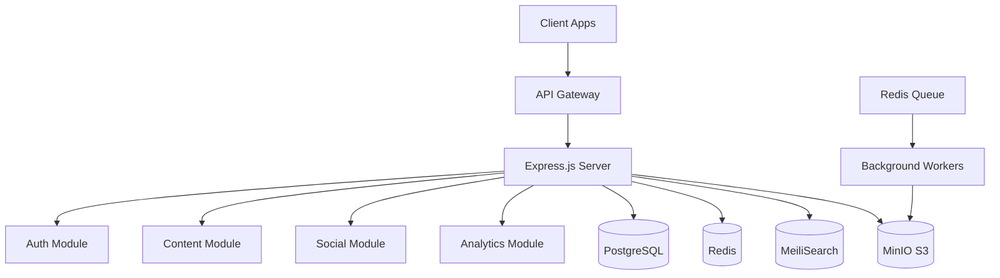
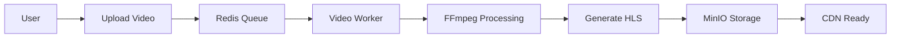
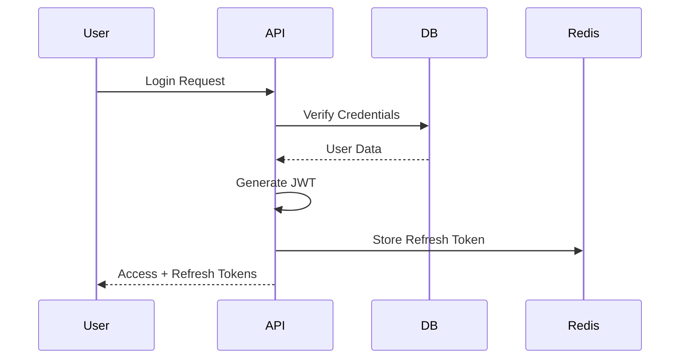

# MediaVerse MVP - Architecture Documentation

Tài liệu kiến trúc chi tiết và workflow của hệ thống MediaVerse MVP.

## 📚 Mục Lục

### 1. [Tổng Quan Hệ Thống](./00-overview.md)
- Giới thiệu tổng quan về project
- Kiến trúc tổng thể
- Tech stack
- Core modules
- Deployment architecture
- Security & Performance

### 2. [Use Cases Chi Tiết](./01-use-cases.md)
- Tất cả use cases của hệ thống
- Sequence diagrams chi tiết
- Authentication use cases
- Content management use cases
- Social interaction use cases
- Moderation use cases
- Analytics use cases

### 3. [Authentication & Authorization](./02-authentication-workflow.md)
- Local authentication flow
- OAuth 2.0 integration (Google, Facebook, GitHub)
- JWT token management
- Password reset workflow
- Authorization middleware
- Role-based access control
- Resource ownership checks

### 4. [Content Management Workflow](./03-content-workflow.md)
- Video upload & processing (chi tiết)
- FFmpeg processing pipeline
- HLS adaptive streaming
- Article publishing workflow
- Document upload workflow
- Content search & discovery (MeiliSearch)
- Content CRUD operations

### 5. [Social Interaction Workflow](./04-interaction-workflow.md)
- Like/Unlike system
- Comment & reply system
- Follow/Unfollow mechanism
- Share functionality
- Playlist management
- Engagement analytics

### 6. [Video Processing Workflow](./05-video-processing-workflow.md)
- Chunked video upload system
- Background job queue (Redis + Bull)
- FFmpeg processing pipeline
- Multi-quality transcoding (1080p, 720p, 480p, 360p)
- HLS adaptive streaming generation
- Thumbnail generation
- MinIO storage structure

### 7. [Recommendation System](./06-recommendation-system.md)
- User interest profile building
- Interaction weight system
- Smart recommendations algorithm
- Trending content algorithm
- Similar content recommendations
- Personalized feed generation
- Category-based recommendations

### 8. [Analytics System](./07-analytics-system.md)
- Real-time analytics tracking
- Content analytics & metrics
- User behavior analytics
- Daily summary aggregation
- Traffic source analysis
- Demographics analysis
- Creator dashboard analytics

### 9. [Moderation System](./08-moderation-system.md)
- Content & user reporting
- AI-powered text analysis
- Priority queue system
- SLA management
- Moderation actions (remove, warn, ban)
- Audit logging
- Moderator dashboard

### 10. [Notification System](./09-notification-system.md)
- Real-time notifications (WebSocket)
- Email notifications
- Web push notifications
- Notification preferences
- Multi-channel delivery

### 11. [Database Schema](./10-database-schema.md)
- Complete ER diagram
- All models chi tiết
- Relationships & constraints
- Indexes & optimizations
- Common query patterns
- Migration management

## 🎯 Các Diagram Chính

### Kiến Trúc Tổng Thể


### Data Flow


### Authentication Flow


## 📊 Các Workflow Chính

### 1. Video Upload Pipeline
1. Client initiates chunked upload
2. Server stores chunks in MinIO
3. Job queued in Redis
4. Worker picks up job
5. FFmpeg processes video
   - Extract metadata
   - Generate thumbnails
   - Create HLS variants (1080p, 720p, 480p, 360p)
   - Extract audio
6. Upload processed files to MinIO
7. Update database
8. Notify user via WebSocket

### 2. Social Interaction Flow
1. User performs action (like, comment, follow)
2. Create record in database
3. Update engagement metrics
4. Invalidate relevant caches
5. Send real-time notification via WebSocket
6. Queue email notification
7. Queue push notification

### 3. Content Discovery
1. User searches content
2. MeiliSearch performs search
3. Results ranked by relevance
4. Enrich with user data from PostgreSQL
5. Cache results in Redis
6. Return to user

## 🔑 Key Features

### Authentication
- ✅ Local authentication (email/password)
- ✅ OAuth 2.0 (Google, Facebook, GitHub)
- ✅ JWT tokens (access + refresh)
- ✅ Password reset via OTP
- ✅ Email verification

### Content Management
- ✅ Video upload with chunking
- ✅ Adaptive streaming (HLS)
- ✅ Article publishing
- ✅ Document sharing
- ✅ Full-text search (MeiliSearch)
- ✅ Draft/Published workflow

### Social Features
- ✅ Like/Unlike
- ✅ Comment & Reply
- ✅ Follow/Unfollow
- ✅ Share to social platforms
- ✅ Playlists
- ✅ Bookmarks

### Real-time Features
- ✅ WebSocket notifications
- ✅ Live comment updates
- ✅ Real-time analytics
- ✅ Processing status updates

### Analytics
- ✅ View tracking
- ✅ Engagement metrics
- ✅ Daily aggregations
- ✅ Creator dashboard
- ✅ Demographics data

### Moderation
- ✅ Content reporting
- ✅ User reporting
- ✅ Ban/Warn system
- ✅ Moderation logs
- ✅ Review workflow

## 🛠️ Technologies Used

### Backend
- **Node.js 18+** - Runtime
- **Express.js** - Web framework
- **Prisma** - ORM
- **Passport.js** - Authentication

### Databases & Storage
- **PostgreSQL** - Primary database
- **Redis** - Cache & queue
- **MeiliSearch** - Search engine
- **MinIO** - Object storage (S3-compatible)

### Processing
- **FFmpeg** - Video processing
- **Sharp** - Image processing
- **Bull** - Job queue

### Real-time
- **Socket.io** - WebSocket
- **Web Push** - Push notifications

### Email
- **SendGrid** - Email delivery
- **Handlebars** - Email templates

## 📁 Project Structure

```
src/
├── app.js                      # Main application entry
├── config/
│   ├── auth.js                 # Passport strategies
│   ├── database.js             # PostgreSQL config
│   ├── redis.js                # Redis clients
│   ├── minio.js                # MinIO S3 config
│   └── swagger.js              # API documentation
├── modules/
│   ├── auth/                   # Authentication module
│   ├── users/                  # User management
│   ├── content/                # Content management
│   ├── analytics/              # Analytics module
│   ├── moderation/             # Moderation system
│   ├── notifications/          # Notification system
│   ├── recommendations/        # Recommendation engine
│   └── uploads/                # Upload handling
├── services/
│   ├── media/                  # Media processing
│   ├── searchService.js        # MeiliSearch
│   └── emailService.js         # Email service
├── jobs/
│   ├── queues/                 # Job queues
│   └── workers/                # Background workers
├── middleware/
│   ├── auth.js                 # Authentication
│   ├── authorize.js            # Authorization
│   └── errorHandler.js         # Error handling
└── utils/
    ├── healthCheck.js          # Health checks
    └── logger.js               # Winston logger

prisma/
├── schema.prisma               # Database schema
├── migrations/                 # DB migrations
└── seed.js                     # Seed data

docs/
├── architecture/               # THIS FOLDER
├── workflows/                  # Workflow docs
└── api/                        # API endpoints docs
```

## 🚀 Getting Started

### Prerequisites
```bash
# Install Node.js 18+
node --version

# Install dependencies
npm install

# Setup environment
cp .env.example .env
```

### Database Setup
```bash
# Start PostgreSQL & Redis with Docker
npm run docker:start

# Run migrations
npm run db:migrate

# Seed database
npm run db:seed
```

### Run Development Server
```bash
# Start all services
npm run dev

# Or start individually
npm run docker:start    # Start Docker services
npm run dev:core        # Start Express server
```

### Access Points
- **API Server**: http://localhost:5000
- **API Docs**: http://localhost:5000/api-docs
- **Health Check**: http://localhost:5000/health
- **PostgreSQL**: localhost:5432
- **Redis**: localhost:6379
- **MeiliSearch**: localhost:7700
- **MinIO**: localhost:9000

## 📖 API Documentation

API documentation is available at `/api-docs` when running the server.

### Main API Routes
```
/api/auth                 # Authentication
/api/users                # User management
/api/content              # Content CRUD
/api/notifications        # Notifications
/api/moderation           # Moderation
/api/analytics            # Analytics
/api/playlists            # Playlists
/api/uploads              # File uploads
/api/storage              # Storage proxy
```

## 🔐 Security Features

- **JWT Authentication** with refresh tokens
- **Password hashing** with bcrypt (10 rounds)
- **Rate limiting** on sensitive endpoints
- **CORS** configuration
- **Helmet** security headers
- **Input validation** with Joi
- **SQL injection prevention** via Prisma
- **XSS protection**
- **File upload validation**

## 📈 Performance Optimizations

- **Redis caching** for frequent queries
- **Database indexing** on key columns
- **Connection pooling** for PostgreSQL
- **Lazy loading** for large datasets
- **Adaptive streaming** (HLS) for videos
- **Image optimization** with Sharp
- **Compression** middleware
- **CDN-ready** architecture

## 🧪 Testing

```bash
# Run all tests
npm test

# Run tests in watch mode
npm run test:watch

# Generate coverage report
npm run test:coverage
```

## 📊 Monitoring

- Health check endpoints (`/health`, `/health/detailed`)
- System metrics (`/metrics`)
- Winston logger for application logs
- Error tracking
- Performance monitoring

## 🤝 Contributing

1. Đọc tài liệu kiến trúc
2. Tìm hiểu workflows
3. Follow coding standards
4. Write tests
5. Submit PR

## 📝 License

MIT License

---

## 📞 Contact & Support

- **Documentation**: `/docs`
- **API Docs**: `/api-docs`
- **Issues**: GitHub Issues
- **Discussions**: GitHub Discussions

---

**Last Updated**: October 2025

**Version**: 1.0.0

**Authors**: MediaVerse Team
