# Analytics & Recommendation System Workflow Documentation

This document describes the comprehensive workflows for analytics data collection, processing, and the recommendation engine that powers content discovery in the MediaCMS platform.

## Table of Contents
1. [Analytics System Overview](#analytics-system-overview)
2. [Data Collection Workflow](#data-collection-workflow)
3. [Real-time Processing Pipeline](#real-time-processing-pipeline)
4. [Batch Processing Workflow](#batch-processing-workflow)
5. [Recommendation Engine Workflow](#recommendation-engine-workflow)
6. [Personalization System](#personalization-system)
7. [Trending Content Detection](#trending-content-detection)
8. [Performance Monitoring](#performance-monitoring)

---

## Analytics System Overview

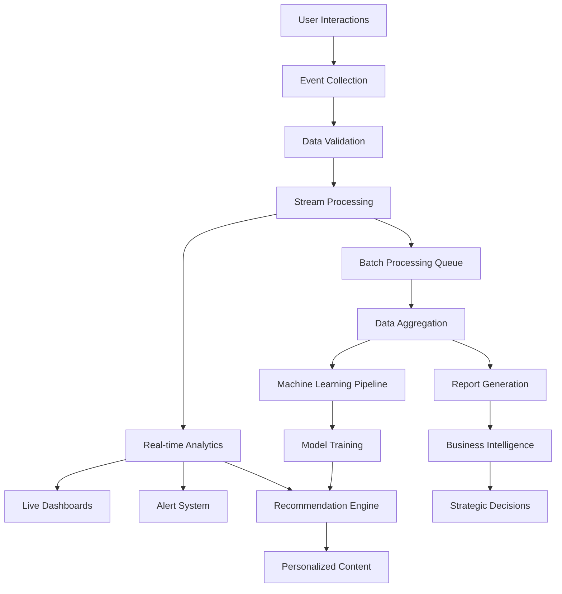

---

## Data Collection Workflow

### 1. Event Capture System

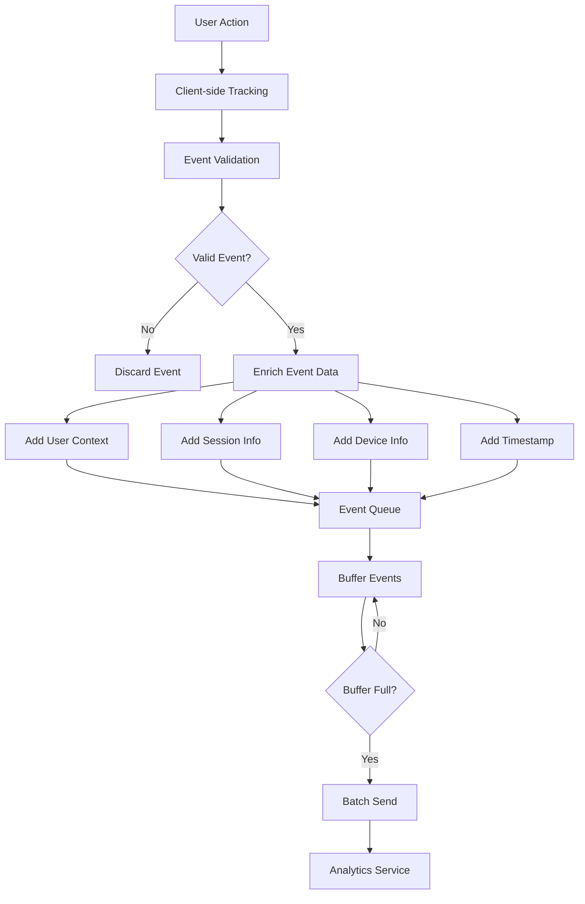

#### Event Collection Implementation:
```javascript
const collectAnalyticsEvent = async (eventData, userContext) => {
  const collectionSteps = [
    'validation',
    'enrichment',
    'privacy_check',
    'buffering',
    'transmission'
  ];
  
  let currentStep = 0;
  
  try {
    // Step 1: Event validation
    await updateCollectionStatus(eventId, collectionSteps[currentStep++]);
    const validatedEvent = await validateEventData(eventData, {
      requiredFields: ['eventType', 'resourceId', 'timestamp'],
      allowedEventTypes: [
        'view', 'like', 'comment', 'share', 'download',
        'search', 'click', 'scroll', 'play', 'pause'
      ],
      maxFieldLengths: {
        eventType: 50,
        resourceId: 36,
        customData: 1000
      }
    });
    
    // Step 2: Event enrichment
    await updateCollectionStatus(eventId, collectionSteps[currentStep++]);
    const enrichedEvent = {
      ...validatedEvent,
      eventId: generateEventId(),
      userId: userContext.userId,
      sessionId: userContext.sessionId,
      deviceInfo: {
        type: userContext.deviceType,
        os: userContext.operatingSystem,
        browser: userContext.browserInfo,
        screenResolution: userContext.screenResolution
      },
      locationInfo: {
        country: userContext.country,
        city: userContext.city,
        timezone: userContext.timezone
      },
      contextData: {
        referrer: userContext.referrer,
        userAgent: userContext.userAgent,
        language: userContext.language
      },
      timestamp: new Date(validatedEvent.timestamp),
      serverTimestamp: new Date()
    };
    
    // Step 3: Privacy compliance check
    await updateCollectionStatus(eventId, collectionSteps[currentStep++]);
    const privacyResult = await checkPrivacyCompliance(enrichedEvent, {
      userConsent: userContext.hasAnalyticsConsent,
      dataRetentionPeriod: 365, // days
      anonymizationRules: await getAnonymizationRules()
    });
    
    if (!privacyResult.allowed) {
      return { collected: false, reason: privacyResult.reason };
    }
    
    // Step 4: Buffer event
    await updateCollectionStatus(eventId, collectionSteps[currentStep++]);
    await addToEventBuffer(enrichedEvent, {
      bufferSize: 100,
      flushInterval: 5000, // 5 seconds
      priority: getEventPriority(enrichedEvent.eventType)
    });
    
    // Step 5: Real-time processing trigger
    await updateCollectionStatus(eventId, collectionSteps[currentStep++]);
    if (isHighPriorityEvent(enrichedEvent)) {
      await triggerRealTimeProcessing(enrichedEvent);
    }
    
    return { collected: true, eventId: enrichedEvent.eventId };
    
  } catch (error) {
    await handleCollectionError(eventId, currentStep, error);
    throw error;
  }
};
```

### 2. Data Quality Assurance

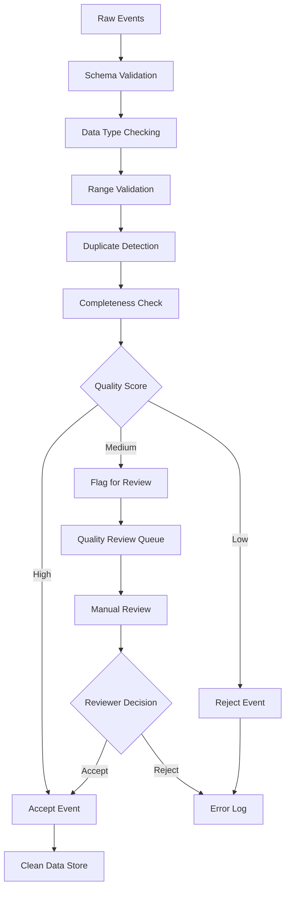

---

## Real-time Processing Pipeline

### 1. Stream Processing Architecture

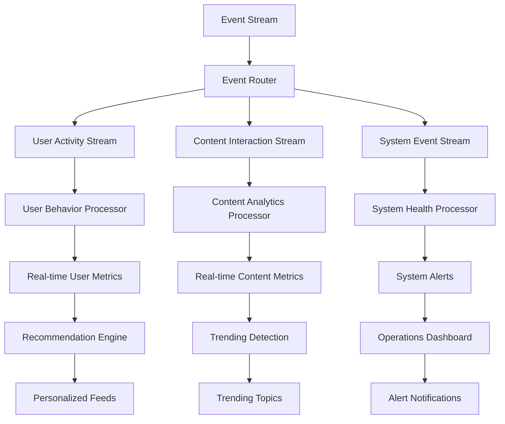

#### Real-time Processing Implementation:
```javascript
const processRealTimeEvent = async (event) => {
  const processingPipeline = [
    'event_routing',
    'stream_processing',
    'metric_updates',
    'pattern_detection',
    'real_time_response'
  ];
  
  let currentStage = 0;
  
  try {
    // Stage 1: Event routing
    await updateProcessingStatus(event.eventId, processingPipeline[currentStage++]);
    const routingDecision = await routeEvent(event, {
      userActivityStream: ['view', 'like', 'comment', 'share'],
      contentStream: ['play', 'pause', 'download', 'search'],
      systemStream: ['error', 'performance', 'security']
    });
    
    // Stage 2: Stream-specific processing
    await updateProcessingStatus(event.eventId, processingPipeline[currentStage++]);
    const processingResults = await Promise.all(
      routingDecision.streams.map(stream => 
        processEventForStream(event, stream)
      )
    );
    
    // Stage 3: Update real-time metrics
    await updateProcessingStatus(event.eventId, processingPipeline[currentStage++]);
    const metricUpdates = await updateRealTimeMetrics(event, {
      incrementCounters: true,
      updateAverages: true,
      refreshLeaderboards: true
    });
    
    // Stage 4: Pattern detection
    await updateProcessingStatus(event.eventId, processingPipeline[currentStage++]);
    const patterns = await detectPatterns(event, {
      anomalyDetection: true,
      trendingDetection: true,
      behaviorAnalysis: true
    });
    
    // Stage 5: Generate real-time responses
    await updateProcessingStatus(event.eventId, processingPipeline[currentStage++]);
    const realTimeActions = [];
    
    // Update recommendation engine
    if (event.eventType === 'view' || event.eventType === 'like') {
      realTimeActions.push(
        updateUserPreferences(event.userId, event.resourceId, event.eventType)
      );
    }
    
    // Trigger notifications
    if (patterns.anomalies.length > 0) {
      realTimeActions.push(
        sendAnomalyAlert(patterns.anomalies)
      );
    }
    
    // Update trending content
    if (patterns.trending.length > 0) {
      realTimeActions.push(
        updateTrendingContent(patterns.trending)
      );
    }
    
    await Promise.all(realTimeActions);
    
    return {
      processed: true,
      eventId: event.eventId,
      metrics: metricUpdates,
      patterns: patterns,
      actions: realTimeActions.length
    };
    
  } catch (error) {
    await handleRealTimeProcessingError(event.eventId, currentStage, error);
    throw error;
  }
};
```

### 2. Real-time Metrics Dashboard

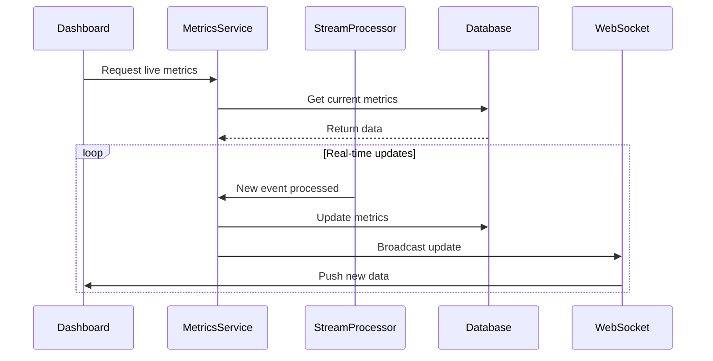

---

## Batch Processing Workflow

### 1. ETL Pipeline

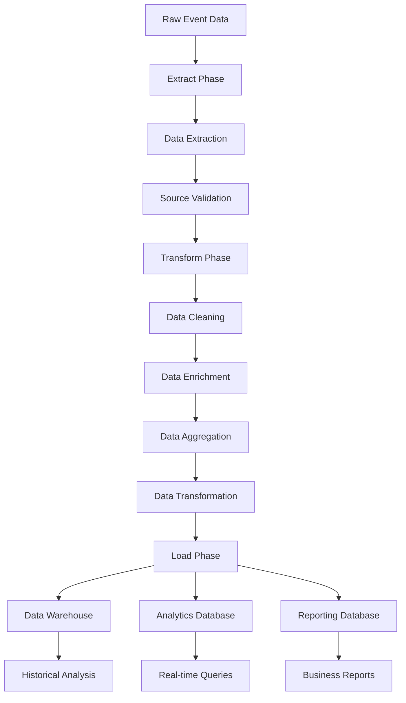

#### Batch Processing Implementation:
```javascript
const executeBatchProcessing = async (batchId, timeRange) => {
  const batchSteps = [
    'data_extraction',
    'data_cleaning',
    'data_transformation',
    'aggregation',
    'model_training',
    'data_loading'
  ];
  
  let currentStep = 0;
  const batchMetrics = {
    startTime: new Date(),
    recordsProcessed: 0,
    errorsEncountered: 0
  };
  
  try {
    // Step 1: Data extraction
    await updateBatchStatus(batchId, batchSteps[currentStep++]);
    const rawData = await extractRawEvents(timeRange, {
      sources: ['user_events', 'content_events', 'system_events'],
      filters: {
        excludeTestUsers: true,
        excludeBotTraffic: true,
        includeOnlyValidated: true
      }
    });
    
    batchMetrics.recordsProcessed = rawData.length;
    
    // Step 2: Data cleaning
    await updateBatchStatus(batchId, batchSteps[currentStep++]);
    const cleanedData = await cleanEventData(rawData, {
      removeOutliers: true,
      handleMissingValues: true,
      standardizeFormats: true,
      deduplication: true
    });
    
    // Step 3: Data transformation
    await updateBatchStatus(batchId, batchSteps[currentStep++]);
    const transformedData = await transformEventData(cleanedData, {
      calculateDerivedMetrics: true,
      normalizeValues: true,
      createFeatures: true,
      sessionization: true
    });
    
    // Step 4: Data aggregation
    await updateBatchStatus(batchId, batchSteps[currentStep++]);
    const aggregatedData = await aggregateData(transformedData, {
      aggregationLevels: ['hourly', 'daily', 'weekly', 'monthly'],
      metrics: [
        'total_views', 'unique_users', 'engagement_rate',
        'bounce_rate', 'conversion_rate', 'retention_rate'
      ],
      dimensions: [
        'content_type', 'user_segment', 'device_type',
        'traffic_source', 'geographic_region'
      ]
    });
    
    // Step 5: Machine learning model training
    await updateBatchStatus(batchId, batchSteps[currentStep++]);
    const modelResults = await trainModels(transformedData, {
      models: [
        'content_recommendation',
        'user_segmentation',
        'churn_prediction',
        'content_performance'
      ],
      validationSplit: 0.2,
      hyperparameterTuning: true
    });
    
    // Step 6: Data loading
    await updateBatchStatus(batchId, batchSteps[currentStep++]);
    await loadProcessedData({
      aggregatedData,
      modelResults,
      destinations: [
        { type: 'dataWarehouse', table: 'analytics_daily' },
        { type: 'analyticsDB', collection: 'user_metrics' },
        { type: 'reportingDB', table: 'content_performance' }
      ]
    });
    
    batchMetrics.endTime = new Date();
    batchMetrics.duration = batchMetrics.endTime - batchMetrics.startTime;
    
    return {
      batchId,
      status: 'completed',
      metrics: batchMetrics,
      results: {
        recordsProcessed: batchMetrics.recordsProcessed,
        aggregations: aggregatedData.length,
        modelsUpdated: modelResults.length
      }
    };
    
  } catch (error) {
    batchMetrics.errorsEncountered++;
    await handleBatchProcessingError(batchId, currentStep, error);
    throw error;
  }
};
```

---

## Recommendation Engine Workflow

### 1. Hybrid Recommendation System

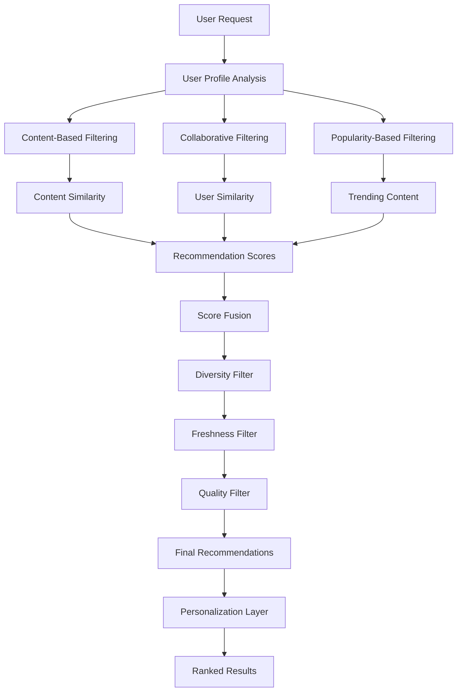

#### Recommendation Engine Implementation:
```javascript
const generateRecommendations = async (userId, requestContext) => {
  const recommendationSteps = [
    'user_profile_analysis',
    'candidate_generation',
    'scoring_algorithms',
    'ranking_fusion',
    'filtering_post_processing',
    'personalization'
  ];
  
  let currentStep = 0;
  
  try {
    // Step 1: User profile analysis
    await updateRecommendationStatus(requestId, recommendationSteps[currentStep++]);
    const userProfile = await analyzeUserProfile(userId, {
      interactionHistory: await getUserInteractions(userId, { days: 90 }),
      preferences: await getUserPreferences(userId),
      demographics: await getUserDemographics(userId),
      contextualInfo: requestContext
    });
    
    // Step 2: Candidate generation
    await updateRecommendationStatus(requestId, recommendationSteps[currentStep++]);
    const candidates = await generateCandidates(userProfile, {
      contentBased: {
        model: 'content_similarity_v2',
        maxCandidates: 500,
        similarityThreshold: 0.3
      },
      collaborative: {
        model: 'user_item_cf_v3',
        maxCandidates: 300,
        neighborhoodSize: 50
      },
      popularity: {
        timeWindow: '7d',
        maxCandidates: 100,
        trendingWeight: 0.7
      }
    });
    
    // Step 3: Scoring algorithms
    await updateRecommendationStatus(requestId, recommendationSteps[currentStep++]);
    const scoredCandidates = await scoreCandidates(candidates, userProfile, {
      algorithms: [
        {
          name: 'content_similarity',
          weight: 0.4,
          features: ['category', 'tags', 'description', 'creator']
        },
        {
          name: 'user_behavior',
          weight: 0.3,
          features: ['view_history', 'like_patterns', 'share_behavior']
        },
        {
          name: 'social_signals',
          weight: 0.2,
          features: ['likes', 'comments', 'shares', 'ratings']
        },
        {
          name: 'freshness',
          weight: 0.1,
          features: ['publish_date', 'last_update', 'trending_score']
        }
      ]
    });
    
    // Step 4: Ranking and fusion
    await updateRecommendationStatus(requestId, recommendationSteps[currentStep++]);
    const rankedCandidates = await fuseRankings(scoredCandidates, {
      fusionMethod: 'weighted_borda',
      diversityWeight: 0.15,
      noveltyWeight: 0.1,
      maxResults: 50
    });
    
    // Step 5: Post-processing filters
    await updateRecommendationStatus(requestId, recommendationSteps[currentStep++]);
    const filteredResults = await applyFilters(rankedCandidates, {
      qualityFilter: {
        minRating: 3.0,
        minEngagement: 0.1
      },
      diversityFilter: {
        maxSameCategory: 3,
        maxSameCreator: 2
      },
      freshnessFilter: {
        maxAge: '30d',
        freshnessBoost: true
      },
      businessRules: {
        excludePreviouslyViewed: true,
        respectUserBlocks: true,
        applyContentPolicies: true
      }
    });
    
    // Step 6: Personalization layer
    await updateRecommendationStatus(requestId, recommendationSteps[currentStep++]);
    const personalizedResults = await personalizeResults(filteredResults, userProfile, {
      contextualAdjustments: {
        timeOfDay: requestContext.timeOfDay,
        device: requestContext.device,
        location: requestContext.location
      },
      userPreferences: {
        contentTypes: userProfile.preferredContentTypes,
        languages: userProfile.preferredLanguages,
        lengths: userProfile.preferredContentLengths
      }
    });
    
    return {
      recommendations: personalizedResults,
      metadata: {
        requestId,
        userId,
        generatedAt: new Date(),
        candidateCount: candidates.length,
        algorithmsUsed: scoredCandidates.algorithms,
        personalizedFor: userProfile.segment
      }
    };
    
  } catch (error) {
    await handleRecommendationError(requestId, currentStep, error);
    throw error;
  }
};
```

### 2. Real-time Recommendation Updates

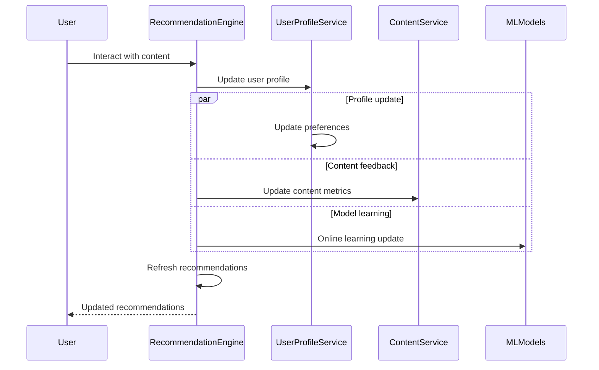

---

## Personalization System

### 1. User Segmentation

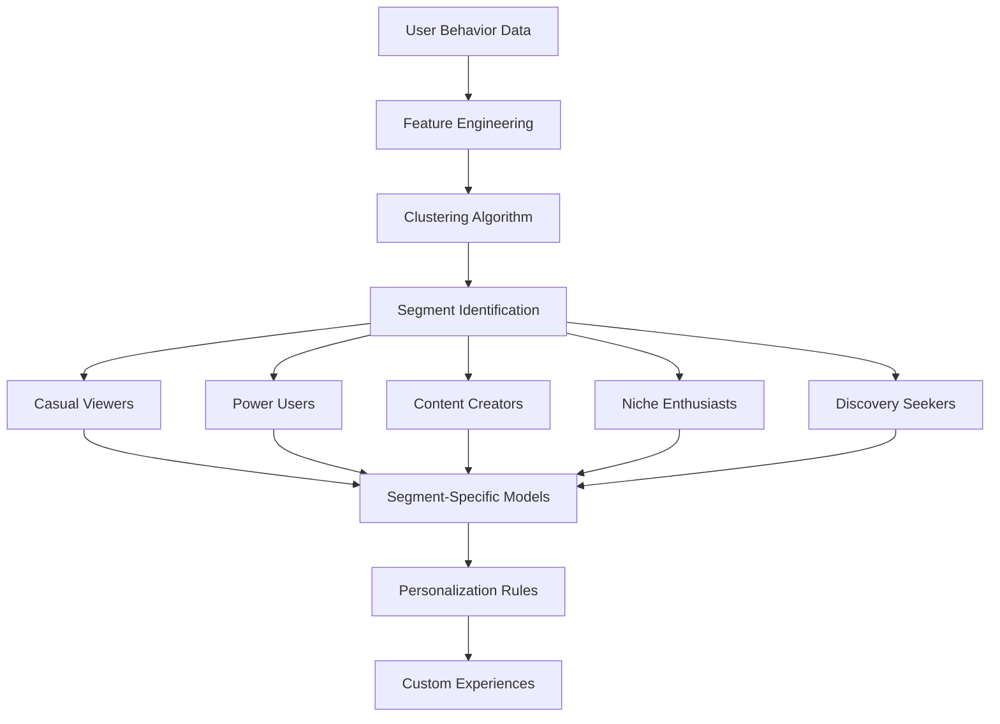

### 2. Dynamic Content Adaptation

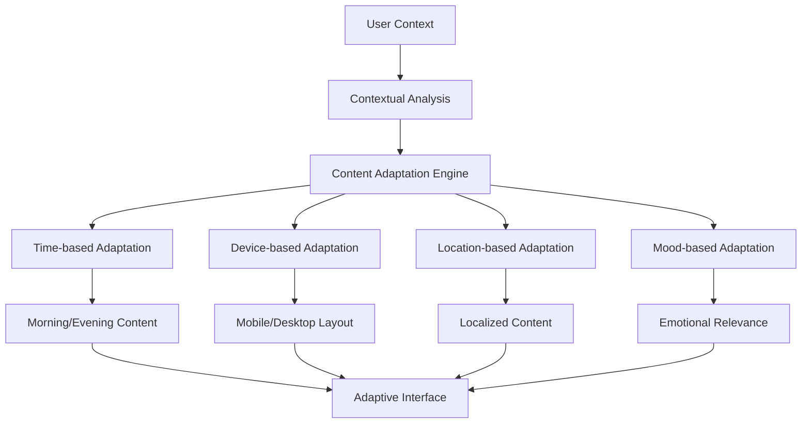

#### Personalization Implementation:
```javascript
const personalizeUserExperience = async (userId, sessionContext) => {
  // Get user segment and preferences
  const userProfile = await getUserProfile(userId);
  const userSegment = await getUserSegment(userId);
  
  // Contextual analysis
  const context = {
    timeOfDay: new Date().getHours(),
    device: sessionContext.deviceType,
    location: sessionContext.location,
    sessionLength: sessionContext.sessionDuration,
    previousActivity: await getRecentActivity(userId)
  };
  
  // Personalization rules by segment
  const personalizationRules = {
    'casual_viewer': {
      contentTypes: ['short_videos', 'trending_articles'],
      layoutPreference: 'grid',
      autoplay: false,
      notificationFrequency: 'low'
    },
    'power_user': {
      contentTypes: ['in_depth_articles', 'live_streams'],
      layoutPreference: 'list',
      autoplay: true,
      notificationFrequency: 'high',
      showAdvancedFeatures: true
    },
    'content_creator': {
      contentTypes: ['tutorials', 'industry_news'],
      layoutPreference: 'custom',
      showCreatorTools: true,
      prioritizeCreatorContent: true
    }
  };
  
  // Apply contextual adaptations
  const adaptations = await applyContextualAdaptations(
    personalizationRules[userSegment],
    context
  );
  
  return {
    userId,
    segment: userSegment,
    personalizedSettings: adaptations,
    recommendationWeights: await getRecommendationWeights(userSegment),
    interfaceCustomizations: await getInterfaceCustomizations(userId, context)
  };
};
```

---

## Trending Content Detection

### 1. Trending Algorithm

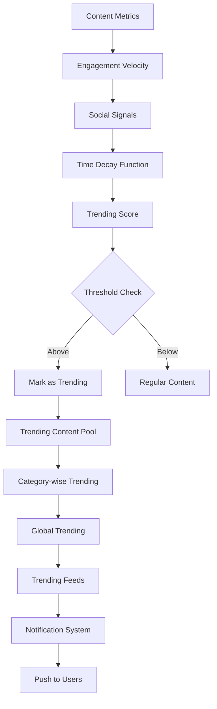

#### Trending Detection Implementation:
```javascript
const detectTrendingContent = async () => {
  const trendingWindow = 24 * 60 * 60 * 1000; // 24 hours
  const now = new Date();
  const windowStart = new Date(now.getTime() - trendingWindow);
  
  // Get content metrics from the time window
  const contentMetrics = await getContentMetrics(windowStart, now);
  
  // Calculate trending scores
  const trendingScores = contentMetrics.map(content => {
    const ageHours = (now - content.publishedAt) / (1000 * 60 * 60);
    const velocityScore = calculateVelocityScore(content);
    const socialScore = calculateSocialScore(content);
    const qualityScore = calculateQualityScore(content);
    
    // Time decay function
    const timeDecay = Math.exp(-ageHours / 12); // Decay over 12 hours
    
    const trendingScore = (
      velocityScore * 0.4 +
      socialScore * 0.3 +
      qualityScore * 0.3
    ) * timeDecay;
    
    return {
      contentId: content.id,
      score: trendingScore,
      metrics: {
        velocity: velocityScore,
        social: socialScore,
        quality: qualityScore,
        timeDecay
      }
    };
  });
  
  // Filter and rank trending content
  const trendingThreshold = 0.7;
  const trendingContent = trendingScores
    .filter(item => item.score >= trendingThreshold)
    .sort((a, b) => b.score - a.score)
    .slice(0, 50); // Top 50 trending items
  
  return trendingContent;
};
```

---

## Performance Monitoring

### 1. System Performance Metrics

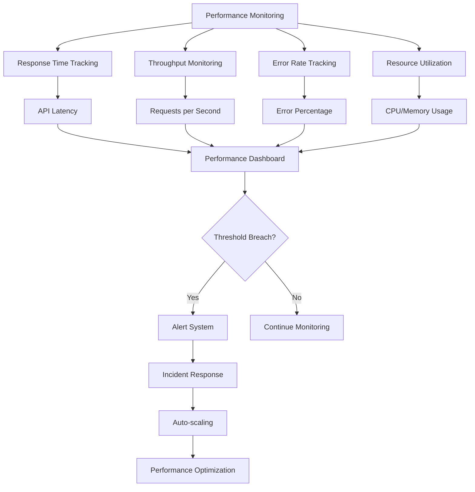

### 2. Analytics Performance Optimization

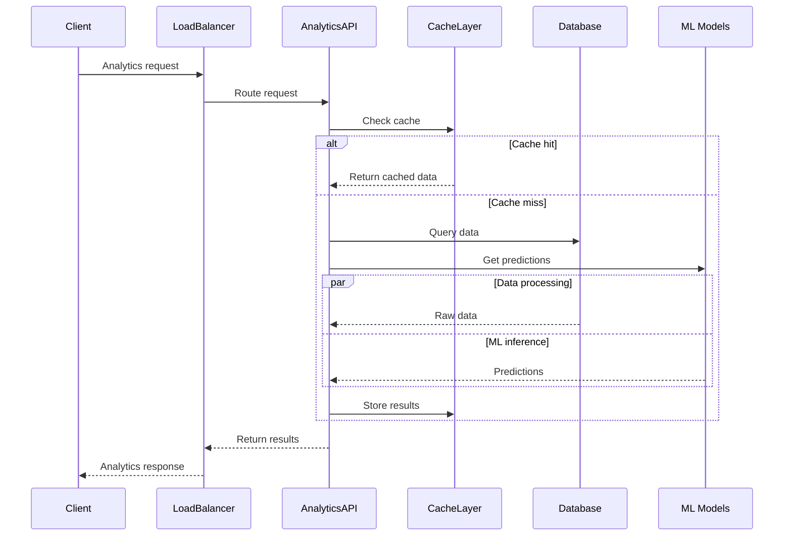

This comprehensive analytics and recommendation system workflow documentation provides detailed insights into how data flows through the MediaCMS platform to generate intelligent, personalized experiences for users while maintaining high performance and accuracy.