# Content Management Workflow Documentation

This document describes the comprehensive workflows for the MediaCMS Content Management System, covering articles, videos, documents, and their lifecycle management.

## Table of Contents
1. [Content Lifecycle Overview](#content-lifecycle-overview)
2. [Article Workflow](#article-workflow)
3. [Video Processing Workflow](#video-processing-workflow)
4. [Document Processing Workflow](#document-processing-workflow)
5. [Content Publishing Workflow](#content-publishing-workflow)
6. [Content Moderation Workflow](#content-moderation-workflow)
7. [Search & Indexing Workflow](#search--indexing-workflow)
8. [Analytics & Metrics Workflow](#analytics--metrics-workflow)

---

## Content Lifecycle Overview

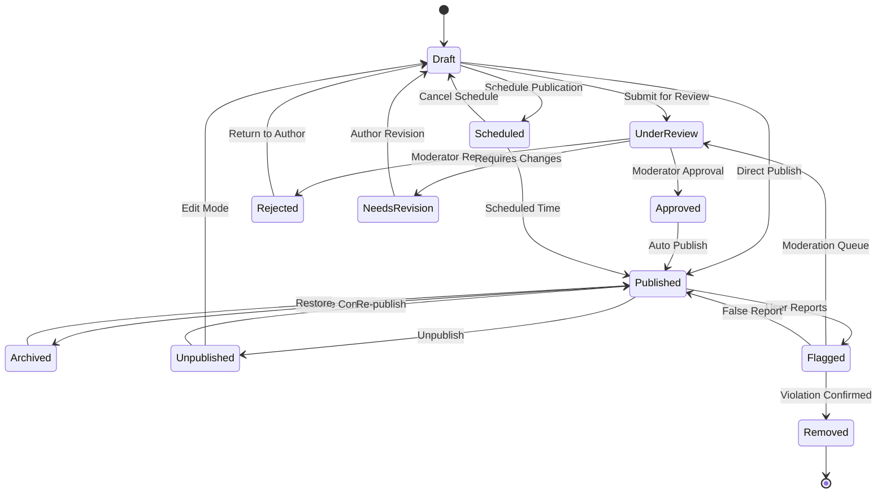

---

## Article Workflow

### 1. Article Creation Process

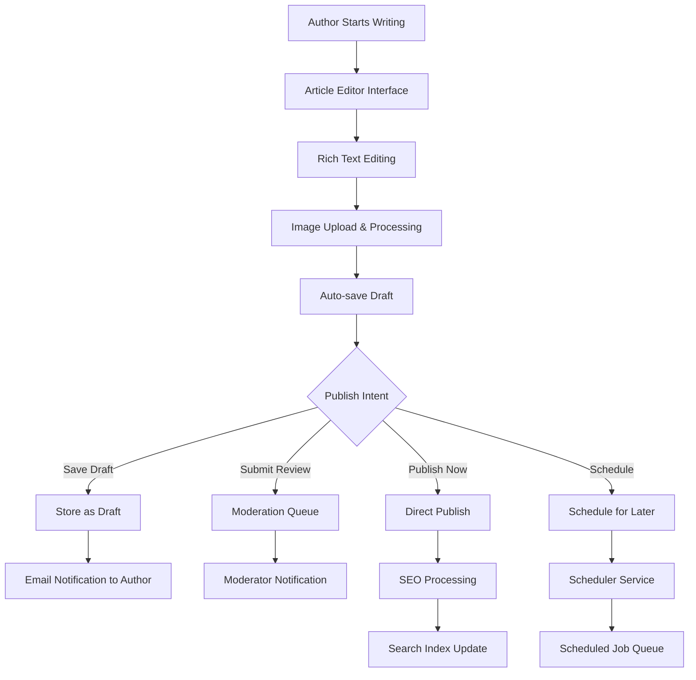

#### Article Creation Implementation:
```javascript
const createArticleWorkflow = async (articleData, user) => {
  // Step 1: Validate input
  const validatedData = await validateArticleData(articleData);
  
  // Step 2: Process cover image if provided
  let coverImageUrl = null;
  if (validatedData.coverImage) {
    coverImageUrl = await processImage(validatedData.coverImage, {
      sizes: [400, 800, 1200],
      formats: ['webp', 'jpg'],
      quality: 85
    });
  }
  
  // Step 3: Generate slug
  const slug = generateUniqueSlug(validatedData.title);
  
  // Step 4: Calculate read time
  const readTime = calculateReadTime(validatedData.content);
  
  // Step 5: Create article record
  const article = await prisma.article.create({
    data: {
      ...validatedData,
      slug,
      readTime,
      coverImageUrl,
      authorId: user.id,
      status: 'draft'
    }
  });
  
  // Step 6: Process content for SEO
  await processSEOMetadata(article);
  
  // Step 7: Auto-save mechanism
  scheduleAutoSave(article.id);
  
  return article;
};
```

### 2. Article Publishing Workflow

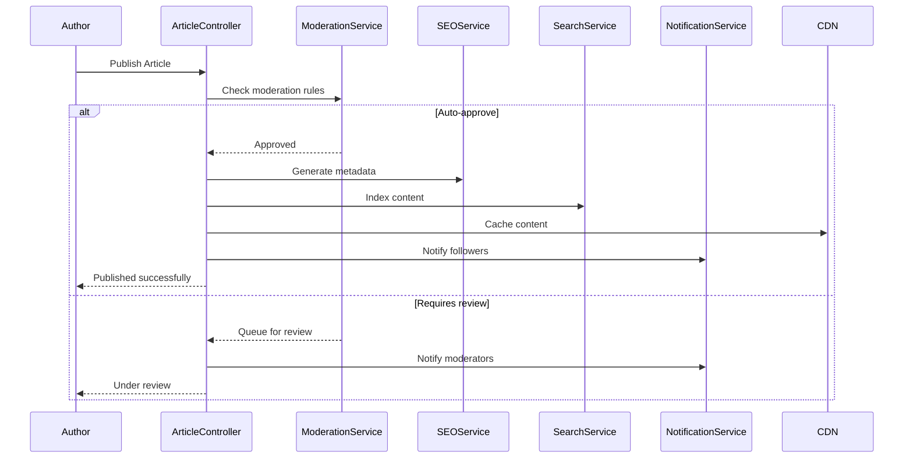

### 3. Article Revision System

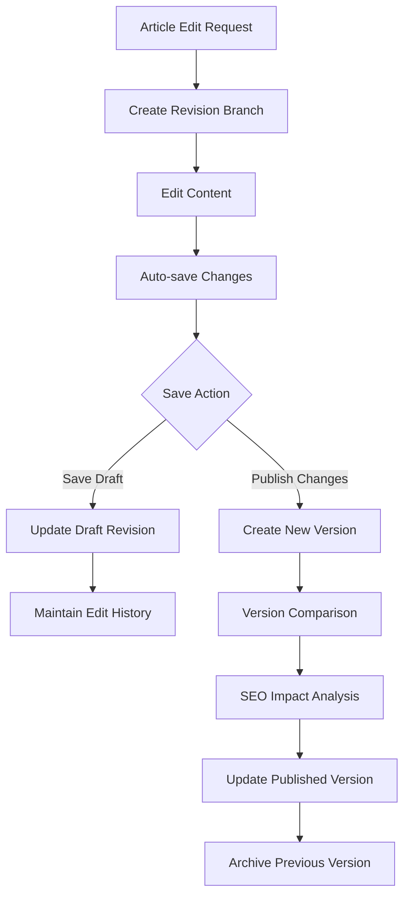

---

## Video Processing Workflow

### 1. Video Upload & Processing Pipeline

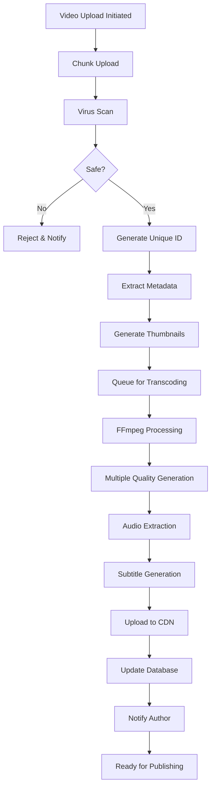

#### Video Processing Implementation:
```javascript
const processVideoWorkflow = async (videoFile, metadata, userId) => {
  const processingId = generateUniqueId();
  
  try {
    // Step 1: Initial upload processing
    const uploadResult = await processVideoUpload(videoFile, {
      userId,
      processingId,
      chunkSize: 5 * 1024 * 1024 // 5MB chunks
    });
    
    // Step 2: Security scan
    await performSecurityScan(uploadResult.filePath);
    
    // Step 3: Extract video metadata
    const videoMetadata = await extractVideoMetadata(uploadResult.filePath);
    
    // Step 4: Generate thumbnails
    const thumbnails = await generateThumbnails(uploadResult.filePath, {
      times: [0.1, 0.3, 0.5, 0.7, 0.9], // Generate at different points
      sizes: [
        { width: 320, height: 180, name: 'small' },
        { width: 640, height: 360, name: 'medium' },
        { width: 1280, height: 720, name: 'large' }
      ]
    });
    
    // Step 5: Queue transcoding jobs
    const transcodingJobs = await queueTranscodingJobs(uploadResult.filePath, {
      qualities: ['360p', '480p', '720p', '1080p'],
      formats: ['mp4', 'webm'],
      audioFormats: ['aac', 'opus']
    });
    
    // Step 6: Create database record
    const video = await prisma.video.create({
      data: {
        ...metadata,
        authorId: userId,
        processingId,
        status: 'processing',
        metadata: videoMetadata,
        thumbnails,
        processingJobs: transcodingJobs
      }
    });
    
    return { video, processingId };
    
  } catch (error) {
    await handleProcessingError(processingId, error);
    throw error;
  }
};
```

### 2. Video Transcoding Workflow

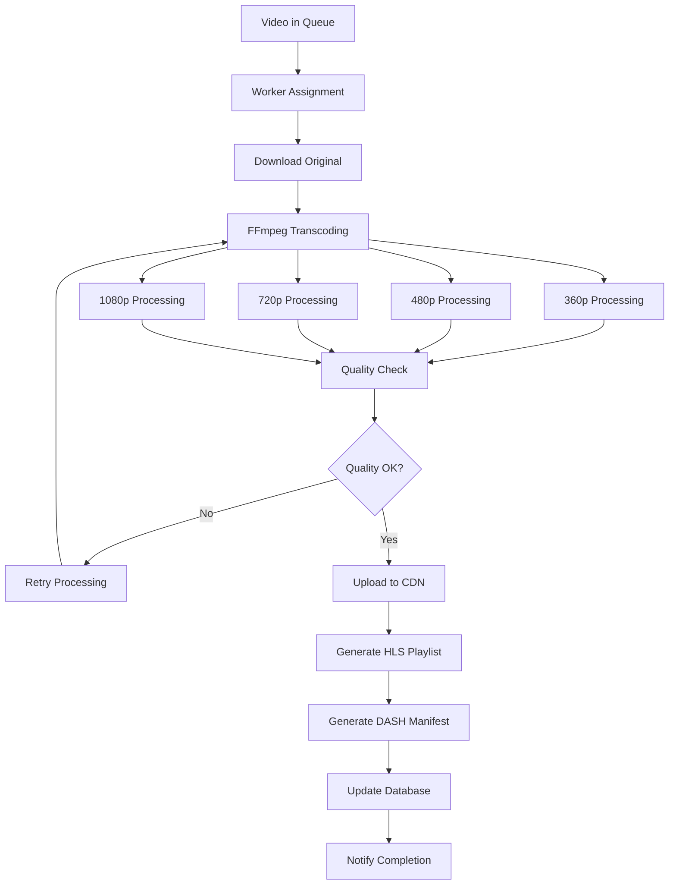

### 3. Video Streaming Workflow

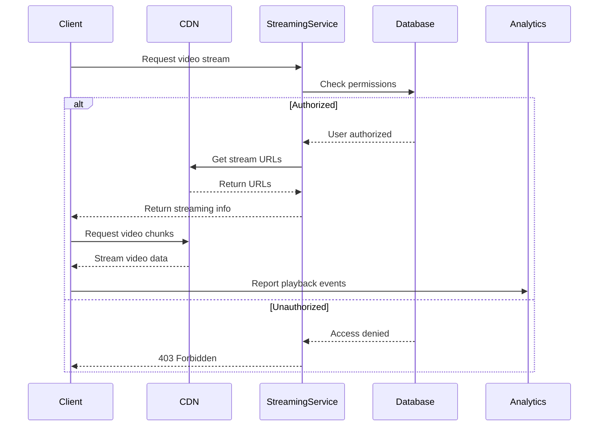

---

## Document Processing Workflow

### 1. Document Upload & Processing

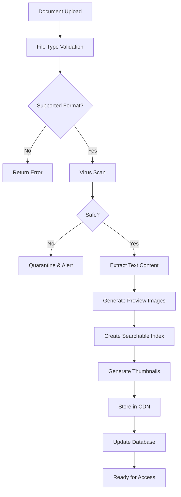

#### Document Processing Implementation:
```javascript
const processDocumentWorkflow = async (documentFile, metadata, userId) => {
  const processingStages = [
    'upload',
    'virus_scan',
    'text_extraction',
    'preview_generation',
    'indexing',
    'storage'
  ];
  
  let currentStage = 0;
  
  try {
    // Stage 1: Upload validation
    await updateProcessingStatus(documentId, processingStages[currentStage++]);
    const uploadResult = await validateAndStoreDocument(documentFile);
    
    // Stage 2: Security scan
    await updateProcessingStatus(documentId, processingStages[currentStage++]);
    await performDocumentSecurityScan(uploadResult.filePath);
    
    // Stage 3: Text extraction
    await updateProcessingStatus(documentId, processingStages[currentStage++]);
    const extractedText = await extractTextFromDocument(uploadResult.filePath, {
      format: metadata.mimeType,
      options: {
        ocr: true, // Enable OCR for scanned documents
        languages: ['eng', 'vie'], // Support multiple languages
        preserveFormatting: true
      }
    });
    
    // Stage 4: Preview generation
    await updateProcessingStatus(documentId, processingStages[currentStage++]);
    const previewImages = await generateDocumentPreviews(uploadResult.filePath, {
      pages: 'all',
      format: 'jpeg',
      quality: 85,
      sizes: [
        { width: 200, height: 280, name: 'thumbnail' },
        { width: 600, height: 800, name: 'preview' },
        { width: 1200, height: 1600, name: 'full' }
      ]
    });
    
    // Stage 5: Search indexing
    await updateProcessingStatus(documentId, processingStages[currentStage++]);
    await indexDocumentContent({
      documentId,
      title: metadata.title,
      content: extractedText,
      metadata: {
        author: metadata.author,
        keywords: metadata.keywords,
        category: metadata.category
      }
    });
    
    // Stage 6: Final storage
    await updateProcessingStatus(documentId, processingStages[currentStage++]);
    const document = await prisma.document.create({
      data: {
        ...metadata,
        authorId: userId,
        extractedText,
        previewImages,
        status: 'ready',
        processingCompleted: true
      }
    });
    
    return document;
    
  } catch (error) {
    await handleDocumentProcessingError(documentId, currentStage, error);
    throw error;
  }
};
```

### 2. Document Viewing Workflow

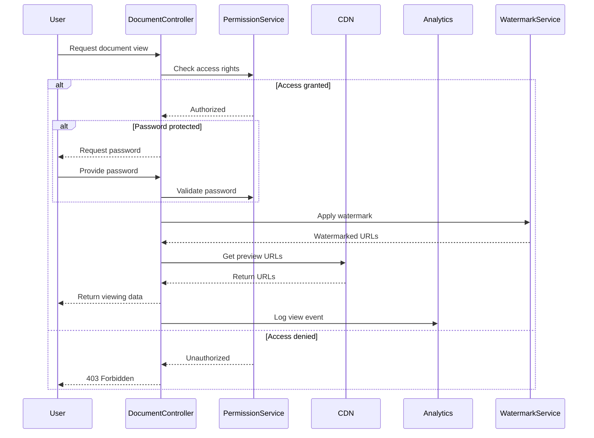

---

## Content Publishing Workflow

### 1. Multi-Stage Publishing Process

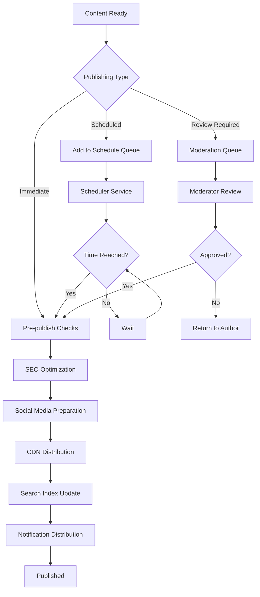

### 2. Content Distribution Workflow

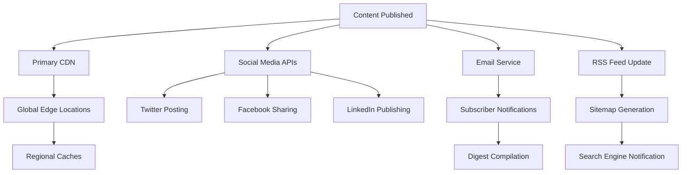

#### Publishing Implementation:
```javascript
const publishContentWorkflow = async (contentId, publishOptions, userId) => {
  const publishingTasks = [];
  
  try {
    // Step 1: Pre-publish validation
    const content = await validateContentForPublishing(contentId, userId);
    
    // Step 2: SEO optimization
    publishingTasks.push(
      optimizeContentForSEO(content, {
        generateMetaTags: true,
        createOpenGraphData: true,
        generateStructuredData: true
      })
    );
    
    // Step 3: CDN distribution
    publishingTasks.push(
      distributeToContentDeliveryNetwork(content, {
        regions: ['us-east', 'eu-west', 'asia-pacific'],
        cacheSettings: {
          maxAge: 3600,
          staleWhileRevalidate: 86400
        }
      })
    );
    
    // Step 4: Search indexing
    publishingTasks.push(
      updateSearchIndex(content, {
        fullTextIndex: true,
        facetedSearch: true,
        autoComplete: true
      })
    );
    
    // Step 5: Social media preparation
    if (publishOptions.shareToSocialMedia) {
      publishingTasks.push(
        prepareSocialMediaPosts(content, publishOptions.socialPlatforms)
      );
    }
    
    // Step 6: Execute all tasks in parallel
    const results = await Promise.allSettled(publishingTasks);
    
    // Step 7: Update content status
    await prisma.content.update({
      where: { id: contentId },
      data: {
        status: 'published',
        publishedAt: new Date(),
        publishingResults: results
      }
    });
    
    // Step 8: Send notifications
    await sendPublishingNotifications(content, publishOptions);
    
    return { success: true, content, results };
    
  } catch (error) {
    await handlePublishingError(contentId, error);
    throw error;
  }
};
```

---

## Content Moderation Workflow

### 1. Automated Moderation Pipeline

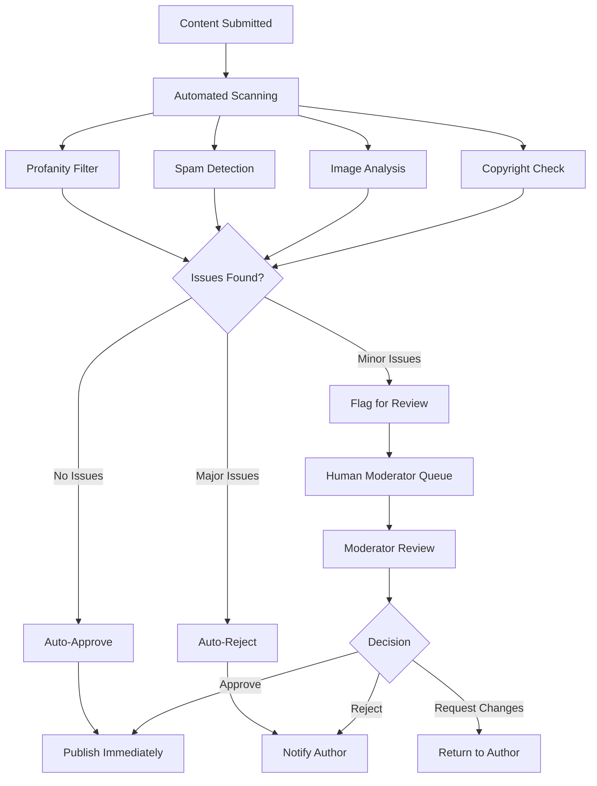

### 2. Human Moderation Interface

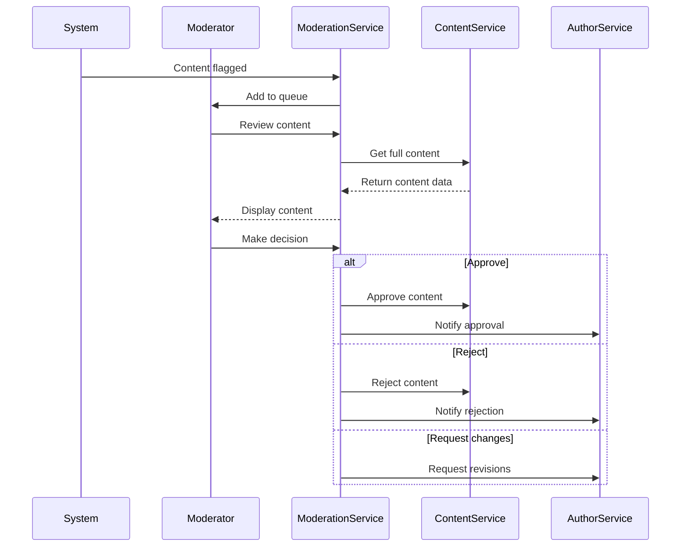

---

## Search & Indexing Workflow

### 1. Content Indexing Process

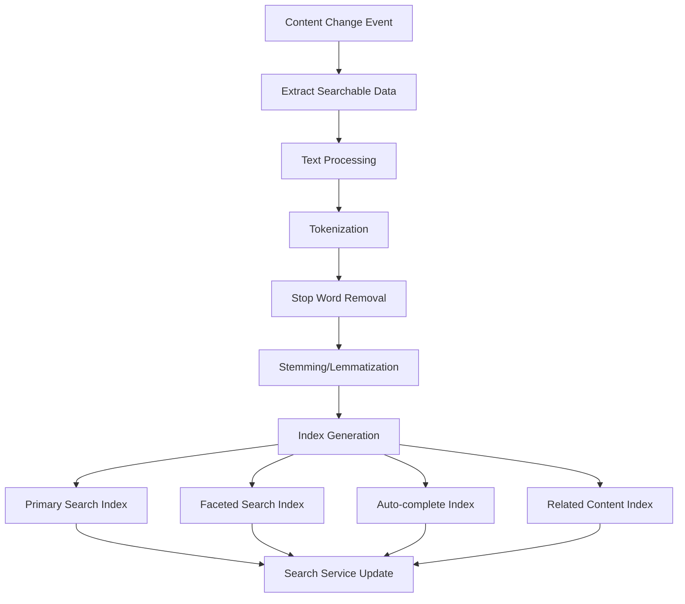

### 2. Search Query Processing

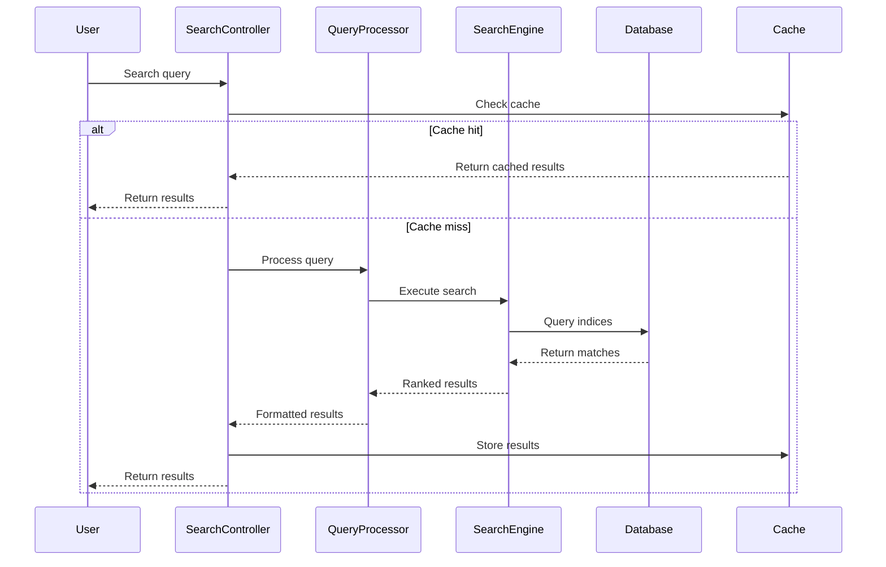

#### Search Implementation:
```javascript
const processSearchQuery = async (query, filters, pagination) => {
  // Step 1: Query preprocessing
  const processedQuery = await preprocessQuery(query, {
    expandAcronyms: true,
    correctSpelling: true,
    addSynonyms: true
  });
  
  // Step 2: Build search criteria
  const searchCriteria = {
    query: processedQuery,
    filters: {
      contentType: filters.contentType,
      category: filters.category,
      author: filters.author,
      dateRange: filters.dateRange
    },
    sort: {
      field: filters.sortBy || 'relevance',
      order: filters.sortOrder || 'desc'
    },
    pagination: {
      page: pagination.page || 1,
      limit: Math.min(pagination.limit || 20, 50)
    },
    facets: [
      'contentType',
      'category',
      'author',
      'publishYear'
    ]
  };
  
  // Step 3: Execute search
  const searchResults = await searchEngine.search(searchCriteria);
  
  // Step 4: Enhance results with metadata
  const enhancedResults = await Promise.all(
    searchResults.hits.map(async (hit) => {
      const metadata = await getContentMetadata(hit.id);
      return {
        ...hit,
        metadata,
        highlightedText: generateHighlights(hit.content, processedQuery)
      };
    })
  );
  
  return {
    query: processedQuery,
    results: enhancedResults,
    facets: searchResults.facets,
    pagination: searchResults.pagination,
    performance: searchResults.performance
  };
};
```

---

## Analytics & Metrics Workflow

### 1. Real-time Analytics Pipeline

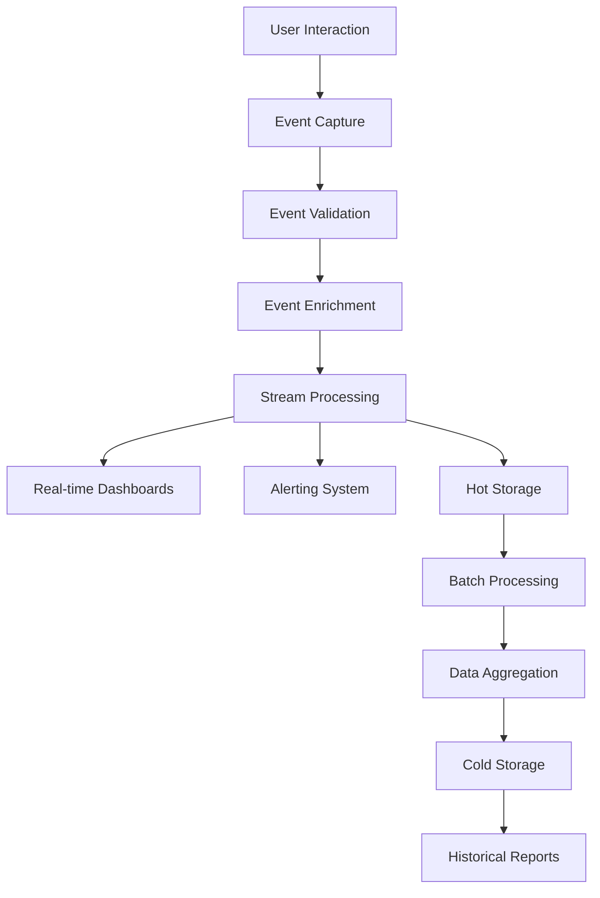

### 2. Content Performance Tracking

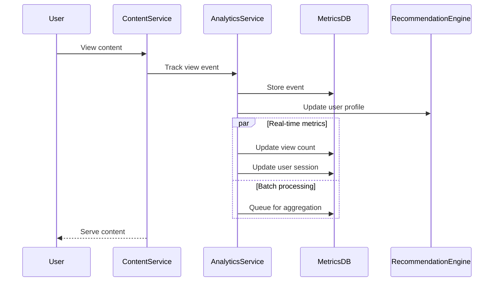

#### Analytics Implementation:
```javascript
const trackContentInteraction = async (eventData) => {
  const event = {
    id: generateEventId(),
    timestamp: new Date(),
    userId: eventData.userId,
    contentId: eventData.contentId,
    eventType: eventData.eventType, // view, like, share, comment
    metadata: {
      duration: eventData.duration,
      device: eventData.device,
      location: eventData.location,
      referrer: eventData.referrer
    }
  };
  
  // Immediate processing
  const immediateProcessing = [
    // Update real-time counters
    incrementCounter(`content:${event.contentId}:${event.eventType}`),
    
    // Update user activity
    updateUserActivity(event.userId, event),
    
    // Check for trending patterns
    checkTrendingThresholds(event.contentId),
    
    // Update recommendation signals
    updateRecommendationSignals(event.userId, event.contentId, event.eventType)
  ];
  
  await Promise.all(immediateProcessing);
  
  // Queue for batch processing
  await queueForBatchProcessing(event);
  
  return event;
};
```

This comprehensive content management workflow documentation provides detailed insights into how content flows through the MediaCMS system, from creation to analytics, including all the processing steps, validation, and optimization phases.