# Feed System Workflow Documentation

This document describes the comprehensive workflows for the MediaCMS Feed System, including how different modules interact to provide personalized content discovery.

## Table of Contents
1. [System Overview](#system-overview)
2. [Feed Generation Workflow](#feed-generation-workflow)
3. [Personalization Engine Workflow](#personalization-engine-workflow)
4. [Content Discovery Workflow](#content-discovery-workflow)
5. [Cache Management Workflow](#cache-management-workflow)
6. [Analytics & Recommendation Workflow](#analytics--recommendation-workflow)
7. [Module Interactions](#module-interactions)
8. [Data Flow Diagrams](#data-flow-diagrams)

---

## System Overview

The MediaCMS Feed System is a complex orchestration of multiple modules working together to deliver personalized content experiences. The system handles millions of content items and user interactions to generate relevant feeds.

### Core Components
- **Feed Controller**: Main orchestrator for feed requests
- **Recommendation Engine**: AI-powered content suggestions
- **Cache Layer**: Redis-based caching for performance
- **Analytics Engine**: User behavior tracking and analysis
- **Content Aggregator**: Multi-source content collection
- **Personalization Service**: User preference management

---

## Feed Generation Workflow

### 1. Personalized Feed Generation

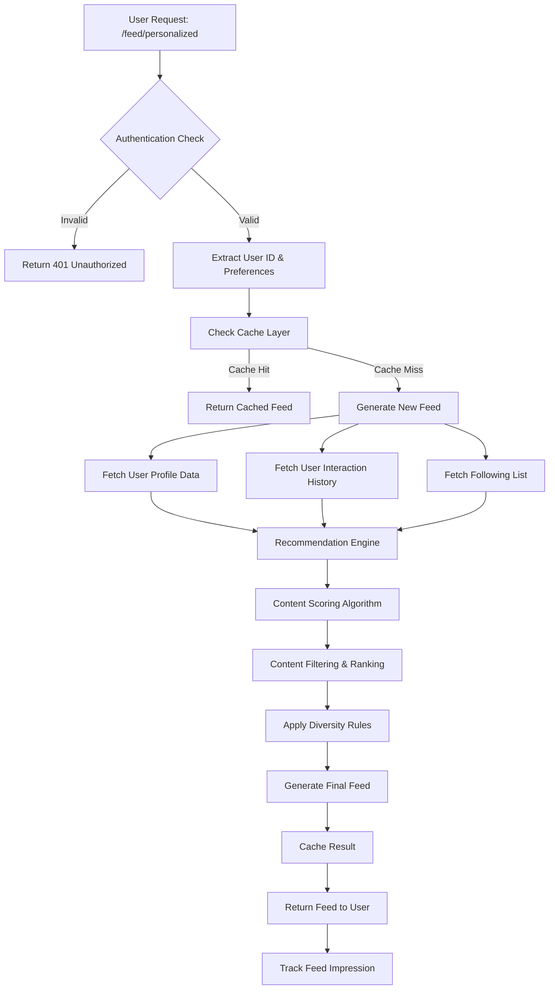
```mermaid
graph TD
    A[User Request: /feed/personalized] --> B{Authentication Check}
    B -->|Invalid| C[Return 401 Unauthorized]
    B -->|Valid| D[Extract User ID & Preferences]
    
    D --> E[Check Cache Layer]
    E -->|Cache Hit| F[Return Cached Feed]
    E -->|Cache Miss| G[Generate New Feed]
    
    G --> H[Fetch User Profile Data]
    G --> I[Fetch User Interaction History]
    G --> J[Fetch Following List]
    
    H --> K[Recommendation Engine]
    I --> K
    J --> K
    
    K --> L[Content Scoring Algorithm]
    L --> M[Content Filtering & Ranking]
    M --> N[Apply Diversity Rules]
    N --> O[Generate Final Feed]
    
    O --> P[Cache Result]
    P --> Q[Return Feed to User]
    Q --> R[Track Feed Impression]
```

#### Detailed Steps:

1. **Request Processing**
   ```javascript
   // User requests personalized feed
   GET /api/content/feed/personalized?page=1&limit=20&contentTypes=["article","video"]
   ```

2. **Authentication & Validation**
   ```javascript
   // Middleware chain
   authenticateToken → requireActiveUser → validateFeed
   ```

3. **Cache Check**
   ```javascript
   // Redis cache lookup
   const cacheKey = `feed:personalized:${userId}:${params}`;
   const cachedFeed = await redis.get(cacheKey);
   ```

4. **Data Collection**
   ```javascript
   // Parallel data fetching
   const [userProfile, interactions, following, preferences] = await Promise.all([
     getUserProfile(userId),
     getUserInteractions(userId, last30Days),
     getUserFollowing(userId),
     getUserPreferences(userId)
   ]);
   ```

5. **Content Scoring**
   ```javascript
   // Recommendation algorithm
   const contentScores = await recommendationEngine.scoreContent({
     userProfile,
     interactions,
     following,
     preferences,
     availableContent
   });
   ```

### 2. General Feed Generation

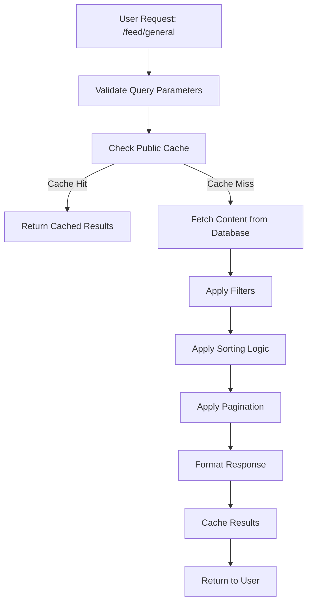
```mermaid
graph TD
    A[User Request: /feed/general] --> B[Validate Query Parameters]
    B --> C[Check Public Cache]
    C -->|Cache Hit| D[Return Cached Results]
    C -->|Cache Miss| E[Fetch Content from Database]
    
    E --> F[Apply Filters]
    F --> G[Apply Sorting Logic]
    G --> H[Apply Pagination]
    H --> I[Format Response]
    I --> J[Cache Results]
    J --> K[Return to User]
```

#### Sorting Logic Implementation:
```javascript
const getSortOrder = (sortBy, sortOrder) => {
  const sortMap = {
    recent: { publishedAt: sortOrder },
    popular: { _count: { views: sortOrder } },
    trending: { trendingScore: sortOrder },
    engagement: { engagementScore: sortOrder }
  };
  return sortMap[sortBy] || { publishedAt: 'desc' };
};
```

---

## Personalization Engine Workflow

### 1. User Preference Learning

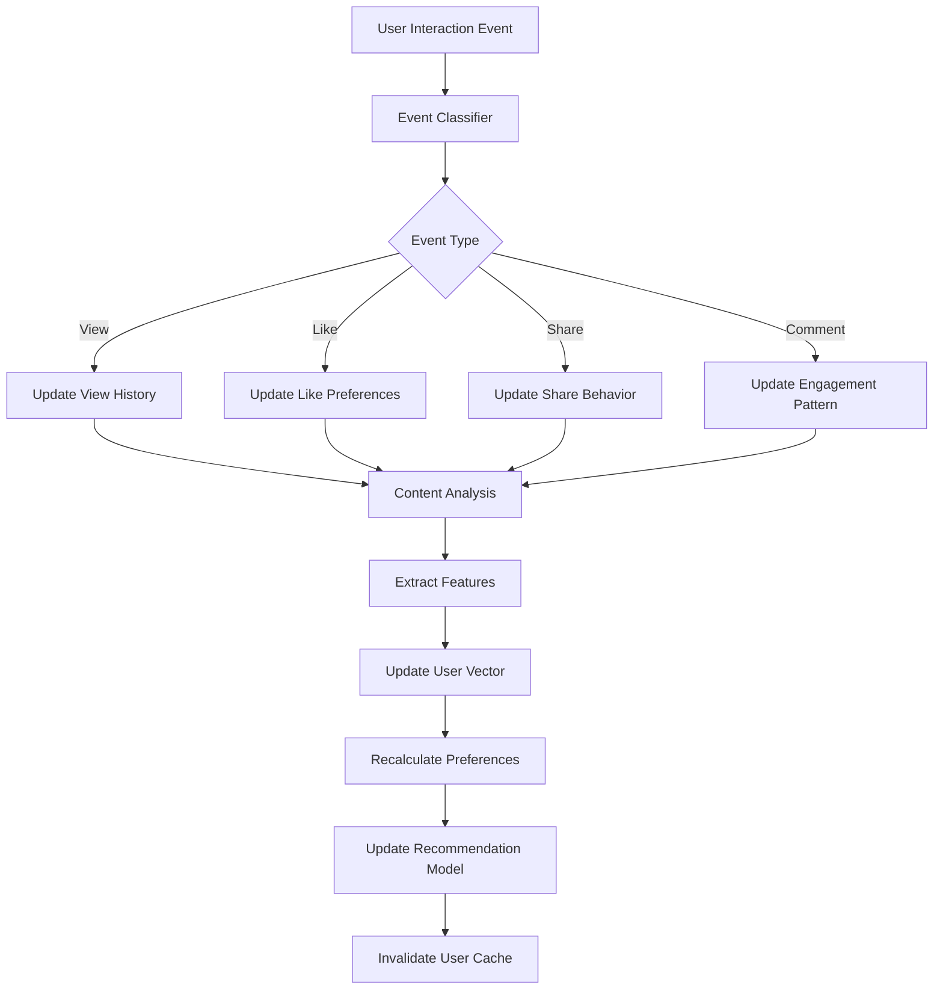
```mermaid
graph TD
    A[User Interaction Event] --> B[Event Classifier]
    B --> C{Event Type}
    
    C -->|View| D[Update View History]
    C -->|Like| E[Update Like Preferences]
    C -->|Share| F[Update Share Behavior]
    C -->|Comment| G[Update Engagement Pattern]
    
    D --> H[Content Analysis]
    E --> H
    F --> H
    G --> H
    
    H --> I[Extract Features]
    I --> J[Update User Vector]
    J --> K[Recalculate Preferences]
    K --> L[Update Recommendation Model]
    L --> M[Invalidate User Cache]
```

#### Feature Extraction Process:
```javascript
const extractContentFeatures = (content, interaction) => {
  return {
    // Content features
    category: content.category,
    tags: content.tags,
    contentType: content.type,
    author: content.authorId,
    
    // Interaction features
    interactionType: interaction.type,
    timeSpent: interaction.duration,
    engagement: interaction.engagement,
    timestamp: interaction.createdAt,
    
    // Contextual features
    timeOfDay: getTimeOfDay(interaction.createdAt),
    device: interaction.device,
    source: interaction.source
  };
};
```

### 2. Content Recommendation Algorithm

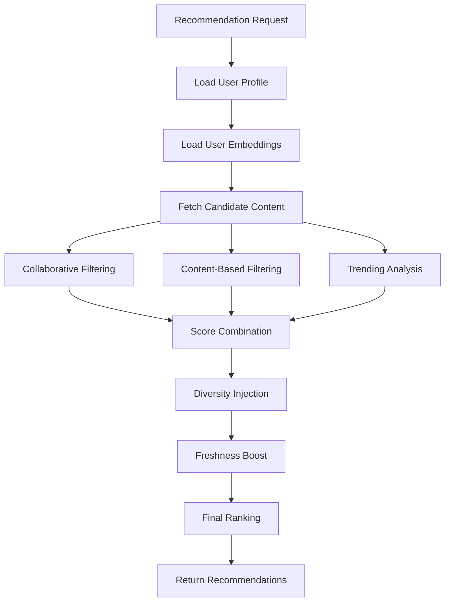
```mermaid
graph TD
    A[Recommendation Request] --> B[Load User Profile]
    B --> C[Load User Embeddings]
    C --> D[Fetch Candidate Content]
    
    D --> E[Collaborative Filtering]
    D --> F[Content-Based Filtering]
    D --> G[Trending Analysis]
    
    E --> H[Score Combination]
    F --> H
    G --> H
    
    H --> I[Diversity Injection]
    I --> J[Freshness Boost]
    J --> K[Final Ranking]
    K --> L[Return Recommendations]
```

#### Scoring Algorithm:
```javascript
const calculateContentScore = (user, content, context) => {
  const scores = {
    // Collaborative filtering score (40%)
    collaborative: calculateCollaborativeScore(user, content),
    
    // Content-based score (30%)
    contentBased: calculateContentBasedScore(user.preferences, content),
    
    // Trending score (20%)
    trending: calculateTrendingScore(content, context.timeframe),
    
    // Freshness score (10%)
    freshness: calculateFreshnessScore(content.publishedAt)
  };
  
  return (
    scores.collaborative * 0.4 +
    scores.contentBased * 0.3 +
    scores.trending * 0.2 +
    scores.freshness * 0.1
  );
};
```

---

## Content Discovery Workflow

### 1. Trending Content Detection

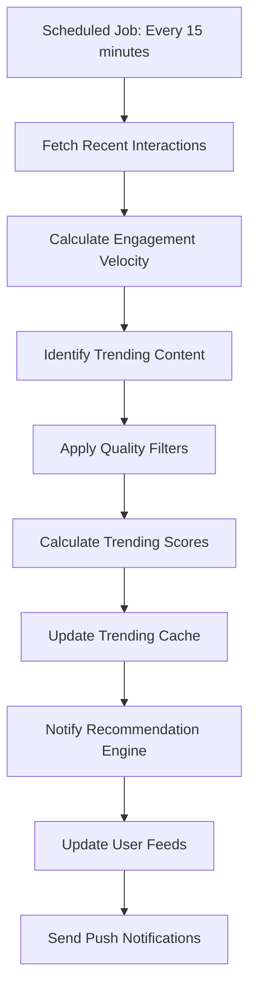
```mermaid
graph TD
    A[Scheduled Job: Every 15 minutes] --> B[Fetch Recent Interactions]
    B --> C[Calculate Engagement Velocity]
    C --> D[Identify Trending Content]
    
    D --> E[Apply Quality Filters]
    E --> F[Calculate Trending Scores]
    F --> G[Update Trending Cache]
    G --> H[Notify Recommendation Engine]
    
    H --> I[Update User Feeds]
    I --> J[Send Push Notifications]
```

#### Trending Score Calculation:
```javascript
const calculateTrendingScore = (content, timeframe = '1h') => {
  const { views, likes, comments, shares } = content.recentStats;
  const timeWeight = getTimeWeight(content.publishedAt, timeframe);
  
  const engagementScore = (
    views * 1 +
    likes * 3 +
    comments * 5 +
    shares * 8
  );
  
  const velocityScore = engagementScore / Math.max(1, getHoursSincePublished(content));
  
  return velocityScore * timeWeight * getQualityMultiplier(content);
};
```

### 2. Explore Feed Algorithm

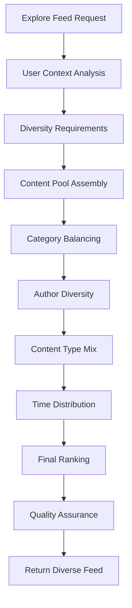
```mermaid
graph TD
    A[Explore Feed Request] --> B[User Context Analysis]
    B --> C[Diversity Requirements]
    C --> D[Content Pool Assembly]
    
    D --> E[Category Balancing]
    E --> F[Author Diversity]
    F --> G[Content Type Mix]
    G --> H[Time Distribution]
    
    H --> I[Final Ranking]
    I --> J[Quality Assurance]
    J --> K[Return Diverse Feed]
```

#### Diversity Algorithm:
```javascript
const generateDiverseFeed = (contentPool, userPreferences, diversityLevel) => {
  const diversityRules = {
    low: { categoryMix: 0.3, authorMix: 0.4, typeMix: 0.3 },
    medium: { categoryMix: 0.5, authorMix: 0.6, typeMix: 0.5 },
    high: { categoryMix: 0.8, authorMix: 0.8, typeMix: 0.7 }
  };
  
  const rules = diversityRules[diversityLevel];
  
  return applyDiversityConstraints(contentPool, {
    maxPerCategory: Math.floor(20 * rules.categoryMix),
    maxPerAuthor: Math.floor(20 * rules.authorMix),
    maxPerType: Math.floor(20 * rules.typeMix)
  });
};
```

---

## Cache Management Workflow

### 1. Multi-Layer Caching Strategy

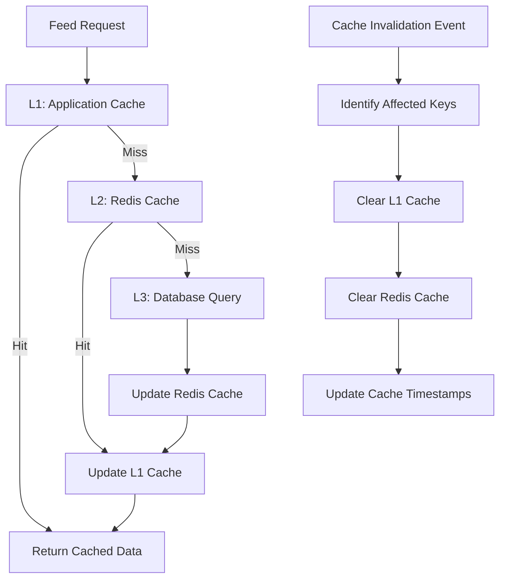
```mermaid
graph TD
    A[Feed Request] --> B[L1: Application Cache]
    B -->|Hit| C[Return Cached Data]
    B -->|Miss| D[L2: Redis Cache]
    
    D -->|Hit| E[Update L1 Cache]
    E --> C
    
    D -->|Miss| F[L3: Database Query]
    F --> G[Update Redis Cache]
    G --> E
    
    H[Cache Invalidation Event] --> I[Identify Affected Keys]
    I --> J[Clear L1 Cache]
    J --> K[Clear Redis Cache]
    K --> L[Update Cache Timestamps]
```

#### Cache Key Strategy:
```javascript
const generateCacheKey = (feedType, userId, params) => {
  const keyParts = [
    'feed',
    feedType,
    userId || 'anonymous',
    hashParams(params),
    getApiVersion()
  ];
  
  return keyParts.join(':');
};

const cacheKeyPatterns = {
  personalizedFeed: 'feed:personalized:{userId}:{paramsHash}',
  generalFeed: 'feed:general:{paramsHash}',
  trendingContent: 'feed:trending:{timeframe}',
  userPreferences: 'user:preferences:{userId}',
  contentStats: 'content:stats:{contentId}:{timeframe}'
};
```

### 2. Cache Invalidation Strategy

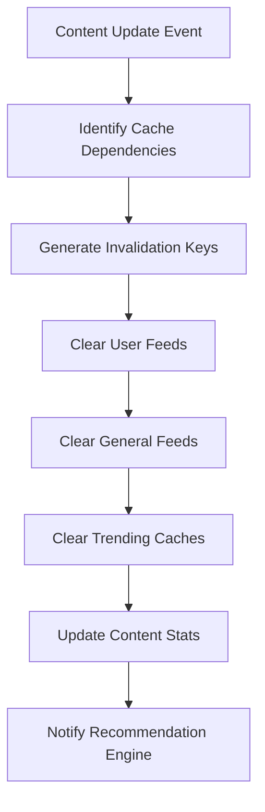
```mermaid
graph TD
    A[Content Update Event] --> B[Identify Cache Dependencies]
    B --> C[Generate Invalidation Keys]
    C --> D[Clear User Feeds]
    D --> E[Clear General Feeds]
    E --> F[Clear Trending Caches]
    F --> G[Update Content Stats]
    G --> H[Notify Recommendation Engine]
```

---

## Analytics & Recommendation Workflow

### 1. Real-time Analytics Pipeline

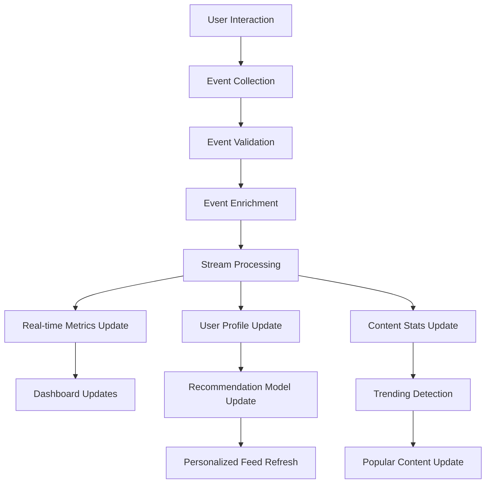
```mermaid
graph TD
    A[User Interaction] --> B[Event Collection]
    B --> C[Event Validation]
    C --> D[Event Enrichment]
    D --> E[Stream Processing]
    
    E --> F[Real-time Metrics Update]
    E --> G[User Profile Update]
    E --> H[Content Stats Update]
    
    F --> I[Dashboard Updates]
    G --> J[Recommendation Model Update]
    H --> K[Trending Detection]
    
    J --> L[Personalized Feed Refresh]
    K --> M[Popular Content Update]
```

#### Event Processing Pipeline:
```javascript
const processInteractionEvent = async (event) => {
  // 1. Validate event
  const validatedEvent = await validateEvent(event);
  
  // 2. Enrich with context
  const enrichedEvent = await enrichEvent(validatedEvent);
  
  // 3. Update real-time metrics
  await updateRealTimeMetrics(enrichedEvent);
  
  // 4. Update user profile
  await updateUserProfile(enrichedEvent);
  
  // 5. Update content statistics
  await updateContentStats(enrichedEvent);
  
  // 6. Trigger recommendations update
  await triggerRecommendationUpdate(enrichedEvent.userId);
  
  // 7. Check for trending patterns
  await checkTrendingPatterns(enrichedEvent.contentId);
};
```

### 2. Batch Analytics Processing

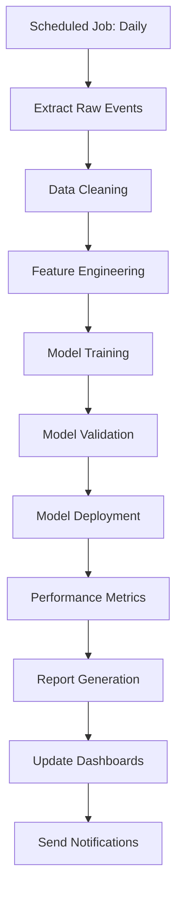
```mermaid
graph TD
    A[Scheduled Job: Daily] --> B[Extract Raw Events]
    B --> C[Data Cleaning]
    C --> D[Feature Engineering]
    D --> E[Model Training]
    
    E --> F[Model Validation]
    F --> G[Model Deployment]
    G --> H[Performance Metrics]
    H --> I[Report Generation]
    
    I --> J[Update Dashboards]
    J --> K[Send Notifications]
```

---

## Module Interactions

### 1. Cross-Module Communication

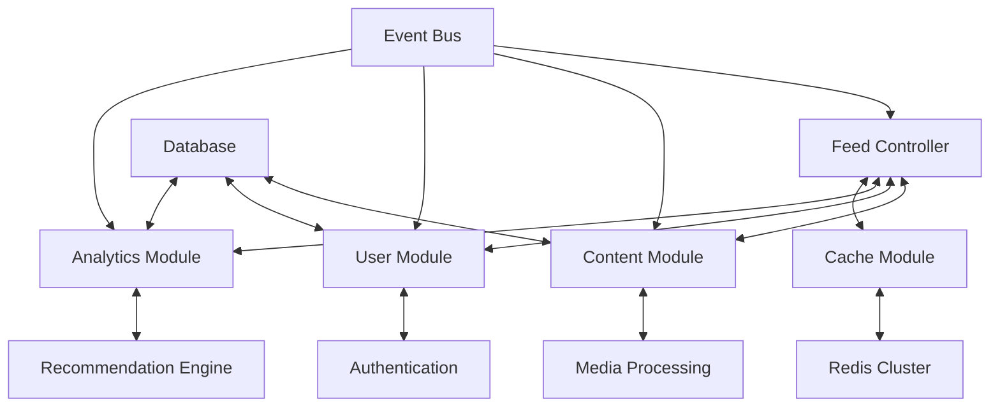
```mermaid
graph TD
    A[Feed Controller] <--> B[Content Module]
    A <--> C[User Module]
    A <--> D[Analytics Module]
    A <--> E[Cache Module]
    
    B <--> F[Media Processing]
    C <--> G[Authentication]
    D <--> H[Recommendation Engine]
    E <--> I[Redis Cluster]
    
    J[Event Bus] --> A
    J --> B
    J --> C
    J --> D
    
    K[Database] <--> B
    K <--> C
    K <--> D
```

#### Inter-Module Event Flow:
```javascript
// Event-driven architecture
const eventBus = {
  // Content events
  'content.created': ['feed.invalidateCache', 'recommendation.updateModel'],
  'content.updated': ['feed.invalidateUserCache', 'analytics.updateStats'],
  'content.deleted': ['feed.removeFromCache', 'recommendation.removeContent'],
  
  // User events
  'user.profileUpdated': ['feed.invalidatePersonalized', 'recommendation.updatePreferences'],
  'user.followed': ['feed.addToPersonalized', 'recommendation.updateSocial'],
  
  // Interaction events
  'interaction.created': ['analytics.updateMetrics', 'recommendation.updateScores'],
  'interaction.deleted': ['analytics.adjustMetrics', 'feed.recalculateScores']
};
```

### 2. Database Schema Interactions

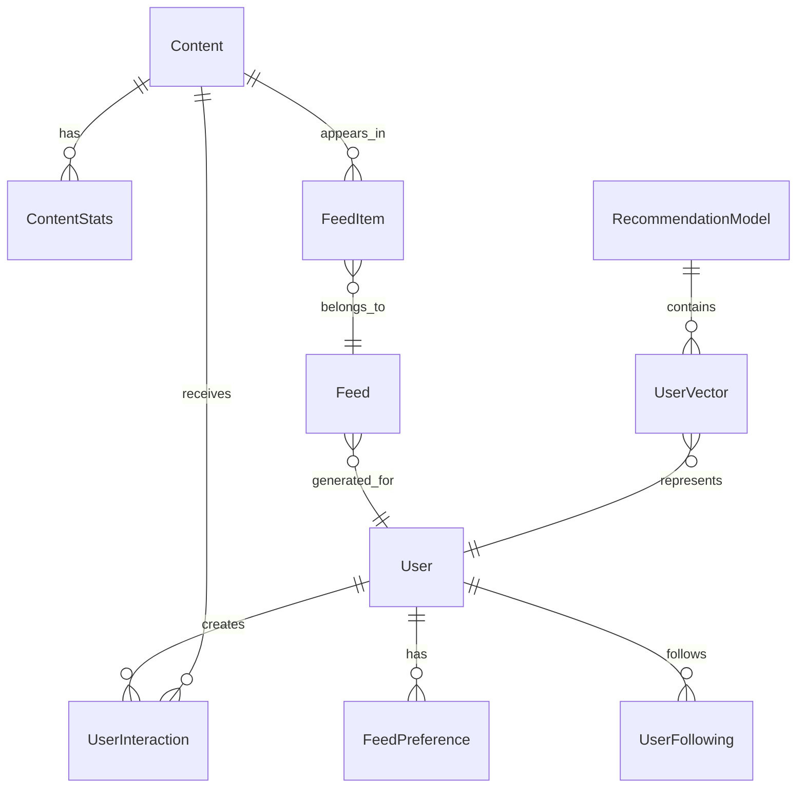
```mermaid
erDiagram
    User ||--o{ FeedPreference : has
    User ||--o{ UserInteraction : creates
    User ||--o{ UserFollowing : follows
    
    Content ||--o{ UserInteraction : receives
    Content ||--o{ ContentStats : has
    Content ||--o{ FeedItem : appears_in
    
    FeedItem }o--|| Feed : belongs_to
    Feed }o--|| User : generated_for
    
    RecommendationModel ||--o{ UserVector : contains
    UserVector }o--|| User : represents
```

---

## Data Flow Diagrams

### 1. Feed Generation Data Flow

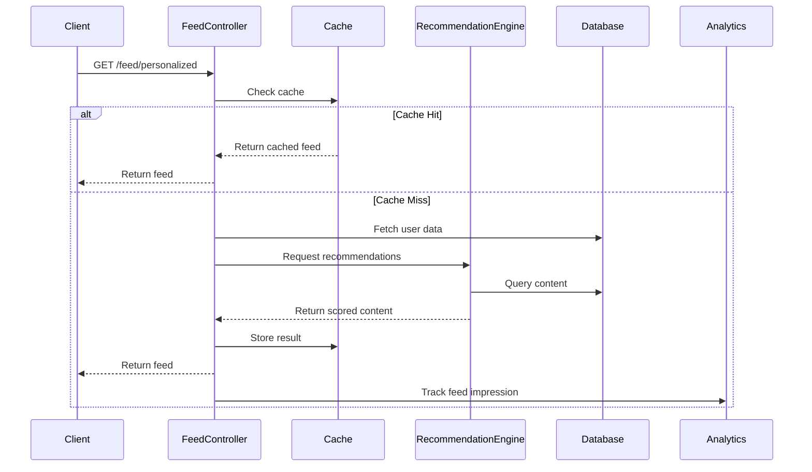
```mermaid
sequenceDiagram
    participant Client
    participant FeedController
    participant Cache
    participant RecommendationEngine
    participant Database
    participant Analytics
    
    Client->>FeedController: GET /feed/personalized
    FeedController->>Cache: Check cache
    
    alt Cache Hit
        Cache-->>FeedController: Return cached feed
        FeedController-->>Client: Return feed
    else Cache Miss
        FeedController->>Database: Fetch user data
        FeedController->>RecommendationEngine: Request recommendations
        RecommendationEngine->>Database: Query content
        RecommendationEngine-->>FeedController: Return scored content
        FeedController->>Cache: Store result
        FeedController-->>Client: Return feed
        FeedController->>Analytics: Track feed impression
    end
```

### 2. Content Interaction Data Flow

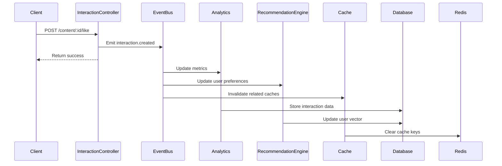
```mermaid
sequenceDiagram
    participant Client
    participant InteractionController
    participant EventBus
    participant Analytics
    participant RecommendationEngine
    participant Cache
    
    Client->>InteractionController: POST /content/:id/like
    InteractionController->>EventBus: Emit interaction.created
    InteractionController-->>Client: Return success
    
    EventBus->>Analytics: Update metrics
    EventBus->>RecommendationEngine: Update user preferences
    EventBus->>Cache: Invalidate related caches
    
    Analytics->>Database: Store interaction data
    RecommendationEngine->>Database: Update user vector
    Cache->>Redis: Clear cache keys
```

### 3. Real-time Updates Data Flow

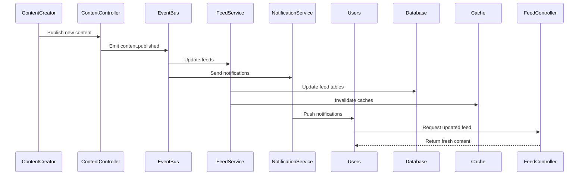
```mermaid
sequenceDiagram
    participant ContentCreator
    participant ContentController
    participant EventBus
    participant FeedService
    participant NotificationService
    participant Users
    
    ContentCreator->>ContentController: Publish new content
    ContentController->>EventBus: Emit content.published
    
    EventBus->>FeedService: Update feeds
    EventBus->>NotificationService: Send notifications
    
    FeedService->>Database: Update feed tables
    FeedService->>Cache: Invalidate caches
    
    NotificationService->>Users: Push notifications
    
    Users->>FeedController: Request updated feed
    FeedController-->>Users: Return fresh content
```

---

## Performance Optimization Workflows

### 1. Cache Warming Strategy

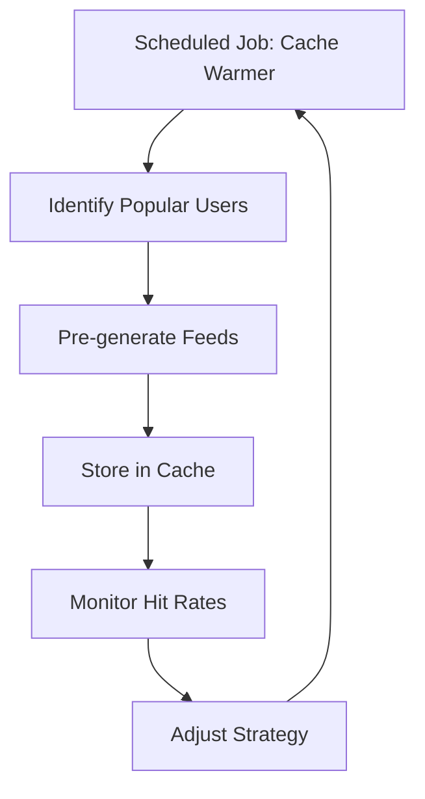
```mermaid
graph TD
    A[Scheduled Job: Cache Warmer] --> B[Identify Popular Users]
    B --> C[Pre-generate Feeds]
    C --> D[Store in Cache]
    D --> E[Monitor Hit Rates]
    E --> F[Adjust Strategy]
    F --> A
```

### 2. Load Balancing Workflow

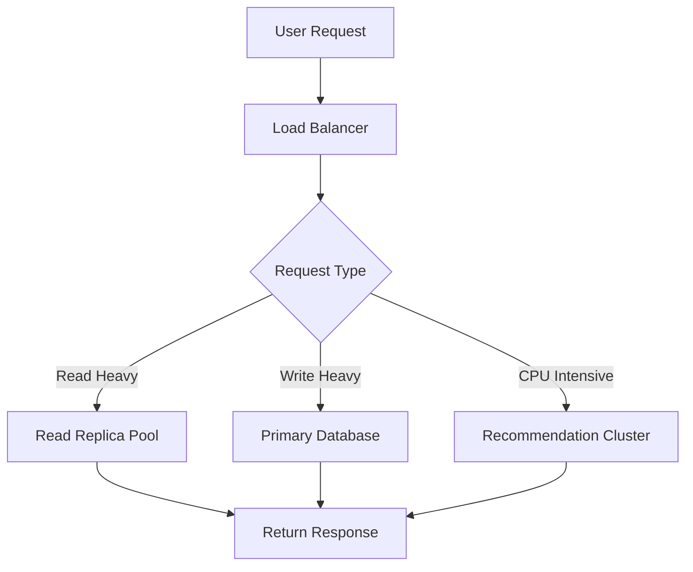
```mermaid
graph TD
    A[User Request] --> B[Load Balancer]
    B --> C{Request Type}
    
    C -->|Read Heavy| D[Read Replica Pool]
    C -->|Write Heavy| E[Primary Database]
    C -->|CPU Intensive| F[Recommendation Cluster]
    
    D --> G[Return Response]
    E --> G
    F --> G
```

---

## Error Handling & Recovery

### 1. Graceful Degradation

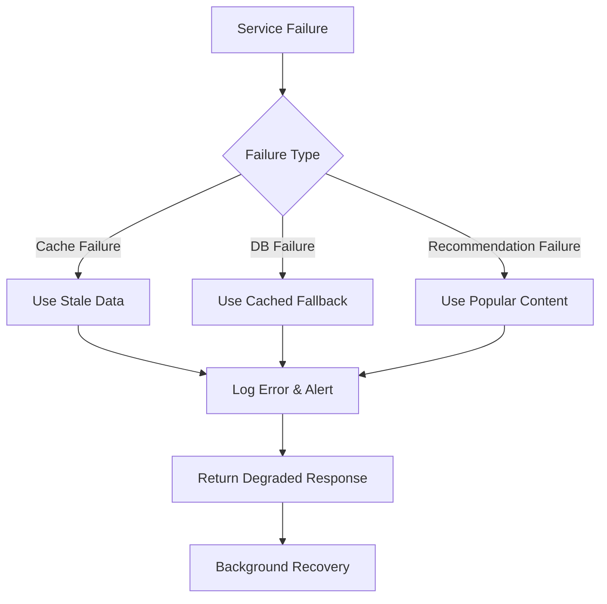
```mermaid
graph TD
    A[Service Failure] --> B{Failure Type}
    
    B -->|Cache Failure| C[Use Stale Data]
    B -->|DB Failure| D[Use Cached Fallback]
    B -->|Recommendation Failure| E[Use Popular Content]
    
    C --> F[Log Error & Alert]
    D --> F
    E --> F
    
    F --> G[Return Degraded Response]
    G --> H[Background Recovery]
```

### 2. Circuit Breaker Pattern

```javascript
const circuitBreaker = {
  state: 'CLOSED', // CLOSED, OPEN, HALF_OPEN
  failureCount: 0,
  threshold: 5,
  timeout: 30000,
  
  async call(operation) {
    if (this.state === 'OPEN') {
      if (Date.now() - this.lastFailure > this.timeout) {
        this.state = 'HALF_OPEN';
      } else {
        throw new Error('Circuit breaker is OPEN');
      }
    }
    
    try {
      const result = await operation();
      this.onSuccess();
      return result;
    } catch (error) {
      this.onFailure();
      throw error;
    }
  },
  
  onSuccess() {
    this.failureCount = 0;
    this.state = 'CLOSED';
  },
  
  onFailure() {
    this.failureCount++;
    if (this.failureCount >= this.threshold) {
      this.state = 'OPEN';
      this.lastFailure = Date.now();
    }
  }
};
```

This comprehensive workflow documentation provides a detailed understanding of how the MediaCMS Feed System operates, including all module interactions, data flows, and optimization strategies. The workflows can be used for development, debugging, and system maintenance purposes.