# System Integration & Communication Workflow Documentation

This document describes the comprehensive workflows for system integration, inter-service communication, external API integration, and data synchronization across the MediaCMS platform.

## Table of Contents
1. [System Architecture Overview](#system-architecture-overview)
2. [Microservice Communication](#microservice-communication)
3. [External API Integration](#external-api-integration)
4. [Data Synchronization Workflow](#data-synchronization-workflow)
5. [Event-Driven Architecture](#event-driven-architecture)
6. [Error Handling & Resilience](#error-handling--resilience)
7. [Monitoring & Observability](#monitoring--observability)
8. [Deployment & Scaling Workflow](#deployment--scaling-workflow)

---

## System Architecture Overview

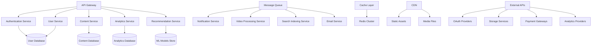

---

## Microservice Communication

### 1. Service-to-Service Communication Patterns

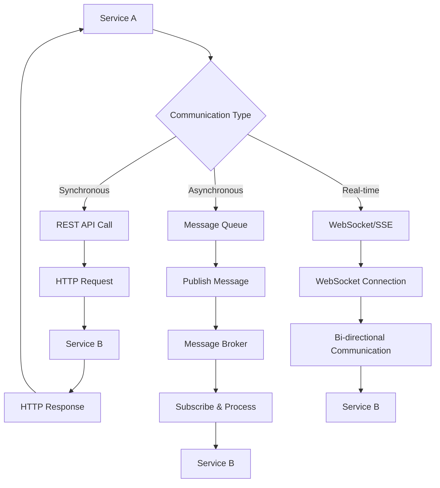

#### Inter-Service Communication Implementation:
```javascript
const ServiceCommunicator = {
  // Synchronous communication
  async callService(serviceName, endpoint, data, options = {}) {
    const communicationSteps = [
      'service_discovery',
      'load_balancing',
      'circuit_breaker_check',
      'request_execution',
      'response_handling',
      'error_recovery'
    ];
    
    let currentStep = 0;
    
    try {
      // Step 1: Service discovery
      await updateCommunicationStatus(requestId, communicationSteps[currentStep++]);
      const serviceEndpoint = await this.discoverService(serviceName, {
        version: options.version || 'latest',
        region: options.region || 'auto',
        loadBalancing: true
      });
      
      // Step 2: Load balancing
      await updateCommunicationStatus(requestId, communicationSteps[currentStep++]);
      const selectedInstance = await this.selectServiceInstance(serviceEndpoint, {
        strategy: 'round_robin',
        healthCheck: true,
        responseTime: true
      });
      
      // Step 3: Circuit breaker check
      await updateCommunicationStatus(requestId, communicationSteps[currentStep++]);
      const circuitState = await this.checkCircuitBreaker(serviceName);
      
      if (circuitState === 'OPEN') {
        return await this.handleCircuitBreakerOpen(serviceName, data);
      }
      
      // Step 4: Execute request
      await updateCommunicationStatus(requestId, communicationSteps[currentStep++]);
      const requestConfig = {
        url: `${selectedInstance.baseUrl}${endpoint}`,
        method: options.method || 'POST',
        data,
        headers: {
          'Content-Type': 'application/json',
          'Authorization': await this.getServiceToken(serviceName),
          'X-Request-ID': generateRequestId(),
          'X-Service-Source': process.env.SERVICE_NAME
        },
        timeout: options.timeout || 30000,
        retry: {
          attempts: 3,
          delay: 1000,
          backoff: 'exponential'
        }
      };
      
      const response = await this.executeRequest(requestConfig);
      
      // Step 5: Response handling
      await updateCommunicationStatus(requestId, communicationSteps[currentStep++]);
      await this.recordSuccessfulCall(serviceName, response.responseTime);
      
      return {
        success: true,
        data: response.data,
        metadata: {
          serviceInstance: selectedInstance.id,
          responseTime: response.responseTime,
          requestId: requestConfig.headers['X-Request-ID']
        }
      };
      
    } catch (error) {
      // Step 6: Error recovery
      await updateCommunicationStatus(requestId, communicationSteps[currentStep++]);
      return await this.handleCommunicationError(serviceName, error, data, options);
    }
  },
  
  // Asynchronous communication
  async publishMessage(topic, message, options = {}) {
    const messageData = {
      id: generateMessageId(),
      topic,
      payload: message,
      source: process.env.SERVICE_NAME,
      timestamp: new Date(),
      metadata: {
        correlationId: options.correlationId,
        priority: options.priority || 'normal',
        retryPolicy: options.retryPolicy || 'exponential'
      }
    };
    
    // Message validation
    await this.validateMessage(messageData);
    
    // Publish to message broker
    await this.messagePublisher.publish(topic, messageData, {
      persistent: true,
      acknowledge: true,
      timeout: 10000
    });
    
    return messageData.id;
  },
  
  // Service discovery
  async discoverService(serviceName, options = {}) {
    const serviceRegistry = await this.getServiceRegistry();
    
    const availableServices = serviceRegistry.services
      .filter(service => 
        service.name === serviceName &&
        service.status === 'healthy' &&
        (options.version === 'latest' || service.version === options.version)
      );
    
    if (availableServices.length === 0) {
      throw new ServiceDiscoveryError(`No healthy instances found for ${serviceName}`);
    }
    
    return availableServices;
  }
};
```

### 2. API Gateway Integration

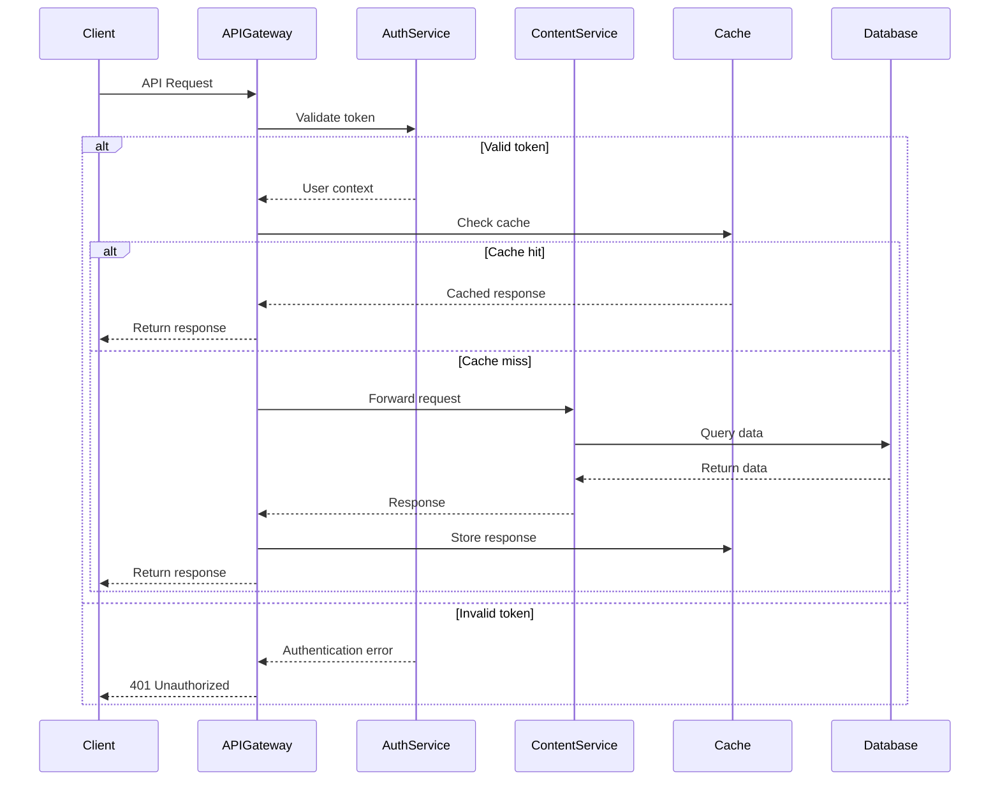

---

## External API Integration

### 1. Third-Party Service Integration

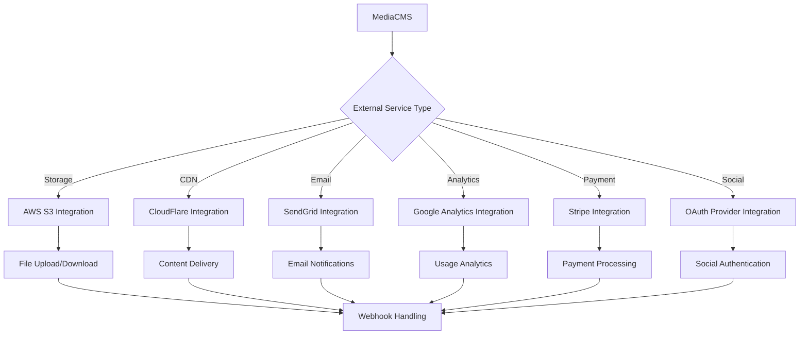

#### External API Integration Implementation:
```javascript
const ExternalAPIIntegrator = {
  // Generic external API client
  async callExternalAPI(provider, endpoint, data, options = {}) {
    const integrationSteps = [
      'credential_retrieval',
      'rate_limit_check',
      'request_preparation',
      'api_call_execution',
      'response_processing',
      'error_handling'
    ];
    
    let currentStep = 0;
    
    try {
      // Step 1: Retrieve credentials
      await updateIntegrationStatus(integrationId, integrationSteps[currentStep++]);
      const credentials = await this.getProviderCredentials(provider, {
        encryptionKey: process.env.ENCRYPTION_KEY,
        rotateIfExpired: true
      });
      
      // Step 2: Rate limit check
      await updateIntegrationStatus(integrationId, integrationSteps[currentStep++]);
      await this.checkRateLimit(provider, {
        window: '1h',
        maxRequests: this.getProviderLimits(provider),
        backoffStrategy: 'exponential'
      });
      
      // Step 3: Request preparation
      await updateIntegrationStatus(integrationId, integrationSteps[currentStep++]);
      const requestConfig = await this.prepareRequest(provider, endpoint, data, {
        credentials,
        authentication: this.getAuthMethod(provider),
        headers: {
          'User-Agent': `MediaCMS/1.0`,
          'X-API-Client': 'MediaCMS',
          ...options.headers
        }
      });
      
      // Step 4: Execute API call
      await updateIntegrationStatus(integrationId, integrationSteps[currentStep++]);
      const response = await this.executeExternalRequest(requestConfig, {
        timeout: options.timeout || 60000,
        retryPolicy: {
          maxRetries: 3,
          retryConditions: ['network_error', '5xx_error', 'timeout'],
          backoffStrategy: 'exponential'
        }
      });
      
      // Step 5: Process response
      await updateIntegrationStatus(integrationId, integrationSteps[currentStep++]);
      const processedResponse = await this.processProviderResponse(provider, response);
      
      // Record successful integration
      await this.recordIntegrationMetrics(provider, {
        success: true,
        responseTime: response.responseTime,
        endpoint
      });
      
      return processedResponse;
      
    } catch (error) {
      // Step 6: Error handling
      await updateIntegrationStatus(integrationId, integrationSteps[currentStep++]);
      return await this.handleExternalAPIError(provider, error, {
        originalRequest: { endpoint, data, options },
        retryable: this.isRetryableError(error),
        fallbackAvailable: this.hasFallback(provider, endpoint)
      });
    }
  },
  
  // Webhook handler for external services
  async handleWebhook(provider, payload, headers) {
    const webhookSteps = [
      'signature_verification',
      'payload_validation',
      'event_processing',
      'state_synchronization',
      'notification_dispatch'
    ];
    
    let currentStep = 0;
    
    try {
      // Step 1: Verify webhook signature
      await updateWebhookStatus(webhookId, webhookSteps[currentStep++]);
      await this.verifyWebhookSignature(provider, payload, headers);
      
      // Step 2: Validate payload
      await updateWebhookStatus(webhookId, webhookSteps[currentStep++]);
      const validatedPayload = await this.validateWebhookPayload(provider, payload);
      
      // Step 3: Process event
      await updateWebhookStatus(webhookId, webhookSteps[currentStep++]);
      const eventResult = await this.processWebhookEvent(provider, validatedPayload);
      
      // Step 4: Synchronize state
      await updateWebhookStatus(webhookId, webhookSteps[currentStep++]);
      await this.synchronizeExternalState(provider, eventResult);
      
      // Step 5: Dispatch notifications
      await updateWebhookStatus(webhookId, webhookSteps[currentStep++]);
      await this.dispatchWebhookNotifications(provider, eventResult);
      
      return { processed: true, eventId: eventResult.id };
      
    } catch (error) {
      await this.handleWebhookError(provider, error, payload);
      throw error;
    }
  }
};
```

### 2. OAuth Provider Integration

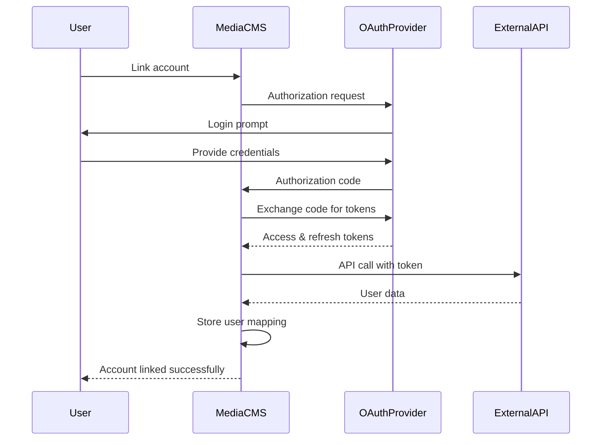

---

## Data Synchronization Workflow

### 1. Multi-Database Synchronization

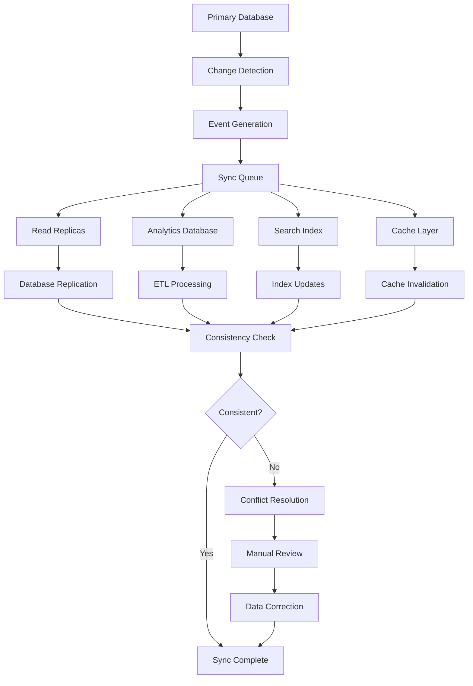

#### Data Synchronization Implementation:
```javascript
const DataSynchronizer = {
  async synchronizeData(sourceEvent, targets) {
    const syncSteps = [
      'event_validation',
      'conflict_detection',
      'target_preparation',
      'parallel_sync',
      'consistency_verification',
      'conflict_resolution'
    ];
    
    let currentStep = 0;
    const syncResults = {};
    
    try {
      // Step 1: Validate sync event
      await updateSyncStatus(syncId, syncSteps[currentStep++]);
      const validatedEvent = await this.validateSyncEvent(sourceEvent);
      
      // Step 2: Detect potential conflicts
      await updateSyncStatus(syncId, syncSteps[currentStep++]);
      const conflicts = await this.detectConflicts(validatedEvent, targets);
      
      if (conflicts.length > 0) {
        await this.handlePreSyncConflicts(conflicts);
      }
      
      // Step 3: Prepare target systems
      await updateSyncStatus(syncId, syncSteps[currentStep++]);
      const preparedTargets = await Promise.all(
        targets.map(target => this.prepareTarget(target, validatedEvent))
      );
      
      // Step 4: Execute parallel synchronization
      await updateSyncStatus(syncId, syncSteps[currentStep++]);
      const syncPromises = preparedTargets.map(async (target) => {
        try {
          const result = await this.syncToTarget(target, validatedEvent);
          return { target: target.name, success: true, result };
        } catch (error) {
          return { target: target.name, success: false, error: error.message };
        }
      });
      
      const syncResults = await Promise.allSettled(syncPromises);
      
      // Step 5: Verify consistency
      await updateSyncStatus(syncId, syncSteps[currentStep++]);
      const consistencyCheck = await this.verifyConsistency(
        validatedEvent,
        syncResults.filter(r => r.status === 'fulfilled' && r.value.success)
      );
      
      // Step 6: Resolve any remaining conflicts
      await updateSyncStatus(syncId, syncSteps[currentStep++]);
      if (!consistencyCheck.consistent) {
        await this.resolveConsistencyIssues(consistencyCheck.issues);
      }
      
      return {
        syncId,
        sourceEvent: validatedEvent.id,
        results: syncResults,
        consistency: consistencyCheck,
        completedAt: new Date()
      };
      
    } catch (error) {
      await this.handleSyncError(syncId, currentStep, error);
      throw error;
    }
  },
  
  // Conflict resolution strategies
  async resolveConflict(conflict, strategy = 'timestamp') {
    const resolutionStrategies = {
      timestamp: () => this.resolveByTimestamp(conflict),
      priority: () => this.resolveByPriority(conflict),
      merge: () => this.mergeConflictingData(conflict),
      manual: () => this.flagForManualResolution(conflict)
    };
    
    const resolver = resolutionStrategies[strategy];
    if (!resolver) {
      throw new Error(`Unknown conflict resolution strategy: ${strategy}`);
    }
    
    return await resolver();
  },
  
  // Real-time sync monitoring
  async monitorSyncHealth() {
    const healthMetrics = {
      replicationLag: await this.measureReplicationLag(),
      syncQueueDepth: await this.getSyncQueueDepth(),
      failureRate: await this.calculateSyncFailureRate(),
      conflictRate: await this.calculateConflictRate()
    };
    
    // Check health thresholds
    const healthAlerts = [];
    
    if (healthMetrics.replicationLag > 30000) { // 30 seconds
      healthAlerts.push({
        type: 'HIGH_REPLICATION_LAG',
        value: healthMetrics.replicationLag,
        threshold: 30000
      });
    }
    
    if (healthMetrics.failureRate > 0.05) { // 5%
      healthAlerts.push({
        type: 'HIGH_FAILURE_RATE',
        value: healthMetrics.failureRate,
        threshold: 0.05
      });
    }
    
    // Send alerts if any issues detected
    if (healthAlerts.length > 0) {
      await this.sendSyncHealthAlerts(healthAlerts);
    }
    
    return { metrics: healthMetrics, alerts: healthAlerts };
  }
};
```

---

## Event-Driven Architecture

### 1. Event Bus Architecture

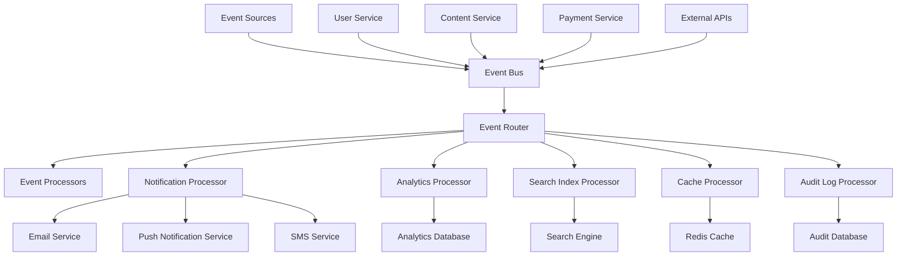

### 2. Event Processing Pipeline

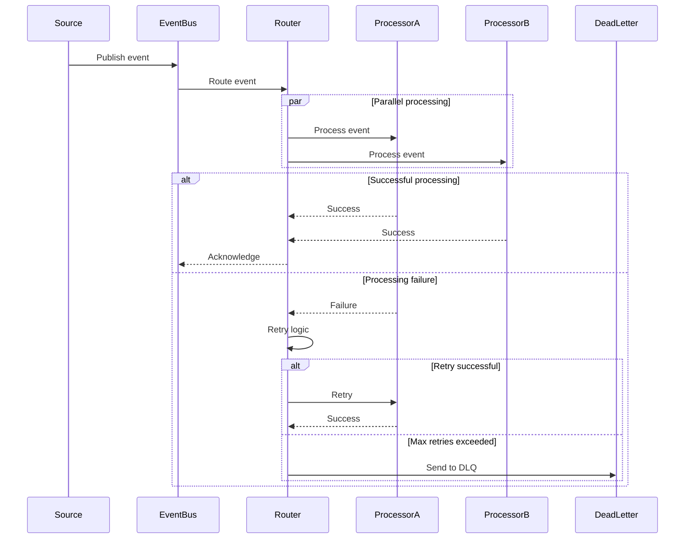

#### Event-Driven Implementation:
```javascript
const EventDrivenSystem = {
  // Event publishing
  async publishEvent(eventType, payload, options = {}) {
    const event = {
      id: generateEventId(),
      type: eventType,
      source: process.env.SERVICE_NAME,
      payload,
      timestamp: new Date(),
      version: '1.0',
      metadata: {
        correlationId: options.correlationId || generateCorrelationId(),
        causationId: options.causationId,
        userId: options.userId,
        sessionId: options.sessionId
      }
    };
    
    // Validate event structure
    await this.validateEvent(event);
    
    // Publish to event bus
    await this.eventBus.publish(eventType, event, {
      persistent: true,
      priority: options.priority || 'normal',
      timeout: 10000
    });
    
    // Log event publication
    await this.logEventPublication(event);
    
    return event.id;
  },
  
  // Event subscription and processing
  async subscribeToEvents(eventTypes, processor, options = {}) {
    const subscription = {
      id: generateSubscriptionId(),
      eventTypes,
      processor: processor.name,
      options: {
        batchSize: options.batchSize || 1,
        maxRetries: options.maxRetries || 3,
        retryDelay: options.retryDelay || 1000,
        deadLetterQueue: options.deadLetterQueue !== false
      }
    };
    
    // Register subscription
    await this.eventBus.subscribe(eventTypes, async (events) => {
      const processingPromises = events.map(event => 
        this.processEventWithRetry(event, processor, subscription.options)
      );
      
      await Promise.allSettled(processingPromises);
    }, subscription.options);
    
    return subscription.id;
  },
  
  // Event processing with retry logic
  async processEventWithRetry(event, processor, options) {
    let attempt = 0;
    let lastError;
    
    while (attempt < options.maxRetries) {
      try {
        // Process the event
        const result = await processor.process(event);
        
        // Log successful processing
        await this.logEventProcessing(event, processor.name, {
          success: true,
          attempt: attempt + 1,
          result
        });
        
        return result;
        
      } catch (error) {
        attempt++;
        lastError = error;
        
        // Log processing attempt
        await this.logEventProcessing(event, processor.name, {
          success: false,
          attempt,
          error: error.message
        });
        
        // Wait before retry (exponential backoff)
        if (attempt < options.maxRetries) {
          const delay = options.retryDelay * Math.pow(2, attempt - 1);
          await this.sleep(delay);
        }
      }
    }
    
    // All retries exhausted, send to dead letter queue
    if (options.deadLetterQueue) {
      await this.sendToDeadLetterQueue(event, processor.name, lastError);
    }
    
    throw new EventProcessingError(`Failed to process event after ${options.maxRetries} attempts`);
  }
};
```

---

## Error Handling & Resilience

### 1. Circuit Breaker Pattern

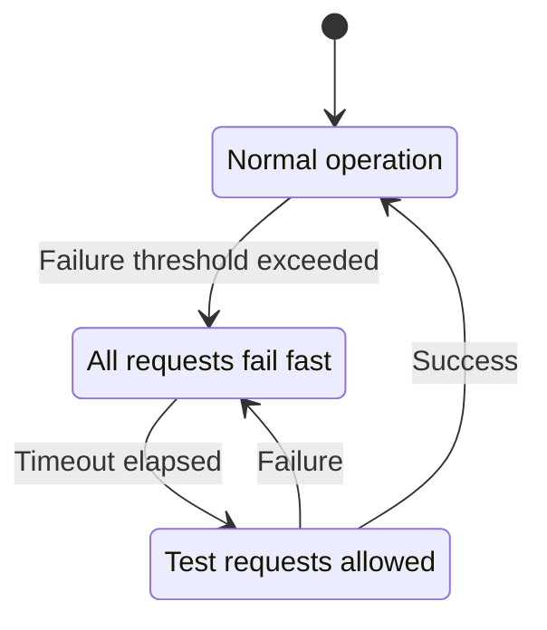

### 2. Retry and Fallback Strategies

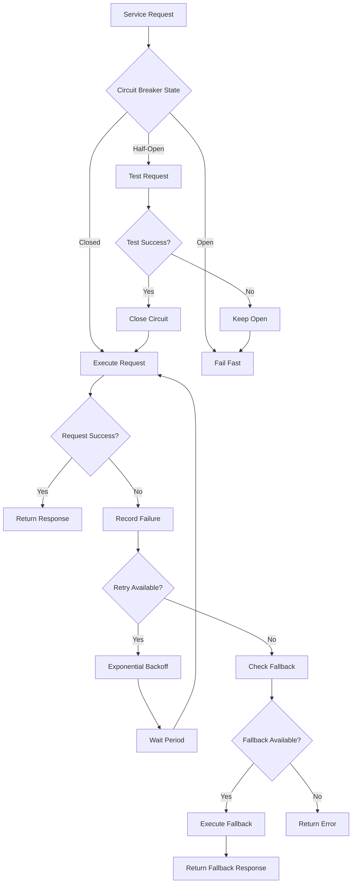

#### Resilience Implementation:
```javascript
const ResilienceManager = {
  // Circuit breaker implementation
  circuitBreakers: new Map(),
  
  async executeWithCircuitBreaker(serviceName, operation, options = {}) {
    const circuitBreaker = this.getOrCreateCircuitBreaker(serviceName, options);
    
    // Check circuit breaker state
    if (circuitBreaker.state === 'OPEN') {
      if (Date.now() - circuitBreaker.lastFailureTime < circuitBreaker.timeout) {
        throw new CircuitBreakerOpenError(`Circuit breaker is OPEN for ${serviceName}`);
      } else {
        // Transition to HALF_OPEN
        circuitBreaker.state = 'HALF_OPEN';
      }
    }
    
    try {
      const result = await operation();
      
      // Record success
      if (circuitBreaker.state === 'HALF_OPEN') {
        circuitBreaker.state = 'CLOSED';
        circuitBreaker.failureCount = 0;
      }
      
      return result;
      
    } catch (error) {
      // Record failure
      circuitBreaker.failureCount++;
      circuitBreaker.lastFailureTime = Date.now();
      
      // Check if threshold exceeded
      if (circuitBreaker.failureCount >= circuitBreaker.failureThreshold) {
        circuitBreaker.state = 'OPEN';
      }
      
      throw error;
    }
  },
  
  // Retry with exponential backoff
  async executeWithRetry(operation, options = {}) {
    const {
      maxRetries = 3,
      baseDelay = 1000,
      maxDelay = 30000,
      backoffFactor = 2,
      jitter = true
    } = options;
    
    let attempt = 0;
    let delay = baseDelay;
    
    while (attempt < maxRetries) {
      try {
        return await operation();
      } catch (error) {
        attempt++;
        
        // Check if error is retryable
        if (!this.isRetryableError(error) || attempt >= maxRetries) {
          throw error;
        }
        
        // Calculate next delay
        if (jitter) {
          delay = delay + (Math.random() * delay * 0.1); // Add 10% jitter
        }
        
        delay = Math.min(delay * backoffFactor, maxDelay);
        
        // Wait before retry
        await this.sleep(delay);
      }
    }
  },
  
  // Fallback mechanism
  async executeWithFallback(primary, fallback, options = {}) {
    try {
      return await this.executeWithRetry(primary, options.retryOptions);
    } catch (primaryError) {
      try {
        const fallbackResult = await fallback();
        
        // Log fallback usage
        await this.logFallbackUsage(primary.name, fallback.name, primaryError);
        
        return {
          ...fallbackResult,
          _fallback: true,
          _primaryError: primaryError.message
        };
        
      } catch (fallbackError) {
        // Both primary and fallback failed
        throw new CompleteFallbackFailureError({
          primaryError,
          fallbackError
        });
      }
    }
  }
};
```

---

## Monitoring & Observability

### 1. Distributed Tracing

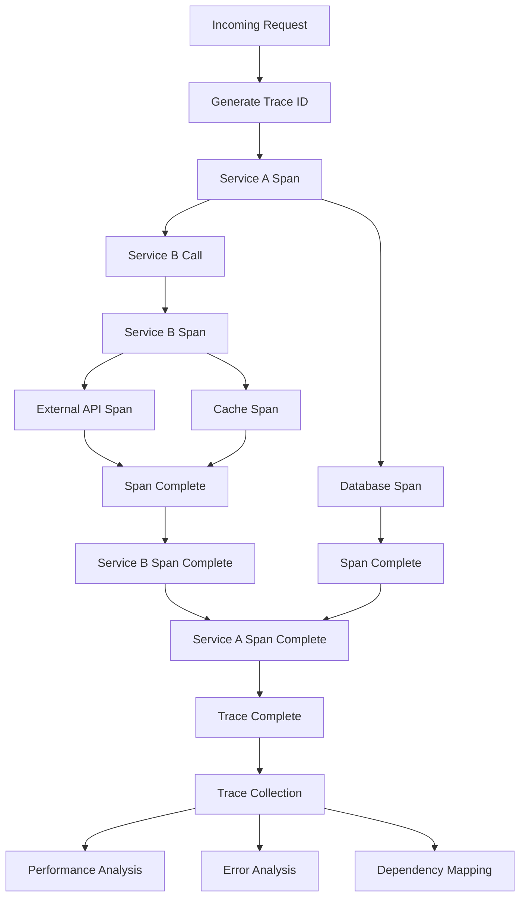

### 2. Health Check System

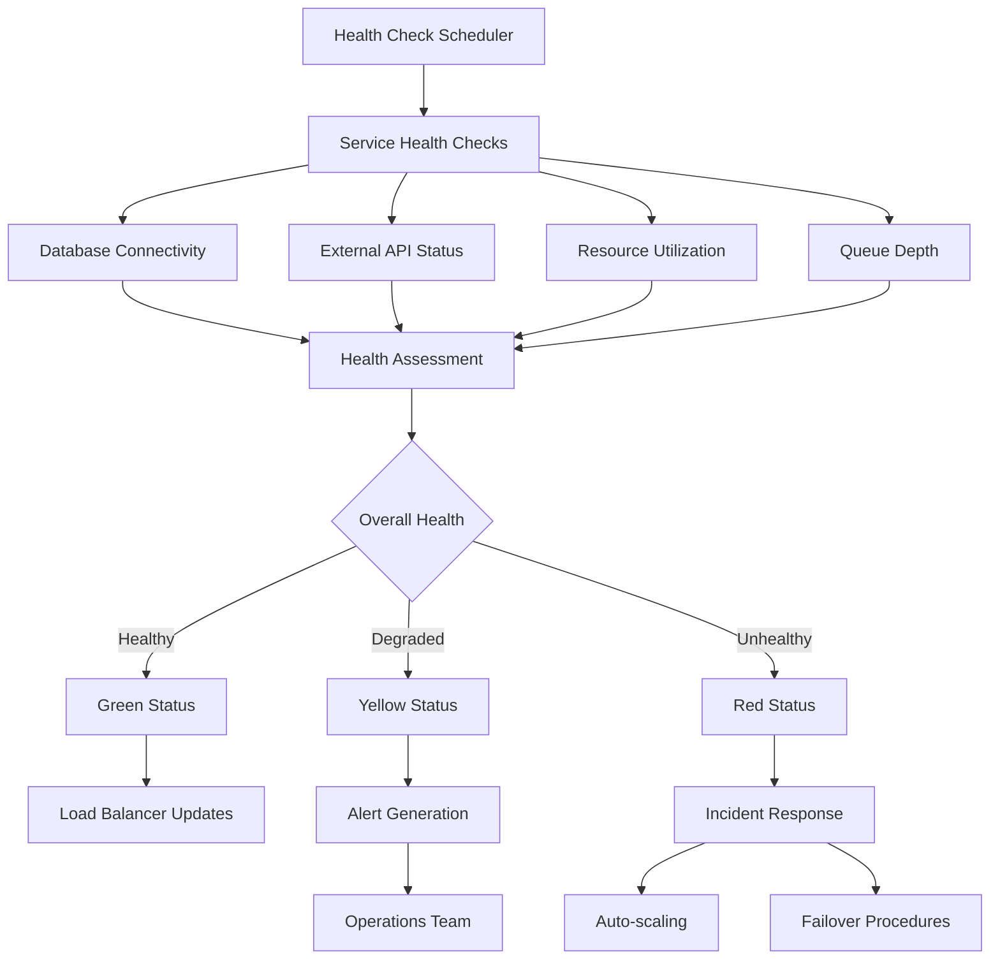

#### Monitoring Implementation:
```javascript
const MonitoringSystem = {
  // Distributed tracing
  async startTrace(operationName, parentContext = null) {
    const trace = {
      traceId: parentContext?.traceId || generateTraceId(),
      spanId: generateSpanId(),
      parentSpanId: parentContext?.spanId,
      operationName,
      startTime: Date.now(),
      tags: {
        service: process.env.SERVICE_NAME,
        version: process.env.SERVICE_VERSION
      },
      logs: []
    };
    
    // Store in context
    this.setCurrentTrace(trace);
    
    return trace;
  },
  
  async finishTrace(trace, result = null, error = null) {
    trace.endTime = Date.now();
    trace.duration = trace.endTime - trace.startTime;
    
    if (error) {
      trace.error = true;
      trace.tags.error = true;
      trace.logs.push({
        timestamp: Date.now(),
        level: 'error',
        message: error.message,
        stack: error.stack
      });
    }
    
    if (result) {
      trace.result = this.sanitizeTraceData(result);
    }
    
    // Send to tracing system
    await this.sendTrace(trace);
    
    return trace;
  },
  
  // Health monitoring
  async performHealthCheck() {
    const healthChecks = [
      this.checkDatabaseHealth(),
      this.checkExternalAPIHealth(),
      this.checkResourceHealth(),
      this.checkQueueHealth()
    ];
    
    const results = await Promise.allSettled(healthChecks);
    
    const healthStatus = {
      overall: 'healthy',
      checks: {},
      timestamp: new Date(),
      version: process.env.SERVICE_VERSION
    };
    
    results.forEach((result, index) => {
      const checkName = ['database', 'external_apis', 'resources', 'queues'][index];
      
      if (result.status === 'fulfilled') {
        healthStatus.checks[checkName] = result.value;
      } else {
        healthStatus.checks[checkName] = {
          status: 'unhealthy',
          error: result.reason.message
        };
        healthStatus.overall = 'unhealthy';
      }
    });
    
    // Update service registry
    await this.updateServiceHealth(healthStatus);
    
    return healthStatus;
  },
  
  // Metrics collection
  async collectMetrics() {
    const metrics = {
      timestamp: Date.now(),
      service: process.env.SERVICE_NAME,
      performance: {
        responseTime: await this.getAverageResponseTime(),
        throughput: await this.getCurrentThroughput(),
        errorRate: await this.getErrorRate()
      },
      resources: {
        cpuUsage: process.cpuUsage(),
        memoryUsage: process.memoryUsage(),
        uptime: process.uptime()
      },
      business: {
        activeUsers: await this.getActiveUserCount(),
        requestsPerMinute: await this.getRequestsPerMinute(),
        featuresUsage: await this.getFeatureUsageStats()
      }
    };
    
    // Send to metrics collection system
    await this.sendMetrics(metrics);
    
    return metrics;
  }
};
```

---

## Deployment & Scaling Workflow

### 1. CI/CD Pipeline

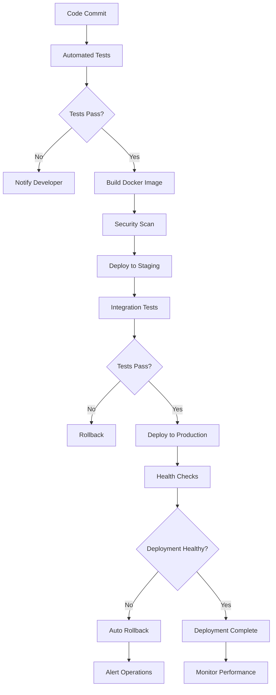

### 2. Auto-scaling Architecture

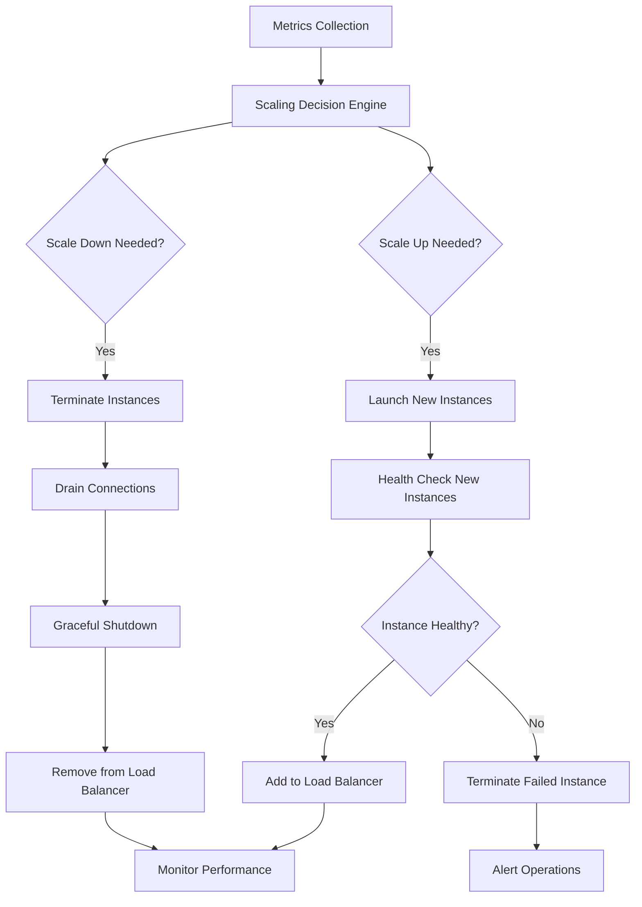

This comprehensive system integration and communication workflow documentation provides detailed insights into how all the components of the MediaCMS platform work together, communicate, and maintain reliability and performance at scale.