# User Management & Authentication Workflow Documentation

This document describes the comprehensive workflows for user management, authentication, authorization, and user lifecycle in the MediaCMS platform.

## Table of Contents
1. [User Lifecycle Overview](#user-lifecycle-overview)
2. [Registration & Onboarding Workflow](#registration--onboarding-workflow)
3. [Authentication Workflow](#authentication-workflow)
4. [OAuth Integration Workflow](#oauth-integration-workflow)
5. [User Profile Management](#user-profile-management)
6. [Permission & Role Management](#permission--role-management)
7. [Account Security Workflow](#account-security-workflow)
8. [User Activity & Session Management](#user-activity--session-management)

---

## User Lifecycle Overview

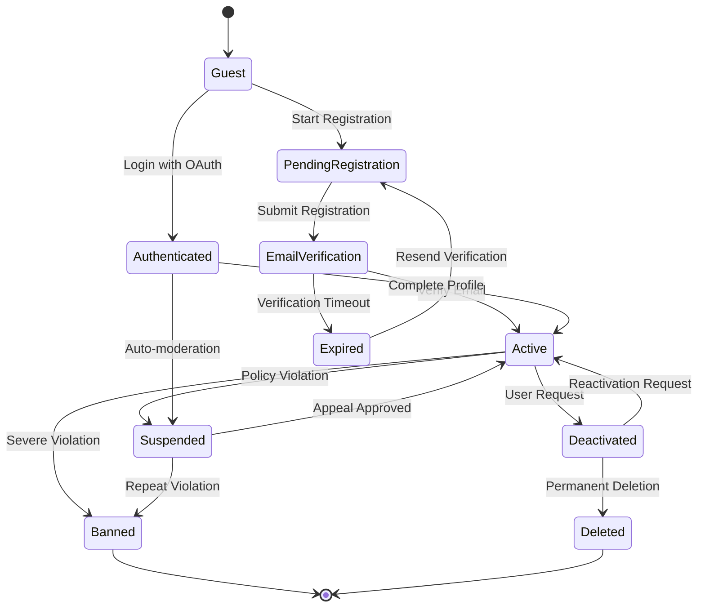

---

## Registration & Onboarding Workflow

### 1. User Registration Process

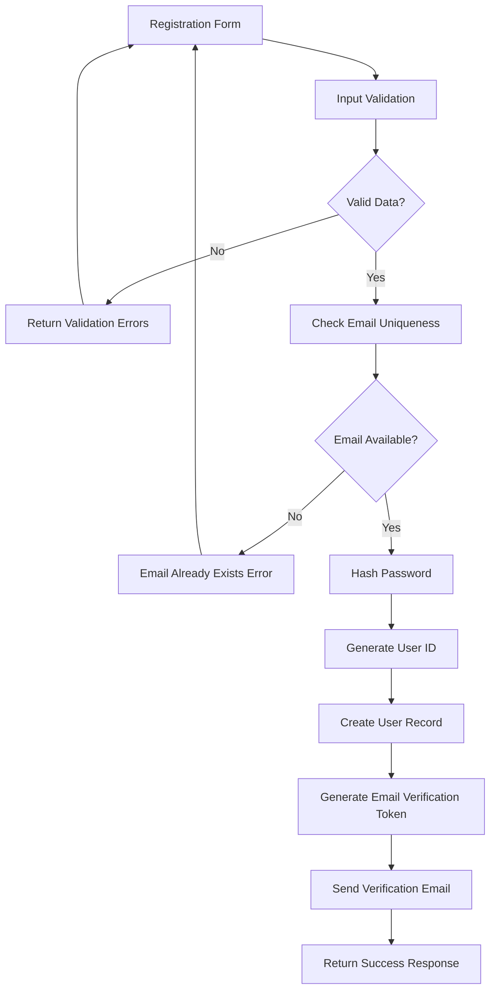

#### Registration Implementation:
```javascript
const registerUserWorkflow = async (registrationData) => {
  const registrationSteps = [
    'validation',
    'uniqueness_check',
    'password_processing',
    'user_creation',
    'email_verification',
    'profile_setup'
  ];
  
  let currentStep = 0;
  
  try {
    // Step 1: Input validation
    await updateRegistrationStatus(registrationId, registrationSteps[currentStep++]);
    const validatedData = await validateRegistrationData(registrationData, {
      email: {
        format: 'email',
        maxLength: 255,
        blacklist: await getEmailBlacklist()
      },
      password: {
        minLength: 8,
        requireUppercase: true,
        requireLowercase: true,
        requireNumbers: true,
        requireSpecialChars: true,
        preventCommonPasswords: true
      },
      username: {
        minLength: 3,
        maxLength: 30,
        allowedChars: /^[a-zA-Z0-9_-]+$/,
        reservedNames: await getReservedUsernames()
      }
    });
    
    // Step 2: Uniqueness verification
    await updateRegistrationStatus(registrationId, registrationSteps[currentStep++]);
    const uniquenessCheck = await Promise.all([
      checkEmailUniqueness(validatedData.email),
      checkUsernameUniqueness(validatedData.username)
    ]);
    
    if (!uniquenessCheck.every(check => check.isUnique)) {
      throw new ValidationError('Email or username already exists');
    }
    
    // Step 3: Password processing
    await updateRegistrationStatus(registrationId, registrationSteps[currentStep++]);
    const passwordHash = await hashPassword(validatedData.password, {
      saltRounds: 12,
      algorithm: 'bcrypt'
    });
    
    // Step 4: User creation
    await updateRegistrationStatus(registrationId, registrationSteps[currentStep++]);
    const user = await prisma.user.create({
      data: {
        email: validatedData.email,
        username: validatedData.username,
        passwordHash,
        firstName: validatedData.firstName,
        lastName: validatedData.lastName,
        role: 'USER',
        status: 'PENDING_VERIFICATION',
        registrationDate: new Date(),
        lastLogin: null,
        profile: {
          create: {
            displayName: validatedData.displayName || validatedData.username,
            bio: '',
            isPublic: true,
            preferences: {
              notifications: {
                email: true,
                push: false,
                sms: false
              },
              privacy: {
                showEmail: false,
                showActivity: true,
                allowMessages: true
              }
            }
          }
        }
      },
      include: {
        profile: true
      }
    });
    
    // Step 5: Email verification setup
    await updateRegistrationStatus(registrationId, registrationSteps[currentStep++]);
    const verificationToken = await generateVerificationToken(user.id);
    
    await sendVerificationEmail(user.email, {
      token: verificationToken,
      username: user.username,
      verificationUrl: `${process.env.APP_URL}/verify-email?token=${verificationToken}`
    });
    
    // Step 6: Initial profile setup
    await updateRegistrationStatus(registrationId, registrationSteps[currentStep++]);
    await initializeUserProfile(user.id, {
      createDefaultPlaylists: true,
      subscribeToDefaultChannels: false,
      setupRecommendationProfile: true
    });
    
    return {
      user: {
        id: user.id,
        email: user.email,
        username: user.username,
        status: user.status
      },
      verificationRequired: true
    };
    
  } catch (error) {
    await handleRegistrationError(registrationId, currentStep, error);
    throw error;
  }
};
```

### 2. Email Verification Workflow

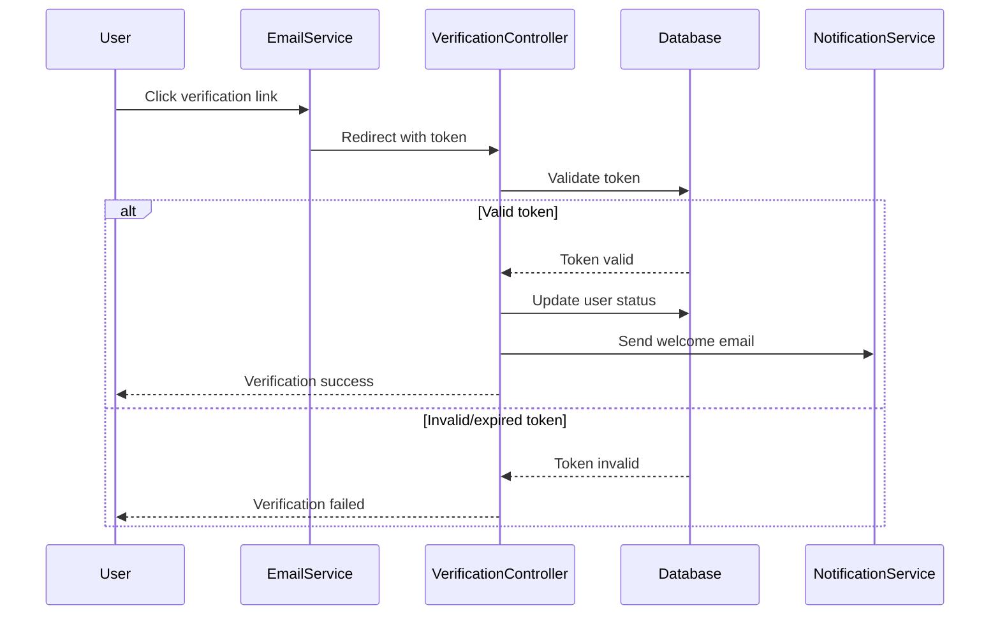

### 3. User Onboarding Workflow

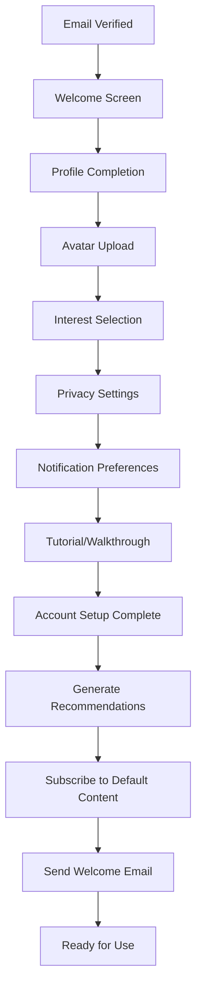

---

## Authentication Workflow

### 1. Login Process

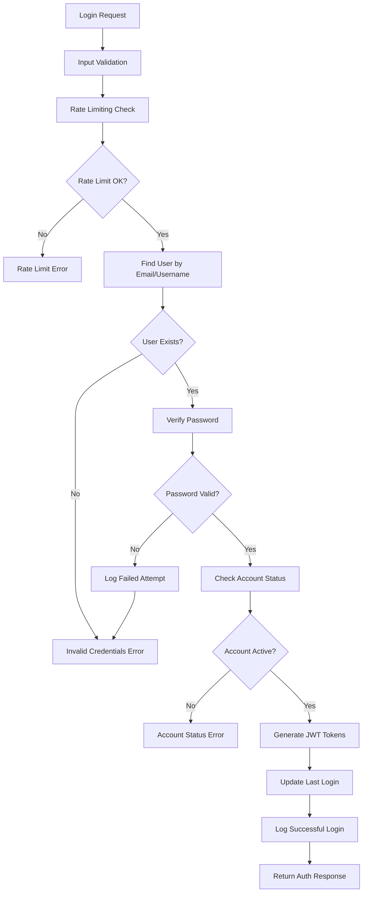

#### Authentication Implementation:
```javascript
const authenticateUserWorkflow = async (credentials, clientInfo) => {
  const authSteps = [
    'rate_limiting',
    'input_validation',
    'user_lookup',
    'password_verification',
    'account_status_check',
    'token_generation',
    'session_creation'
  ];
  
  let currentStep = 0;
  const loginAttempt = {
    timestamp: new Date(),
    ipAddress: clientInfo.ipAddress,
    userAgent: clientInfo.userAgent,
    success: false
  };
  
  try {
    // Step 1: Rate limiting
    await updateAuthStatus(authId, authSteps[currentStep++]);
    await checkRateLimit(clientInfo.ipAddress, {
      windowMs: 15 * 60 * 1000, // 15 minutes
      maxAttempts: 5,
      blockDuration: 30 * 60 * 1000 // 30 minutes
    });
    
    // Step 2: Input validation
    await updateAuthStatus(authId, authSteps[currentStep++]);
    const validatedCredentials = await validateLoginCredentials(credentials);
    
    // Step 3: User lookup
    await updateAuthStatus(authId, authSteps[currentStep++]);
    const user = await findUserByEmailOrUsername(validatedCredentials.identifier);
    
    if (!user) {
      await recordFailedLoginAttempt(validatedCredentials.identifier, loginAttempt);
      throw new AuthenticationError('Invalid credentials');
    }
    
    // Step 4: Password verification
    await updateAuthStatus(authId, authSteps[currentStep++]);
    const passwordValid = await verifyPassword(
      validatedCredentials.password,
      user.passwordHash
    );
    
    if (!passwordValid) {
      await recordFailedLoginAttempt(user.id, loginAttempt);
      throw new AuthenticationError('Invalid credentials');
    }
    
    // Step 5: Account status check
    await updateAuthStatus(authId, authSteps[currentStep++]);
    if (user.status !== 'ACTIVE') {
      throw new AuthenticationError(`Account is ${user.status.toLowerCase()}`);
    }
    
    // Step 6: Token generation
    await updateAuthStatus(authId, authSteps[currentStep++]);
    const tokens = await generateAuthTokens(user, {
      accessTokenExpiry: '15m',
      refreshTokenExpiry: '7d',
      includePermissions: true
    });
    
    // Step 7: Session creation
    await updateAuthStatus(authId, authSteps[currentStep++]);
    const session = await createUserSession(user.id, {
      tokens,
      deviceInfo: clientInfo,
      loginMethod: 'password'
    });
    
    // Update user login information
    await prisma.user.update({
      where: { id: user.id },
      data: {
        lastLogin: new Date(),
        loginCount: { increment: 1 }
      }
    });
    
    loginAttempt.success = true;
    await recordSuccessfulLogin(user.id, loginAttempt);
    
    return {
      user: {
        id: user.id,
        email: user.email,
        username: user.username,
        role: user.role,
        profile: user.profile
      },
      tokens,
      session: {
        id: session.id,
        expiresAt: session.expiresAt
      }
    };
    
  } catch (error) {
    await handleAuthenticationError(authId, currentStep, error);
    throw error;
  }
};
```

### 2. Token Refresh Workflow

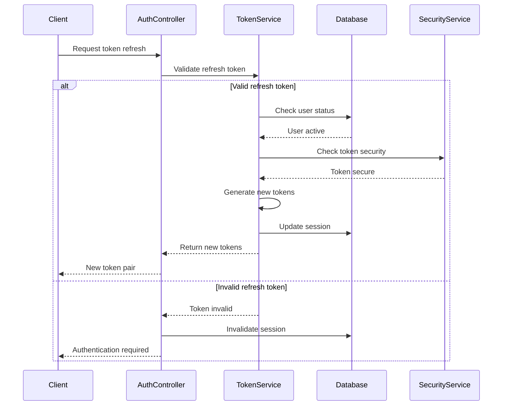

---

## OAuth Integration Workflow

### 1. OAuth Provider Setup

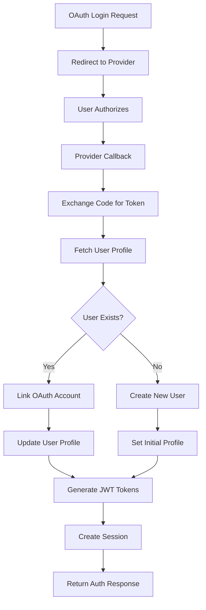

#### OAuth Implementation:
```javascript
const handleOAuthCallback = async (provider, authCode, state) => {
  const oauthSteps = [
    'state_validation',
    'token_exchange',
    'profile_fetch',
    'user_resolution',
    'account_linking',
    'session_creation'
  ];
  
  let currentStep = 0;
  
  try {
    // Step 1: Validate state parameter
    await updateOAuthStatus(oauthId, oauthSteps[currentStep++]);
    await validateOAuthState(state);
    
    // Step 2: Exchange authorization code for access token
    await updateOAuthStatus(oauthId, oauthSteps[currentStep++]);
    const tokenResponse = await exchangeOAuthCode(provider, authCode, {
      clientId: process.env[`${provider.toUpperCase()}_CLIENT_ID`],
      clientSecret: process.env[`${provider.toUpperCase()}_CLIENT_SECRET`],
      redirectUri: `${process.env.APP_URL}/auth/${provider}/callback`
    });
    
    // Step 3: Fetch user profile from provider
    await updateOAuthStatus(oauthId, oauthSteps[currentStep++]);
    const providerProfile = await fetchOAuthProfile(provider, tokenResponse.accessToken);
    
    // Step 4: Resolve or create user
    await updateOAuthStatus(oauthId, oauthSteps[currentStep++]);
    let user = await findUserByOAuthProvider(provider, providerProfile.id);
    
    if (!user) {
      // Check if user exists by email
      user = await prisma.user.findUnique({
        where: { email: providerProfile.email },
        include: { profile: true, oauthProviders: true }
      });
      
      if (!user) {
        // Create new user
        user = await createUserFromOAuth(providerProfile, provider);
      }
    }
    
    // Step 5: Link OAuth account
    await updateOAuthStatus(oauthId, oauthSteps[currentStep++]);
    await linkOAuthProvider(user.id, {
      provider,
      providerId: providerProfile.id,
      accessToken: tokenResponse.accessToken,
      refreshToken: tokenResponse.refreshToken,
      profile: providerProfile
    });
    
    // Step 6: Create authenticated session
    await updateOAuthStatus(oauthId, oauthSteps[currentStep++]);
    const tokens = await generateAuthTokens(user);
    const session = await createUserSession(user.id, {
      tokens,
      loginMethod: `oauth_${provider}`
    });
    
    return {
      user: {
        id: user.id,
        email: user.email,
        username: user.username,
        profile: user.profile
      },
      tokens,
      session
    };
    
  } catch (error) {
    await handleOAuthError(oauthId, currentStep, error);
    throw error;
  }
};
```

### 2. OAuth Provider Management

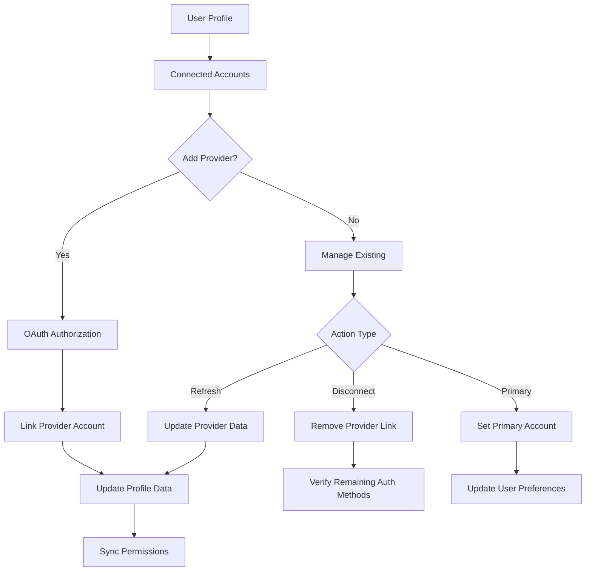

---

## User Profile Management

### 1. Profile Update Workflow

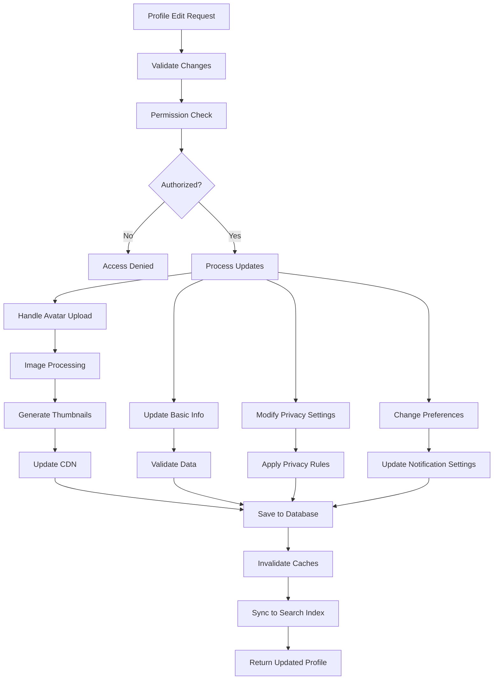

#### Profile Update Implementation:
```javascript
const updateUserProfileWorkflow = async (userId, profileUpdates, files) => {
  const updateSteps = [
    'authorization',
    'validation',
    'file_processing',
    'data_update',
    'cache_invalidation',
    'search_sync'
  ];
  
  let currentStep = 0;
  
  try {
    // Step 1: Authorization check
    await updateProfileStatus(profileId, updateSteps[currentStep++]);
    await verifyProfileUpdatePermissions(userId, profileUpdates);
    
    // Step 2: Input validation
    await updateProfileStatus(profileId, updateSteps[currentStep++]);
    const validatedUpdates = await validateProfileUpdates(profileUpdates, {
      displayName: {
        minLength: 1,
        maxLength: 50,
        allowedChars: /^[a-zA-Z0-9\s\-_.]+$/
      },
      bio: {
        maxLength: 500,
        allowHTML: false
      },
      socialLinks: {
        maxCount: 10,
        validateUrls: true
      }
    });
    
    // Step 3: File processing (avatar, cover image)
    await updateProfileStatus(profileId, updateSteps[currentStep++]);
    const processedFiles = {};
    
    if (files.avatar) {
      processedFiles.avatarUrl = await processAvatarImage(files.avatar, {
        sizes: [50, 100, 200, 400],
        formats: ['webp', 'jpg'],
        quality: 90
      });
    }
    
    if (files.coverImage) {
      processedFiles.coverImageUrl = await processCoverImage(files.coverImage, {
        dimensions: { width: 1200, height: 400 },
        formats: ['webp', 'jpg'],
        quality: 85
      });
    }
    
    // Step 4: Database update
    await updateProfileStatus(profileId, updateSteps[currentStep++]);
    const updatedProfile = await prisma.profile.update({
      where: { userId },
      data: {
        ...validatedUpdates,
        ...processedFiles,
        updatedAt: new Date()
      },
      include: {
        user: {
          select: {
            id: true,
            username: true,
            email: true,
            role: true
          }
        }
      }
    });
    
    // Step 5: Cache invalidation
    await updateProfileStatus(profileId, updateSteps[currentStep++]);
    await invalidateProfileCaches(userId, [
      `profile:${userId}`,
      `user:${userId}:profile`,
      `public:profile:${updatedProfile.user.username}`
    ]);
    
    // Step 6: Search index synchronization
    await updateProfileStatus(profileId, updateSteps[currentStep++]);
    await updateUserSearchIndex(userId, {
      displayName: updatedProfile.displayName,
      bio: updatedProfile.bio,
      isPublic: updatedProfile.isPublic
    });
    
    return updatedProfile;
    
  } catch (error) {
    await handleProfileUpdateError(profileId, currentStep, error);
    throw error;
  }
};
```

### 2. Privacy Settings Management

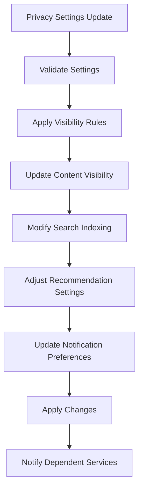

---

## Permission & Role Management

### 1. Role-Based Access Control

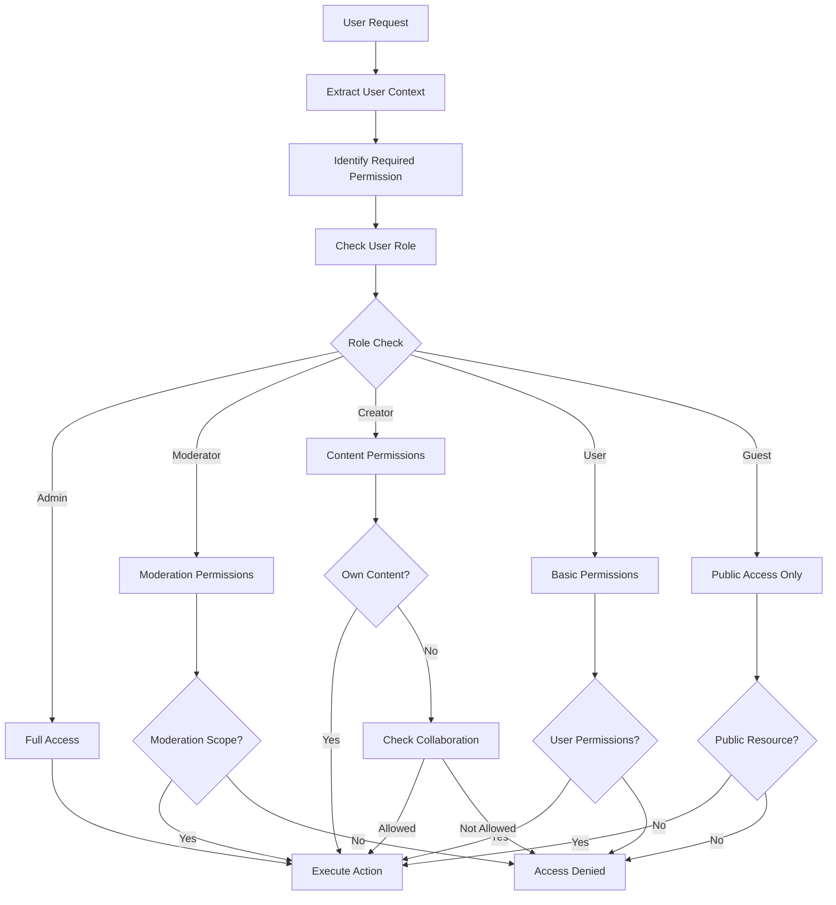

#### Permission Implementation:
```javascript
const checkUserPermissions = async (userId, action, resource) => {
  // Get user with roles and permissions
  const user = await prisma.user.findUnique({
    where: { id: userId },
    include: {
      role: {
        include: {
          permissions: true
        }
      },
      customPermissions: true
    }
  });
  
  if (!user) {
    throw new AuthorizationError('User not found');
  }
  
  // Build permission context
  const permissionContext = {
    user,
    action,
    resource,
    timestamp: new Date()
  };
  
  // Check role-based permissions
  const rolePermissions = user.role.permissions.map(p => p.name);
  
  // Check custom permissions
  const customPermissions = user.customPermissions
    .filter(p => p.expiresAt > new Date())
    .map(p => p.permission);
  
  // Combine all permissions
  const allPermissions = [...rolePermissions, ...customPermissions];
  
  // Permission hierarchy check
  const permissionChecks = [
    // Direct permission match
    allPermissions.includes(action),
    
    // Wildcard permissions
    allPermissions.includes(`${resource}.*`),
    allPermissions.includes('*'),
    
    // Resource ownership
    await checkResourceOwnership(userId, resource),
    
    // Collaborative permissions
    await checkCollaborativeAccess(userId, resource)
  ];
  
  const hasPermission = permissionChecks.some(check => check === true);
  
  // Log permission check
  await logPermissionCheck(permissionContext, hasPermission);
  
  return hasPermission;
};
```

### 2. Dynamic Permission Assignment

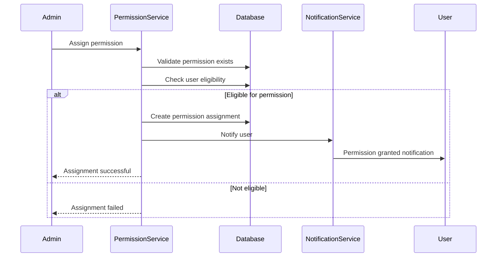

---

## Account Security Workflow

### 1. Security Monitoring

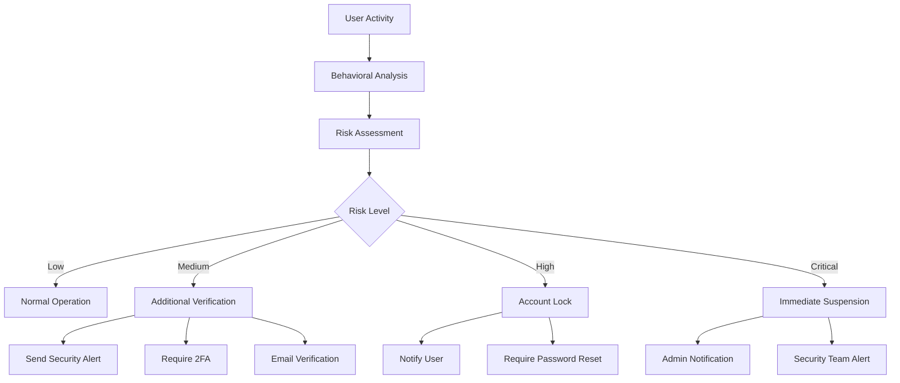

### 2. Password Security Workflow

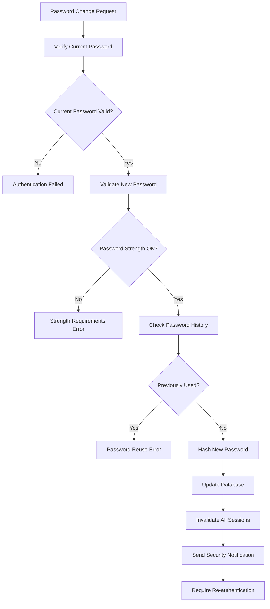

#### Security Implementation:
```javascript
const monitorAccountSecurity = async (userId, activityData) => {
  const securityMetrics = {
    loginLocations: await getRecentLoginLocations(userId),
    deviceFingerprints: await getDeviceFingerprints(userId),
    activityPatterns: await getActivityPatterns(userId),
    failedAttempts: await getFailedLoginAttempts(userId)
  };
  
  // Risk assessment
  const riskFactors = [
    // Unusual location
    checkUnusualLocation(activityData.location, securityMetrics.loginLocations),
    
    // New device
    checkNewDevice(activityData.deviceFingerprint, securityMetrics.deviceFingerprints),
    
    // Unusual time
    checkUnusualTime(activityData.timestamp, securityMetrics.activityPatterns),
    
    // Multiple failed attempts
    checkFailedAttempts(securityMetrics.failedAttempts),
    
    // Velocity checks
    checkLoginVelocity(userId, activityData.timestamp)
  ];
  
  const riskScore = calculateRiskScore(riskFactors);
  
  // Take action based on risk level
  if (riskScore >= 90) {
    await suspendAccount(userId, 'High risk activity detected');
  } else if (riskScore >= 70) {
    await requireAdditionalVerification(userId);
  } else if (riskScore >= 50) {
    await sendSecurityAlert(userId, riskFactors);
  }
  
  // Log security event
  await logSecurityEvent(userId, {
    riskScore,
    riskFactors,
    action: getActionForRiskScore(riskScore),
    metadata: activityData
  });
  
  return riskScore;
};
```

---

## User Activity & Session Management

### 1. Session Lifecycle

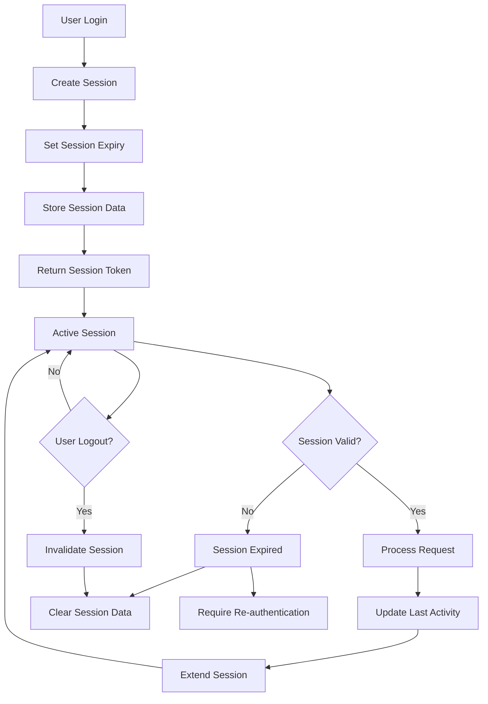

### 2. Activity Tracking

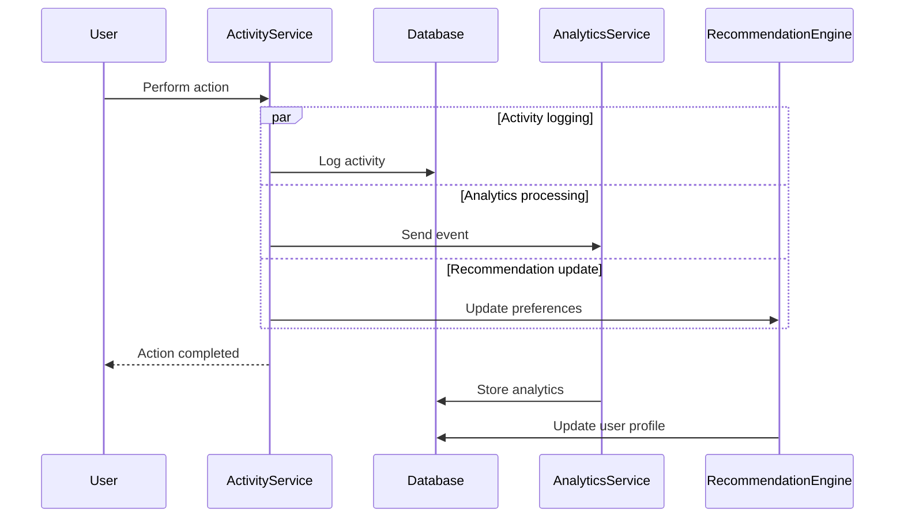

#### Activity Implementation:
```javascript
const trackUserActivity = async (userId, activityData) => {
  const activity = {
    id: generateActivityId(),
    userId,
    type: activityData.type,
    action: activityData.action,
    resourceType: activityData.resourceType,
    resourceId: activityData.resourceId,
    metadata: {
      ipAddress: activityData.ipAddress,
      userAgent: activityData.userAgent,
      duration: activityData.duration,
      referrer: activityData.referrer
    },
    timestamp: new Date()
  };
  
  // Parallel processing
  const processingTasks = [
    // Store activity record
    storeActivityRecord(activity),
    
    // Update user session
    updateUserSession(userId, {
      lastActivity: activity.timestamp,
      activityCount: { increment: 1 }
    }),
    
    // Send to analytics
    sendToAnalytics(activity),
    
    // Update recommendation profile
    updateRecommendationProfile(userId, activity),
    
    // Check for achievements
    checkUserAchievements(userId, activity),
    
    // Update activity feeds
    updateActivityFeeds(userId, activity)
  ];
  
  await Promise.allSettled(processingTasks);
  
  return activity;
};
```

This comprehensive user management and authentication workflow documentation provides detailed insights into how users interact with the MediaCMS system, from registration through ongoing security monitoring and activity tracking.